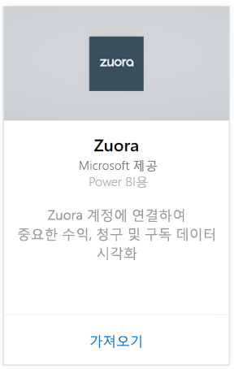
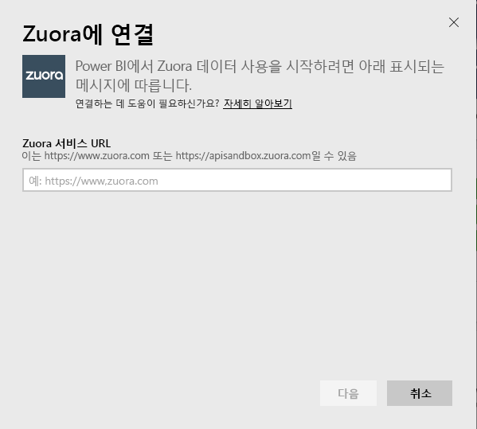
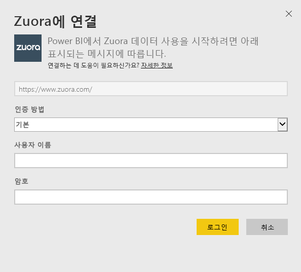
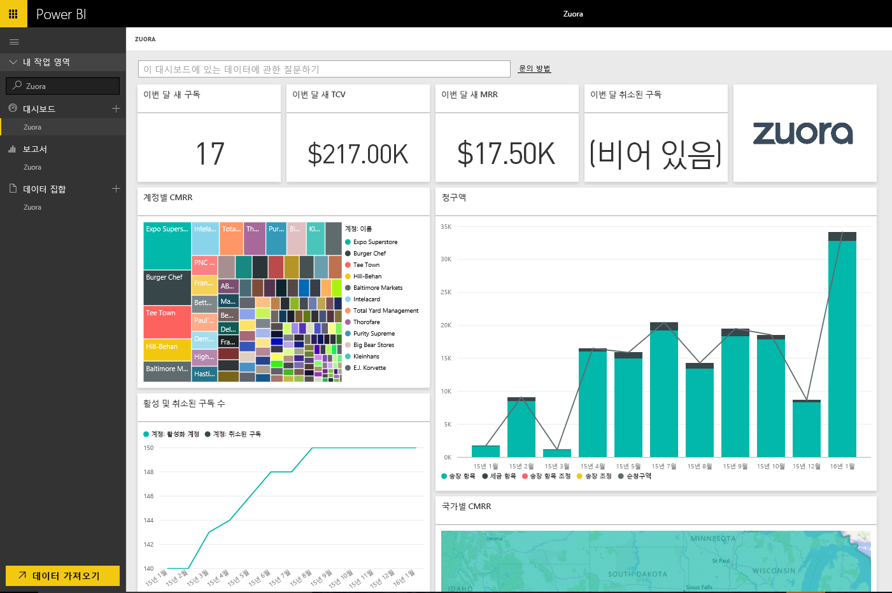

# Power BI로 Zuora에 연결
Power BI용 Zuora를 사용하면 중요한 수익, 청구 및 구독 데이터를 시각화할 수 있습니다. 기본 대시보드 및 보고서를 사용하여 사용량 추세를 분석하거나, 대금 청구 및 지불을 추적하거나, 되풀이되는 수익을 모니터링하거나, 고유한 대시보드 및 보고 요구 사항을 충족하도록 사용자 지정합니다.

Power BI용 [Zuora](https://app.powerbi.com/getdata/services/Zuora)에 연결합니다.

## 연결 방법
1. 왼쪽 탐색 창의 맨 아래에 있는 **데이터 가져오기** 를 선택합니다.

   
2. **서비스** 상자에서 **가져오기**를 선택합니다.

   
3. **Zuora** \>  **가져오기**를 선택합니다.

   
4. Zuora URL을 지정합니다. 이는 일반적으로 " https://www.zuora.com "이며, 아래 [이러한 매개 변수 찾기](#FindingParams)에서 세부 정보를 참조하세요.

   
5. **인증 방법**에 대해 **기본** 을 선택하고, 사용자 이름 및 암호(대/소문자 구분)를 제공한 다음 **로그인**을 선택합니다.

    
6. 승인되면 가져오기 프로세스가 자동으로 시작됩니다. 완료되면 새 대시보드, 보고서 및 모델이 탐색 창에 나타납니다. 대시보드를 선택하여 가져온 데이터를 표시합니다.

     

**다음 단계**

* 대시보드 맨 위에 있는 [질문 및 답변 상자에 질문](power-bi-q-and-a.md)합니다.
* 대시보드에서 [타일을 변경](service-dashboard-edit-tile.md)합니다.
* [타일을 선택](service-dashboard-tiles.md)하여 원본 보고서를 엽니다.
* 데이터 집합을 매일 새로 고치도록 예약하는 경우 새로 고침 일정을 변경하거나 **지금 새로 고침**을 사용하여 필요할 때 새로 고칠 수 있습니다.

## 포함된 내용
콘텐츠 팩은 Zuora AQUA API를 사용하여 다음 테이블을 가져옵니다.

| 표 |  |  |
| --- | --- | --- |
| 계정 |InvoiceItemAdjustment |환불 |
| AccountingCode |지불 |RevenueSchedule |
| AccountingPeriod |PaymentMethod |RevenueScheduleItem |
| BillTo |제품 |구독 |
| DateDim |ProductRatePlan |TaxationItem |
| 송장 |ProductRatePlanCharge |사용 현황 |
| InvoiceAdjustment |RatePlan | |
| InvoiceItem |RatePlanCharge | |

또한 이러한 계산된 측정값이 포함됩니다.

| 측정값 | 설명 | 의사-계산 |
| --- | --- | --- |
| 계정: 지불 |지불 유효 날짜에 기반한 특정 기간의 총 지불 금액입니다. |합계(Payment.Amount)  위치 Payment.EffectiveDate =< TimePeriod.EndDate AND    Payment.EffectiveDate >= TimePeriod.StartDate |
| 계정: 환불 |환불 날짜에 기반한 특정 기간의 총 환불 금액입니다. 금액은 음수로 보고됩니다. |-1*합계(Refund.Amount) 위치 Refund.RefundDate =< TimePeriod.EndDate 및    Refund.RefundDate >= TimePeriod.StartDate |
| 계정: 순지불 |특정 기간의 계정 지불 더하기 계정 환불입니다. |Account.Payments + Account.Refunds |
| 계정: 활성화 계정 |특정 기간에 활성화된 계정의 수입니다. 구독은 기간 시작 날짜 이전(또는 시점)에 시잔되어야 합니다. |수(Account.AccountNumber) 위치     Subscription.Status != "Expired" 및    Subscription.Status != "Draft" 및    Subscription.SubscriptionStartDate <= TimePeriod.StartDate 및    (Subscription.SubscriptionEndDate > TimePeriod.StartDate 또는 Subscription.SubscriptionEndDate = null) –evergreen subscription |
| 계정: 되풀이되는 평균 수익 |특정 기간의 활성화 계정당 총 MRR입니다. |총 MRR/Account.ActiveAccounts |
| 계정: 취소된 구독 |특정 기간에 구독을 취소한 계정의 수입니다. |수(Account.AccountNumber) 위치 Subscription.Status = "Cancelled" 및    Subscription.SubscriptionStartDate <= TimePeriod.StartDate 및    Subscription.CancelledDate >= TimePeriod.StartDate |
| 계정: 지불 오류 |지불 오류의 합계입니다. |합계(Payment.Amount) 위치 Payment.Status = "Error" |
| 예정된 수익 항목: 인식된 수익 |특정 회계 기간에 인식된 총수익입니다. |합계(RevenueScheduleItem.Amount) 위치 AccountingPeriod.StartDate = TimePeriod.StartDate |
| 구독: 새 구독 |특정 기간의 새 구독 수입니다. |수(Subscription.ID) 위치 Subscription.Version = "1" 및    Subscription.CreatedDate <= TimePeriod.EndDate 및    Subscription.CreatedDate >= TimePeriod.StartDate |
| 송장: 송장 항목 |특정 기간의 송장 항목 요금 총액입니다. |합계(InvoiceItem.ChargeAmount) 위치     Invoice.Status = "Posted" 및 Invoice.InvoiceDate <= TimePeriod.EndDate 및 Invoice.InvoiceDate >= TimePeriod.StartDate |
| 송장: 세금 항목 |특정 기간의 세금 항목 총세액입니다. |합계(TaxationItem.TaxAmount) 위치 Invoice.Status = "Posted" 및 Invoice.InvoiceDate <= TimePeriod.EndDate 및 Invoice.InvoiceDate >= TimePeriod.StartDate |
| 송장: 송장 항목 조정 |특정 기간의 송장 항목 조정 총액입니다. |합계(InvoiceItemAdjustment.Amount)  위치     Invoice.Status = "Posted" 및 InvoiceItemAdjustment.AdjustmentDate <= TimePeriod.EndDate 및    InvoiceItemAdjustment.AdjustmentDate >= TimePeriod.StartDate |
| 송장: 송장 조정 |특정 기간의 송장 조정 총액입니다. |합계(InvoiceAdjustment.Amount)  위치     Invoice.Status = "Posted" 및 InvoiceAdjustment.AdjustmentDate <= TimePeriod.EndDate 및    InvoiceAdjustment.AdjustmentDate >= TimePeriod.StartDate |
| 송장: 순청구액 |특정 기간의 송장 항목, 세금 항목, 송장 항목 조정 및 송장 조정의 합입니다. |Invoice.InvoiceItems + Invoice.TaxationItems + Invoice.InvoiceItemAdjustments + Invoice.InvoiceAdjustments |
| 송장: 송장 잔고 |게시된 송장 잔고의 합계입니다. |합계(Invoice.Balance)  위치     Invoice.Status = "Posted" |
| 송장: 총청구액 |특정 기간에 게시된 송장에 대한 송장 항목 요금의 합계입니다. |합계(InvoiceItem.ChargeAmount)  위치     Invoice.Status = "Posted" 및 Invoice.InvoiceDate <= TimePeriod.EndDate 및 Invoice.InvoiceDate >= TimePeriod.StartDate |
| 송장: 총 조정액 |게시된 송장과 관련된 송장 조정액 및 송장 항목 조정액의 합계입니다. |합계(InvoiceAdjustment.Amount)  위치     Invoice.Status = "Posted" 및 InvoiceAdjustment.Status = "Processed" + 합계(InvoiceItemAdjustment.Amount)  위치     Invoice.Status = "Posted" 및 invoiceItemAdjustment.Status = "Processed" |
| 총 MRR: 등급 계획 요금 |특정 기간에 구독에서 되풀이되는 월수익의 합계입니다. |합계(RatePlanCharge.MRR)  위치     Subscription.Status != "Expired" 및    Subscription.Status != "Draft" 및    RatePlanCharge.EffectiveStartDate <= TimePeriod.StartDate 및 RatePlanCharge.EffectiveEndDate > TimePeriod.StartDate     또는    RatePlanCharge.EffectiveEndDate = null --evergreen subscription |

## 시스템 요구 사항
Zuora API에 대한 액세스 권한이 필요합니다.

## 매개 변수 찾기
일반적으로 Zuora 데이터에 액세스하기 위해 로그인하는 URL을 제공합니다. 유효한 옵션은 다음과 같습니다.  

* https://www.zuora.com  
* https://www.apisandbox.zuora.com  
* 서비스 인스턴스에 해당하는 URL  

## 문제 해결
Zuora 콘텐츠 팩은 Zuora 계정의 다양한 기능을 가져옵니다. 특정 기능을 사용하지 않으면 해당 타일/보고서가 빈 상태로 표시될 수 있습니다. 로드하는 데 문제가 발생하는 경우 Power BI 지원 담당자에게 문의하세요.

## 다음 단계
[Power BI에서 시작](service-get-started.md)

[Power BI에서 데이터 가져오기](service-get-data.md)
