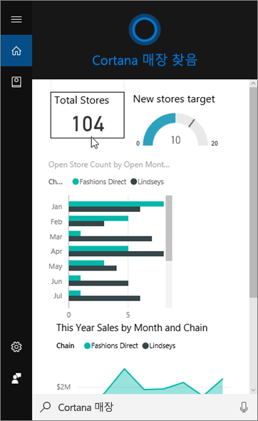
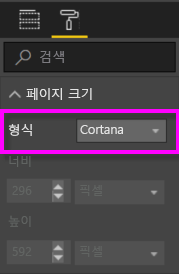
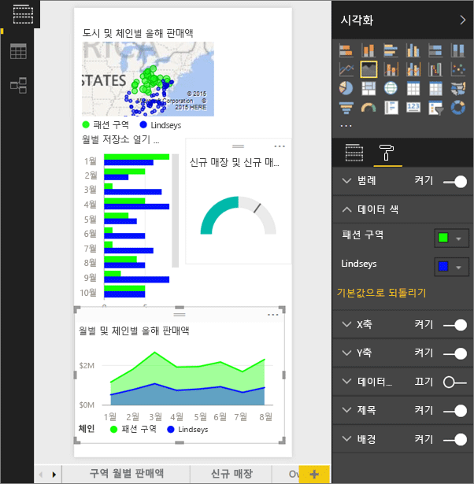
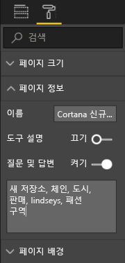
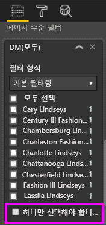

# Power BI 서비스 또는 Power BI Desktop을 사용하여 Cortana에 대한 사용자 지정 답변 페이지 만들기
Power BI의 전체 기능을 사용하여 Cortana 질문에 답변하도록 특별히 설계된 *Cortana 답변 페이지*(“Cortana 대답 카드”라고도 함)라는 특수한 보고서 페이지를 만듭니다.

> [!IMPORTANT]
> Cortana와 Power BI **대시보드** 미리 보기를 사용해 보려는 경우 이 문서의 나머지 부분을 건너뛸 수 있습니다. Cortana가 Power BI 대시보드를 검색하는 데 필요한 설치 요구 사항은 따로 없습니다.
> 
> 

## 시작하기 전에
Power BI에 대한 Cortana의 설정 및 사용을 안내하는 4가지 문서가 있습니다. 아직 없는 경우 문서 1부터 읽어보는 것이 좋습니다. 또한 문서 2는 Cortana 답변 페이지를 사용하기 전에 수행해야 하는 몇 가지 단계를 설명하기 때문에 특히 중요합니다.

**문서 1**: [Cortana와 Power BI가 함께 작동하는 방식 이해](service-cortana-intro.md)

**문서 2**: [Power BI 보고서 검색: Cortana - Power BI - Windows 통합 활성화](service-cortana-enable.md)

**문서 3**: 이 문서

**문서 4**: [문제 해결](service-cortana-troubleshoot.md)

## Cortana를 위해 특별히 디자인된 Cortana 대답 페이지 만들기
보고서의 *Cortana 대답 페이지*는 특별히 Cortana용으로 크기가 지정되었기 때문에 Cortana가 질문에 대한 답변으로 화면에 알맞게 표시할 수 있습니다.  Cortana에 대한 대답 페이지를 만들려면 다음을 수행합니다.

1. [빈 보고서 페이지](power-bi-report-add-page.md)로 시작하는 것이 좋습니다.
2. **시각화** 창에서 페인트 롤러 아이콘을 선택한 다음 **페이지 크기 > 유형 > Cortana**를 선택합니다.
   
    
3. 특정 질문(또는 일련의 질문)에 대한 응답으로 Cortana에 표시하려는 시각적 개체 또는 시각적 개체 집합을 만듭니다.
4. 모든 시각적 개체가 페이지 테두리 내에 맞는지 확인합니다.  필요에 따라 디스플레이 설정, 데이터 레이블, 색 및 배경을 수정합니다.  
   
    
5. 페이지에 이름을 지정하고 대체 이름을 추가합니다.  Cortana는 결과를 검색할 때 이러한 이름을 사용합니다. **시각화** 창에서 페인트 브러시 아이콘을 선택한 다음 **페이지 정보**를 선택합니다. 슬라이더를 **On**으로 이동하여 이 시각적 개체에 대한 질문 및 답변을 활성화합니다.
   
    
   
   > [!TIP]
   > 결과를 향상시키려면 열 이름에 해당하는 단어는 사용하지 마십시오.
   > 
   > 
6. 필요에 따라 보고서에 페이지 수준 필터가 있는 경우 **하나만 선택해야 합니다**를 설정하는 것이 좋습니다. Cortana는 질문에 필터 항목 중 하나만 지정된 경우에만 이 보고서를 답변으로 표시합니다. **하나만 선택해야 합니다**는 **필터** 창의 맨 아래에 있습니다.
   
   > [!NOTE]
   > Cortana에 페이지 수준 필터가 있는 보고서를 표시하도록 요청하기 위해 **Require single selection(단일 선택 필요)** 을 설정할 필요가 없습니다.  예를 들어 단일 선택 필요 설정에 관계없이 “Charlotte Lindseys의 매출 표시”에서 답변 페이지를 표시합니다.
   > 
   > 
   
     
   
      예를 들어 Cortana에게 다음과 같이 질문한다고 가정합니다.
   
   * “상점 이름별 매출 표시” - 필요한 페이지 수준 필터의 항목이 포함되지 않았으므로 이 대답 페이지가 나타나지 않습니다.
   * “Cary Lindseys 및 Charlotte Lindseys의 매출 표시” - 필요한 페이지 수준 필터에서 두 개 이상의 항목을 지정했으므로 이 대답 페이지가 나타나지 않습니다.
   * “Charlotte Lindseys의 매출 표시” - 이 답변 페이지가 표시됩니다.
     
     “매출 표시” - 필요한 페이지 수준 필터의 항목이 포함되지 않았으므로 이 답변 페이지가 나타나지 않습니다.

> [!IMPORTANT]
> Cortana가 Cortana 대답 페이지에 액세스하려면 [Cortana에 대해 데이터 집합을 사용하도록 설정](service-cortana-enable.md)해야 합니다.
> 
> 

## Cortana에서 결과는 어떻게 정렬되나요?
점수가 높은 답변(예: 지정된 페이지 이름과 전체 일치)을 포함하는 결과가 Cortana에서 먼저 *가장 일치하는 항목* 으로 표시됩니다. Power BI에 여러 Cortana 대답 페이지가 있는 경우 가장 일치하는 항목이 여러 개 나타날 수 있습니다. 점수가 중간 이하인 대답(예: 대답 페이지의 이름을 기반으로 하지 않는 답변) 또는 Power BI에서 인식할 수 없는 단어를 포함하는 질문은 Cortana에서 가장 일치하는 항목 아래에 링크로 나열됩니다.

> [!NOTE]
> 새 데이터 집합 또는 사용자 지정 Cortana 대답 페이지가 Power BI에 추가되고 Cortana에 대해 사용하도록 설정된 경우 Cortana에 결과가 표시되기까지 최대 30분 정도 걸릴 수 있습니다. Windows 10에 로그인했다가 로그아웃하거나 Windows 10에서 Cortana 프로세스를 다시 시작하면 새 콘텐츠를 즉시 표시할 수 있습니다.
> 
> 

## 다음 단계
[Power BI와 함께 Cortana 사용](service-cortana-intro.md)

Cortana가 아직도 Power BI와 함께 작동하지 않나요?  [Cortana 문제 해결사](service-cortana-troubleshoot.md)를 사용해 보세요.

궁금한 점이 더 있나요? [Power BI 커뮤니티를 이용하세요.](http://community.powerbi.com/)

