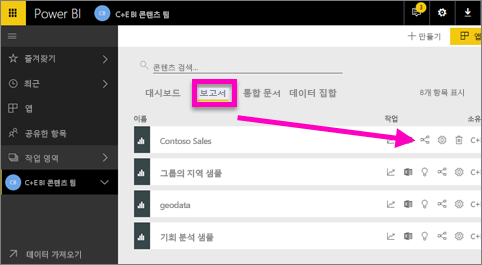
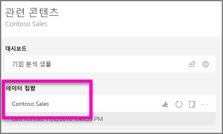
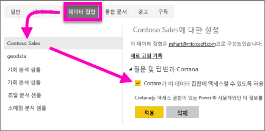
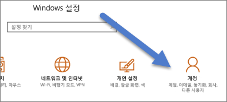

# Cortana가 Power BI 보고서(및 해당 기본 데이터 세트)에 액세스하도록 설정
지금까지 [Cortana 및 Power BI 소개](service-cortana-intro.md)에 대해 읽으셨습니다(그러지 않은 경우 먼저 읽은 후 다시 돌아오세요). 이제 직접 사용해 볼 수 있습니다.  Cortana에서 자연어로 질문하고 Power BI ***보고서***에 저장된 데이터에서 답변을 찾으려면 몇 가지 요구 사항을 충족해야 합니다. 특히 다음을 수행해야 합니다.

> [!NOTE]
> Cortana와 Power BI ***대시보드*** 미리 보기를 사용해 보려는 경우 이 문서의 나머지 부분을 건너뛸 수 있습니다. Cortana가 Power BI 대시보드를 검색하는 데 필요한 설치 요구 사항은 따로 없습니다.
> 
> 

Power BI 서비스에서

* Cortana에 하나 이상의 데이터 세트를 사용하도록 설정(최상위 데이터 세트에 빌드된 보고서이므로 Cortana는 해당 데이터 세트에 대한 액세스 필요)

Microsoft Windows에서

* 버전 1511 또는 이후 버전의 Windows 10을 실행 중인지 확인
* Power BI가 Windows가 서로 “대화”할 수 있는지 확인합니다. 즉, Windows에 계정을 연결합니다.

## Power BI 서비스를 사용하여 Cortana가 Power BI의 보고서 페이지에 액세스할 수 있도록 설정
Cortana에서 Power BI의 보고서에 액세스할 수 있도록 설정하는 것은 간단합니다.  사실 “Cortana가 이 데이터 세트에 액세스할 수 있도록 설정”을 선택하여 보고서의 기본 데이터 세트를 사용하도록 설정하기만 하면 됩니다. 그러면 일반적인 Power BI 공유, 앱 및 콘텐츠 팩 기능을 통해 Power BI의 데이터 세트에 액세스할 수 있는 모든 사용자가 Windows 10에서 Cortana의 보고서에 저장된 답변을 확인할 수 있습니다.

Power BI 서비스(Power BI Desktop 아님)에 로그인하고 Power BI 서비스에서 Cortana가 액세스할 수 있게 하려는 각 데이터 세트에 대해 이러한 단계를 반복해야 합니다.

1. 사용할 수 있도록 설정할 데이터 세트를 결정합니다. 보고서 콘텐츠 목록에서 Cortana에서 액세스하려는 보고서를 선택하고 **관련 항목 보기** 아이콘 을 선택합니다.
   
    
2. 이 보고서와 연결된 데이터 세트는 **Contoso Sales**입니다.
   
    
3. 데이터 세트 이름 오른쪽에 있는 **생략 부호(...) &gt; 설정**을 선택합니다.  
   
    
4. **Q&amp;A 및 Cortana** > **Cortana가 이 데이터 세트에 액세스할 수 있도록 허용** > **적용**을 선택합니다.
   
   
   
   이 예제에서는 Contoso Sales 데이터 세트에서 Cortana를 사용하도록 설정합니다.
   
   > [!NOTE]
   > 새 데이터 세트 또는 Cortana 대답 카드를 Power BI에 추가하고 Cortana에 사용하도록 설정한 경우 결과가 표시되는 데 최대 30분 정도 걸릴 수 있습니다. Windows 10에 로그인했다가 로그아웃하거나 Windows 10에서 Cortana 프로세스를 다시 시작하면 새 콘텐츠를 즉시 표시할 수 있습니다.
   > 
   > 사용자가 소유하는 콘텐츠 팩 또는 앱의 일부인 데이터 세트를 Cortana에 사용하도록 설정한 경우 동료도 Cortana에서 이 데이터 세트를 사용할 수 있도록 다시 게시해야 합니다.
   > 
   > 

## Windows에 Power BI 자격 증명 추가
Windows 10 버전 1511 이상을 실행 중이어야 합니다.

1. 실행 중인 Windows 10 버전을 확인합니다. **설정**을 엽니다.
    

    그런 다음 **시스템 > 정보**를 선택합니다. 화면 아래쪽에 **Windows 사양 > 버전**이 표시됩니다.

   * Windows 10 버전이 1511(Windows 10 2015년 11월 업데이트)에서 1607까지에 해당하는 경우 회사 또는 학교 계정과 Microsoft 계정을 추가합니다(아래의 2단계 및 3단계 수행).
   * Windows 10 버전이 1607(Windows 10 2016년 7월 업데이트) 이상에 해당하는 경우 회사 또는 학교 계정을 추가합니다(아래의 2단계만 수행).
1. Cortana에 대한 회사 또는 학교 계정을 추가합니다.
   
   * **설정** > **계정**을 엽니다.
     
       
   * 아래쪽으로 스크롤하여 **회사 또는 학교 계정 추가**를 선택합니다. 또는 **계정** 페이지에서 **회사 또는 학교 액세스 >연결**을 선택합니다.
     
     

Cortana는 이 회사 또는 학교 계정을 사용하여 Power BI에서 Cortana의 질문에 대한 답변을 확인합니다.

## 다음 단계
[Power BI](service-cortana-answer-cards.md)에서 Cortana *답변 카드* 만들기

[Cortana 및 Power BI 통합 문제 해결](service-cortana-troubleshoot.md)

궁금한 점이 더 있나요? [Power BI 커뮤니티를 이용하세요.](http://community.powerbi.com/)

