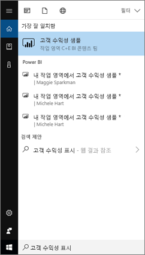
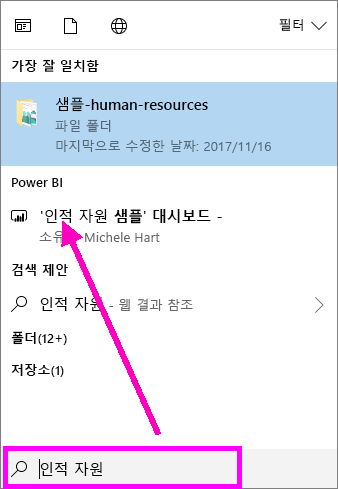
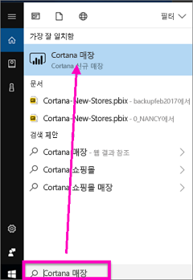
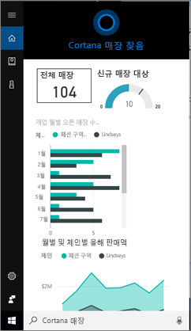
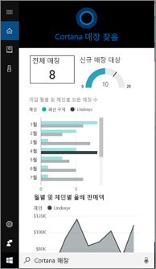
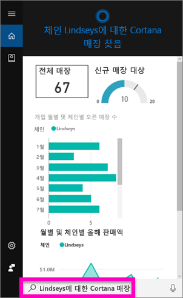
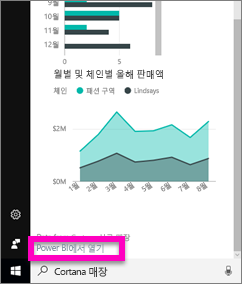
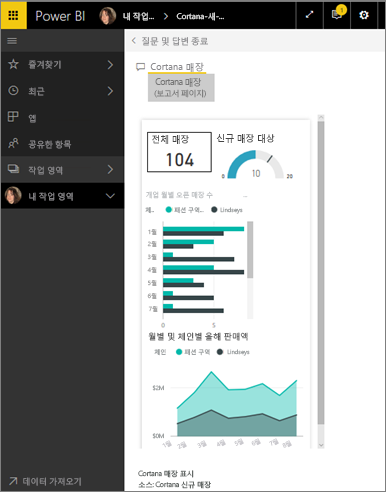

# Power BI에 대한 Cortana를 사용하여 Power BI 데이터를 신속하게 찾기 및 보기
Windows 10 디바이스에서 Cortana를 사용하여 중요한 비즈니스 관련 질문에 대한 답변을 즉시 확인하세요. Power BI와 통합하면 Cortana는 Power BI 대시보드 및 보고서에서 직접 주요 정보를 검색할 수 있습니다. Windows 10 2015년 11월 이상 버전, Cortana, Power BI 및 하나 이상의 데이터 세트에 대한 액세스만 있으면 됩니다.

## Windows 10에 대한 새 Cortana *대시보드* 검색 환경 미리 보기
잠시 동안 [Cortana를 사용하여 특정 형식의 보고서 페이지를 검색할](service-cortana-answer-cards.md) 수 있습니다. 이제 **새로운 환경**이 추가되었습니다. 바로 대시보드를 검색할 수 있는 기능입니다. 사용해 보시고 [Power BI Ideas에서 피드백을 보내주세요](https://ideas.powerbi.com/forums/265200-power-bi). 최종적으로 *새로운 환경*이 확장되어 보고서에 대한 Cortana 검색이 포함될 것입니다.  새 환경의 주요 이점 중 하나는 Cortana를 활성화하거나 Windows 10을 구성하는 등 특별한 설정이 필요 없다는 점입니다. 알아서 작동합니다.

> [!NOTE]
> “알아서 작동”하지 않으면 도움을 받을 수 있는 [문제 해결 문서](service-cortana-troubleshoot.md)를 참조하세요.
> 
> 

기본 기술은 [Microsoft Azure Search 서비스](https://docs.microsoft.com/azure/search/)를 사용합니다. 이 검색 서비스는 스마트 순위, 오류 수정 및 자동 완성과 같은 추가 기능을 제공합니다.

두 Cortana 환경은 함께 존재합니다.

## Power BI에 대한 Cortana 설명서
Power BI에 대한 Cortana의 설정 및 사용을 안내하는 4가지 문서가 있습니다. 이 문서 시리즈에서는 다음 단계를 안내합니다.

**문서 1**(이 문서): Cortana와 Power BI가 함께 작동하는 방식 이해

**문서 2**: [Power BI 보고서 검색: Cortana - Power BI - Windows 통합 활성화](service-cortana-enable.md)

**문서 3**: [Power BI 보고서 검색: 특수 *Cortana 답변 카드*](service-cortana-answer-cards.md) 만들기

**문서 4**: [문제 해결](service-cortana-troubleshoot.md)

## Cortana 및 Power BI는 어떻게 함께 작동하나요?
Cortana를 사용하여 질문하면 Cortana가 Power BI에서도 답변을 검색할 수 있습니다. Power BI에서 Cortana는 *Cortana 답변 카드*라는 특수한 유형의 보고서 페이지가 포함된 Power BI 보고서 및 Power BI 대시보드에서 풍부한 데이터 기반의 답변을 찾을 수 있습니다.

Cortana는 일치 항목을 찾으면, Cortana 화면에서 바로 대시보드 또는 보고서 페이지의 이름을 표시합니다. 대시보드 또는 보고서 페이지는 Power BI에서 열 수 있습니다. 또한 보고서 페이지는 대화형으로 Cortana에서 바로 탐색할 수 있습니다.

### Cortana 및 대시보드(*새로운 환경*)
Cortana는 소유하고 있는 대시보드 및 사용자와 공유된 대시보드에서 답변을 찾을 수 있습니다. 제목, 키워드, 소유자 이름, 작업 영역 이름, 앱 이름 등을 사용하여 Cortana에 질문할 수 있습니다.

Cortana가 답변을 찾도록 질문에는 최소 2개 단어가 있어야 합니다. 한 단어 이름(Marketing)이 있는 대시보드를 검색하는 경우, “show Marketing” 및 “michele hart sample”의 경우와 같이 “show” 또는 “Power BI” 또는 소유자 이름을 질문에 추가합니다. 

대시보드에 두 단어 이상의 제목이 있을 때, 검색 결과 최소 두 단어와 일치하거나 소유자 이름과 함께 단어 중 하나와 일치하는 경우 Cortana는 해당 대시보드를 반환하기만 합니다. “Customer Profitability Sample(고객 수익성 샘플)”이라는 대시보드의 경우 다음과 같습니다. 

* “show me customer(고객 표시)”는 Power BI 대시보드 결과를 반환하지 *않습니다*.   
* “show me customer profitability(고객 수익성 표시)”, “customer p(고객 p)”, “customer s(고객 s)”, “profitability sample(수익성 샘플)”, “michele hart sample(michele hart 샘플)”, “show customer profitability sample(고객 수익성 샘플 표시)” 및 “show me customer p(고객 p 표시)”와 같은 발언(utterances)은 Power BI 결과를 반환하게 *됩니다*.
* 단어 “powerbi”를 추가하면 2개의 필수 단어 중 하나로 계산되어 “powerbi sample”은 ‘Power BI 결과를 반환’하게 됩니다. 
  
    

### Cortana 및 보고서
 Cortana는 [Cortana에서 표시하도록 특별히 디자인된 페이지](service-cortana-answer-cards.md)가 있는 보고서에서 답변을 찾을 수 있습니다. 이러한 특별 보고서 페이지 중 하나에서 제목 또는 키워드를 사용하여 간단히 질문합니다.  

보고서에 대한 기본 기술은 [Microsoft의 Power BI 질문 및 답변](consumer/end-user-q-and-a.md)을 사용합니다.

Cortana에서 질문하는 경우 Power BI는 Cortana용으로 특별히 디자인된 보고서 페이지에서 답변합니다. Power BI에 이미 생성된 Cortana *답변 카드*에서 Cortana가 직접 잠재적인 답변을 즉시 결정합니다.  답변을 자세히 살펴보려면 Power BI에서 결과를 엽니다.

> [!NOTE]
> Cortana가 Power BI 보고서에서 답변을 찾도록 하려면 [Power BI 서비스를 사용하여 이 기능을 활성화하고 Power BI와 통신하도록 Windows를 설정](service-cortana-enable.md)해야 합니다.  
> 
> 

## Cortana를 사용하여 Power BI에서 답변 확인
1. Cortana에서 시작합니다. 여러 가지 다른 방법으로 Cortana를 *열* 수 있습니다. 작업 표시줄에서 Cortana 아이콘을 선택하거나(아래 그램 참조), 음성 명령을 사용하거나, Windows 모바일 디바이스에서 검색 아이콘을 탭합니다.
   
     
2. Cortana가 준비되면 Cortana 검색 표시줄에 질문을 입력하거나 말합니다. Cortana에서 사용 가능한 결과를 표시합니다. 질문과 일치하는 Power BI 대시보드가 있으면 **가장 일치하는 항목** 또는 **Power BI** 아래에 표시됩니다.
   
     
   
   > [!NOTE]
   > 현재 영어만 지원됩니다.
   > 
   > 
3. 대시보드를 선택하여 Cortana에서 엽니다.

    

    [대시보드의 *휴대폰 보기*를 편집](service-create-dashboard-mobile-phone-view.md)하여 레이아웃을 변경할 수 있습니다. 

1. Cortana에는 Power BI 서비스 또는 Power BI Mobile에서 대시보드를 여는 옵션도 있습니다. **웹에서 열기**를 선택하여 Power BI 서비스에서 대시보드를 엽니다. 
   
      
4. 이제 Cortana를 사용하여 보고서를 검색해 보겠습니다. [Cortana 답변 카드가 포함된 페이지가 있는 보고서](service-cortana-answer-cards.md)에 대해 알아야 합니다. 이 예제에서는 “Cortana-New-Stores”라는 보고서에 “cortana stores”라는 Cortana 답변 카드 페이지가 있습니다.  
   
     Cortana 검색 표시줄에 질문을 입력하거나 말합니다. Cortana에서 사용 가능한 결과를 표시합니다. 질문과 일치하는 Power BI 보고서 페이지가 있으면 **가장 일치하는 항목** 또는 **Power BI** 아래에 표시됩니다. 이 예제에서는 답변 카드를 만드는 데 사용한 .pbix 파일(및 백업)도 **문서** 아래에 표시됩니다.
   
      
5. **Cortana 매장** 보고서 페이지를 선택하여 Cortana 창에 표시합니다.
   
       
   
    답변 카드는 데이터 세트 소유자가 만든 Power BI 보고서 페이지의 특수한 유형입니다.  자세한 내용은 [Cortana 답변 카드 만들기](service-cortana-answer-cards.md)를 참조하세요.
6. 하지만 이것이 전부가 아닙니다. Power BI에서와 마찬가지로 답변 카드에서 시각화 요소와 상호 작용합니다.
   
   * 예를 들어 한 시각화 요소를 선택하여 답변 카드의 다른 시각화 요소를 교차 필터링 및 강조 표시합니다.
     
     
   * 또는 자연어를 사용하여 결과를 필터링합니다.  예를 들어 “Lindseys에 대한 Cortana 매장”을 질문하면 Lindseys 체인에 대한 데이터만 표시하도록 필터링된 카드를 확인할 수 있습니다.
     
     
7. 계속 탐색하세요. Cortana 창 아래쪽으로 스크롤하고 **Power BI에서 열기**를 선택합니다.
   
     
8. Power BI에서 보고서 페이지가 열립니다.    
     

## 고려 사항 및 문제 해결
* Cortana는 [Power BI에 사용하도록 설정](service-cortana-enable.md)되지 않은 모든 Cortana 카드에 액세스할 수 없습니다.
* Cortana가 아직도 Power BI와 함께 작동하지 않나요?  [Cortana 문제 해결사](service-cortana-troubleshoot.md)를 사용해 보세요.
* Power BI용 Cortana는 현재 영어로만 제공됩니다.
* Power BI에 대한 Cortana는 Windows 모바일 디바이스에서만 사용할 수 있습니다.

궁금한 점이 더 있나요? [Power BI 커뮤니티를 이용](http://community.powerbi.com/)하세요.
의견이 있으신가요? [Power BI Ideas에 피드백을 보내주세요](https://ideas.powerbi.com/forums/265200-power-bi).

## 다음 단계
[보고서를 위한 Cortana - Power BI - Windows 통합 활성화](service-cortana-enable.md)

