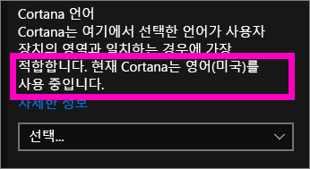
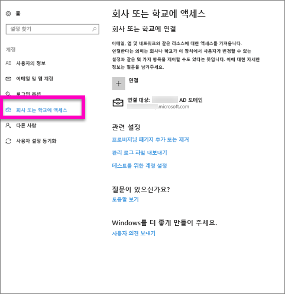
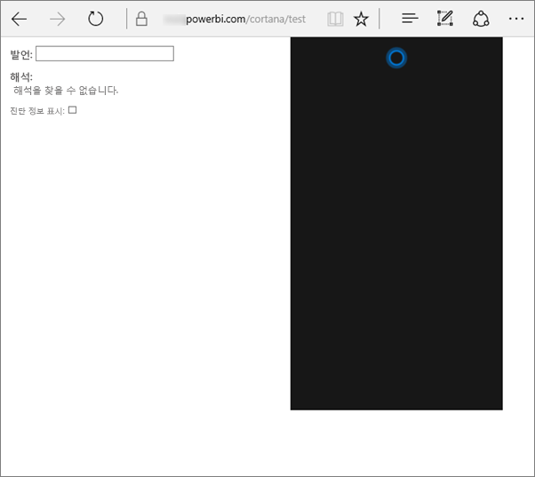
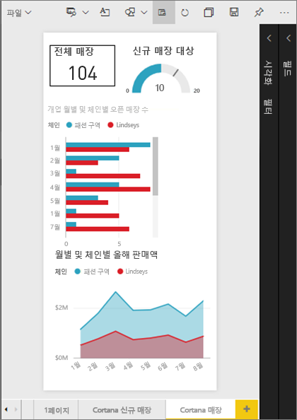
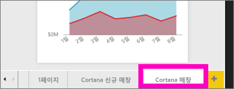
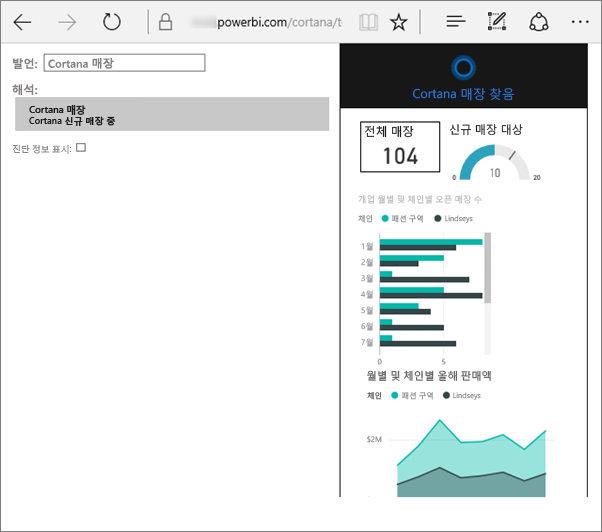
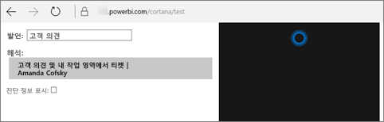

# Power BI용 Cortana 문제 해결
이 문서는 시리즈의 일부입니다. 

> [!IMPORTANT]
> Cortana 통합은 Power BI에서 더 이상 사용되지 않습니다. 6월 11일부터 Cortana는 더 이상 대시보드 및 보고서에서 작동하지 않습니다.

Cortana를 Power BI와 통합하는 데 문제가 있는 경우 제대로 찾아 오셨습니다. 아래 단계를 수행하여 문제를 진단하고 해결합니다.

## Cortana가 내 Power BI 보고서 또는 대시보드에서 답변을 찾지 않는 이유는 무엇입니까?
1. Power BI 계정이 있습니까?  그렇지 않으면 [평가판에 등록하세요](https://powerbi.microsoft.com/get-started/).
2. Cortana가 작동합니까?  작업 표시줄에 Cortana 아이콘이 나타납니까?

    

    선택하면 입력할 수 있는 필드와 함께 Cortana가 열립니까?
3. 검색에 최소한 2개 단어를 사용했나요? Cortana는 Power BI에서 대답을 찾기 위해 2개 이상의 여러 단어로 된 구가 필요합니다. 질문의 시작 부분에 “표시”를 추가해 보세요.
4. 대시보드에 한 단어 이상의 제목이 있을 때, 검색 결과 최소 두 단어와 일치하는 경우 Cortana는 해당 대시보드를 반환하기만 합니다. “Sales FY16(매출 FY16)”이라는 대시보드의 경우:

   * "show sales(매출 표시)"는 Power BI 결과를 반환하지 *않습니다*.   
   * “show me sales fy16(매출 fy16 표시)”, “sales fy16(매출 fy16)”, “show sales fy16(매출 fy16 표시)” 및 “show me sales f(매출 f 표시)”는 Power BI 결과를 반환하게 *됩니다*.    
   * 단어 "powerbi"를 추가하면 2개의 필수 단어 중 하나로 계산되어 "powerbi sales(powerbi 매출)"는 Power BI 결과를 반환하게 *됩니다*.
5. 보고서 또는 대시보드에 대한 액세스 또는 편집 사용 권한이 있습니까? 보고서의 경우 검색하려는 콘텐츠에 [대답 카드](service-cortana-answer-cards.md)가 있는지 확인합니다.  대시보드의 경우 검색하려는 콘텐츠가 **공유한 항목**, 앱 작업 영역 또는 **내 작업 영역**에 있는지 확인합니다. 문제를 파악하는 데 유용한 [문제 해결 도구를 사용](#try-the-cortana-troubleshooting-tool)하세요.
6. 모바일 디바이스를 사용하고 있습니까?  현재 Windows 모바일 디바이스에서의 Power BI와 Cortana 통합만 지원됩니다.
7. Cortana가 영어에 대해 구성되어 있습니까?  현재 Cortana-Power BI 통합은 영어만을 지원합니다. Cortana를 열고 톱니 아이콘을 선택하여 설정을 표시합니다. **Cortana 언어**까지 아래로 스크롤하고 영어 옵션 중 하나로 설정되어 있는지 확인합니다.

   
8. Cortana에 대해 활성화한 보고서가 100개 이상입니까?  Cortana는 최대 총 100개만을 검색합니다.  보고서가 포함되어 있는지 확인하려면 Cortana가 내 작업 영역을 처음으로 검색하므로 **내 작업 영역**으로 이동하거나 복사합니다.
9. 얼마 동안의 시간을 제공해야 할 수도 있습니다. 처음으로 쿼리를 입력하는 경우 모델은 콜드일 수 있습니다.  데이터가 메모리로 로드될 수 있도록 몇 초 정도 기다린 다음 다시 시도하십시오.
10. 대시보드의 경우 Cortana에 액세스할 수 있게 하려면 최대 24시간이 걸릴 수 있습니다.    
11. 보고서의 경우 새 데이터 세트 또는 사용자 지정 대답 카드를 Power BI에 추가하고 Cortana에 대해 사용하도록 설정한 경우 Cortana에 결과를 표시하는 데에는 최대 30분 정도 걸릴 수 있습니다. Windows 10에 로그인했다가 로그아웃하거나, Windows 10에서 Cortana 프로세스를 다시 시작하면 새 보고서 콘텐츠를 즉시 표시할 수 있습니다.  
12. Power BI 관리자는 “옵트아웃”할 수 있습니다. 이 경우에 해당하는지 관리자에게 확인합니다.

## 보고서 전용: Cortana가 내 Power BI 보고서에서 대답을 찾지 않는 이유는 무엇입니까?
1. 보고서에서 대답을 찾고 있는 경우 Cortana **대답 카드**가 포함된 보고서가 있습니까? 대답 카드는 Cortana가 사용자의 Power BI 보고서에서 대답을 찾을 수 있는 유일한 방법입니다.  [Power BI 서비스 및 Power BI Desktop에서 Cortana 대답 카드 만들기](service-cortana-answer-cards.md)를 참조하여 대답 카드를 만드는 방법을 알아봅니다.
2. Windows 버전 1511 이상을 실행 중입니까?  Windows 설정을 열고 **시스템 > 정보**를 선택하여 확인합니다. 그렇지 않은 경우 Windows의 버전을 업데이트합니다.
3. Windows 및 Power BI 계정이 연결되어 있습니까? 이 작업은 혼동될 수 있습니다. [Power BI에 대해 Cortana 사용](service-cortana-enable.md#add-your-power-bi-credentials-to-windows)의 지침을 따릅니다.
4. 기본 데이터 세트가 Cortana에 대해 사용하도록 설정되었습니까? 동료가 이미 Cortana에 대해 사용하도록 설정된 데이터 세트를 공유한 것 같습니다. 하지만 그렇지 않은 경우 [직접 Cortana에 대한 데이터 세트를 활성화하는 방법을 알아봅니다](service-cortana-enable.md). 빠르고 간단합니다.

## 대시보드 전용: Cortana가 내 Power BI 대시보드에서 대답을 찾지 않는 이유는 무엇입니까?
1. 회사 계정에 연결되어 있는지 확인합니다. Power BI는 이 연결이 필요하므로 데이터에 대한 액세스 권한을 인증할 수 있습니다. 연결되어 있는지 확인하려면, 또는 그렇지 않은 경우 회사 계정을 연결하려면 Windows 검색 상자를 사용하여 “회사 또는 학교에 연결”로 이동합니다.  

    
2. Cortana에 액세스할 수 있습니까? Windows 검색 상자를 선택하고 Cortana 액세스 권한을 사용자 정보에 제공합니다.

## Cortana 문제 해결 도구를 사용해 보세요.
그래도 문제가 있나요?  이제 Cortana 문제 해결 도구를 실행하여 가능한 문제 범위를 좁힐 때입니다.

### 보고서에서 대답을 검색하는 데 문제가 있습니까?
1. 보고서의 경우 문제 해결 도구를 실행하기 전에 Cortana 대답 카드의 **페이지 수준** 필터를 **단일 선택 필요**로 설정합니다. 이 작업을 수행하는 데 대한 도움말은 [Cortana 대답 카드 만들기](service-cortana-answer-cards.md)를 참조하세요.
2. Power BI 서비스 URL의 끝에 "/cortana/test"를 추가하여 문제 해결 도구를 엽니다. URL은 다음과 유사하게 나타납니다.

   app.powerbi.com/cortana/test

   
3. **Utterance** 필드에서 보고서 문제를 해결하려면 Cortana 대답 카드의 이름을 ***Power BI 탭에 표시된 대로 정확하게*** 입력합니다.

   

    

   
4. 경우에 따라 처음으로 **Utterance** 필드에 입력하는 경우 아무 일도 발생하지 않습니다. 시스템 준비로 생각하세요. 문제 해결 도구에 작동할 시간이라고 알려주는 것입니다. **Utterance** 필드에 잘라내고 붙여넣거나 다시 입력합니다. 이 예에서 대답 카드의 이름은 **Cortana 저장소**입니다. 도구에 **Cortana 매장**을 붙여넣거나 입력하면 **설명** 필드에 표시되는 단일 결과를 생성합니다. Cortana 창에 표시된 대답 카드를 클릭하여 확인합니다(이 경우 **Cortana 매장**).

   

   결과를 얻었으므로 이제 Cortana**가** Power BI에서 사용하도록 설정된 것을 알 수 있습니다. 문제를 Windows 쪽 또는 Cortana 언어 설정의 문제 항목 또는 Cortana에 대해 활성화된 100개 이상의 데이터 세트를 갖는 것으로 좁힙니다.

### 대시보드에서 대답을 검색하는 데 문제가 있습니까?
사용자와 공유된 대시보드를 찾고 있나요?  Power BI > **공유한 항목**을 열고 대시보드의 이름을 찾습니다.  그런 다음, 해당 이름을 **Utterances** 필드에 입력합니다.

#### 문제 해결 도구 알려진 문제
* 도구가 결과를 처음으로 가져오지 않는 경우, 대신 쿼리를 Utterance 텍스트 상자에 붙여넣습니다.
* 쿼리는 의도적으로 2개 이상의 단어여야 합니다.  쿼리가 너무 짧으면 "show"라는 단어를 추가합니다.
* 전치사가 있는 일부 쿼리 문자열은 작동하지 않을 수 있습니다(예: sales by item(항목별 판매)). 전치사를 사용하지 않고 의미 있는/고유한 다른 쿼리 용어를 시도합니다.

궁금한 점이 더 있나요? [Power BI 커뮤니티를 이용하세요.](http://community.powerbi.com/)
