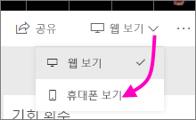
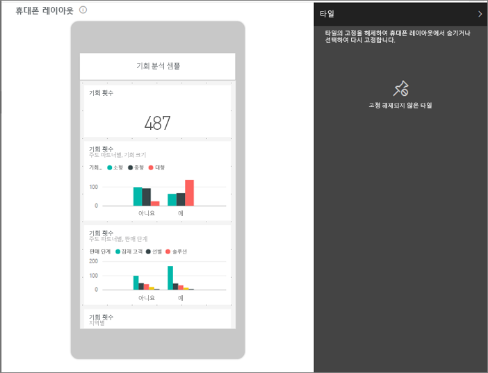
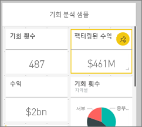
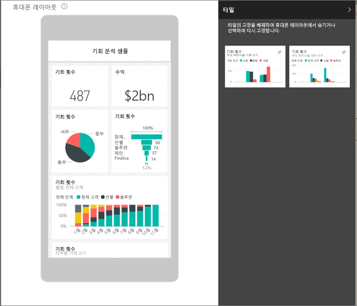
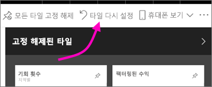

# 휴대폰에 대한 대시보드 최적화 - Power BI 
휴대폰에서 세로 모드로 대시보드를 볼 때 대시보드 타일이 모두 동일한 크기로 하나씩 배치된 것을 확인할 수 있습니다. Power BI 서비스에서 대시보드의 사용자 지정 보기를 만들 수 있습니다(특히 휴대폰 세로 모드). 휴대폰 보기를 만든 경우에도 휴대을 옆으로 돌리면 서비스에 배치된 대로 대시보드가 표시됩니다.

모바일 디바이스에서 대시보드를 보는 방법에 대한 정보를 찾고 있나요? 이 빠른 시작 [Power BI 모바일 앱에서 대시보드 및 보고서 살펴보기](consumer/mobile/mobile-apps-quickstart-view-dashboard-report.md)를 대신 사용해 보세요.

> [!NOTE]
> 휴대폰 보기를 편집할 때 휴대폰에서 대시보드를 보고 있는 사용자는 실시간으로 변경하는 내용을 볼 수 있습니다. 예를 들어 대시보드 휴대폰 보기의 모든 타일을 고정 해제하는 경우 휴대폰의 대시보드에 갑자기 타일이 없어집니다. 
> 
> 

## 대시보드의 휴대폰 보기 만들기
1. Power BI 서비스에서 대시보드를 엽니다.
2. 오른쪽 상단 코너에서 **웹 보기** 옆에 있는 화살표를 선택한 다음 **휴대폰 보기**를 선택합니다.

    

    대시보드 소유자가 아닌 경우 이 옵션은 표시되지 않습니다.

    

    휴대폰 대시보드 편집 보기가 열립니다. 여기에서 휴대폰 보기에 맞게 타일을 고정 해제, 크기 조정 및 다시 정렬할 수 있습니다. 대시보드 웹 버전은 변경되지 않습니다.

1. 타일을 선택하여 끌어 놓기, 크기 조정 또는 고정 해제합니다. 타일을 끌어서 놓는 방법으로 다른 타일이 이동합니다.
   
    
   
    고정 해제된 타일은 고정 해제된 타일 창으로 이동하고 다시 추가하지 않는 한 여기에서 유지됩니다.
   
    
2. 마음이 바뀌면 **타일 다시 설정**을 선택하여 전에 있었던 크기 및 순서로 다시 놓습니다.
   
    
   
    Power BI 서비스에서 휴대폰 편집 보기를 열면 휴대폰 타일의 크기 및 모양이 약간 변경됩니다. 따라서 휴대폰 편집 보기에서 열기 전에 대시보드를 정확한 상태로 돌리려면 **타일 다시 설정**을 선택합니다.
3. 휴대폰 대시보드 레이아웃이 만족스러우면 오른쪽 상단 모퉁이에서 **휴대폰 보기** 옆에 있는 화살표를 선택한 다음 **웹 보기**를 선택합니다.
   
    Power BI는 휴대폰 레이아웃을 자동으로 저장합니다.

## 다음 단계
* [Power BI 모바일 앱에 최적화된 보고서 만들기](desktop-create-phone-report.md)
* [모든 크기에 최적화된 반응형 시각적 개체 만들기](visuals/desktop-create-responsive-visuals.md)
* 궁금한 점이 더 있나요? [Power BI 커뮤니티에 질문합니다.](https://community.powerbi.com/)

