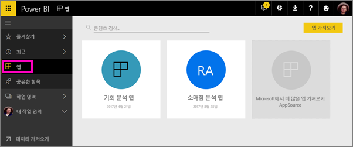
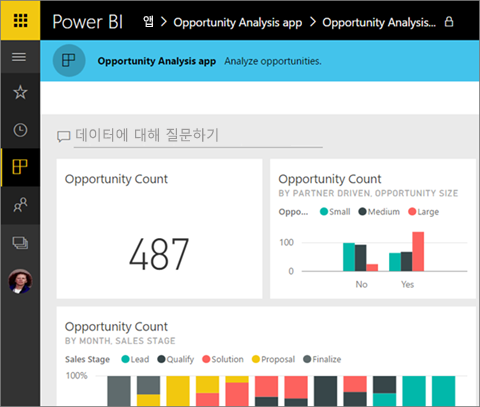
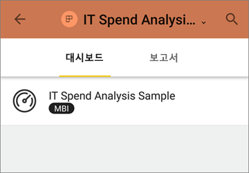
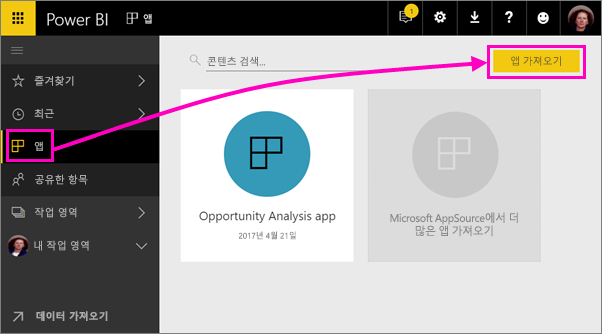
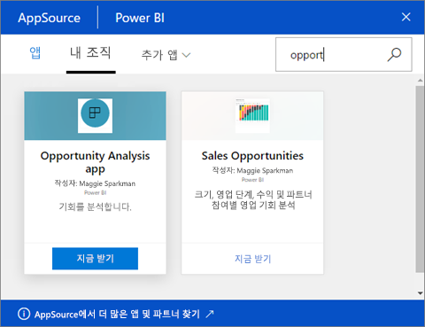
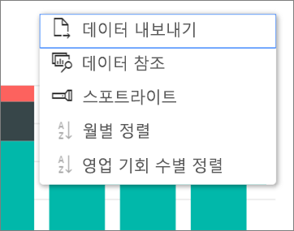

# Power BI에서 대시보드 및 보고서로 앱 설치 및 사용

Power BI에서 *앱*을 사용하면 관련된 대시보드 및 보고서를 모두 한 곳에 모을 수 있습니다. 조직의 사용자는 주요 비즈니스 정보를 사용하여 앱을 만들고 배포할 수 있습니다. 이미 사용 중일 수 있는 Google 웹로그 분석 및 Microsoft Dynamics CRM과 같은 [외부 서비스](consumer/end-user-connect-to-services.md)에서도 Power BI 앱을 제공합니다. 

앱은 Power BI 서비스([https://powerbi.com](https://powerbi.com)) 및 모바일 장치에서 쉽게 찾아 설치할 수 있습니다. 앱을 설치한 후에는 다양한 여러 대시보드가 앱, 브라우저 또는 모바일 장치에 모두 함께 있기 때문에 그 이름들을 기억할 필요가 없습니다.

앱을 사용하면 앱 작성자가 업데이트를 릴리스할 때마다 자동으로 변경 사항을 확인할 수 있습니다. 또한 작성자는 데이터 새로 고침 예약 빈도를 조절하기도 하므로, 최신 상태로 유지하는 것에 대해 염려할 필요가 없습니다. 

앱을 작성할 계획인가요? 자세한 내용은 [Power BI에서 동료와 작업 영역 만들기](service-create-workspaces.md)를 참조하세요.

## 새 앱 가져오기

몇 가지 방법으로 앱을 가져올 수 있습니다. 앱 작성자는 Power BI 계정에서 자동으로 앱을 설치하거나, 앱에 대한 직접 링크를 보내거나, AppSource에서 검색할 수 있습니다(액세스할 수 있는 모든 앱을 볼 수 있음). 모바일 장치의 Power BI에서는 AppSource가 아닌 직접 링크를 통해서만 설치할 수 있습니다. 앱 작성자가 앱을 자동 설치할 경우 앱 목록이 표시됩니다.

### 직접 링크에서 앱 설치 

새 앱을 설치하는 가장 쉬운 방법은 앱 작성자로부터 직접 링크를 받는 것입니다. Power BI가 설치 링크를 만들면 작성자는 이를 사용자에게 보낼 수 있습니다.

**컴퓨터에서** 

이메일의 링크를 클릭하면 Power BI 서비스([https://powerbi.com](https://powerbi.com))가 브라우저에서 열립니다. 앱을 설치 의사를 확인하면 앱 시작 페이지로 열립니다.

**iOS 또는 Android 모바일 장치에서** 

모바일 장치에서 이메일의 링크를 클릭하면 앱이 자동으로 설치되어 모바일 앱에서 앱 콘텐츠 목록을 엽니다. 

### Microsoft AppSource에서 앱 가져오기

또한 Microsoft AppSource에서 액세스 권한이 있는 앱을 찾고 설치할 수 있습니다. 

1. **앱**  > **앱 가져오기**를 선택합니다. 

     
2. AppSource의 **내 조직**에서 검색하여 결과 범위를 좁힌 후 찾고자 하는 앱을 찾을 수 있습니다.

     
3. **지금 가져오기**를 선택하여 앱 페이지에 추가합니다. 

## 앱에서 대시보드 및 보고서와 상호 작용

이제 앱에서 대시보드 및 보고서의 데이터를 탐색할 수 있습니다. 필터링, 강조 표시, 정렬 및 드릴다운과 같은 모든 표준 Power BI 상호 작용에 액세스할 수 있습니다. 보고서의 테이블 또는 다른 시각적 개체에서 [데이터를 Excel로 내보낼](consumer/end-user-export-data.md) 수도 있습니다. 

## 다음 단계

* [외부 서비스용 Power BI 앱](consumer/end-user-connect-to-services.md)
* 궁금한 점이 더 있나요? [Power BI 커뮤니티에 질문합니다.](http://community.powerbi.com/)