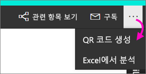
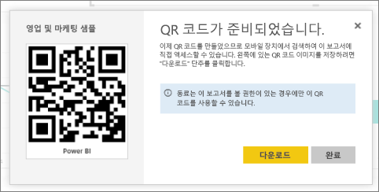

# Power BI에서 모바일 앱에 사용할 보고서의 QR 코드 만들기
Power BI의 QR 코드는 실제 세계의 모든 항목을 관련된 BI 정보에 연결할 수 있습니다. 탐색하거나 검색할 필요가 없습니다.

편집할 수 없는 보고서에 대한 QR 코드를 Power BI 서비스에서 만들 수 있습니다. 그런 다음 주요 위치에 QR 코드를 배치합니다. 예를 들어 메일에 붙여넣거나 인쇄하여 특정 위치에 붙여넣을 수 있습니다. 

보고서를 공유한 동료는 [모바일 장치](mobile-apps-qr-code.md)에서 바로 QR 코드를 스캔하여 보고서에 액세스할 수 있습니다. Power BI 앱에 있는 QR 코드 스캐너 또는 휴대폰에 설치된 다른 QR 스캐너 중 하나를 사용할 수 있습니다. [혼합 현실용 Power BI 앱을 사용하여 보고서 QR 코드를 스캔](mobile-mixed-reality-app.md#scan-a-report-qr-code-in-holographic-view)할 수도 있습니다.

## 보고서에 대한 QR 코드 만들기
1. Power BI 서비스에서 보고서를 엽니다.
2. 오른쪽 위에 있는 줄임표(...)를 선택하고 **QR 코드 생성**을 선택합니다. 
   
    
3. QR 코드와 함께 대화 상자가 나타납니다. 
   
    
4. 여기서 QR 코드를 스캔 또는 다운로드하여 저장한 후 다음을 수행할 수 있습니다. 
   
   * 메일 또는 다른 문서에 추가 또는 
   * 인쇄하여 특정 위치에 배치 

## QR 코드 인쇄
Power BI는 QR 코드를 인쇄할 수 있는 JPG 파일로 생성합니다. 

1. **다운로드**를 선택하고 프린터에 연결된 컴퓨터에서 PNG 파일을 엽니다.  
   
   JPG 파일의 이름은 타일과 동일합니다. 예를 들어 "Sales and Marketing Sample.jpg"입니다.
   
1. 100% 또는 "실제 크기"로 파일을 인쇄합니다.  
2. 가장자리를 따라 QR 코드를 잘라내어 보고서와 관련된 위치에 붙입니다. 

## 다음 단계
* 모바일 앱으로 [실제 Power BI 데이터에 연결](mobile-apps-data-in-real-world-context.md)
* [모바일 장치에서 Power BI QR 코드 스캔](mobile-apps-qr-code.md)
* [타일에 대한 QR 코드 만들기](service-create-qr-code-for-tile.md)
* 궁금한 점이 더 있나요? [Power BI 커뮤니티에 질문합니다.](http://community.powerbi.com/)

