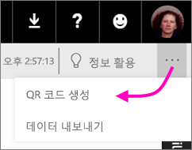
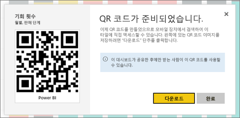

# Power BI에서 모바일 앱에 사용할 타일의 QR 코드 만들기
Power BI의 QR 코드는 실제 세계의 모든 항목을 관련된 BI 정보에 연결할 수 있습니다. 탐색하거나 검색할 필요가 없습니다.

편집할 수 없는 대시보드의 타일에 대한 QR 코드를 Power BI 서비스에서 만들 수 있습니다. 그런 다음 주요 위치에 QR 코드를 배치합니다. 예를 들어 메일에 붙여넣거나 인쇄하여 특정 위치에 붙여넣을 수 있습니다. 

대시보드를 공유한 동료는 [모바일 디바이스에서 바로 QR 코드를 스캔하여 타일에 액세스](consumer/mobile/mobile-apps-qr-code.md)할 수 있습니다. Power BI 앱에 있는 QR 코드 스캐너 또는 휴대폰에 설치된 다른 QR 스캐너 중 하나를 사용할 수 있습니다.

## 타일에 대한 QR 코드 만들기
1. Power BI 서비스에서 대시보드를 엽니다.
2. 타일의 오른쪽 위에 있는 **추가 옵션**(...)을 선택한 다음, **포커스 모드** 를 선택합니다.
3. 오른쪽 위에 있는 **추가 옵션**(...)을 선택한 다음, **QR 코드 생성**을 선택합니다. 
   
    
4. QR 코드와 함께 대화 상자가 나타납니다. 
   
    
5. 여기서 QR 코드를 스캔 또는 다운로드하여 저장한 후 다음을 수행할 수 있습니다. 
   
   * 메일 또는 다른 문서에 추가 또는 
   * 인쇄하여 특정 위치에 배치 

## QR 코드 인쇄
Power BI는 QR 코드를 인쇄할 수 있는 JPG 파일로 생성합니다. 

1. **다운로드**를 선택하고 프린터에 연결된 컴퓨터에서 PNG 파일을 엽니다.  
   
   > [!TIP]
   > JPG 파일의 이름은 타일과 동일합니다. 예를 들어 "Opportunity Count - by Month, Sales Stage.jpg"입니다.
   > 
   > 
2. 100% 또는 "실제 크기"로 파일을 인쇄합니다.  
3. QR 코드를 잘라내어 타일과 관련된 위치에 부착합니다. 

## 다음 단계
* 모바일 앱으로 [실제 Power BI 데이터에 연결](consumer/mobile/mobile-apps-data-in-real-world-context.md)
* [모바일 디바이스에서 Power BI QR 코드 스캔](consumer/mobile/mobile-apps-qr-code.md)
* [보고서에 대한 QR 코드 만들기](service-create-qr-code-for-report.md)
* 궁금한 점이 더 있나요? [Power BI 커뮤니티에 질문합니다.](https://community.powerbi.com/)

