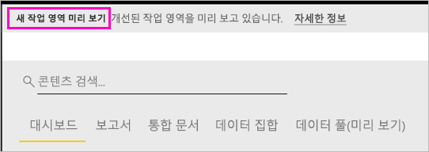
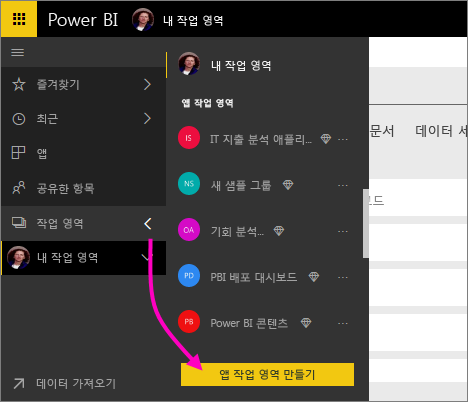
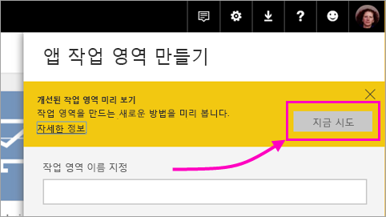
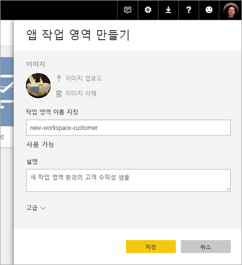
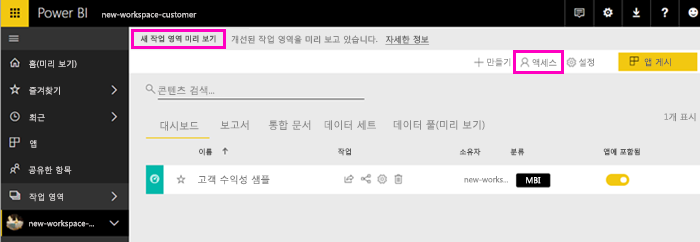
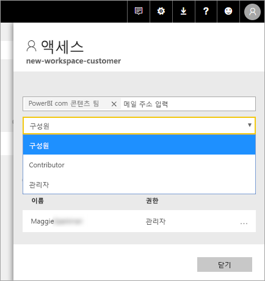
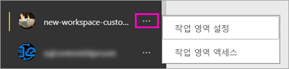

# Power BI에서 새 작업 영역 만들기(미리 보기)

Power BI는 새 작업 영역 환경을 미리 보기 상태로 소개합니다. 작업 영역에서는 *앱*에 포함하고 전체 조직 또는 특정 사람 또는 그룹에 배포할 수 있는 대시보드 및 보고서의 컬렉션을 만들기 위해 동료와 공동 작업할 수 있습니다. 

새 작업 영역 미리 보기에서 다음을 수행할 수 있습니다.

- 보안 그룹, 배포 목록, Office 365 그룹 및 개인과 같은 사용자 그룹에 작업 영역 역할을 할당합니다.
- Office 365 그룹을 만들지 않고 Power BI에서 작업 영역을 만듭니다.
- 작업 영역에서 더 유연한 사용 권한 관리에 대해 세분화된 작업 영역 역할을 사용합니다.

자세한 배경 정보는 [새 작업 영역(미리 보기)](service-new-workspaces.md) 문서를 참조하세요.

## 새로운 앱 작업 영역 중 하나 만들기

1. 웹 작업 영역을 만들어 시작합니다. **작업 영역** > **앱 작업 영역 만들기**를 선택합니다.
   
     

2. **개선된 작업 영역을 미리 보기**에서 **지금 시도**를 선택합니다.
   
     

2. 작업 영역에 이름을 지정합니다. 이름을 사용할 수 없는 경우 편집하여 고유한 ID를 입력합니다.
   
     앱의 이름은 작업 영역과 동일합니다.
   
1. 원하는 경우 이미지를 추가합니다. 파일 크기는 45KB보다 작은 수입니다.
 
    

1. **저장**을 선택합니다.

    새 작업 영역에 대한 **시작** 화면에 데이터를 추가할 수 있습니다. 

    

1. 예를 들어 **샘플** > **고객 수익성 샘플**을 선택합니다.

    이제 작업 영역 콘텐츠 목록에 **새 작업 영역 미리 보기**가 표시됩니다. 사용자가 관리자이므로 새 작업인 **액세스**도 표시됩니다.

    

1. **액세스**를 선택합니다.

1. 보안 그룹, 배포 목록, Office 365 그룹 또는 개인을 이러한 작업 영역에 구성원, 참가자 또는 관리자로 추가합니다. 다양한 역할에 대한 설명은 [새 작업 영역의 역할](service-new-workspaces.md#roles-in-the-new-workspaces)을 참조하세요.

    

9. **추가** > **닫기**를 선택합니다.

1. Power BI는 작업 영역을 만들고 엽니다. 구성원으로 속해 있는 작업 영역 목록에서 볼 수 있습니다. 사용자가 관리자이므로, 줄임표(…)를 선택하여 뒤로 이동하고 작업 영역 설정을 변경하여 새 멤버를 추가하거나 해당 사용 권한을 변경할 수 있습니다.

     

## 앱 작업 영역에 콘텐츠 추가

새로운 스타일의 앱 작업 영역을 만들면 콘텐츠를 추가할 수 있습니다. 콘텐츠를 추가하는 작업은 한 가지 예외를 제외하면 새로운 스타일의 작업 영역 및 이전 스타일의 작업 영역에서 비슷합니다. 앱 작업 영역에 있는 동안에는 고유한 내 작업 영역에서처럼 파일을 업로드하거나 연결할 수 있습니다. 새로운 작업 영역에서는 Microsoft Dynamics CRM, Salesforce 또는 Google Analytics와 같은 조직 콘텐츠 팩 또는 타사 콘텐츠 팩에 연결할 수 없습니다. 현재 작업 영역에서 콘텐츠 팩에 연결할 수 있습니다.

앱 작업 영역에서 콘텐츠 목록의 콘텐츠를 볼 때 앱 작업 영역의 이름이 소유자로 나열됩니다.

### 새 작업 영역에서 타사 서비스에 연결(미리 보기)

새 작업 영역 환경에서 *앱*에 집중하도록 변경이 진행 중입니다. 타사 서비스의 앱을 통해 사용자가 Microsoft Dynamics CRM, Salesforce 또는 Google Analytics와 같은 사용할 서비스에서 데이터를 쉽게 가져올 수 있습니다.
조직 앱을 통해 필요한 내부 데이터를 사용자에게 제공합니다. 사용자가 앱 내에서 찾은 콘텐츠를 사용자 지정할 수 있도록 조직 앱에 기능을 추가할 예정입니다. 이러한 기능을 통해 콘텐츠 팩에 대한 필요성이 제거됩니다. 

새 작업 영역 미리 보기를 사용하여 조직 콘텐츠 팩을 만들거나 사용할 수 없습니다. 대신 타사 서비스에 연결하기 위해 제공된 앱을 사용하거나 내부 팀이 현재 사용하는 콘텐츠 팩의 앱을 제공하도록 요청할 수 있습니다. 

## 앱 배포

콘텐츠가 준비되면 게시할 대시보드 및 보고서를 선택한 다음, *앱*으로 게시합니다. 각 작업 영역에서 하나의 앱을 만들 수 있습니다. 동료는 몇 가지 다른 방법으로 앱을 설치할 수 있습니다. Power BI 관리자가 사용자에게 사용 권한을 부여한 경우 동료의 Power BI 계정에서 해당 앱을 자동으로 설치할 수 있습니다. 그렇지 않으면 Microsoft AppSource에서 해당 앱을 찾아 설치하거나 직접 링크를 보낼 수 있습니다. 업데이트를 자동으로 가져오므로, 데이터 새로 고침 빈도를 조절할 수 있습니다. 자세한 내용은 [Power BI에서 대시보드 및 보고서로 앱 생성 및 게시](service-create-distribute-apps.md)를 참조하세요.

## 이전 앱 작업 영역을 새 앱 작업 영역으로 변환

미리 보기 기간 동안 이전 앱 작업 영역을 새 앱 작업 영역으로 자동으로 변환할 수 없습니다. 그러나 새 앱 작업 영역을 만들고 콘텐츠를 새 위치에 게시할 수 있습니다. 

새 작업 영역이 GA(일반 공급)되면 이전 작업 영역을 자동으로 마이그레이션하도록 옵트인할 수 있습니다. GA 이후 어떤 시점에서 마이그레이션해야 합니다.

## 다음 단계
* [Power BI의 새 작업 영역에서 작업 구성(미리 보기)](service-new-workspaces.md)에 대해 알아보기
* [현재 작업 영역 만들기](service-create-workspaces.md)
* [Power BI에서 앱 설치 및 사용](service-create-distribute-apps.md)
* 궁금한 점이 더 있나요? [Power BI 커뮤니티에 질문합니다.](http://community.powerbi.com/)
