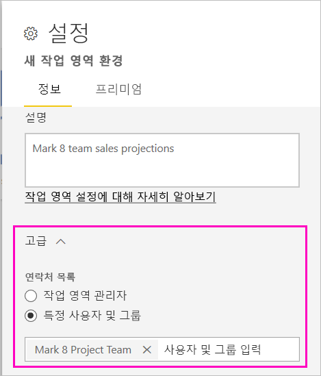
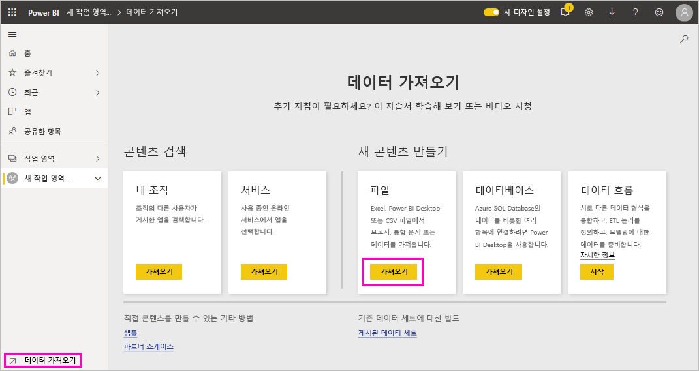
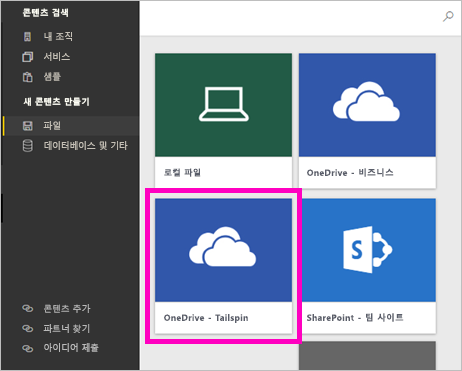
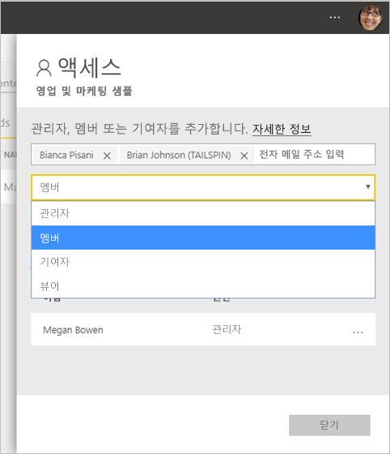

# Power BI에서 새 작업 영역 만들기

Power BI는 새 작업 영역 환경을 소개합니다. 작업 영역은 여전히 동료와 협업하여 대시보드, 보고서 및 페이지를 매긴 보고서의 컬렉션을 만드는 공간입니다. 그런 다음, 해당 컬렉션을 *앱*으로 묶어 전체 조직 또는 특정 사용자나 그룹에 배포할 수 있습니다. 

차이점은 다음과 같습니다. 새 작업 영역을 사용하면 다음을 수행할 수 있습니다.

- 보안 그룹, 배포 목록, Office 365 그룹 및 개인과 같은 사용자 그룹에 작업 영역 역할을 할당합니다.
- Office 365 그룹을 만들지 않고 Power BI에서 작업 영역을 만듭니다.
- 작업 영역에서 더 유연한 사용 권한 관리에 대해 세분화된 작업 영역 역할을 사용합니다.

> [!NOTE]
> 작업 영역에서 콘텐츠를 검색하는 Power BI Pro 사용자를 위해 RLS(행 수준 보안)를 적용하려면 사용자에게 뷰어 역할을 할당합니다.

자세한 배경 정보는 [새 작업 영역](service-new-workspaces.md) 문서를 참조하세요.

## 새로운 작업 영역 중 하나 만들기

1. 먼저 작업 영역을 만듭니다. **작업 영역** > **작업 영역 만들기**를 선택합니다.
   
     

2. **클래식으로 되돌리기**를 선택하지 않으면 업그레이드된 작업 영역이 자동으로 생성됩니다.
   
     
     
     **클래식으로 되돌리기**를 선택하는 경우 [Office 365 그룹을 기준으로 작업 영역](service-create-workspaces.md)이 생성됩니다. 

2. 작업 영역에 이름을 지정합니다. 이름을 사용할 수 없는 경우 편집하여 고유한 이름을 입력합니다.
   
     작업 영역에 대한 앱은 작업 영역과 동일한 이름 및 아이콘을 갖게 됩니다.
   
1. 작업 영역에 대해 설정할 수 있는 몇 가지 선택적 항목은 다음과 같습니다.

    **작업 영역 이미지**를 업로드합니다. 파일은 .png 또는 .jpg 형식일 수 있습니다. 파일 크기는 45KB보다 작아야 합니다.
    
    [**연락처 목록**을 추가합니다](#workspace-contact-list). 기본적으로 작업 영역 관리자는 연락처입니다. 
    
    [URL이 아닌 기존 Office 365 그룹의 이름만 입력하여 **작업 영역 OneDrive**](#workspace-onedrive)를 지정합니다. 이제 이 작업 영역에서 해당 Office 365 그룹의 파일 스토리지 위치를 사용할 수 있습니다. 

    

    작업 영역을 **전용 용량**에 할당하려면 **프리미엄** 탭에서 **전용 용량**을 선택합니다.
     
    

1. **저장**을 선택합니다.

    Power BI는 작업 영역을 만들고 엽니다. 구성원으로 속해 있는 작업 영역 목록에서 볼 수 있습니다. 

## 작업 영역 연락처 목록

작업 영역에서 발생하는 문제에 대한 알림을 받을 사용자를 지정할 수 있습니다. 기본적으로 작업 영역 관리자로 지정된 사용자 또는 그룹은 알림을 받지만, *연락처 목록*에 사용자 또는 그룹을 추가하여 목록을 사용자 지정할 수 있습니다. 연락처 목록에 포함된 사용자 또는 그룹은 UI(사용자 인터페이스)에 나열되어 사용자가 작업 영역에 관련된 도움말을 확인할 수 있습니다.

1. 다음 두 가지 방법 중 하나로 **연락처 목록** 설정에 액세스합니다.

    처음 만드는 경우 **작업 영역 만들기** 창에서

    왼쪽 탐색 창에서 **작업 영역** 옆에 있는 화살표를 선택하고 작업 영역 이름 옆에 있는 **추가 옵션**(…)을 선택한 다음 > **작업 영역 설정**을 선택합니다. **설정** 창이 열립니다.

    

2. **고급** >  **연락처 목록**에서 기본값인 **작업 영역 관리자**를 그대로 적용하거나 고유한 **특정 사용자 또는 그룹** 목록을 추가합니다. 

    

3. **저장**을 선택합니다.

## 작업 영역 OneDrive

작업 영역 OneDrive 기능을 사용하면 작업 영역 사용자가 SharePoint 문서 라이브러리 파일 스토리지를 사용할 수 있는 Office 365 그룹을 구성할 수 있습니다. 먼저 Power BI 외부에 그룹을 만듭니다. 

Power BI는 작업 영역 액세스 권한을 가지도록 구성된 사용자 또는 그룹의 권한을 Office 365 그룹 멤버 자격과 동기화하지 않습니다. 이 설정 Office 365 그룹에서 구성한 파일 스토리지 및 [작업 영역에 대한 액세스 권한](#give-access-to-your-workspace)이 포함된 동일한 Office 365 그룹을 제공하는 것이 가장 좋습니다. 그런 다음, Office 365 그룹의 멤버 자격을 관리하여 작업 영역 액세스를 관리합니다. 

1. 다음 두 가지 방법 중 하나로 새 **작업 영역 OneDrive** 설정에 액세스합니다.

    처음 만드는 경우 **작업 영역 만들기** 창에서

    왼쪽 탐색 창에서 **작업 영역** 옆에 있는 화살표를 선택하고 작업 영역 이름 옆에 있는 **추가 옵션**(…)을 선택한 다음 > **작업 영역 설정**을 선택합니다. **설정** 창이 열립니다.

    

2. **고급** > **작업 영역 OneDrive**에서 이전에 만든 Office 365 그룹의 이름을 입력합니다. Power BI는 그룹의 OneDrive를 자동으로 선택합니다.

    

3. **저장**을 선택합니다.

### 작업 영역 OneDrive 위치에 액세스

OneDrive 위치를 구성한 후에는 Power BI 서비스에서 다른 데이터 원본으로 이동하는 것과 동일한 방법으로 가져올 수 있습니다.

1. 왼쪽 탐색 창에서 **데이터 가져오기**를 선택한 다음, **파일** 상자에서 **가져오기**를 선택합니다.

    

1.  **Onedrive – 비즈니스** 항목은 사용자의 고유한 비즈니스용 OneDrive입니다. 두 번째 OneDrive는 추가한 OneDrive입니다.

    

### 새 작업 영역에서 타사 서비스에 연결

새 작업 영역 환경에서 *앱*에 집중하도록 변경이 진행 중입니다. 타사 서비스의 앱을 통해 사용자가 Microsoft Dynamics CRM, Salesforce 또는 Google Analytics와 같은 사용할 서비스에서 데이터를 쉽게 가져올 수 있습니다.

새 작업 영역 환경에서 조직 콘텐츠 팩을 만들거나 사용할 수 없습니다. 대신 타사 서비스에 연결하기 위해 제공된 앱을 사용하거나 내부 팀이 현재 사용하는 콘텐츠 팩의 앱을 제공하도록 요청할 수 있습니다. 

## 작업 영역에 대한 액세스 권한 부여

1. 작업 영역 콘텐츠 목록에서 관리자는 새 작업(**액세스**)을 볼 수 있습니다.

    

1. 보안 그룹, 배포 목록, Office 365 그룹 또는 개인을 이러한 작업 영역에 구성원, 참가자 또는 관리자로 추가합니다. 다양한 역할에 대한 설명은 [새 작업 영역의 역할](service-new-workspaces.md#roles-in-the-new-workspaces)을 참조하세요.

    

9. **추가** > **닫기**를 선택합니다.

## 앱 배포

조직 내의 많은 대상 그룹에 공식 콘텐츠를 배포하려는 경우 작업 영역에서 앱을 게시할 수 있습니다.  콘텐츠가 준비되면 게시할 대시보드 및 보고서를 선택한 다음, ‘앱’으로 게시합니다.  각 작업 영역에서 하나의 앱을 만들 수 있습니다.

[새 작업 영역에서 앱을 게시하는](service-create-distribute-apps.md) 방법에 대해 알아보기

## 다음 단계
* [Power BI의 새 작업 영역에서 작업 구성](service-new-workspaces.md)에 대해 알아보기
* [클래식 작업 영역 만들기](service-create-workspaces.md)
* [Power BI의 새 작업 영역에서 앱 게시](service-create-distribute-apps.md)
* 궁금한 점이 더 있나요? [Power BI 커뮤니티에 질문합니다.](http://community.powerbi.com/)
