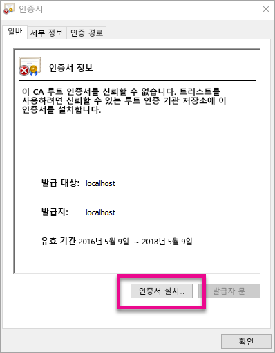
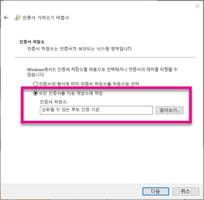
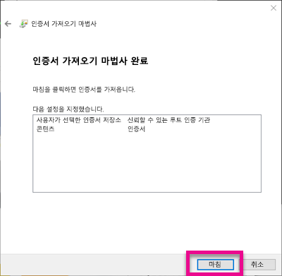
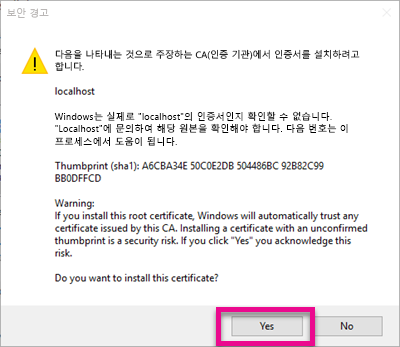
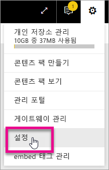
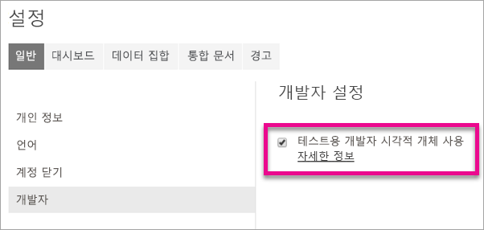
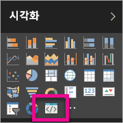

# <a name="use-developer-tools-to-create-custom-visuals"></a>개발자 도구를 사용하여 사용자 지정 시각적 개체 만들기
사용자 지정 시각적 개체를 사용하면 사용자 요구 사항과 앱 디자인에 맞출 수 있습니다. 개발자 도구로 Power BI용 사용자 지정 시각적 개체를 만드는 방법을 알아보세요.

> [!NOTE]
> 이 문서를 사용하면 개발자 도구를 시작하고 실행할 수 있습니다. 자세한 내용에 대해서는 [Power BI 시각적 개체 Git 리포지토리](https://github.com/Microsoft/PowerBI-visuals)에 있는 참조 정보를 검토하세요.
> 
> 

## <a name="requirements"></a>요구 사항
* NodeJS 4.0 + 필요 (5.0 이상 권장) [NodeJS 다운로드](https://nodejs.org)

## <a name="install-nodejs-and-the-power-bi-tools"></a>NodeJS 및 Power BI 도구 설치
사용자 지정 시각적 개체를 만들려면 NodeJS를 설치해야 합니다. NodeJS는 명령줄 도구를 실행하기 위해 필요합니다.

1. [NodeJS](https://nodejs.org)를 다운로드하고 설치합니다. 버전 4.0 이상이 필요하지만 5.0 이상을 권장합니다.
2. 명령줄 도구를 설치합니다. 명령 프롬프트에서 다음 명령을 실행합니다.
   
        npm install -g powerbi-visuals-tools
3. 매개 변수 없이 다음 명령을 실행하여 도구가 설치되었는지 확인할 수 있습니다.
   
        pbiviz
   
    도움말 출력이 표시됩니다.
   
    <pre><code>
         +syyso+/
    oms/+osyhdhyso/
    ym/       /+oshddhys+/
    ym/              /+oyhddhyo+/
    ym/                     /osyhdho
    ym/                           sm+
    ym/               yddy        om+
    ym/         shho /mmmm/       om+
     /    oys/ +mmmm /mmmm/       om+
    oso  ommmh +mmmm /mmmm/       om+
   ymmmy smmmh +mmmm /mmmm/       om+
   ymmmy smmmh +mmmm /mmmm/       om+
   ymmmy smmmh +mmmm /mmmm/       om+
   +dmd+ smmmh +mmmm /mmmm/       om+
         /hmdo +mmmm /mmmm/ /so+//ym/
               /dmmh /mmmm/ /osyhhy/
                 //   dmmd
                       ++
   
       PowerBI Custom Visual Tool
   
    Usage: pbiviz [options] [command]
   
    Commands:
   
    new [name]        Create a new visual
    info              Display info about the current visual
    start             Start the current visual
    package           Package the current visual into a pbiviz file
    update [version]  Updates the api definitions and schemas in the current visual. Changes the version if specified
    help [cmd]        display help for [cmd]
   
    Options:
   
    -h, --help      output usage information
    -V, --version   output the version number
    --install-cert  Install localhost certificate
    </code></pre>

<a name"ssl-setup"></a>

### <a name="server-certificate-setup"></a>서버 인증서 설치
시각적 개체에 대한 실시간 미리 보기를 사용하려면 신뢰할 수 있는 https 서버가 필요합니다. 시작하기 전에 웹 브라우저에서 로드할 수 있도록 시각적 개체 자산을 허용하는 SSL 인증서를 설치해야 합니다. 

> [!NOTE]
> 이 인증서는 개발자 워크스테이션에 한 번만 설치합니다.
> 
> 

인증서를 추가하려면 다음 명령을 실행합니다.

    pbiviz --install-cert

**Windows OS**

1. **인증서 설치...**를 선택합니다.
   
    
2. **현재 사용자**, **다음**을 차례로 선택합니다.
   
    
3. **모든 인증서를 다음 저장소에 저장**, **찾아보기...**를 차례로 선택합니다.
4. **신뢰할 수 있는 루트 인증 기관**, **확인**을 차례로 선택합니다. **다음**을 선택합니다.
   
    
5. **마침**을 선택합니다.
   
    
6. 보안 경고 대화 상자에서 **예**를 선택합니다.
   
    
7. 열려 있는 브라우저를 모두 닫습니다.

> [!NOTE]
> 인증서가 인식되지 않으면 컴퓨터를 다시 시작해야 합니다.
> 
> 

**OSX**

1. 왼쪽 위의 자물쇠가 잠겨 있으면 이 자물쇠를 선택하여 잠금을 해제합니다. localhost를 검색하고 해당 인증서를 두 번 클릭합니다.
   
    
2. **항상 신뢰**를 선택하고 창을 닫습니다.
   
    
3. 사용자 이름과 암호를 입력 합니다. **설정 업데이트**를 선택합니다.
   
    
4. 열려 있는 브라우저를 모두 닫습니다.

> [!NOTE]
> 인증서가 인식되지 않으면 컴퓨터를 다시 시작해야 합니다.
> 
> 

## <a name="enable-live-preview-of-developer-visual"></a>개발자 시각적 개체의 실시간 미리 보기 사용
사용자 지정 시각적 개체에 대한 실시간 미리 보기를 사용하려면 다음 단계를 수행 합니다. 이렇게 하면 보고서를 편집할 때 Power BI 서비스에서 시각적 개체를 사용할 수 있습니다.

1. [app.powerbi.com](https://app.powerbi.com)을 찾아 로그인합니다.
2. **기어 아이콘**, **설정**을 차례로 선택합니다.
   
    
3. **개발자**, **테스트를 위해 개발자 시각적 개체 사용하도록 설정**을 차례로 선택합니다.
   
    
4. **시각화** 창에서 **개발자 시각적 개체**를 선택합니다.
   
    
   
   > [!NOTE]
   > 이렇게 하려면 개발 컴퓨터의 시각적 개체 폴더에서 `pbiviz start`를 실행했어야 합니다. 시각적 개체 만들기에 대한 자세한 내용은 이 문서의 [새 시각적 개체 만들기](#create-a-new-visual)를 참조하세요.
   > 
   > 
5. 보고서 캔버스에서 시각적 개체를 선택합니다. 다른 시각적 개체를 처리하는 것처럼 데이터를 바인딩할 수 있습니다.

이제 시각적 개체를 개발하기 위해 시작할 수 있습니다.

## <a name="create-a-new-visual"></a>새 시각적 개체 만들기
다음 명령을 실행하여 새로운 시각적 개체 프로젝트를 만들 수 있습니다.

```
pbiviz new My Visual name
```

내 시각적 개체 이름을 시각적 개체에 부여할 이름으로 바꿀 수 있습니다. 나중에 이 이름은 생성된 `pbiviz.json` 파일의 `name`과 `displayName` 필드를 수정하여 변경할 수 있습니다.

이 명령은 실행된 바로 그 위치에 새 폴더를 만듭니다. 시각적 개체를 위한 기본 시작 템플릿을 생성 합니다. 명령이 완료되면 디렉터리를 열고 선호하는 편집기를 사용하여 새 시각적 개체에 대한 작업을 시작할 수 있습니다.

## <a name="testing-your-visual-in-power-bi"></a>Power BI에서 시각적 개체 테스트
보고서와 대시보드의 Power BI 서비스에서 시각적 개체를 테스트할 수 있습니다.

<a name="running-your-visual"></a>

### <a name="running-your-visual"></a>시각적 개체 실행
다음을 수행하면 시각적 개체를 실행할 수 있습니다.

1. 프롬프트를 엽니다.
2. 시각적 개체 폴더가 있는 디렉터리로 이동합니다. 이 폴더에는 `pbiviz.json` 파일이 있습니다.
3. 다음 명령을 실행합니다.
   
    ```
    pbiviz start
    ```
   
    

잘못된 위치에 있으면 다음과 비슷한 오류 메시지가 표시됩니다.

```
    error  LOAD ERROR Error: pbiviz.json not found. You must be in the root of a visual project to run this command.
        at e (C:\Users\[user]\AppData\Roaming\npm\node_modules\powerbi-visuals-tools\lib\VisualPackage.js:67:35)
        at Function.loadVisualPackage (C:\Users\[user]\AppData\Roaming\npm\node_modules\powerbi-visuals-tools\lib\VisualPackage.js:62:16)
        at Object.<anonymous> (C:\Users\[user]\AppData\Roaming\npm\node_modules\powerbi-visuals-tools\bin\pbiviz-start.js:43:15)
        at Module._compile (module.js:556:32)
        at Object.Module._extensions..js (module.js:565:10)
        at Module.load (module.js:473:32)
        at tryModuleLoad (module.js:432:12)
        at Function.Module._load (module.js:424:3)
        at Module.runMain (module.js:590:10)
        at run (bootstrap_node.js:394:7)
```

### <a name="viewing-your-visual-in-power-bi"></a>Power BI에서 시각적 개체 보기
보고서에서 시각적 개체를 보려면 해당 보고서로 이동하고 **시각화** 창에서 시각적 개체를 선택합니다.

> [!NOTE]
> [시각적 개체 실행](#running-your-visual) 섹션에서 설명한 대로 먼저 `pbiviz start` 명령을 실행해야 이 작업을 수행할 수 있습니다.
> 
> 


이제 시각적 개체에 대한 시작 템플릿이 표시됩니다.


| 도구 모음 항목 | 설명 |
| --- | --- |
| 시각적 개체 새로 고침 |자동 다시 로드를 사용할 수 없으면 시각적 개체를 수동으로 새로 고칩니다. |
| 자동 다시 로드 토글 |작동 시 시각적 개체 파일을 저장할 때마다 시각적 개체가 자동으로 업데이트됩니다. |
| 데이터 보기 표시 |디버깅할 수 있도록 시각적 개체의 기본 데이터 보기를 보여 줍니다. |
| 도움말 보기 |GitHub에 있는 문서입니다. |
| 피드백 보내기 |환경을 개선할 수 있는 귀중한 경험이 있으면 알려 주십시오! (GitHub 계정 필요) |

## <a name="package-your-visual-for-use-in-power-bi-desktop-and-distribution"></a>Power BI Desktop 및 배포에 사용할 시각적 개체 패키징
시각적 개체를 [Power BI Desktop](https://powerbi.microsoft.com/desktop/)에 로드하거나 [Power BI 시각적 개체 갤러리](https://visuals.powerbi.com)의 커뮤니티와 공유하려면 먼저 `pbiviz` 파일을 생성해야 합니다.

다음을 수행하면 시각적 개체를 패키징할 수 있습니다.

1. 프롬프트를 엽니다.
2. 시각적 개체 폴더가 있는 디렉터리로 이동합니다. 이 폴더에는 `pbiviz.json` 파일이 있습니다.
3. 다음 명령을 실행합니다.
   
    ```
    pbiviz package
    ```

이 명령은 `dist/` 디렉터리에 시각적 개체 프로젝트의 `pbiviz` 파일을 만듭니다. 이미 `pbiviz` 파일이 있으면 이 파일을 덮어씁니다.

## <a name="updating-the-visuals-api-version"></a>시각적 개체 API 버전 업데이트
`pbiviz new`를 사용하여 시각적 개체를 만드는 경우 해당 API type 정의 및 json 스키마의 복사본이 시각적 개체의 디렉터리로 복사됩니다. 필요한 경우 `pbiviz update` 명령을 사용하여 이러한 파일을 업데이트할 수 있습니다. 이렇게 하면 이전 API 버전에 대한 수정이 릴리스되거나 최신 API 버전으로 업데이트하려는 경우에 유용합니다.

### <a name="updating-your-existing-api-version"></a>기존 API 버전 업데이트
기존 API에 대한 업데이트가 릴리스되는 경우 다음을 수행하여 최신 버전을 가져올 수 있습니다.

```
#Update your version of pbiviz
npm install -g powerbi-visuals-tools

#Run update from the root of your visual project, where pbiviz.json is located
pbiviz update
```

이렇게 하면 npm에서 업데이트된 type 정의와 스키마를 포함한 최신 도구를 다운로드합니다. `pbiviz update`를 사용하는 경우 *pbiviz.json* 파일의 `apiVersion` 속성을 최신 버전으로 덮어씁니다.

### <a name="upgrading-to-a-different-api-version"></a>다른 API 버전으로 업그레이드
위에서 설명한 대로 동일한 단계를 사용하여 다른 API 버전으로 업데이트할 수 있습니다. 사용할 API 버전을 명시적으로 지정할 수 있습니다.

```
#Update your version of pbiviz
npm install -g powerbi-visuals-tools

#Run update from the root of your visual project, where pbiviz.json is located
pbiviz update 1.2.0
```

이렇게 하면 시각적 개체를 API 버전 1.2.0으로 업데이트합니다. `1.2.0`은 어떤 버전으로도 바꿔 사용할 수 있습니다.

> [!WARNING]
> 도구에서 사용하는 기본 API 버전은 항상 안정적인 API 버전입니다. 기본 API 버전 이후의 버전은 안정적이지 못하며 조금 후에 바로 바뀔 수도 있습니다. 예기치 않은 동작이 발생하거나 Power BI 서비스와 Power BI Desktop 간에 다르게 작동할 수 있습니다. 현재 안정적인 API 버전에 대해서는 [변경 로그](https://github.com/Microsoft/PowerBI-visuals/blob/master/ChangeLog.md)를 참조하세요. 시험판 버전에 대한 자세한 내용은 [로드맵](https://github.com/Microsoft/PowerBI-visuals/blob/master/Roadmap/README.md)을 참조하세요.
> 
> 

## <a name="inside-the-visual-project"></a>시각적 개체 프로젝트 내부 구조
시각적 개체 프로젝트는 `pbiviz new` 명령을 실행할 때 만들어지는 폴더입니다. 

### <a name="file-structure"></a>파일 구조
| 항목 | 설명 |
| --- | --- |
| assets/ |아이콘, 스크린샷 등 시각적 개체 자산을 저장 하기 위해 사용됩니다. |
| dist/ |`pbiviz package`를 실행할 때 pbiviz 파일이 생성되는 위치입니다. |
| src/ |시각적 개체에 대한 TypeScript 코드입니다. |
| style/ |시각적 개체에 대한 Less 스타일입니다. |
| .gitignore |리포지토리에서 추적되지 않는 파일을 무시하도록 Git에 알립니다. |
| capabilities.json |시각적 개체의 [capabilities](https://github.com/Microsoft/PowerBI-visuals/blob/master/Capabilities/Capabilities.md)를 정의하기 위해 사용됩니다. |
| package.json |[npm](https://www.npmjs.com/)에서 모듈을 관리하기 위해 사용됩니다. |
| pbiviz.json |기본 구성 파일입니다. |
| tsconfig.json |TypeScript 컴파일러 설정입니다. [tsconfig.json](https://www.typescriptlang.org/docs/handbook/tsconfig-json.html)에서 자세히 알아보세요. |

### <a name="pbivizjson"></a>pbiviz.json
시각적 개체에 대한 기본 구성 파일입니다. 여기에는 시각적 개체를 빌드하는 데 필요한 파일 관련 정보와 함께 메타 데이터도 포함되어 있습니다.

```
{
    "visual": {
        "name": "myVisual", // internal visual name (should not contain spaces)
        "displayName": "My Visual!", // visual name displayed to user (used in gallery)
        "guid": "PBI_CV_xxxxxxx", // a unique id for this visual MUST BE UNIQUE
        "visualClassName": "Visual" // the entry class for your visual
        "version": "1.0.0", // visual version. Should be semantic version (increment if you update the visual)
        "description": "", // description used in gallery
        "supportUrl": "", // url to where users can get support for this visual
        "gitHubUrl": "" // url to the source in github (if applicable)
    },
    "apiVersion": "1.0.0", //API version this visual was created with
    "author": {
        "name": "", // your name
        "email": "" // your e-mail
    },
    "assets": {
        "icon": "assets/icon.png" // relative path to your icon file (20x20 png)
    },
    "style": "style/visual.less", // relative path to your less file
    "capabilities": "capabilities.json" // relative path to your capabilities definition 
}
```

### <a name="visual-source-typescript"></a>시각적 개체 원본(TypeScript)
시각적 개체는 더 많은 고급 기능과 ES6/ES7 기능에 대한 초기 액세스를 지원하는 JavaScript의 상위 집합인 TypeScript로 작성해야 합니다.

모든 TypeScript 파일은 `src/` 디렉터리에 저장되고 `tsconfig.json`의 `files` 배열에 추가되어야 합니다. 이렇게 하면 TypeScript 컴파일러에서 특정 순서로 이 파일들을 로드할 수 있습니다.

시각적 개체를 빌드할 때 모든 TypeScript가 하나의 JavaScript 파일로 컴파일됩니다. 이렇게 하면 두 파일이 tsconfig에 나열되어 있는 동안에는 수동으로 `require`를 수행할 필요 없이 다른 파일에서 내보낸 요소를 참조할 수 있습니다.

시각적 개체를 만들어야 하는 만큼 많은 개수의 파일과 클래스를 만들 수 있습니다.

[TypeScript](http://www.typescriptlang.org/)에서 자세히 알아보세요.

### <a name="visual-style-less"></a>시각적 개체 스타일(Less)
시각적 개체 스타일 지정은 CSS 스타일 시트로 처리됩니다. 편의상 중첩, 변수, mixin, 조건, 루프 등 몇 가지 고급 기능을 지원하는 Less 사전 컴파일러를 사용합니다. 이러한 기능 중 하나를 사용하지 않을 경우 Less 파일에 일반 CSS만 작성할 수 있습니다.

모든 Less 파일은 `style/` 디렉터리에 저장됩니다. `pbiviz.json` 파일의 `style` 필드에 지정된 파일이 로드됩니다. 추가되는 파일은 모두 `@import`를 사용하여 로드됩니다.

[Less](http://lesscss.org/)에서 자세히 알아보세요.

## <a name="debugging"></a>디버깅
사용자 지정 시각적 개체의 디버깅에 대한 팁은 [디버깅 가이드](https://github.com/Microsoft/PowerBI-visuals/blob/master/tools/debugging.md)를 을 참조하세요.

## <a name="submit-your-visual-to-appsource"></a>AppSource에 시각적 개체 제출
다른 사람들이 사용할 시각적 개체를 나열하고 AppSource에 제출할 수 있습니다. 이 과정에 대한 자세한 내용은 [사용자 지정 시각적 개체를 AppSource에 게시](developer/office-store.md)를 참조하세요.

## <a name="troubleshooting"></a>문제 해결
**Pbiviz 명령어가 없습니다(또는 유사한 오류)**

`pbiviz`를 터미널/명령줄에서 실행하는 경우에는 도움말 화면이 표시됩니다. 그렇지 않은 경우 개발자 도구가 올바르게 설치되지 않았습니다. 4.0 버전 이상의 NodeJS를 설치했는지 확인합니다.

자세한 내용은 [NodeJS 및 Power BI 도구 설치](#install-nodejs-and-the-power-bi-tools)를 참조하세요.

**시각화 탭에 디버그 시각적 개체가 없습니다**

**시각화** 탭에는 프롬프트 아이콘처럼 보이는 디버그 시각적 개체가 있습니다.


디버그 시각적 개체가 보이지 않으면 Power BI 설정에서 사용할 수 있도록 설정되었는지 확인합니다. 

> [!NOTE]
> 디버그 시각적 개체는 현재 Power BI 서비스에서만 제공되며, Power BI Desktop이나 모바일 앱에는 제공되지 않습니다. 패키징된 시각적 개체는 어디서나 변함 없이 작동됩니다.
> 
> 

자세한 내용은 [개발자 시각적 개체의 실시간 미리 보기 사용](#enable-live-preview-of-developer-visual)을 참조하세요.

**시각적 개체 서버에 연결할 수 없습니다**

시각적 개체 프로젝트의 루트에 있는 터미널/명령줄의 `pbiviz start` 명령으로 서버를 실행합니다. 서버가 실행 중인 경우 SSL 인증서가 올바르게 설치되지 않았을 수도 있습니다.

자세한 내용은 [시각적 개체 실행](#running-your-visual) 또는 [서버 인증서 설치](#ssl-setup)를 참조하세요.

## <a name="next-steps"></a>다음 단계
[Power BI의 시각화](power-bi-report-visualizations.md)  
[Power BI의 사용자 지정 시각화](power-bi-custom-visuals.md)  
[사용자 지정 시각적 개체를 Office 스토어에 게시](developer/office-store.md)  
[TypeScript](http://www.typescriptlang.org/)  
[Less CSS](http://lesscss.org/)  

궁금한 점이 더 있나요? [Power BI 커뮤니티에 질문합니다.](http://community.powerbi.com/)

