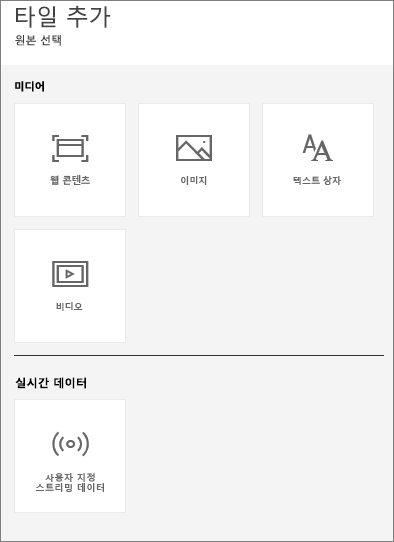
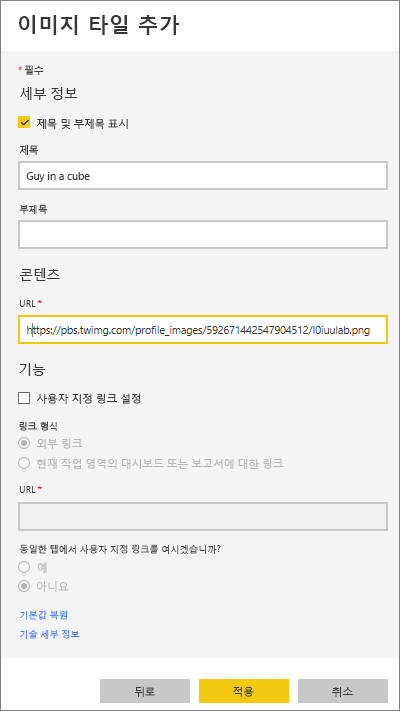
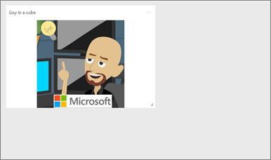
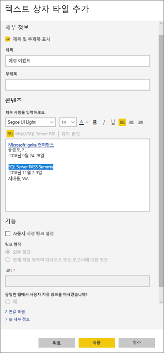
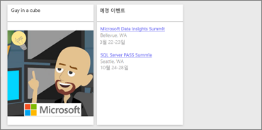
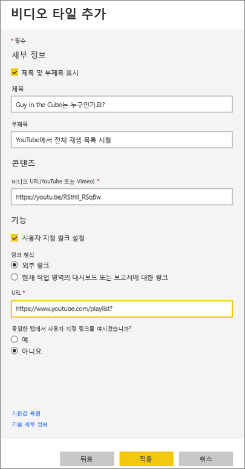
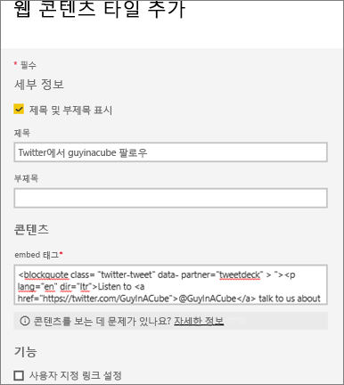
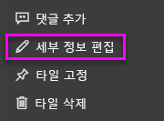

# <a name="add-images-videos-and-more-to-your-dashboard"></a>대시보드에 이미지, 동영상 등 추가

대시보드에 타일을 추가하여 이미지, 텍스트 상자, 동영상, 스트리밍 데이터, 웹 코드 등을 대시보드에 저장할 수 있습니다. 

Amanda가 대시보드에 타일을 추가합니다.

   
<iframe width="560" height="315" src="https://www.youtube.com/embed/e2PD8m1Q0vU" frameborder="0" allowfullscreen></iframe>


## <a name="add-an-image-video-or-other-tile"></a>이미지, 비디오 또는 기타 타일 추가
이미지, 텍스트 상자, 비디오, 스트리밍 데이터 또는 웹 코드를 대시보드에 직접 추가할 수 있습니다.

1. 대시보드 맨 위 메뉴 모음에서 **타일 추가**를 선택합니다. 공간 제약에 따라 더하기  기호만 표시될 수 있습니다.
   
    
2. 다음 중 추가할 타일 유형을 선택합니다. 

    **[웹 콘텐츠](#add-web-content)**

    **[이미지](#add-an-image)**

    **[텍스트 상자](#add-a-text-box-or-dashboard-heading)**

    **[비디오](#add-a-video)**

    **[사용자 지정 스트리밍 데이터](#add-streaming-data)**
   
    

## <a name="add-an-image"></a>이미지 추가
대시보드에 회사 로고나 다른 이미지를 추가하려면 이미지 파일을 온라인으로 저장하고 연결합니다. 이미지 파일에 액세스하는 데 보안 자격 증명이 필요하지 않은지 확인합니다. 예를 들어, OneDrive 및 SharePoint는 인증을 사용해야 하므로 여기에 저장된 이미지를 대시보드에 이러한 방식으로 추가할 수 없습니다.  

1. **타일 추가** 창에서 **이미지** > **다음**을 선택합니다.

2. **이미지 타일 추가** 창에서 이미지 정보를 추가합니다.   
   
   a. 이미지 위에 제목을 표시하려면 **제목 및 부제목 표시**를 선택하고 **제목**을 입력하고 선택적으로 **부제목**을 입력합니다.

   b. 이미지 **URL**을 입력합니다.

   c. 제목을 하이퍼링크로 만들려면 **사용자 지정 링크 설정**을 선택하고 **URL**을 입력합니다. 

      동료가 이미지 또는 제목을 클릭하면 이 URL로 이동합니다.

   d. **적용**을 선택합니다. 

      

3. 대시보드에서 필요에 따라 이미지 크기를 조정하고 이동합니다.
     
     

## <a name="add-a-text-box-or-dashboard-heading"></a>텍스트 상자 또는 대시보드 제목 추가

대시보드 제목을 추가하려면, 텍스트 상자에 제목을 입력하고 글꼴을 늘립니다.

1. **타일 추가** 창에서 **텍스트 상자** > **다음**을 선택합니다.

2. 텍스트 상자의 서식을 지정합니다.
   
   a. 텍스트 상자 위에 제목을 표시하려면 **제목 및 부제목 표시**를 선택하고 **제목**을 입력하고 선택적으로 **부제목**을 입력합니다.

   b. 텍스트 상자에 **콘텐츠**를 입력하고 형식을 지정합니다.  

   c. 필요에 따라 제목에 대한 사용자 지정 링크를 설정합니다. 외부 사이트나 대시보드 또는 작업 영역의 보고서를 사용자 지정 링크로 사용할 수 있습니다. 하지만 이 예제에서는 텍스트 상자 내에 하이퍼링크를 추가했으므로 **사용자 지정 링크 설정**을 선택하지 않은 상태로 둡니다.

   d. **적용**을 선택합니다. 

     
   
3. 대시보드에서 필요에 따라 텍스트 상자 크기를 조정하고 이동합니다.
   
   

## <a name="add-a-video"></a>동영상 추가
대시보드에 YouTube 또는 Vimeo 동영상 타일을 추가하면 동영상이 대시보드에서 바로 재생됩니다.

1. **타일 추가** 창에서 **비디오** > **다음**을 선택합니다.
2. **비디오 타일 추가** 창에 비디오 정보를 추가합니다.   
   
   a. 비디오 타일 위에 제목과 부제목을 표시하려면 **제목 및 부제목 표시**를 선택하고 **제목**을 입력하고 선택적으로 **부제목**을 입력합니다. 이 예제에서는 **부제목**을 추가한 다음 전체 YouTube 재생 목록에 대한 하이퍼링크로 변환합니다.

   b. 동영상에 대한 **비디오 URL**을 입력합니다.

   c. 동료가 포함된 동영상을 시청한 후에 YouTube에서 전체 재생 목록을 볼 수 있도록 **제목** 및 **부제목**에 대한 하이퍼링크를 추가합니다. 이렇게 하려면 **기능**에서 **사용자 지정 링크 설정**을 선택하고 재생 목록에 대한 **URL**을 입력합니다.

   d. **적용**을 선택합니다.  

   

3. 대시보드에서 필요에 따라 동영상 타일 크기를 조정하고 이동합니다.
     
   
4. 동영상 타일을 선택하여 동영상을 재생합니다.
5. 부제목을 선택하여 YouTube의 재생 목록을 방문합니다.

## <a name="add-streaming-data"></a>스트리밍 데이터 추가
PubNub을 사용하여 대시보드의 타일에 스트리밍 데이터(예: Twitter 피드 또는 센서 데이터)를 추가할 수 있습니다. Power BI가 PubNub에서 데이터를 가져오는 통합을 만들었습니다. 여기서는 Will이 작동 방법을 설명합니다.
   

<iframe width="560" height="315" src="https://www.youtube.com/embed/kOuINwgkEkQ" frameborder="0" allowfullscreen></iframe>

1. **타일 추가** 창에서 **사용자 지정 스트리밍 데이터** > **다음**을 선택합니다.
2. **스트리밍 데이터 세트 추가**를 선택합니다.
3. Power BI API 또는 PubNub를 사용하여 **새 스트리밍 데이터 세트**를 만듭니다.
4. **데이터 세트 이름**, **구독 키** 및 **채널 이름** 필드에 입력합니다. 보안 연결인 경우 인증 키도 있습니다. PubNub의 샘플 값을 사용하여 시도해 볼 수 있습니다.
5. **다음**을 선택합니다.
    데이터 세트에서 사용 가능한 필드는 데이터 형식 및 JSON 형식으로 표시됩니다.
6. **연결**을 선택합니다.
    스트리밍 데이터 세트를 만들었습니다.
7. 대시보드로 돌아가서 **타일 추가** > **사용자 지정 스트리밍 데이터** > **다음**을 다시 선택합니다.
8. 만든 센서 데이터의 데이터 세트를 선택하고 **다음**을 선택합니다.
9. 원하는 시각적 개체 유형을 선택합니다. 대체로 꺾은선형 차트는 이 데이터에서 잘 작동합니다.
10. **축**, **범례** 및 **값**을 선택합니다.
11. 표시하려는 시간을 초, 분 또는 시간 단위로 결정합니다.
12. **다음**을 선택합니다.
13. 원하는 경우 **제목** 및 **부제목**을 지정합니다.
14. 대시보드에 고정합니다.


1. **타일 추가** 창에서 **사용자 지정 스트리밍 데이터** > **다음**을 선택합니다.

2. **스트리밍 데이터 세트 추가**를 선택합니다.

3. Power BI API 또는 PubNub를 사용하여 **새 스트리밍 데이터 세트**를 만듭니다.

4. **데이터 세트 이름**, **구독 키** 및 **채널 이름** 필드에 입력합니다. 보안 연결인 경우 인증 키도 있습니다. PubNub의 샘플 값을 사용하여 시도해 볼 수 있습니다.

5. **다음**을 선택합니다.

   데이터 세트에서 사용 가능한 필드는 데이터 형식 및 JSON 형식으로 표시됩니다.

6. **연결**을 선택합니다.

   스트리밍 데이터 세트를 만들었습니다.

7. 대시보드로 돌아가서 **타일 추가** > **사용자 지정 스트리밍 데이터** > **다음**을 다시 선택합니다.

8. 만든 센서 데이터의 데이터 세트를 선택하고 **다음**을 선택합니다.

9. 원하는 시각적 개체 유형을 선택합니다. 대체로 꺾은선형 차트는 이 데이터에서 잘 작동합니다.

10. **축**, **범례** 및 **값**을 선택합니다.

11. 표시하려는 시간을 초, 분 또는 시간 단위로 결정합니다.

12. **다음**을 선택합니다.

13. 필요한 경우 **제목** 및 **부제목**을 지정합니다.

14. 대시보드에 고정합니다.

## <a name="add-web-content"></a>웹 콘텐츠 추가
보고서 또는 대시보드에 HTML 콘텐츠를 타일로 붙여넣거나 입력할 수 있습니다. embed 태그를 수동으로 입력하거나 Twitter, YouTube, embed.ly 등의 사이트에서 복사하여 붙여넣습니다.

1. **타일 추가** 창에서 **웹 콘텐츠** > **다음**을 선택합니다.

2. **웹 콘텐츠 타일 추가** 창에 정보를 추가합니다.
   
   a. 타일 위에 제목을 표시하려면 **제목 및 부제목 표시**를 선택하고 **제목**을 입력하고 선택적으로 **부제목**을 입력합니다.

   b. embed 태그를 입력합니다. 이 예제에서는 Twitter 피드를 복사하고 붙여넣습니다.

   c. **적용**을 선택합니다.

   
   

3. 대시보드에서 필요에 따라 웹 콘텐츠 타일 크기를 조정하고 이동합니다.
     
   

### <a name="tips-for-embedding-web-content"></a>웹 콘텐츠 포함에 대한 팁
* iframe의 경우 보안 소스를 사용합니다. iframe embed 태그를 입력하고 빈 타일을 가져오는 경우 iframe 소스에 *http*를 사용하고 있지 않은지 알아봅니다. http를 사용하고 있는 경우 *https*로 변경하세요.
  
  ```html
  <iframe src="https://xyz.com">
  ```
* 너비와 높이 정보를 편집합니다. embed 태그는 동영상을 포함하고 동영상 플레이어를 560 x 315 픽셀로 설정합니다. 이 크기는 타일 크기를 조정할 때 변경되지 않습니다.
  
  ```html
  <iframe width="560" height="315"
  src="https://www.youtube.com/embed/Cle_rKBpZ28" frameborder="0"
   allowfullscreen></iframe>
  ```
  
  타일 크기에 맞게 플레이어 크기를 조정하려는 경우 너비 및 크기를 100%로 설정합니다.
  
  ```html
  <iframe width="100%" height="100%"
  src="https://www.youtube.com/embed/Cle_rKBpZ28" frameborder="0"
   allowfullscreen></iframe>
  ```
* 이 코드는 트윗을 포함하고, AFK 팟캐스트, \@GuyInACube의 Twitter 페이지, 팔로우, #analytics, 댓글, 리트윗 및 좋아요에 대한 링크를 대시보드의 개별 링크로 유지합니다.  타일 자체를 선택하면 Twitter의 팟캐스트로 이동됩니다.
  
  ```html
  <blockquote class="twitter-tweet" data-partner="tweetdeck">
  <p lang="en" dir="ltr">Listen to
  <a href="https://twitter.com/GuyInACube">@GuyInACube</a> talk to
  us about making videos about Microsoft Business Intelligence
  platform
  <a href="https://t.co/TmRgalz7tv">https://t.co/TmRgalz7tv </a>
  <a href="https://twitter.com/hashtag/analytics?src=hash">
  #analytics</a></p>&mdash; AFTK Podcast (@aftkpodcast) <a
  href="https://twitter.com/aftkpodcast/status/693465456531771392">
  January 30, 2016</a></blockquote> <script async src="//platform.twitter.com/widgets.js" charset="utf-8"></script>
  ```

## <a name="edit-a-tile"></a>타일 편집
기존 타일을 변경하려면

1. 타일의 오른쪽 위를 마우스로 가리키고 **추가 옵션**(...)을 선택합니다.
   
    
2. **세부 정보 편집**을 선택하여 **타일 세부 정보** 창을 표시하고 변경합니다.
   
    

## <a name="considerations-and-troubleshooting"></a>고려 사항 및 문제 해결
* 대시보드의 타일로 쉽게 이동할 수 있도록 하려면 제목 및 선택적 부제목을 추가합니다.
* 웹 사이트의 콘텐츠를 포함하려고 하지만 웹 사이트에서 복사하여 붙여넣을 embed 태그를 제공하지 않으면 embed.ly에서 embed 태그 생성에 대한 도움말을 확인하세요.

## <a name="next-steps"></a>다음 단계
[Power BI 디자이너용 대시보드 타일 소개](service-dashboard-tiles.md)

궁금한 점이 더 있나요? [Power BI 커뮤니티를 이용](https://community.powerbi.com/)하세요.

