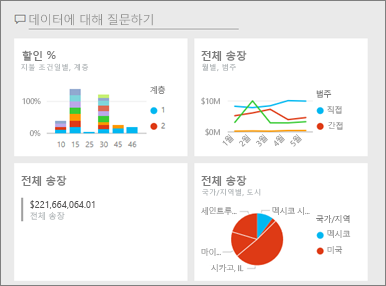
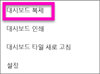
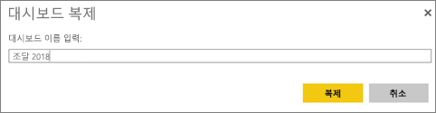

# Power BI 서비스에서 대시보드 복사본 만들기

 대시보드의 사본을 만드는 데는 여러 가지 이유가 있습니다. 원본을 변경하고 원본에 대해 그 성능을 테스트하거나, 동료, 지역 또는 팀에 배포할 약간씩 다른 버전을 만들고자 할 수 있습니다. 동료들이 대시보드 디자인이 마음에 들어서 자신의 상사에게 보고할 때 해당 디자인을 사용하고자 할 수도 있습니다. 또 다른 이유는 데이터 구조과 형식이 동일한 새 데이터베이스에서 이미 만든 대시보드를 재사용하려하는 경우가 있습니다. 이런 상황은 자주 발생하나 Power BI Desktop에서는 어느 정도의 작업이 필요합니다. 

대시보드는 Power BI 서비스를 사용하여 생성(그리고 복사)되고 Power BI Mobile 및 Power BI Embedded에서 볼 수 있습니다.  대시보드는 Power BI Desktop에서 사용할 수 없습니다. 

대시보드 복사본을 만들려면 대시보드 *작성자*여야 합니다. 앱으로 공유된 대시보드는 복제할 수 없습니다.

1. 대시보드를 엽니다.
2. 오른쪽 위에 있는 **추가 옵션**(...)을 선택한 다음, **대시보드 복제**를 선택합니다.
   
   
3. 대시보드에 이름을 지정하고 **복제**를 선택합니다. 
   
   
4. 새 대시보드는 원본과 같은 작업 영역에 저장됩니다. 
   
   

5.    새 대시보드를 열고 필요한 대로 편집합니다. 다음과 같은 몇 가지 작업을 수행합니다.    
    a. [타일을 이동하고, 이름을 바꾸고, 크기를 조정하거나 삭제합니다](service-dashboard-edit-tile.md).  
    b. 타일 **추가 옵션**(...)을 선택한 다음, **세부 정보 편집**을 선택하여 타일 세부 정보와 하이퍼링크를 편집합니다.  
    c. [대시보드 메뉴 모음에서 새 타일을 추가합니다](service-dashboard-add-widget.md)(**타일 추가**).  
    d. [질문 및 답변](service-dashboard-pin-tile-from-q-and-a.md) 또는 [보고서](service-dashboard-pin-tile-from-report.md)에서 새 타일을 고정합니다.  
    e. 대시보드 설정 창에서 대시보드 이름을 바꾸고, 질문 및 답변을 켜거나 끄고, 타일 흐름을 설정합니다.  대시보드 **추가 옵션**(...) 드롭다운을 선택한 다음, **설정**을 선택합니다.  
    f. 대시보드를 동료들과 직접 공유하거나 Power BI 앱의 일부로 공유합니다. 

## 다음 단계
* [멋진 대시보드를 디자인하기 위한 팁](service-dashboards-design-tips.md) 

궁금한 점이 더 있나요? [Power BI 커뮤니티를 이용하세요.](https://community.powerbi.com/)

