# 보고서에서 Power BI 대시보드 만들기
지금까지 [Power BI의 대시보드](service-dashboards.md)에 대해 살펴보았으며 이제 직접 만들려고 합니다. 보고서에서, 처음부터, 데이터 세트에서 대시보드를 만들거나 기존 대시보드를 복제하는 등 다양한 방법으로 대시보드를 만들 수 있습니다.  

처음 시작할 때에는 부담스러울 수 있으므로, 이미 빌드된 보고서에서 시각화를 고정하여 쉽고 빠르게 대시보드를 만들어 시작합니다. 이 빠른 시작을 완료하면 대시보드와 보고서 간 관계를 이해하고, 보고서 편집기에서 편집용 보기를 열고, 타일을 고정하고, 대시보드와 보고서 간을 탐색할 수 있습니다. 그런 다음, 왼쪽의 목차에 있는 링크를 사용하거나 맨 아래의 **다음 단계**를 사용하여 고급 항목으로 진행합니다.

## 대시보드는 누가 만들 수 있나요?
대시보드 만들기는 **작성자** 기능이며 보고서에 대한 편집 권한이 필요합니다. 편집 권한은 보고서 작성자와 작성자가 액세스 권한을 부여하는 동료들에게 제공됩니다. 예를 들어 David가 workspaceABC에서 보고서를 만들고 해당 작업 영역의 구성원으로 사용자를 추가하는 경우, David와 사용자는 둘 다 편집 권한이 있습니다. 반면, 보고서가 사용자와 직접 공유되거나 [Power BI 앱](service-create-distribute-apps.md)의 일부로서 공유되는 경우(사용자가 보고서를 **소비**하는 경우) 사용자는 대시보드에 타일을 고정할 수 없습니다.

> **참고**: 대시보드는 Power BI Desktop이 아닌 Power BI 서비스의 기능입니다. Power BI 모바일에서는 대시보드를 만들 수 없지만 [보고 공유](consumer/mobile/mobile-apps-view-dashboard.md)할 수는 있습니다.
>
> 

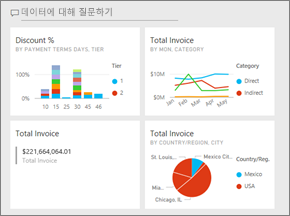

## 비디오: 보고서에서 시각적 개체 및 이미지를 고정하여 대시보드를 만듭니다.
Amanda가 보고서에서 시각화를 핀 고정하여 새 대시보드를 만드는 과정을 시청합니다. 그런 다음, 동영상 아래 단계에 따라 조달 분석 샘플을 직접 사용해 보세요.

<iframe width="560" height="315" src="https://www.youtube.com/embed/lJKgWnvl6bQ" frameborder="0" allowfullscreen></iframe>

### 필수 조건
작업을 수행하려면 “조달 분석” 샘플 Excel 통합 문서를 다운로드하여 Power BI 서비스(app.powerbi.com)에서 열어야 합니다.

## 보고서로 데이터 세트 가져오기
Power BI 샘플 데이터 세트 중 하나를 가져오고 이를 사용하여 새 대시보드를 만듭니다. 사용할 샘플은 두 개의 PowerView 시트가 있는 Excel 통합 문서입니다. Power BI에서 통합 문서를 가져오면 데이터 세트와 보고서를 작업 영역에 추가합니다.  보고서는 PowerView 시트에서 자동으로 생성됩니다.

1. [이 링크를 선택](http://go.microsoft.com/fwlink/?LinkId=529784)하여 조달 분석 샘플 Excel 파일을 다운로드하고 저장합니다. 비즈니스용 OneDrive에 파일을 저장하는 것이 좋습니다.
2. 브라우저에서 Power BI 서비스(app.powerbi.com)를 엽니다.
3. **내 작업 영역**을 선택합니다.
4. 왼쪽 탐색 창에서 **데이터 가져오기**를 선택합니다.

    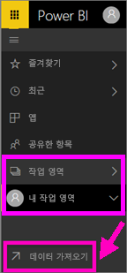
5. **파일**을 선택합니다.

   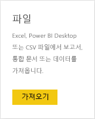
6. 조달 분석 샘플 Excel 파일을 저장한 위치로 이동합니다. 이를 선택하고 **연결**을 선택합니다.

   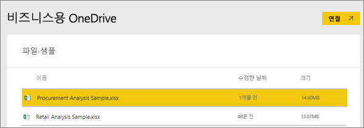
7. 이 연습에서는 **가져오기**를 선택합니다.

    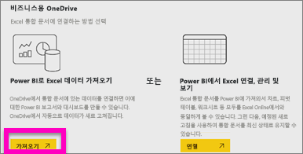
8. 성공 메시지가 나타나면 **x**를 선택하여 닫습니다.

   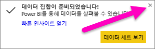

### 보고서를 열고 타일을 대시보드에 핀 고정합니다.
1. 같은 작업 영역에서 **보고서** 탭을 선택합니다. 새로 가져온 보고서에는 노란색 별표가 함께 표시됩니다. 열려는 보고서 이름을 선택합니다.

    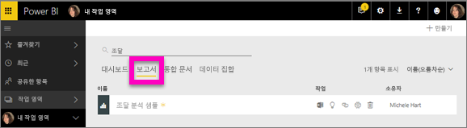
2. 보고서는 읽기용 보기로 열립니다. 맨 아래에는 할인 분석과 지출 개요 등의 두 탭이 있습니다. 각 탭은 보고서의 페이지를 나타냅니다.
    **보고서 편집**을 선택하여 편집용 보기에서 보고서를 엽니다.

    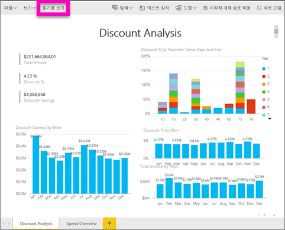
3. 시각화 위로 마우스를 가져 가면 사용할 수 있는 옵션이 표시됩니다. 시각화를 대시보드에 추가하려면 핀 고정  아이콘을 선택합니다.

    
4. 새 대시보드를 만들고 있으므로 **새 대시보드**에 대한 옵션을 선택하고 이름을 지정합니다.

   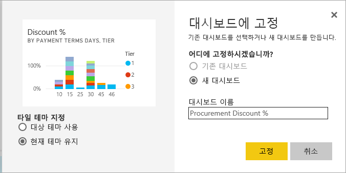
5. **핀 고정**을 선택하면, Power BI에서 현재 작업 영역에 새 대시보드를 만듭니다. **대시보드에 고정됨** 메시지가 나타나면 **대시보드로 이동**을 선택합니다. 보고서를 저장할지 묻는 메시지가 표시되면 **저장**을 선택합니다.

     
6. Power BI에 새 대시보드가 열리고, 방금 고정한 시각화인 타일이 한 개 있습니다.

   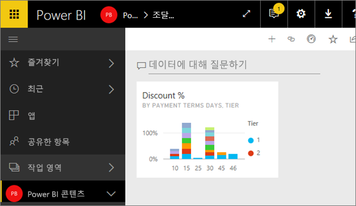
7. 보고서로 돌아가려면 타일을 선택합니다. 새 대시보드에 몇 개 타일을 고정합니다. 이번에는 **대시보드에 고정** 창이 표시될 때 **기존 대시보드**를 선택합니다.  

   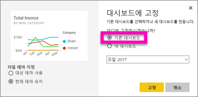

## 전체 보고서 페이지를 대시보드에 고정
시각적 개체를 한 번에 하나씩 고정하는 대신, [전체 보고서 페이지를 ‘라이브 타일’로 고정할 수 있습니다](service-dashboard-pin-live-tile-from-report.md). 이를 수행해 보겠습니다.

1. 보고서 편집기에서 **지출 개요** 탭을 선택하여 보고서의 두 번째 페이지를 엽니다.

   

2. 대시보드에 있는 이러한 시각적 개체를 모두 원합니다.  메뉴 모음의 오른쪽 위 모서리에서 **라이브 고정 페이지**를 선택합니다. 대시보드에서 페이지를 새로 고칠 때마다 라이브 페이지 타일이 업데이트됩니다.

   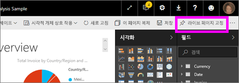

3. **대시보드에 고정** 창이 표시될 때 **기존 대시보드**를 선택합니다.

   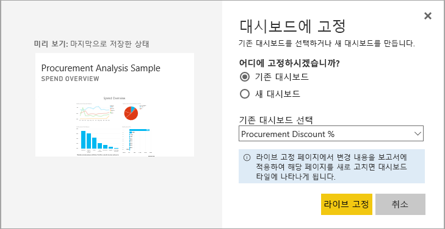

4. [성공] 메시지가 나타나면 **대시보드로 이동**을 선택합니다. 보고서에서 고정한 타일이 표시됩니다. 아래 예에서는 보고서의 1페이지에서 타일을 2개 고정하고 보고서의 2페이지에 있는 라이브 타일을 하나 고정했습니다.

   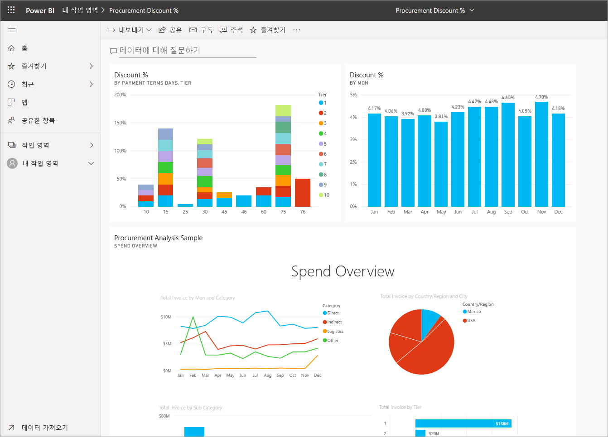

축하합니다. 첫 번째 대시보드를 만들었습니다! 이제 대시보드가 있으며 훨씬 많은 작업을 수행할 수 있습니다.  아래 제시된 **다음 단계** 중 하나를 시도하거나 재생하고 직접 탐색해 보세요.   

## 다음 단계
* [타일 크기 조정 및 이동](service-dashboard-edit-tile.md)
* [대시보드 타일에 대한 모든 정보](service-dashboard-tiles.md)
* [앱을 만들어 대시보드 공유](service-create-workspaces.md)
* [Power BI - 기본 개념](service-basic-concepts.md)
* [멋진 대시보드를 디자인하기 위한 팁](service-dashboards-design-tips.md)

궁금한 점이 더 있나요? [Power BI 커뮤니티를 이용하세요.](http://community.powerbi.com/)
