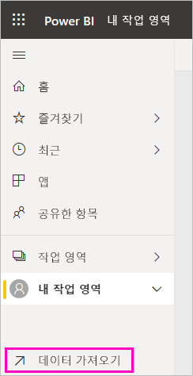

# 보고서에서 Power BI 대시보드 만들기
지금까지 [Power BI의 대시보드 소개](service-dashboards.md)에 대해 살펴보았으며 이제 직접 만들려고 합니다. 다양한 방법으로 대시보드를 만들 수 있습니다. 예를 들어 보고서의 데이터 세트에서 처음부터 또는 기존 대시보드를 복제하여 대시보드를 만들 수 있습니다.  

이미 빌드된 보고서에서 시각화를 고정하는 빠르고 쉬운 대시보드를 만들어 시작하겠습니다. 

이 문서를 완료하면 다음을 잘 이해할 수 있습니다.
- 대시보드와 보고서 간의 관계
- 보고서 편집기에서 편집용 보기를 여는 방법
- 타일을 고정하는 방법 
- 대시보드와 보고서 간에 이동하는 방법 
 

> [!NOTE] 
> 대시보드는 Power BI Desktop이 아닌 Power BI 서비스의 기능입니다. Power BI 모바일 앱에서 대시보드를 만들지는 않지만 이 위치에서 [보기 및 공유](consumer/mobile/mobile-apps-view-dashboard.md)를 수행할 수 있습니다.
>
> 

## 비디오: 보고서에서 시각적 개체 및 이미지를 고정하여 대시보드를 만듭니다.
Amanda가 보고서에서 시각화를 핀 고정하여 새 대시보드를 만드는 과정을 시청합니다. 그리고 다음 섹션에서 [보고서와 함께 데이터 세트 가져오기](#import-a-dataset-with-a-report)의 단계를 따라 조달 분석 샘플을 사용하여 직접 시도해 보세요.
    

<iframe width="560" height="315" src="https://www.youtube.com/embed/lJKgWnvl6bQ" frameborder="0" allowfullscreen></iframe>

## 보고서로 데이터 세트 가져오기
이 단계별 지침에서 Power BI 샘플 데이터 세트 중 하나를 가져오고 이를 사용하여 새 대시보드를 만듭니다. 사용할 샘플은 두 개의 PowerView 시트가 있는 Excel 통합 문서입니다. Power BI에서 통합 문서를 가져오면 데이터 세트와 보고서를 작업 영역에 추가합니다. 보고서는 PowerView 시트에서 자동으로 생성됩니다.

1. [Procurement Analysis sample](https://go.microsoft.com/fwlink/?LinkId=529784) Excel 파일을 다운로드합니다. 비즈니스용 OneDrive에 파일을 저장하는 것이 좋습니다.
2. 브라우저에서 Power BI 서비스(app.powerbi.com)를 엽니다.
3. 탐색 창에서 **내 작업 영역**을 선택하고 **데이터 가져오기**를 선택합니다.

    
5. **파일** 아래에서 **가져오기**를 선택합니다.

   
6. 조달 분석 샘플 Excel 파일을 저장한 위치로 이동합니다. 이를 선택하고 **연결**을 선택합니다.

   
7. 이 연습에서는 **가져오기**를 선택합니다.

    
8. 성공 메시지가 나타나면 **x**를 선택하여 해제합니다.

   

> [!TIP]
> 알고 계셨나요? 위쪽 에서 세 줄이 있는 아이콘을 선택하여 탐색 창의 범위를 좁힐 수 있습니다. 이를 통해 보고서 자체를 위한 공간을 더 확보할 수 있습니다.

### 보고서를 열고 타일을 대시보드에 고정
1. 동일한 작업 영역에서 **보고서** 탭을 선택한 다음 **조달 분석 샘플**을 선택하여 보고서를 엽니다.

     보고서가 읽기용 보기에 열립니다. 왼쪽에 다음 두 탭이 있습니다. **할인 분석** 및 **지출 개요**. 각 탭은 보고서의 페이지를 나타냅니다.

2. **추가 옵션(...)**  > **보고서 편집**을 선택하여 편집용 보기에서 보고서를 엽니다.

    
3. 시각화 위로 마우스를 가져 가면 사용할 수 있는 옵션이 표시됩니다. 시각적 개체를 대시보드에 추가하려면 고정 아이콘 선택 .

    
4. 새 대시보드를 만들고 있으므로 **새 대시보드**에 대한 옵션을 선택하고 이름을 지정합니다.

    
5. **고정**을 선택하면, Power BI에서 현재 작업 영역에 새 대시보드를 만듭니다. **대시보드에 고정됨** 메시지가 나타나면 **대시보드로 이동**을 선택합니다. 보고서를 저장할지 묻는 메시지가 표시되면 **저장**을 선택합니다.

    

    Power BI에서 새 대시보드를 엽니다. 여기에는 방금 고정한 시각적 개체인 타일이 하나 있습니다.

   
7. 보고서로 돌아가려면 타일을 선택합니다. 새 대시보드에 몇 개 타일을 고정합니다. **대시보드에 고정** 창이 표시될 때 **기존 대시보드**를 선택합니다.  

   

## 전체 보고서 페이지를 대시보드에 고정
시각적 개체를 한 번에 하나씩 고정하는 대신, [전체 보고서 페이지를 ‘라이브 타일’로 고정할 수 있습니다](service-dashboard-pin-live-tile-from-report.md).  이를 수행해 보겠습니다.

1. 보고서 편집기에서 **지출 개요** 탭을 선택하여 보고서의 두 번째 페이지를 엽니다.

   

2. 대시보드에서 보고서의 모든 시각적 개체를 표시합니다. 메뉴 모음의 오른쪽 위 모서리에서 **라이브 페이지 고정**을 선택합니다. 대시보드에서 페이지를 새로 고칠 때마다 라이브 페이지 타일이 업데이트됩니다.

   

3. **대시보드에 고정** 창이 표시될 때 **기존 대시보드**를 선택합니다.

   

4. [성공] 메시지가 나타나면 **대시보드로 이동**을 선택합니다. 보고서에 고정한 타일이 표시됩니다. 아래 예에서는 보고서의 1페이지에서 타일을 2개 고정하고 보고서의 2페이지에 있는 라이브 타일을 하나 고정했습니다.

   

## 다음 단계
축하합니다. 첫 번째 대시보드를 만들었습니다! 이제 대시보드가 있으며 훨씬 많은 작업을 수행할 수 있습니다. 아래 제안된 문서 중 하나를 수행하거나 직접 살펴봅니다. 

* [타일 크기 조정 및 이동](service-dashboard-edit-tile.md)
* [대시보드 타일에 대한 모든 정보](service-dashboard-tiles.md)
* [앱을 만들어 대시보드 공유](service-create-workspaces.md)
* [Power BI - 기본 개념](service-basic-concepts.md)
* [멋진 대시보드를 디자인하기 위한 팁](service-dashboards-design-tips.md)

궁금한 점이 더 있나요? [Power BI 커뮤니티를 이용](https://community.powerbi.com/)하세요.
