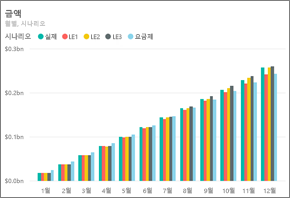
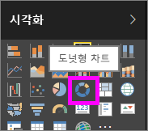
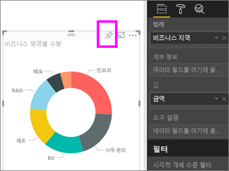
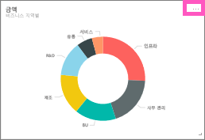
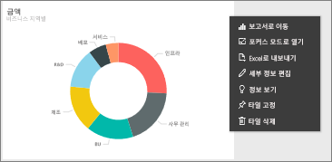
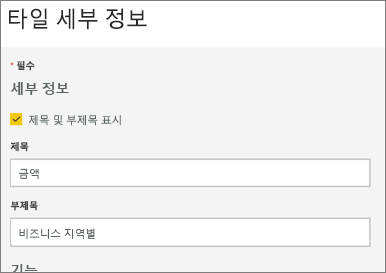
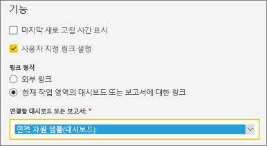
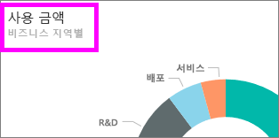
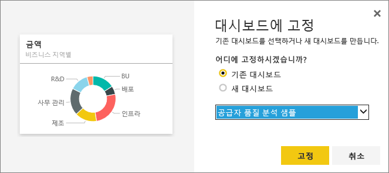

# 대시보드 타일 편집 또는 제거

## 대시보드 *소유자*와 대시보드 *소비자*의 차이점
대시보드를 만들거나 소유할 때 해당 대시보드에서 타일의 모양과 기본 동작을 변경하는 여러 옵션이 있습니다. 아래의 설정과 전략을 사용하여 동료들을 위한 대시보드 *소비* 경험을 디자인하세요.  타일을 선택하면 기본 보고서, 사용자 지정 URL 또는 다른 대시보드가 열립니까? [비디오 또는 스트리밍 데이터를 표시하는 타일을 추가](service-dashboard-add-widget.md)할 것입니까? [대화형 슬라이서가 있는 타일을 만들려는 경우](service-dashboard-pin-live-tile-from-report.md)도 있을 것입니다. *작성자*에게는 여러 가지 옵션이 있습니다. 

<iframe width="560" height="315" src="https://www.youtube.com/embed/lJKgWnvl6bQ" frameborder="0" allowfullscreen></iframe>

이 문서는 다음 내용을 다룹니다.

* [시각화를 만들고 대시보드에 고정](#create)
* [타일 이동](#move)
* [타일의 크기 바꾸기](#resize)
* [타일의 이름 바꾸기](#rename)
* [타일에 하이퍼링크 추가](#hyperlink)
* [타일을 다른 대시보드에 고정](#different)
* [타일 삭제](#delete)
  
  > [!TIP]
  > 타일 자체에 표시된 시각화를 변경하려면 해당 타일을 삭제하고 새 [대시보드 타일](consumer/end-user-tiles.md)을 추가합니다.

  
## 필수 조건
이 자습서를 따라 하려면 Power BI 서비스(Power BI Desktop 아님)를 열고 [IT 지출 분석 샘플을 다운로드](sample-it-spend.md)합니다. "성공" 메시지가 나타나면 **대시보드로 이동**을 선택합니다.

- - -

## 새 시각화를 만들고 대시보드에 고정
1. IT 지출 분석 대시보드에서 "금액" 타일을 선택하여 보고서를 엽니다.

    

2. 상단의 메뉴 모음에서 **보고서 편집**을 선택하여 편집용 보기에서 보고서를 엽니다.

3. 보고서 하단에서 더하기 기호(+)를 선택하여 새 보고서 페이지를 추가합니다.

    

4. 필드 창에서 **팩트 > 양**을 선택한 다음 **비즈니스 영역 > 비즈니스 영역**을 선택합니다.
 
5. 시각화 창에서 도넛형 차트 아이콘을 선택하여 시각화를 도넛형 차트로 변환합니다.

    

5. 고정 아이콘을 선택하고 도넛형 차트를 IT 지출 분석 샘플 대시보드에 고정합니다.

   

6. "성공" 메시지가 나타나면 **대시보드로 이동**을 선택합니다. 변경 내용을 저장하라는 메시지가 표시됩니다. **저장**을 선택합니다.

- - -

## 타일 이동
대시보드에서 새 타일을 찾습니다. 타일을 선택한 상태로 대시보드 캔버스의 새 위치로 끌어옵니다.

- - -

## 타일 크기 조정
1x1 타일 단위에서 5x5까지, 타일을 다양한 크기로 만들 수 있습니다. 핸들(오른쪽 하단)을 선택하고 끌어 타일 크기를 조정합니다.

- - -
## **추가 옵션**(...) 메뉴

1. 타일의 오른쪽 위에 있는 **추가 옵션**(...)을 선택합니다. 
   
   

2. 마우스 커서로 "계정" 타일을 가리키고 줄임표를 선택하여 옵션을 표시합니다. 사용할 수 있는 옵션은 타일 유형에 따라 다릅니다.  예를 들어 라이브 타일에 사용할 수 있는 옵션은 표준 시각화 타일에 사용할 수 있는 옵션과 다릅니다. 또한 소유자가 아닌 사용자와 대시보드를 공유하는 경우 더 적은 옵션이 제공됩니다.

   

3. **세부 정보 편집**을 선택하여 "타일 세부 정보" 창을 엽니다. 

    타일의 제목 및 기본 동작을 변경합니다.  예를 들어 *소비자*가 타일을 선택하면 해당 타일을 만드는 데 사용된 보고서를 여는 대신 새 대시보드를 표시하도록 결정할 수 있습니다.  
   

### 타일 이름 바꾸기
"타일 세부 정보" 창 맨 위에서 **제목**을 **사용 금액**으로 변경합니다.

### 기본 하이퍼링크 변경
기본적으로 타일을 선택하면 일반적으로 타일이 만들어진 보고서나 질문 및 답변(타일이 질문 및 답변에서 만들어진 경우)으로 이동합니다. 웹 페이지, 다른 대시보드 또는 보고서(동일한 작업 영역에서), SSRS 보고서 또는 기타 온라인 콘텐츠에 연결하려면 사용자 지정 링크를 추가합니다.

1. 기능 제목 아래에서 **사용자 지정 링크 설정**을 선택합니다.

2. **현재 작업 영역의 대시보드 또는 보고서에 연결**을 선택한 다음 드롭다운 메뉴에서 선택합니다.  이 예에서는 인적 자원 샘플 대시보드를 선택했습니다. 아직 작업 영역에 이 샘플이 없으면 이 샘플을 추가한 후 이 단계로 돌아와도 되고, 아니면 다른 대시보드를 선택해도 됩니다. 

    

3. **적용**을 선택합니다.

4. 타일에 새 제목이 표시됩니다.  타일을 선택하면 Power BI에서 인적 자원 대시보드가 열립니다. 

    

### 타일을 다른 대시보드에 고정
1. 줄임표 드롭다운 메뉴에서 **타일 고정** 을 선택합니다.
2. 이 타일의 사본을 기존 대시보드 또는 새 대시보드에 고정할지 결정합니다. 
   
   
3. **고정**을 선택합니다.

### 타일 삭제
1. 대시보드에서 타일을 영구적으로 제거하려면 줄임표 드롭다운 메뉴에서 **타일 삭제** 아이콘 을 선택합니다. 

2. 타일을 삭제해도 기본 시각화는 삭제되지 않습니다. "금액" 타일을 선택하여 기본 보고서를 엽니다. 보고서의 마지막 페이지를 열어서 원래 시각화가 보고서에서 삭제되지 않았는지 확인합니다. 

- - -
## 다음 단계
[Power BI의 대시보드 타일](consumer/end-user-tiles.md)

[Power BI의 대시보드](consumer/end-user-dashboards.md)

[Power BI 서비스의 디자이너를 위한 기본 개념](service-basic-concepts.md)

궁금한 점이 더 있나요? [Power BI 커뮤니티를 이용하세요.](https://community.powerbi.com/)

