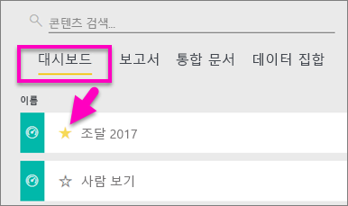
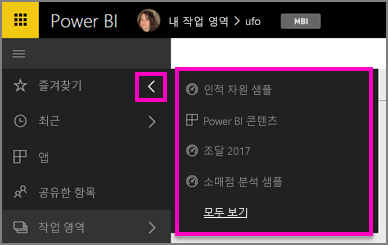
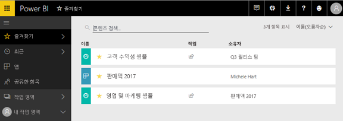
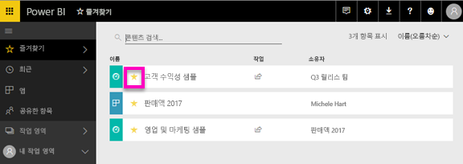

# Power BI 서비스의 즐겨 찾는 대시보드
대시보드를 *즐겨찾기* 로 만들면 모든 작업 영역에서 액세스할 수 있습니다.  즐겨 찾는 대시보드는 일반적으로 가장 많이 방문하는 대시보드입니다.

> [!NOTE]
> 이 항목은 Power BI Desktop이 아니라 Power BI 서비스에 적용됩니다.
> 
> 

Power BI에서 단일 대시보드를 [추천 대시보드](service-dashboard-featured.md)로 선택할 수도 있습니다.

## 대시보드를 *즐겨찾기*로 추가
Amanda가 작업 영역에 즐겨찾기를 추가하는 비디오를 시청한 다음 비디오 아래에 있는 단계별 지침을 따라서 직접 시도해 볼 수 있습니다.

<iframe width="560" height="315" src="https://www.youtube.com/embed/G26dr2PsEpk" frameborder="0" allowfullscreen></iframe>

1. 자주 사용하는 대시보드를 엽니다. 다른 이가 공유해 준 대시보드도 *즐겨찾기*가 될 수 있습니다.
2. Power BI 서비스의 오른쪽 위 모서리에서 **즐겨찾기**나 별  아이콘을 선택합니다.
   
   
   
   작업 영역 **대시보드** 탭에서 대시보드를 즐겨찾기로 지정할 수도 있습니다.
   
   

## *즐겨찾기* 작업
1. 가장 최근의 즐겨찾기를 보려면 아무 작업 영역에서나 **즐겨찾기** 오른쪽의 화살표를 선택합니다.  여기에서 대시보드를 열어 즐겨찾기로 지정할 수 있습니다. 가장 최근의 즐겨찾기 5개만 나열됩니다(사전순). 즐겨찾기가 5개 이상이면 **모두 보기**를 선택하여 즐겨찾기 화면을 엽니다(아래 #2 참조). 
   
   
2. 즐겨찾기에 추가된 **모든** 대시보드를 보려면 왼쪽 탐색 창에서 **즐겨찾기**를 선택하거나 즐겨찾기 아이콘 을 선택합니다.  
   
    
   
   여기에서 대시보드를 선택하여 열거나 동료와 대시보드를 공유할 수도 있습니다.

## 즐겨찾기에서 대시보드 제거
이제 예전처럼 대시보드를 사용하지 않나요?  즐겨찾기에서 제거할 수 있습니다. 즐겨찾기에서 제거하면 대시보드는 즐겨찾기에서 제거되지만 Power BI에서는 제거되지 않습니다.

1. 왼쪽 탐색 창에서 **즐겨찾기**를 선택하여 **즐겨찾기** 화면을 엽니다.
   
   
2. 즐겨찾기에서 제거할 대시보드 옆의 노란색 별표를 선택합니다.

> **참고**: 대시보드 자체에서 대시보드를 즐겨찾기에서 제거할 수도 있습니다. 대시보드 오른쪽 위 모서리에 노란색 별표와 **즐겨찾기에서 제거**가 나타납니다. 즐겨찾기 목록에서 해당 대시보드를 제거하려면 둘 중 하나를 선택합니다. 
> 
> 

## 다음 단계
[Power BI 시작](service-get-started.md)

[Power BI - 기본 개념](service-basic-concepts.md)

궁금한 점이 더 있나요? [Power BI 커뮤니티를 이용하세요.](http://community.powerbi.com/)

