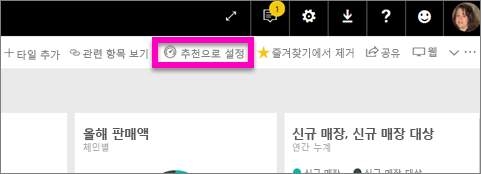
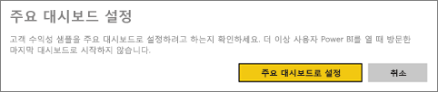
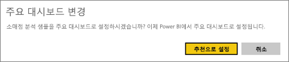
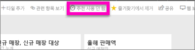

# Power BI의 추천 대시보드
## 추천 대시보드 만들기
사용자 중 상당수는 자주 방문하는 대시보드가 있을 것입니다.  대시보드를 사용하여 비즈니스를 실행하거나 다른 여러 대시보드 및 보고서에서 타일의 집계를 포함할 수 있습니다.

*추천*으로 대시보드를 선택하면 Power BI 서비스를 열 때마다 해당 대시보드가 표시된 상태로 열립니다.  

> **참고**: 몇 가지 대시보드를 선택하고 *즐겨찾기*로 설정할 수도 있습니다. [대시보드 즐겨찾기](service-dashboard-favorite.md)를 참조하세요.
> 
> 

추천 대시보드를 아직 설정하지 않은 경우 Power BI는 사용자가 마지막으로 사용한 대시보드로 열립니다.  

### 대시보드를 **추천**으로 설정하려면
Amanda가 추천 대시보드를 만드는 과정을 시청하고 비디오 아래에 있는 지시를 따라서 직접 시도해 봅니다.

<iframe width="560" height="315" src="https://www.youtube.com/embed/G26dr2PsEpk" frameborder="0" allowfullscreen></iframe>

1. *추천*으로 설정하려는 대시보드를 엽니다. 
2. 상단 탐색 표시줄에 **추천으로 설정** 또는 추천  아이콘만 표시됩니다. 다음 중 하나를 선택합니다.
   
    
3. 선택 사항을 확인합니다.
   
    

## 추천 대시보드 변경
물론, 나중에 마음이 바뀌면 새 대시보드를 추천 대시보드로 설정할 수 있습니다.

1. 위의 1 및 2단계를 따릅니다.
   
    
2. **주요 대시보드로 설정**을 선택합니다. 대시보드를 추천하지 않더라도 작업 영역에서 제거하지는 않습니다.  
   
    

## 주요 대시보드 제거
어떠한 대시보드도 주요 대시보드로 지정되는 것을 원치 않을 경우 주요 대시보드를 해제하는 방법이 있습니다.

1. 현재 추천으로 지정된 대시보드를 엽니다.
2. 맨 위 메뉴 모음에서 **주요 대시보드 사용 안 함**을 선택합니다.
   
    

## 다음 단계
[대시보드를 즐겨찾기에 추가](service-dashboard-favorite.md)

궁금한 점이 더 있나요? [Power BI 커뮤니티를 이용하세요.](http://community.powerbi.com/)

