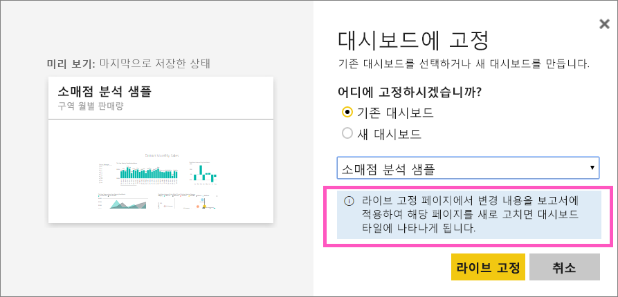
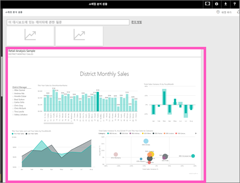

# 전체 보고서 페이지를 라이브 타일로 Power BI 대시보드에 고정
새 [대시보드 타일](consumer/end-user-tiles.md)을 추가하는 다른 방법은 전체 보고서 페이지를 고정하는 것입니다. 이는 한 번에 두 개 이상의 시각화를 고정하는 간단한 방법입니다.  또한 전체 페이지를 고정하면 타일이 *라이브* 상태가 되며, 대시보드에서 바로 상호 작용할 수 있습니다. 필터를 추가하거나 차트에 사용된 필드를 변경하는 등 보고서 편집기에서 시각화 요소들에 수행하는 모든 변경 내용은 대시보드 타일에도 반영됩니다.  

보고서의 라이브 타일을 대시보드에 고정하는 작업은 Power BI 서비스(app.powerbi.com)에서만 가능합니다.

> [!NOTE]
> 공유되는 보고서에서 타일을 고정할 수 없습니다.
> 
> 

## 보고서 페이지 고정
Amanda가 라이브 보고서 페이지를 대시보드에 고정하는 과정을 시청하고 비디오 아래에 있는 단계별 지침을 따라서 직접 시도해 볼 수 있습니다.

<iframe width="560" height="315" src="https://www.youtube.com/embed/EzhfBpPboPA" frameborder="0" allowfullscreen></iframe>

1. [편집용 보기](service-interact-with-a-report-in-editing-view.md)에서 보고서를 엽니다.
2. 시각화를 선택하지 않은 상태에서 메뉴 모음에서 **라이브 페이지 고정**을 선택합니다.
   
    
3. 기존 대시보드 또는 새 대시보드에 타일을 고정합니다. 다음 텍스트가 강조 표시되어 있습니다. ‘라이브 고정 페이지에서 변경 내용을 보고서에 적용하여 해당 페이지를 새로 고치면 대시보드 타일에 나타나게 됩니다.’ 
   
   * 기존 대시보드: 드롭다운에서 대시보드의 이름을 선택합니다. 사용자와 공유된 대시보드는 드롭다운에 나타나지 않습니다.
   * 새 대시보드: 새 대시보드의 이름을 입력합니다.
     
     
4. **라이브 고정**을 선택합니다. 오른쪽 위에 나타나는 성공 메시지를 통해 페이지가 타일로 대시보드에 추가되었음을 알 수 있습니다.

## 대시보드를 열어 고정된 라이브 타일 보기
1. 탐색 창에서 새 라이브 타일이 포함된 대시보드를 선택합니다. 여기에서 고정된 보고서 페이지의 [이름을 바꾸거나 크기를 조정하거나 연결하고 이동](service-dashboard-edit-tile.md)하는 등의 작업을 수행할 수 있습니다.  
2. 라이브 타일과 상호 작용합니다.  아래 스크린샷에서 세로 막대형 차트에서 막대를 선택했더니 타일에 있는 다른 시각화 요소가 교차 필터링되고 교차 강조 표시되었습니다.
   
    

## 다음 단계
[Power BI의 대시보드](consumer/end-user-dashboards.md)

궁금한 점이 더 있나요? [Power BI 커뮤니티를 이용하세요.](https://community.powerbi.com/)

