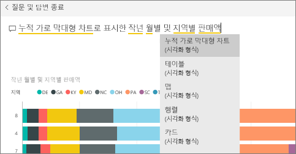
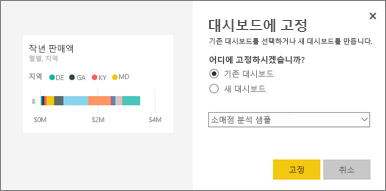
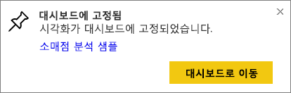
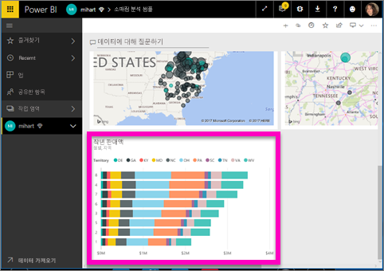
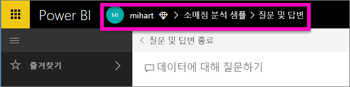

# 질문 및 답변에서 대시보드에 타일 고정
## 질문 및 답변에서 타일을 고정하는 방법
질문 및 답변은 Power BI의 임시 보고 도구입니다. 특정 통찰력을 찾아야 하나요? 데이터에 대한 질문을 하고 시각화 형태로 답변을 받습니다.

이 방법에서는 Power BI 서비스(app.powerbi.com)를 사용하여 대시보드를 열고, 자연어를 사용하여 시각화를 만드는 질문을 하고, 해당 시각화를 대시보드에 고정할 것입니다. 대시보드는 Power BI Desktop에서 사용할 수 없습니다. 질문 및 답변을 다른 Power BI 도구 및 콘텐츠와 함께 사용하는 방법은 [Power BI 질문 및 답변 개요](power-bi-q-and-a.md)를 참조하세요. 

이를 수행하려면 [소매점 분석 샘플 대시보드](sample-retail-analysis.md)를 여세요.

1. 보고서에서 고정된 타일이 하나 이상 있는 [대시보드](service-dashboards.md)를 엽니다. 질문하면 Power BI는 해당 대시보드에 고정된 타일이 있는 데이터 집합에서 답변을 찾습니다.  자세한 내용은 [데이터 가져오기](service-get-data.md)를 참조하세요.
2. 대시보드 맨 위에 있는 질문 상자에 데이터에 대해 알고 싶은 내용을 입력하기 시작합니다.  
   
3. 예를 들어 "last year sales by month and territory(지난 해 월별 및 지역별 판매액)"...을 입력합니다.  
   

   질문 상자에 제안이 표시됩니다.
4. 대시보드에 차트를 타일로 추가하려면 캔버스의 오른쪽 위에 있는 고정 을 선택합니다. 대시보드를 사용자와 공유하면 시각화를 고정할 수 없습니다.

5. 기존 대시보드 또는 새 대시보드에 타일을 고정합니다.

   

   * 기존 대시보드: 드롭다운에서 대시보드의 이름을 선택합니다. 현재 작업 영역에 있는 대시보드만 선택할 수 있습니다.
   * 새 대시보드: 새 대시보드의 이름을 입력합니다. 그러면 현재 작업 영역에 추가됩니다.

6. **고정**을 선택합니다.

   오른쪽 위에 나타나는 성공 메시지를 통해 시각화가 타일로 대시보드에 추가되었음을 알 수 있습니다.  

   
7. **대시보드로 이동**을 선택하여 새 타일을 볼 수 있습니다. 여기에서 대시보드의 [타일 이름을 바꾸고, 크기를 조정하고, 하이퍼링크를 추가하고, 타일의 위치를 변경하는 등](service-dashboard-edit-tile.md)의 작업을 할 수 있습니다.

   

## 고려 사항 및 문제 해결
* 질문 입력을 시작하면 질문 및 답변에서 현재 대시보드와 연결된 모든 데이터 집합에서 최적의 답변을 검색하기 시작합니다.  "현재 대시보드"는 위쪽 탐색 모음에 나열된 대시보드입니다. 예를 들어, 이 질문은 **mihart** 응용 프로그램 작업 영역에 속하는 **소매점 분석 샘플** 대시보드에서 묻습니다.

  
* **질문 및 답변에서 사용할 데이터 집합은 어떻게 아나요**?  질문 및 답변에서는 해당 대시보드에 고정된 시각화가 하나 이상 있는 모든 데이터 집합에 액세스할 수 있습니다.

* **질문 상자가 보이지 않나요**? Power BI 관리자에게 문의하세요. 관리자는 질문 및 답변을 사용하지 않도록 설정할 수 있습니다.

## 다음 단계
[이름 변경, 크기 조정, 하이퍼링크 추가, 타일 위치 변경 등](service-dashboard-edit-tile.md)    
[포커스 모드에서 대시보드 타일 표시](service-focus-mode.md)     
[Power BI의 Q&A로 돌아가기](power-bi-q-and-a.md)  
궁금한 점이 더 있나요? [Power BI 커뮤니티를 이용하세요.](http://community.powerbi.com/)
