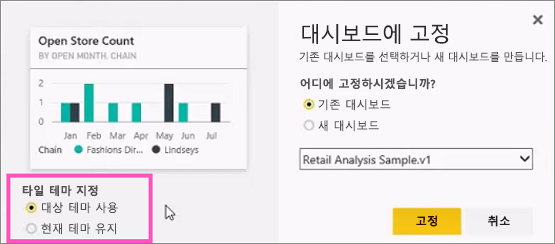
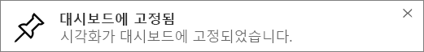

# 보고서에서 Power BI 대시보드에 타일 고정
## 보고서에서 타일 고정
새 [대시보드 타일](consumer/end-user-tiles.md)을 추가하는 한 가지 방법은 [Power BI 보고서](consumer/end-user-reports.md) 내에서 추가하는 것입니다. 실제로 보고서에서 여러 개의 새 타일을 추가할 수 있습니다.  이러한 각 타일은 클릭하여 보고서로 돌아갈 수 있는 링크입니다.

그리고 전체 보고서 페이지는 대시보드에 고정할 수 있습니다.  이렇게 하는 것을 *라이브* 타일을 고정한다고 합니다.  *라이브* 라고 하는 이유는 대시보드의 타일 상호 작용할 수 있기 때문이며, 개별 시각화 타일과 달리 보고서에서 변경된 내용은 대시보드와 동기화되기 때문이기도 합니다. 아래에서 자세히 알아보세요.

Power BI Desktop 또는 공유한 보고서에서는 타일을 고정할 수 없습니다. 

> **팁**: 일부 시각화는 배경 이미지를 사용합니다. 배경 이미지가 너무 크면 고정이 작동하지 않을 수 있습니다.  이미지 크기를 줄이거나 이미지 압축을 사용합니다.  
> 
> 

## 보고서에서 타일 고정
Amanda가 Power BI 보고서에서 시각적 개체 및 이미지를 고정하여 대시보드를 만드는 과정을 시청합니다.

<iframe width="560" height="315" src="https://www.youtube.com/embed/lJKgWnvl6bQ" frameborder="0" allowfullscreen></iframe>

이제 Power BI 샘플 보고서 중 하나를 사용하여 고유한 대시보드를 만듭니다.

1. 고정하려는 타일을 마우스로 가리키고 고정  아이콘을 선택합니다. Power BI에서 **대시보드에 고정** 화면이 열립니다.
   
     
2. 기존 대시보드에 고정할지 또는 새 대시보드에 고정할지를 결정합니다.
   
   * 기존 대시보드: 드롭다운에서 대시보드의 이름을 선택합니다. 사용자와 공유된 대시보드는 드롭다운에 나타나지 않습니다.
   * 새 대시보드: 새 대시보드의 이름을 입력합니다.
3. 경우에 따라 고정하는 항목에 *테마* 가 이미 적용되어 있을 수 있습니다.  예를 들어 Excel 통합 문서에서 고정된 시각적 개체입니다. 이 경우 타일에 적용할 테마를 선택합니다.
4. **고정**을 선택합니다.
   
   오른쪽 위에 나타나는 성공 메시지를 통해 시각화가 타일로 대시보드에 추가되었음을 알 수 있습니다.
   
   
5. 탐색 창에서 새 타일이 포함된 대시보드를 선택합니다. 타일을 선택하여 보고서로 다시 이동합니다. 또는 [타일 표시 및 동작을 편집](service-dashboard-edit-tile.md)합니다.

## 전체 보고서 페이지 고정
또 다른 옵션은 전체 보고서 페이지를 대시보드에 고정하는 것입니다. 이는 한 번에 두 개 이상의 시각화를 고정하는 간단한 방법입니다.  또한 전체 페이지를 고정하면 타일이 *라이브* 상태가 되며, 대시보드에서 바로 상호 작용할 수 있습니다. 필터를 추가하거나 차트에 사용된 필드를 변경하는 등 보고서 편집기에서 시각화 요소들에 수행하는 모든 변경 내용은 대시보드 타일에도 반영됩니다.  

자세한 내용은 [전체 보고서 페이지 고정](service-dashboard-pin-live-tile-from-report.md)을 참조하세요.

## 다음 단계
[Power BI의 대시보드](consumer/end-user-dashboards.md)

[Power BI의 대시보드 타일](consumer/end-user-tiles.md)

[Power BI의 보고서](consumer/end-user-reports.md)

[Power BI에서 데이터 새로 고침](refresh-data.md)

[Power BI 기본 개념](consumer/end-user-basic-concepts.md)

궁금한 점이 더 있나요? [Power BI 커뮤니티를 이용하세요.](http://community.powerbi.com/)

