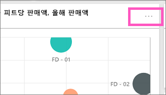
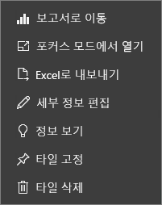

# Power BI 디자이너용 대시보드 타일 소개

타일은 대시보드에 고정된 데이터에 대한 스냅샷입니다. 타일은 보고서, 데이터 세트, 대시보드, Q&A 상자, Excel 및 SSRS(SQL Server Reporting Services) 보고서 등에서 만들 수 있습니다.  이 스크린샷은 대시보드에 고정된 여러 타일을 보여 줍니다.

대시보드 및 대시보드 타일은 Power BI Desktop이 아닌 Power BI 서비스의 기능입니다. 모바일 디바이스에서는 대시보드를 만들 수 없지만 [보기 및 공유](mobile-apps-view-dashboard.md)할 수 있습니다.

타일 고정 외에도, [타일 추가](service-dashboard-add-widget.md) 컨트롤을 사용하여 대시보드에서 직접 독립 실행형 타일을 만들 수 있습니다. 독립 실행형 타일에는 텍스트 상자, 이미지, 동영상, 스트리밍 데이터 및 웹 콘텐츠가 포함됩니다.

Power BI의 구성 요소를 이해하는 데 도움이 필요한 경우 [Power BI 서비스의 디자이너를 위한 기본 개념](service-basic-concepts.md)을 참조하세요.

> [!NOTE]
> 원래 시각화를 사용하여 타일을 변경한 경우 타일이 변경되지 않습니다.  예를 들어 보고서에서 꺾은선형 차트를 고정한 다음 꺾은선형 차트를 막대형 차트로 변경하면 대시보드 타일에 꺾은선형 차트가 계속 표시됩니다. 데이터는 새로 고쳐지지만 시각화 유형은 새로 고쳐지지 않습니다.
> 
> 

## 타일 고정
다양한 방법으로 대시보드에 타일을 추가(고정)할 수 있습니다. 다음에서 타일을 고정할 수 있습니다.

* [Power BI 질문 및 답변](service-dashboard-pin-tile-from-q-and-a.md)
* [보고서](service-dashboard-pin-tile-from-report.md)
* [다른 대시보드](service-pin-tile-to-another-dashboard.md)
* [비즈니스용 OneDrive의 Excel 통합 문서](service-dashboard-pin-tile-from-excel.md)
* [Power BI Publisher for Excel](publisher-for-excel.md)
* [Quick Insights (신속한 정보 활용)](service-insights.md)
* [Power BI Report Server 또는 SQL Server Reporting Services의 온-프레미스 페이지를 매긴 보고서](https://docs.microsoft.com/sql/reporting-services/pin-reporting-services-items-to-power-bi-dashboards)

[타일 추가](service-dashboard-add-widget.md) 컨트롤을 사용하여 대시보드에서 직접 이미지, 텍스트 상자, 동영상, 스트리밍 데이터 및 웹 콘텐츠에 대한 독립 실행형 타일을 만듭니다.

  

## 대시보드에서 타일과 상호작용
대시보드에 타일을 추가한 후에는 타일을 이동하여 크기를 조정하거나, 타일의 모양과 동작을 변경할 수 있습니다.

### 타일 이동 및 크기 조정
타일을 선택하고 [대시보드 내에서 이동](service-dashboard-edit-tile.md)합니다. 핸들 을 가리키고 선택하여 타일 크기를 조정합니다.

### 타일을 가리켜서 모양 및 동작을 변경합니다.
1. 타일을 가리켜서 줄임표를 표시합니다.
   
    
2. 줄임표를 선택하여 타일 작업 메뉴를 엽니다.
   
    
   
    여기에서 다음과 같은 작업을 할 수 있습니다.
   
     * [대시보드에 댓글을 추가합니다](consumer/end-user-comment.md).
     * [이 타일을 만드는 데 사용된 보고서를 엽니다](service-reports.md).  
     * [포커스 모드로 봅니다](service-focus-mode.md).   
     * [타일에 사용된 데이터를 내보냅니다](visuals/power-bi-visualization-export-data.md).
     * [제목과 부제목을 편집하고 하이퍼링크를 추가합니다](service-dashboard-edit-tile.md). 
     * [인사이트를 실행합니다](service-insights.md). 
     * [타일을 다른 대시보드에 고정합니다](service-pin-tile-to-another-dashboard.md).
     * [타일을 삭제합니다](service-dashboard-edit-tile.md).

3. 작업 메뉴를 닫으려면 대시보드에서 빈 영역을 선택합니다.

### 타일 선택
타일을 선택하는 경우 다음 작업은 타일을 만드는 방법에 따라 달라집니다. 그렇지 않은 경우 보고서, Excel Online 통합 문서, 온-프레미스 Reporting Services 보고서 또는 타일을 만드는 데 사용된 Q&A 질문으로 이동됩니다. 또는 [사용자 지정 링크](service-dashboard-edit-tile.md)가 있는 경우 타일을 선택하면 해당 링크로 이동합니다.

> [!NOTE]
> 단, **타일 추가**를 사용하여 대시보드에서 직접 만든 동영상 타일은 예외입니다. 이런 방식으로 만든 동영상 타일을 선택하면 동영상이 대시보드에서 바로 재생됩니다.   
> 
> 

## 고려 사항 및 문제 해결

* 시각화를 만드는 데 사용된 보고서를 저장하지 않은 경우에는 타일을 선택해도 아무 작업도 수행되지 않습니다.
* 타일이 Excel Online의 통합 문서에서 생성된 경우 최소한 해당 통합 문서에 대한 읽기 권한이 필요합니다. 그렇지 않은 경우 타일을 선택해도 Excel Online의 통합 문서가 열리지 않습니다.
* **타일 추가**를 사용하여 대시보드에서 직접 타일을 만들고 사용자 지정 하이퍼링크를 설정한다고 가정해 보겠습니다. 이 경우 제목, 부제목 또는 타일을 선택하면 해당 URL이 열립니다. 그렇지 않고 이미지, 웹 코드 또는 텍스트 상자에 대해 대시보드에서 직접 만든 타일을 선택하면 기본적으로 아무 작업도 수행되지 않습니다.
* Power BI Report Server 또는 SQL Server Reporting Services의 온-프레미스 페이지를 매긴 보고서에서 타일을 만들 수 있습니다. 온-프레미스 보고서에 액세스할 수 있는 권한이 없는 경우 타일을 선택하면 액세스 권한이 없음을 나타내는 페이지로 이동합니다(rsAccessDenied).
* Power BI Report Server 또는 SQL Server Reporting Services의 온-프레미스 페이지를 매긴 보고서에서 만든 타일을 선택한다고 가정합니다. 보고서 서버가 있는 네트워크에 액세스할 수 없는 경우, 해당 페이지를 매긴 보고서에서 만든 타일을 선택하면 서버를 찾을 수 없음을 나타내는 페이지로 이동합니다(HTTP 404). 보고서를 보려면 디바이스가 보고서 서버에 대한 네트워크 액세스 권한이 있어야 합니다.
* 타일을 만드는 데 사용한 원래 시각화가 변경되어도 타일은 변경되지 않습니다. 예를 들어 보고서에서 꺾은선형 차트를 고정한 다음, 꺾은선형 차트를 막대형 차트로 변경하면 대시보드 타일에 꺾은선형 차트가 계속 표시됩니다. 데이터는 새로 고쳐지지만, 시각화 유형은 새로 고쳐지지 않습니다.

## 다음 단계
- [대시보드에 사용할 카드(큰 숫자 타일) 만들기](power-bi-visualization-card.md)
- [Power BI 디자이너용 대시보드 소개](service-dashboards.md)  
- [Power BI에서 데이터 새로 고침](refresh-data.md)
- [Power BI 서비스의 디자이너를 위한 기본 개념](service-basic-concepts.md)
- [Office 문서에 Power BI 타일 통합](https://blogs.msdn.com/b/powerbidev/archive/2015/09/28/integrating-power-bi-tiles-into-office-documents.aspx)
- [Power BI 대시보드에 Reporting Services 항목 고정](https://msdn.microsoft.com/library/mt604784.aspx)

궁금한 점이 더 있나요? [Power BI 커뮤니티를 이용](https://community.powerbi.com/)하세요.

