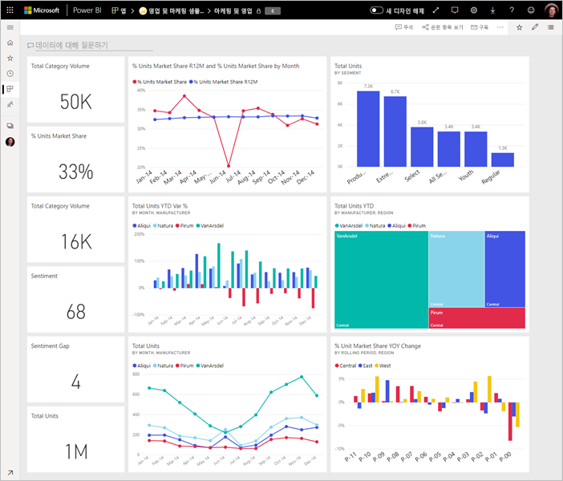

# 멋진 Power BI 대시보드를 디자인하기 위한 팁
이제 대시보드를 만들고 일부 타일을 추가했으므로 모양과 기능을 개선하는 방법을 살펴보겠습니다. 일반적으로, 가장 중요한 정보를 강조하며 깔끔하고 간결하게 다듬는 작업이 포함됩니다.

> [!TIP]
> 이 대시보드가 마음에 드시나요? AppSource에서 대시보드와 관련 보고서를 다운로드할 수 있습니다. **데이터 가져오기** > **서비스**로 이동합니다. **Microsoft 샘플 - 마케팅 및 판매** > **지금 가져오기**를 선택합니다.

보고서에 대한 대부분의 디자인 원칙이 대시보드에도 적용됩니다. 자세한 내용은 백서 [보고서 및 시각화에 대한 최상의 디자인 원칙](visuals/power-bi-visualization-best-practices.md)을 참조하세요.

다음은 대시보드에 대한 몇 가지 팁입니다.

## 대시보드 디자인 모범 사례 동영상

SQLBI.com의 Marco Russo가 제공하는 디자인 팁을 보려면 [Dashboard design best practices in Power BI](https://www.youtube.com/watch?v=-tdkUYrzrio)(Power BI의 대시보드 디자인 모범 사례) 동영상을 시청하세요.

## 대상 그룹을 고려
의사 결정에 도움이 될 주요 메트릭은 무엇인가요? 대시보드가 어떻게 사용될까요? 어떤 학습 내용 또는 문화적 가정이 디자인 선택에 영향을 줄 수 있을까요? 성공을 위해 대상 그룹은 어떤 정보를 필요로 할까요?

대시보드는 현재 데이터 상태를 한 곳에서 모니터링하는 개요임을 유념하세요. 대시보드는 기본 보고서 및 데이터 세트를 기반으로 하고, 이러한 항목은 대체로 방대한 세부 정보를 포함합니다. 독자는 대시보드에서 해당 보고서로 이동할 수 있습니다. 따라서 독자가 모니터링해야 하는 내용이 아니라면 대시보드에 세부 정보를 넣으면 안 됩니다.

대시보드가 어디에 표시될 예정인가요? 큰 모니터에 표시된다면 대시보드에 더 많은 콘텐츠를 넣을 수 있습니다. 그러나 독자가 태블릿에서 대시보드를 보는 경우, 대시보드에 포함된 타일 수가 적을수록 읽기 편합니다.

## 한 화면에서 스토리 전달
대시보드는 중요한 정보를 한 눈에 볼 수 있도록 하는 것이므로 모든 타일을 한 화면에 포함하는 것이 가장 좋습니다. 대시보드에서 스크롤 막대 사용을 피할 수 있나요?

대시보드가 너무 복잡한가요?  필수 정보를 읽고 해석하기 편하도록 불필요한 내용을 제거합니다.

## 전체 화면 모드 사용
대시보드를 프레젠테이션하는 경우 주의가 분산되지 않도록 [전체 화면 모드](consumer/end-user-focus.md)로 표시합니다.

## 가장 중요한 정보 강조
대시보드에서 시각화와 텍스트가 모두 동일한 크기인 경우 독자들은 가장 중요한 사항에 초점을 맞추기 어려워합니다. 예를 들어, 카드 시각화의 경우 중요한 번호를 눈에 띄게 표시하는 좋은 방법입니다.  

하지만 컨텍스트를 제공해야 합니다.  

[번호로만 타일 만들기](visuals/power-bi-visualization-card.md)에 대해 알아보세요.

## 가장 중요한 정보 배치
대부분의 사람은 위에서 아래로 읽는 경향이 있으므로, 가장 높은 수준의 데이터를 왼쪽 위에 배치하고 대상 그룹이 읽어가는 방향(왼쪽에서 오른쪽, 위에서 아래)으로 보다 자세한 정보를 표시합니다.

## 데이터에 오른쪽 시각화 사용
다양성을 위해 여러 시각화를 사용하는 것을 피하세요.  시각화는 그림을 그리는 것이며 "읽고" 해석하기 쉬워야 합니다.  일부 데이터 및 시각화에서는 간단한 그래픽 시각화로도 충분합니다. 보다 복잡한 시각화를 호출할 수 있는 기타 데이터도 있지만 타일 및 레이블, 기타 사용자 지정 항목의 활용이 독자에게 도움이 되도록 해야 합니다.  

* 3차원 차트와 같이 모양은 좋지만 읽기가 어려운 시각적 개체를 사용할 때는 주의하세요. 
* 원형 차트, 도넛형 차트, 계기, 기타 원형 차트 종류가 데이터 시각화에 가장 좋은 사례가 아니라는 것을 알게 되어 실망할 수도 있습니다. 원형 차트는 범주가 8개 미만일 경우 적합합니다. 사용자가 값을 나란히 놓고 비교할 수 없으므로, 가로 막대형 차트와 세로 막대형 차트보다 원형 차트의 값을 비교하기가 더 어렵습니다. 원형 차트는 부분을 비교하기보다는 부분에서 전체로의 관계를 파악하는 데 유용할 수 있습니다. 그리고 계기 차트는 목표와의 관계에서 현재 상태를 표시하는 데 적합합니다.
* 차트 내에서 축의 차트 눈금, 차트 차원 순서, 차원 값에 사용되는 색의 일관성을 유지하세요.
* 정량 데이터를 적절하게 인코딩하세요. 숫자를 표시할 때는 서너 개의 숫자를 초과하지 마세요. 측정값을 소수점 왼쪽 하나 또는 두 숫자와 천 단위 또는 백만 단위 눈금으로 표시하세요(즉, 3,400,000이 아닌 3.4백만).
* 정밀도와 시간 수준을 섞어쓰지 마세요. 시간 프레임을 잘 이해하고 있어야 합니다. 해당 연도의 특정 월에서 필터링된 차트 옆에 지난 달에 대한 하나의 차트를 포함하지 마세요.
* 동일한 눈금(예: 꺾은선형 차트 또는 가로 막대형 차트)에 큰 측정값과 작은 측정값을 함께 사용하지 마세요. 예를 들어 백만 단위의 측정값과 천 단위의 측정값이 있을 수 있습니다. 이러한 큰 단위에서는 천 단위 측정값의 차이를 파악하기 어렵습니다. 함께 사용해야 하는 경우 보조 축의 사용을 허용하는 시각화를 선택합니다.
* 불필요한 데이터 레이블로 차트를 복잡하게 만들지 마세요. 가로 막대형 차트의 값은 일반적으로 실제 숫자를 표시하지 않아도 쉽게 파악할 수 있습니다.
* [차트가 정렬](consumer/end-user-change-sort.md)되는 방식에 주의하세요. 최상위 또는 최하위 숫자에 주목하도록 하려면 측정값을 기준으로 정렬합니다. 사람들이 여러 다른 범주 내에서 특정 범주를 신속하게 찾을 수 있도록 하려면 축을 기준으로 정렬합니다.  

시각화 관련 지침에 대한 자세한 내용은 [Power BI에서 시각화 유형](visuals/power-bi-visualization-types-for-reports-and-q-and-a.md)을 참조하세요.  

## 대시보드 디자인에 대한 자세한 정보
뛰어난 대시보드 디자인 기법을 마스터하려면 시각적 인식 및 상황에 따라 조치 가능한 정보를 명확히 전달하는 방법에 대한 기본적인 게슈탈트(Gestalt) 이론을 학습하는 것이 좋습니다. 다행히 광범위한 리소스가 이미 제공되고 있으며 블로그에도 올라와 있습니다. 다음은 몇 가지 유용한 설명서입니다.

* *Information Dashboard Design* by Stephen Few  
* *Show Me the Numbers* by Stephen Few  
* *Now You See It* by Stephen Few  
* *Envisioning Information* by Edward Tufte  
* *Advanced Presentations* by Design by Andrew Abela   

## 다음 단계
[보고서에서 대시보드 만들기](service-dashboard-create.md)  
[Power BI 서비스의 디자이너를 위한 기본 개념](service-basic-concepts.md)  
궁금한 점이 더 있나요? [Power BI 커뮤니티를 이용하세요.](http://community.powerbi.com/)
