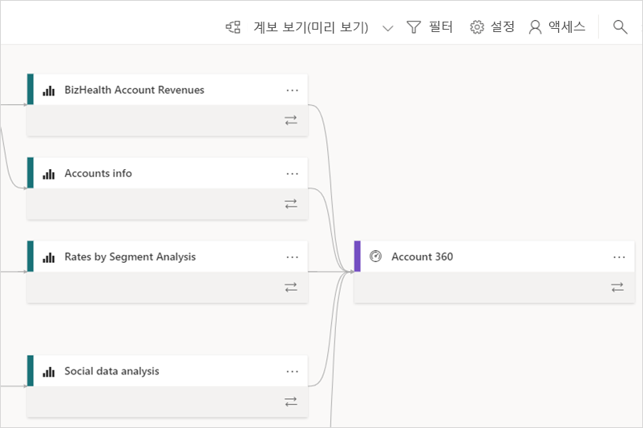
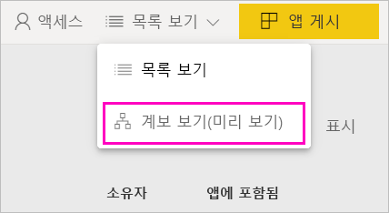
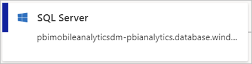
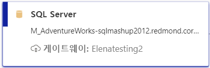
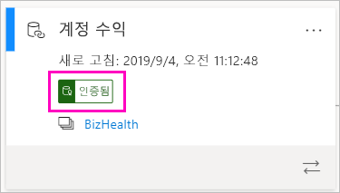
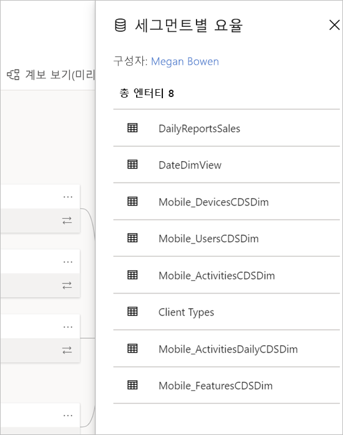
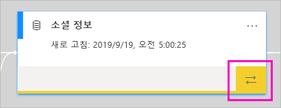
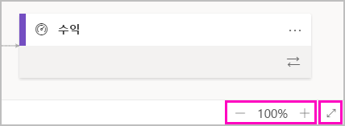

# 데이터 계보(미리 보기)
최신 BI(비즈니스 인텔리전스) 프로젝트에서 데이터 원본에서 대상까지 이동하는 데이터 흐름을 이해하는 것이 중요합니다. 여러 데이터 원본, 아티팩트 및 종속성에 걸쳐 있는 고급 분석 프로젝트를 구성한 경우 중요성은 더 커집니다.  "이 데이터를 변경하면 어떻게 되나요?" 또는 "이 보고서가 최신 상태가 아닌 이유는 무엇인가요?"와 같은 질문은 대답하기 어려울 수 있습니다. 이러한 질문들은 전문가 팀이나 이해를 위한 세부적인 조사가 필요할 수 있습니다. 질문에 대답하는 데 도움이 되는 데이터 계보 보기를 설계했습니다.

 
Power BI에는 대시보드, 보고서, 데이터 세트, 데이터 흐름 등 다양한 아티팩트 형식이 있습니다. 대부분의 데이터 세트 및 데이터 흐름은 SQL Server 같은 외부 데이터 원본 및 다른 작업 영역의 외부 데이터 세트에 연결됩니다. 사용자 소유 작업 영역의 외부에 있는 데이터 세트가 IT 직원 또는 다른 분석가가 소유한 작업 영역에 있을 수 있습니다. 외부 데이터 원본 및 데이터 세트를 사용하면 궁극적으로 데이터의 출처를 파악하기 어려워집니다. 복잡한 프로젝트와 더 간단한 프로젝트를 위한 계보 보기를 소개합니다. 

계보 보기에는 작업 영역에 있는 모든 아티팩트와 모든 외부 종속 항목 간의 계보 관계가 표시됩니다. 데이터 흐름에 다이어그램 보기가 이미 있고 계보 보기에서 해당 보기를 확장합니다. 데이터 흐름(업스트림 및 다운스트림 모두)에 대한 연결을 비롯하여 모든 작업 영역 아티팩트 간 연결을 보여 줍니다. 별도의 데이터 흐름 다이어그램 보기가 11월부터 더 이상 표시되지 않을 예정입니다.

## 계보 보기 살펴보기

내 작업 영역을 제외한 모든 작업 영역(새 또는 클래식)에는 계보 보기가 자동으로 제공됩니다. 이 보기를 보려면 작업 영역에서 최소한 참가자 역할이 있어야 합니다. 자세한 내용은 이 문서의 [사용 권한](#permissions)을 참조하세요. 

- 계보 보기에 액세스하려면 작업 영역 목록 보기로 이동합니다. **보기** 옆의 화살표를 탭하고 **계보**를 선택합니다.

    

    이 보기에는 모든 작업 영역 아티팩트와 한 아티팩트에서 다른 아티팩트로 데이터가 흐르는 방법이 표시됩니다.

**데이터 원본**

데이터 세트 및 데이터 흐름에서 데이터를 가져오는 데이터 원본이 표시됩니다. 데이터 원본 카드에는 원본을 식별하는 데 도움이 되는 자세한 정보가 표시됩니다. 예를 들어 Azure SQL Server의 경우 데이터베이스 이름도 표시됩니다.

 
**게이트웨이**

데이터 원본이 온-프레미스 게이트웨이를 통해 연결되는 경우 게이트웨이 정보가 데이터 원본 카드에 추가됩니다. 게이트웨이 관리자 또는 데이터 원본 사용자 권한이 있는 경우 게이트웨이 이름과 같은 자세한 정보가 표시됩니다.

**데이터 세트 및 데이터 흐름**
 
데이터 세트에는 마지막 새로 고침 시간과 데이터 세트가 인증되거나 승격되는지 여부가 표시됩니다.

 
작업 영역의 보고서가 다른 작업 영역의 데이터 세트를 기반으로 하는 경우 데이터 세트 카드에 원본 작업 영역 이름이 표시됩니다. 원본 작업 영역 이름을 선택하여 해당 작업 영역으로 이동합니다.
 
- 모든 아티팩트에 대해 **추가 옵션**(...)을 선택하여 옵션 메뉴를 표시합니다. 목록 보기에서 사용할 수 있는 것과 동일한 작업이 모두 제공됩니다.
  
데이터 세트에 더 많은 메타데이터를 표시하려면 데이터 세트 카드를 직접 선택합니다. 데이터 세트에 대한 추가 정보가 측면 창에 표시됩니다.

 
## 모든 아티팩트에 대한 계보 표시 

특정 아티팩트에 대한 계보를 확인하려고 합니다.

- 아티팩트 아래에서 이중 화살표를 선택합니다.

    

    Power BI에서는 해당 아티팩트와 관련된 모든 아티팩트를 강조 표시하고 나머지는 흐리게 표시합니다. 

## 탐색 및 전체 화면 

계보 보기는 대화형 캔버스입니다. 마우스 및 터치패드를 사용하여 캔버스에서 검색하고 확대 또는 축소할 수 있습니다.  

- 확대 및 축소하려면 오른쪽 아래 모서리에 있는 메뉴를 사용하거나 마우스 또는 터치패드를 사용합니다. 

- 그래프 자체에 더 많은 공간을 확보하려면 오른쪽 아래 모서리에 있는 전체 화면 옵션을 사용합니다. 

    

## 권한

- 계보 보기를 보려면 Power BI Pro 라이선스가 필요합니다.
- 계보 보기는 작업 영역에 대한 액세스 권한이 있는 사용자만 사용할 수 있습니다.
- 사용자는 작업 영역에서 관리자, 구성원 또는 참가자 역할이 있어야 합니다. 뷰어 역할이 있는 사용자는 계보 보기로 전환할 수 없습니다.

## 고려 사항 및 제한 사항

- Internet Explorer에서는 계보 보기를 사용할 수 없습니다. 자세한 내용은 [Power BI에 지원되는 브라우저](power-bi-browsers.md)를 참조하세요.
- 내 작업 영역에서는 계보 보기를 사용할 수 없습니다.

## 다음 단계

- [작업 영역의 데이터 세트 소개(미리 보기)](service-datasets-across-workspaces.md)
