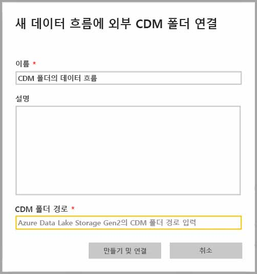
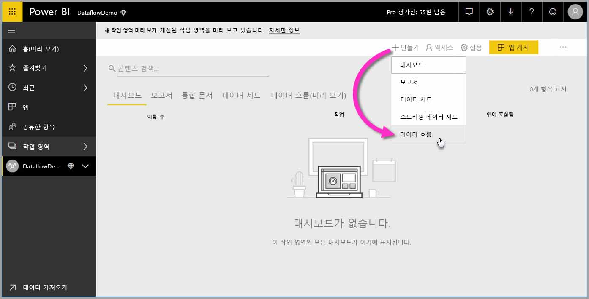
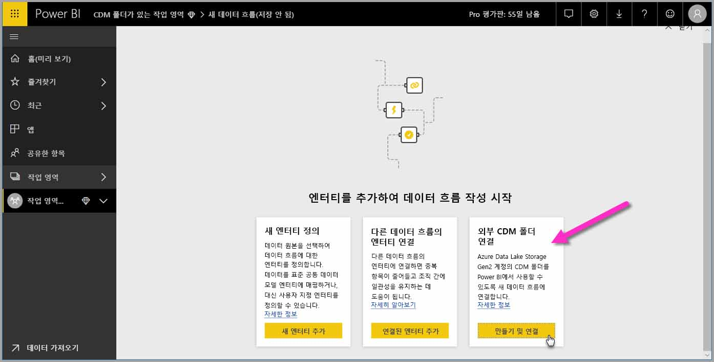
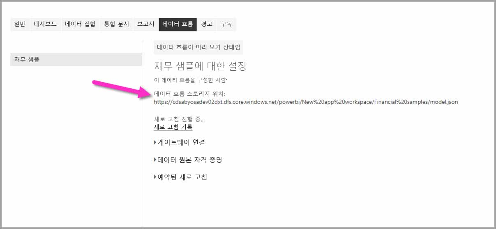

# CDM 폴더를 Power BI에 데이터 흐름으로 추가(미리 보기)

Power BI에서 조직의 Azure Data Lake Store Gen2에 저장된 CDM(공통 데이터 모델) 폴더를 데이터 흐름으로 추가할 수 있습니다. 또한 CDM 폴더에서 데이터 흐름을 만들면 **Power BI Desktop** 및 **Power BI 서비스**를 사용하여 CDM 폴더에 넣은 데이터를 기반으로 한 데이터 세트, 보고서, 대시보드 및 앱을 만들 수 있습니다.

다음 목록의 설명대로 CDM 폴더에서 데이터 흐름을 만들기 위한 몇 가지 요구 사항이 있습니다.

* CDM 폴더에서 데이터 흐름을 만드는 기능은 [새 작업 영역 환경](service-create-the-new-workspaces.md)에서’만’ 사용할 수 있습니다.  
* CDM 폴더를 Power BI에 추가하려면 폴더를 추가하는 사용자에게 [CDM 폴더 및 해당 파일의 권한](https://go.microsoft.com/fwlink/?linkid=2029121)이 있어야 합니다.
* Power BI에 CDM 폴더의 모든 파일 및 폴더를 추가하려면 이에 대한 읽기 및 실행 권한을 부여 받아야 합니다.

다음 섹션에서는 CDM 폴더에서 데이터 흐름을 만드는 방법을 설명합니다.

## CDM 폴더에서 데이터 흐름 만들기

CDM 폴더에서 데이터 흐름을 만들기 시작하려면 **Power BI 서비스**를 시작하고 탐색 창에서 **작업 영역**을 선택합니다. 새 작업 영역을 만들어 여기에서 새 데이터 흐름을 만들 수도 있습니다.

표시되는 화면에서 다음 이미지에 표시된 대로 **만들기 및 연결**을 선택합니다.

다음에 표시되는 화면에서 데이터 흐름 이름을 지정하고, 데이터 흐름의 설명을 제공하고, 조직의 Azure Data Lake Gen2 계정에서 CDM 폴더 경로를 제공할 수 있습니다. [CDM 폴더 경로를 가져오는 방법](service-dataflows-configure-workspace-storage-settings.md#get-the-uri-of-stored-dataflow-files)을 설명하는 문서의 섹션을 참조하세요. 

정보를 제공한 후 **만들기 및 연결**을 선택하여 데이터 흐름을 만듭니다.

CDM 폴더의 데이터 흐름은 Power BI에 표시될 때 *외부* 아이콘이 함께 표시됩니다. 다음 섹션에서는 표준 데이터 흐름과 CDM 폴더에서 만들어진 데이터 흐름 간의 차이점에 대해 설명합니다.

권한이 제대로 설정되면 이 문서에 설명된 대로 **Power BI Desktop**에서 데이터 흐름에 연결할 수 있습니다.

## 고려 사항 및 제한 사항

CDM 폴더에서 만들어진 데이터 흐름의 권한을 사용하는 경우 프로세스는 Power BI의 외부 데이터 원본과 유사합니다. 권한은 데이터 원본에서 관리되고 Power BI 내에서는 관리되지 않습니다. Power BI를 제대로 사용하려면 CDM 폴더에서 만들어진 데이터 흐름과 같은 데이터 원본 자체에서 권한을 적절하게 설정해야 합니다.

다음 목록은 CDM 폴더의 데이터 흐름이 Power BI에서 작동하는 방식을 명확하게 설명하는 데 도움이 됩니다.

Power BI Pro, Premium 및 Embedded 작업 영역:
* CDM 폴더의 데이터 흐름은 편집할 수 없음
* CDM 폴더에서 만들어진 데이터 흐름을 읽을 권한은 Power BI가 아닌 CDM 폴더 소유자가 관리합니다.

Power BI Desktop:
* 데이터 흐름이 만들어진 작업 영역 및 CDM 폴더의 권한이 부여된 사용자만 Power BI 데이터 흐름 커넥터에서 해당 데이터에 액세스할 수 있습니다.

다음 목록에 설명된 몇 가지 추가 고려 사항도 있습니다.

* CDM 폴더에서 데이터 흐름을 만드는 기능은 [새 작업 영역 환경](service-create-the-new-workspaces.md)에서’만’ 사용할 수 있습니다. 
* 연결된 엔터티는 CDM 폴더에서 만들어진 데이터 흐름에 사용할 수 없음

데이터 흐름의 소유자가 아니거나 데이터 흐름의 CDM 폴더 권한이 명시적으로 부여되지 않은 경우 **Power BI Desktop** 고객은 Azure Data Lake Storage Gen2 계정에 저장된 데이터 흐름에 액세스할 수 없습니다. 다음 상황을 고려하세요.

1.  Anna는 새 작업 영역을 만들고 CDM 폴더의 데이터 흐름을 저장하도록 구성합니다.
2.  Anna가 만든 작업 영역의 구성원인 Ben은 Power BI Desktop 및 데이터 흐름 커넥터를 사용하여 Anna가 만든 데이터 흐름에서 데이터를 가져오려고 합니다.
3.  Ben은 Data Lake의 데이터 흐름 CDM 폴더에 대한 권한 있는 사용자로 추가되지 않았으므로 오류가 발생합니다.

    

이 문제를 해결하려면 Ben에게 CDM 폴더 및 해당 파일의 독자 권한이 부여되어야 합니다. [이 문서](https://go.microsoft.com/fwlink/?linkid=2029121)에서 CDM 폴더의 액세스 권한을 부여하는 방법을 자세히 알아볼 수 있습니다.

## 다음 단계

이 문서에서는 데이터 흐름의 작업 영역 스토리지를 구성하는 방법에 대한 지침을 제공합니다. 자세한 내용은 다음 문서를 참조하세요.

데이터 흐름, CDM 및 Azure Data Lake Storage Gen2에 대한 자세한 내용은 다음 문서를 참조하세요.

* [데이터 흐름 및 Azure Data Lake 통합(미리 보기)](service-dataflows-azure-data-lake-integration.md)
* [작업 영역 데이터 흐름 설정 구성(미리 보기)](service-dataflows-configure-workspace-storage-settings.md)
* [데이터 흐름 스토리지를 위해 Azure Data Lake Storage Gen2 연결(미리 보기)](service-dataflows-connect-azure-data-lake-storage-gen2.md)

전반적인 데이터 흐름에 대한 내용은 다음 문서를 참조하세요.

* [Power BI에서 데이터 흐름 만들기 및 사용](service-dataflows-create-use.md)
* [Power BI Premium의 계산된 엔터티 사용](service-dataflows-computed-entities-premium.md)
* [온-프레미스 데이터 원본으로 만든 데이터 흐름 사용](service-dataflows-on-premises-gateways.md)
* [Power BI 데이터 흐름에 사용할 수 있는 개발자 리소스](service-dataflows-developer-resources.md)

Azure Storage에 대한 자세한 내용은 다음 문서를 참조하세요.
* [Azure Storage 보안 가이드](https://docs.microsoft.com/azure/storage/common/storage-security-guide)
* [예약된 새로 고침 구성](refresh-scheduled-refresh.md)
* [Azure Data Services의 github 샘플 시작](https://aka.ms/cdmadstutorial)

공통 데이터 모델에 대한 자세한 내용은 해당 개요 문서를 참조할 수 있습니다.
* [공통 데이터 모델 - 개요 ](https://docs.microsoft.com/powerapps/common-data-model/overview)
* [CDM 폴더](https://go.microsoft.com/fwlink/?linkid=2045304)
* [CDM 모델 파일 정의](https://go.microsoft.com/fwlink/?linkid=2045521)

또한 언제든지 [Power BI 커뮤니티에 질문](https://community.powerbi.com/)할 수 있습니다.

