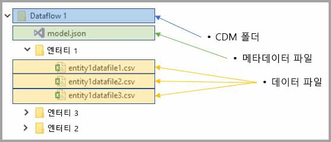
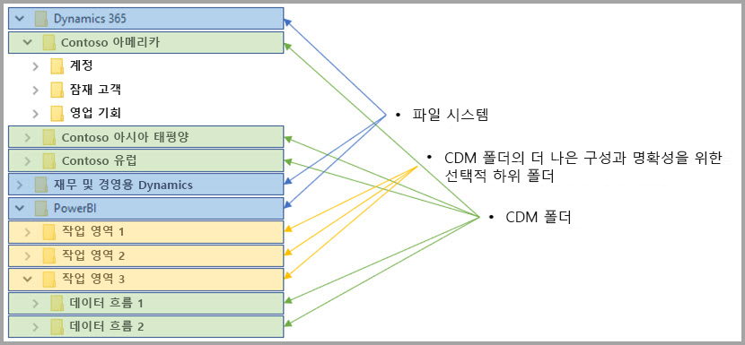

# 데이터 흐름 및 Azure Data Lake 통합(미리 보기)

기본적으로 Power BI에 사용되는 데이터는 Power BI에서 제공하는 내부 스토리지에 저장됩니다. 데이터 흐름 및 ADLS Gen2(Azure Data Lake Storage Gen2)를 통합하면 조직의 Azure Data Lake Storage Gen2 계정에 데이터 흐름을 저장할 수 있습니다. 

> [!NOTE]
> 데이터 흐름 기능은 미리 보기로 제공되며 일반 공급 전에 변경되고 업데이트될 수 있습니다.

## CDM 폴더가 데이터 흐름에 관련되는 방식

**데이터 흐름**을 사용하면 사용자 및 조직이 여러 원본의 데이터를 통합하고 모델링을 위해 준비할 수 있습니다. CDM(공통 데이터 모델)을 사용하면 조직이 애플리케이션 및 배포에서 의미 체계 일관성을 제공하는 데이터 형식을 사용할 수 있습니다. 또한 ADLS Gen2(Azure Data Lake Storage Gen2)를 사용하여 미세 조정된 액세스 및 권한 부여 제어를 Azure의 Data Lake에 적용할 수 있습니다. 결합된 경우 이러한 요소는 엔터프라이즈 전반에서 앱 및 initiaties에 대한 뛰어난 중앙 집중식 데이터, 정형 데이터, 미세 조정된 액세스 제어 및 의미 체계 일관성을 제공합니다.

CDM 형식으로 저장된 데이터는 조직의 애플리케이션 및 배포에서 의미 체계 일관성을 제공합니다. CDM과 ADLS Gen2의 통합을 통해 표준 CDM 형식의 스키마화된 데이터가 포함된 CDM 폴더를 사용하여 (ADLS Gen2)에 저장된 데이터에 동일한 구조적 일관성 및 의미 체계 의미를 적용할 수 있습니다. Azure Data Lake의 표준화된 메타데이터 및 자체 설명 데이터를 사용하면 메타데이터를 쉽게 복구하고 Power BI, Azure Data Factory, Azure Data Lake, Databricks 및 Azure ML(Machine Learning)과 같은 데이터 생산자와 소비자 간에 상호 운용이 가능합니다. 

데이터 흐름은 해당 정의 및 데이터를 다음 형식으로 CDM 폴더에 저장합니다.

**Model.json**
* **Model.json** 메타데이터 설명 파일에는 엔터티 레코드 및 특성에 대한 의미 체계 정보와 기본 데이터 파일 링크가 포함됩니다. Model.json 파일이 있으면 CDM 메타데이터 형식을 준수하고 있음을 나타내고, 애플리케이션이 사용할 수 있는 추가적인 풍부한 기본 제공 의미 체계 메타데이터가 포함된 표준 엔터티를 포함할 수 있습니다.
* 또한 Power BI는 Power BI 서비스의 데이터 흐름 편집기 환경에서 생성된 **쿼리 및 변환**과 함께 각 데이터 원본 정보를 저장합니다. 데이터 원본의 암호는 모델 파일에 저장되지 않습니다.

**데이터 파일**
* 데이터 파일은 잘 정의된 구조 및 형식(이 문서의 뒷부분에 설명된 대로 하위 폴더는 선택 사항임)의 CDM 폴더에 포함되고 model.json 파일에서 참조됩니다. 현재 데이터 파일은 .csv 형식이어야 하지만 후속 업데이트에서 추가 형식이 지원될 수 있습니다. 

다음 다이어그램은 세 개의 엔터티를 포함하는 Power BI 데이터 흐름에서 만들어진 샘플 CDM 폴더를 보여 줍니다.

이전 이미지의 model.json 또는 메타데이터 파일은 CDM 폴더에서 엔터티 데이터 파일에 대한 포인터를 제공합니다.

## Power BI는 Data Lake에서 CDM 폴더를 구성함

Power BI 데이터 흐름 및 ADLS Gen2와 통합을 통해 Power BI는 Data Lake에서 데이터를 생성할 수 있습니다. 데이터 생산자로서 Power BI는 model.json 파일 및 관련 데이터 파일을 포함하는 각 데이터 흐름에 해당하는 CDM 폴더를 만들어야 합니다. Power BI는 ‘파일 시스템’을 사용하여 Data Lake에 다른 데이터 생산자와 격리하여 데이터를 저장합니다. Azure Data Lake Storage Gen2 파일 시스템 및 계층 구조 네임스페이스에 대한 자세한 내용은 [이를 설명하는 문서](https://docs.microsoft.com/azure/storage/data-lake-storage/namespace)를 참조하세요.

Power BI는 하위 폴더를 사용하여 명확하게 설명하고 **Power BI 서비스**에서 제공될 때 향상된 데이터 구성을 제공합니다. 폴더 이름 지정 및 구조는 작업 영역(폴더) 및 데이터 흐름(CDM 폴더)을 나타냅니다. 다음 다이어그램은 Power BI 및 기타 데이터 생산자가 공유하는 Data Lake를 구성하는 방법을 보여 줍니다. 각 서비스(이 경우 Dynamics 365, Dynamics for Finance and Operation 및 Power BI)에서는 자체 파일 시스템을 만들고 유지 관리합니다. 각 서비스의 환경에 따라 파일 시스템 내에서 CDM 폴더를 보다 잘 구성하기 위해 하위 폴더를 만듭니다. 

## Power BI는 Data Lake의 데이터를 보호함

Power BI는 Azure Data Lake Storage Gen2에서 제공하는 *Active Directory OAuth Bearer* 토큰 및 *POSIX ACL* 기능을 사용합니다. 이러한 기능을 사용하면 Power BI가 Data Lake에서 관리하는 파일 시스템에 대한 Power BI의 액세스 범위를 지정하고, 사용자가 만드는 데이터 흐름 또는 CDM 폴더에 대한 사용자의 액세스 범위를 지정할 수 있습니다. 

Power BI 파일 시스템 내에서 CDM 폴더를 만들고 관리하려면 파일 시스템의 읽기, 쓰기 및 실행 권한이 필요합니다. Power BI에서 만들어진 각 데이터 흐름은 자체 CDM 폴더에 저장되고 데이터 흐름 소유자에게는 CDM 폴더 및 해당 콘텐츠의 읽기 전용 권한이 부여됩니다. 이 방법은 Power BI에서 생성하는 데이터의 무결성을 보호하고 관리자에게 감사 로그를 사용하여 CDM 폴더에 액세스한 사용자를 모니터링하는 기능을 제공합니다. 

### 사용자 또는 서비스에 CDM 폴더의 권한 부여

Active Directory OAuth Bearer 토큰 및 POSIX ACL을 사용하면 데이터를 읽어야 하는 사용자 또는 서비스와 같은 데이터 소비자와 CDM 폴더를 쉽게 공유할 수 있습니다. 이렇게 하면 관리자에게 CDM 폴더에 액세스한 사용자를 모니터링하는 기능이 제공됩니다. 필요한 유일한 작업은 선택한 Active Directory 개체(예: 사용자 그룹 또는 서비스)의 액세스 권한을 CDM 폴더에 부여하는 것입니다. 데이터 생산자가 아닌 ID의 경우에는 CDM 폴더의 모든 액세스 권한을 읽기 전용으로 부여하는 것이 좋습니다. 이렇게 하면 생산자가 생성하는 데이터의 무결성이 보호됩니다.

CDM 폴더를 Power BI에 추가하기 위해 CDM 폴더를 추가하는 사용자에게는 CDM 폴더 자체 및 그 안에 있는 모든 파일이나 폴더에 대한 ‘읽기’ 액세스 ACL이 있어야 합니다. 또한 CDM 폴더 자체 및 그 안에 있는 모든 폴더에 대한 ‘실행’ 서 액세스 ACL이 있어야 합니다. 자세한 내용은 [Access control lists on files and directory](https://docs.microsoft.com/azure/storage/blobs/data-lake-storage-access-control#access-control-lists-on-files-and-directories)(파일 및 디렉터리의 액세스 제어 목록) 및 [Best practices for using Azure Data Lake Storage Gen2](https://docs.microsoft.com/azure/storage/blobs/data-lake-storage-best-practices)(Azure Data Lake Storage Gen2 사용 모범 사례)를 검토하는 것이 좋습니다.

### 대체 권한 부여 방식

Power BI 외부의 사용자 또는 서비스는 대체 권한 부여 방식을 이용할 수 있습니다. 이러한 대체 방식은 소유자에게 계정의 ‘모든’ 리소스에 대한 키 액세스, Lake에 있는 모든 리소스에 대한 전체 액세스를 허용하며 범위를 파일 시스템 또는 CDM 폴더로 지정할 수는 없습니다. 이러한 대체 방식은 액세스 권한을 부여하는 간단한 방법일 수 있으나, Data Lake의 특정 리소스를 공유하는 기능을 제한하며 스토리지에 액세스한 사용자를 감사하는 기능을 사용자에게 제공하지 않습니다. 사용 가능한 권한 부여 체계에 대한 자세한 내용은 [Access control in Azure Data Lake Storage Gen2](https://docs.microsoft.com/azure/storage/blobs/data-lake-storage-access-control
)(Azure Data Lake Storage Gen2의 액세스 제어) 문서를 참조하세요.

## 다음 단계

이 문서에서는 Power BI 데이터 흐름, CDM 폴더 및 Azure Data Lake Storage Gen2의 통합을 간략하게 설명합니다. 자세한 내용은 다음 문서를 참조하세요.

데이터 흐름, CDM 및 Azure Data Lake Storage Gen2에 대한 자세한 내용은 다음 문서를 참조하세요.

* [작업 영역 데이터 흐름 설정 구성(미리 보기)](service-dataflows-configure-workspace-storage-settings.md)
* [CDM 폴더를 Power BI에 데이터 흐름으로 추가(미리 보기)](service-dataflows-add-cdm-folder.md)
* [데이터 흐름 스토리지를 위해 Azure Data Lake Storage Gen2 연결(미리 보기)](service-dataflows-connect-azure-data-lake-storage-gen2.md)

전반적인 데이터 흐름에 대한 내용은 다음 문서를 참조하세요.

* [Power BI에서 데이터 흐름 만들기 및 사용](service-dataflows-create-use.md)
* [Power BI Premium의 계산된 엔터티 사용(미리 보기)](service-dataflows-computed-entities-premium.md)
* [온-프레미스 데이터 원본으로 만든 데이터 흐름 사용(미리 보기)](service-dataflows-on-premises-gateways.md)
* [Power BI 데이터 흐름에 사용할 수 있는 개발자 리소스(미리 보기)](service-dataflows-developer-resources.md)

Azure Storage에 대한 자세한 내용은 다음 문서를 참조하세요.
* [Azure Storage 보안 가이드](https://docs.microsoft.com/azure/storage/common/storage-security-guide)
* [Azure Data Services의 github 샘플 시작](https://aka.ms/cdmadstutorial)

공통 데이터 모델에 대한 자세한 내용은 해당 개요 문서를 참조할 수 있습니다.
* [공통 데이터 모델 - 개요 ](https://docs.microsoft.com/powerapps/common-data-model/overview)
* [CDM 폴더](https://go.microsoft.com/fwlink/?linkid=2045304)
* [CDM 모델 파일 정의](https://go.microsoft.com/fwlink/?linkid=2045521)

또한 언제든지 [Power BI 커뮤니티에 질문](http://community.powerbi.com/)할 수 있습니다.
