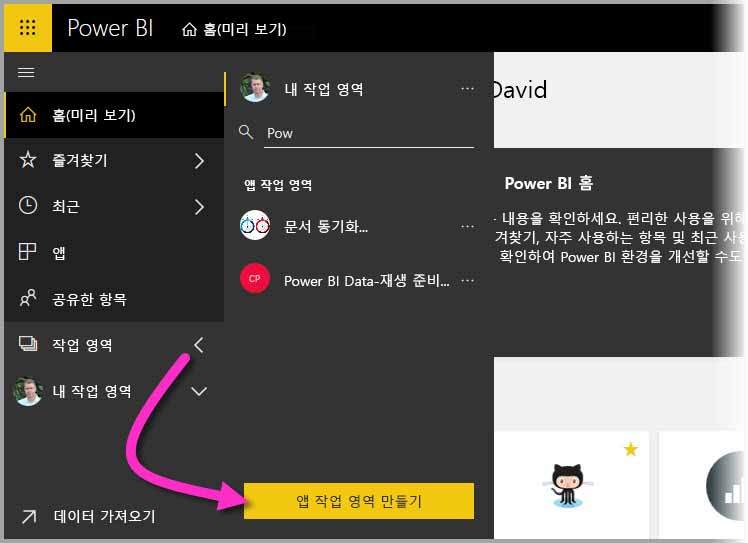
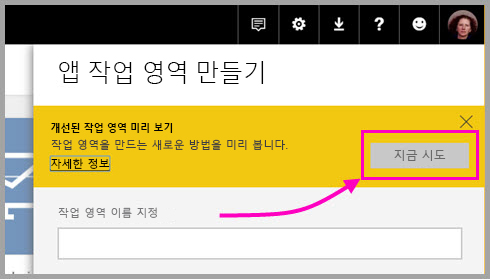
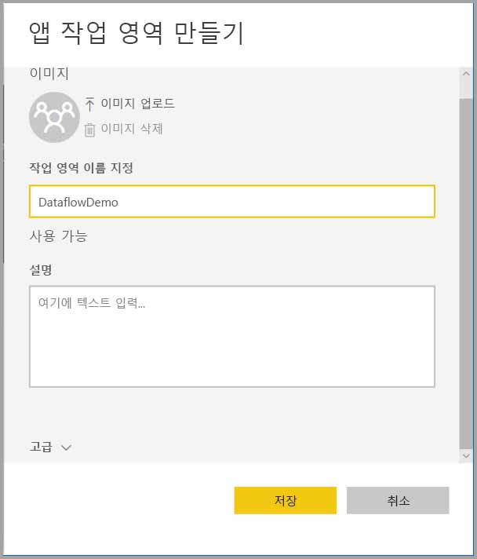
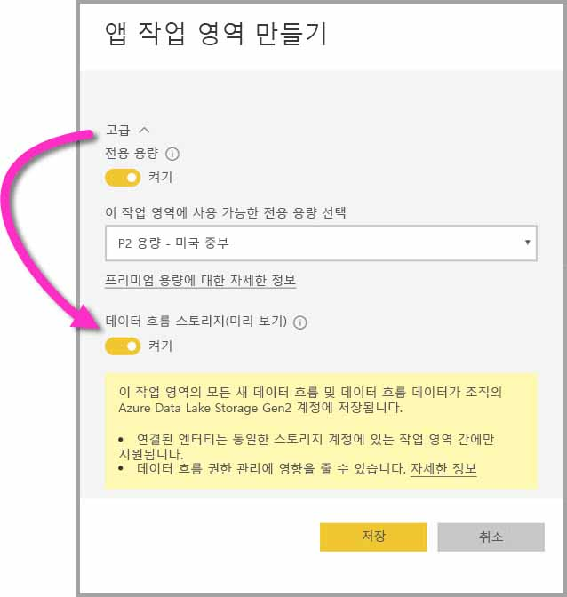
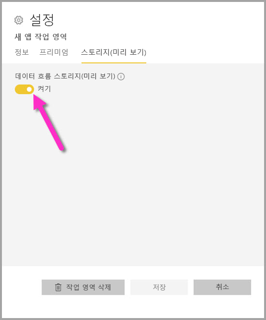
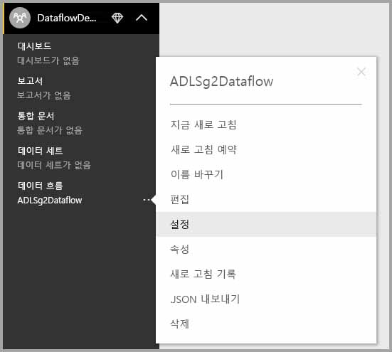

# 작업 영역 데이터 흐름 설정 구성(미리 보기)

Power BI와 데이터 흐름을 사용하면 작업 영역의 데이터 흐름 정의 파일과 데이터 파일을 Azure Data Lake Storage Gen2 계정에 저장할 수 있습니다. 작업 영역 관리자는 Power BI를 구성하여 이 작업을 수행할 수 있고, 이 문서에서는 이 작업에 필요한 단계를 살펴봅니다. 

작업 영역의 데이터 흐름 스토리지 위치를 구성하려면 먼저 회사의 전역 관리자가 조직의 스토리지 계정을 Power BI에 연결하고 해당 스토리지 계정의 스토리지 할당 권한을 사용하도록 설정해야 합니다. *[데이터 흐름 스토리지를 위해 Azure Data Lake Storage Gen2 연결(미리 보기)](service-dataflows-connect-azure-data-lake-storage-gen2.md)* 

작업 영역 데이터 흐름 스토리지 설정을 구성하는 두 가지 방법은 다음과 같습니다. 

* 작업 영역을 만드는 동안
* 기존 작업 영역을 편집하여

다음 섹션에서 각 방법을 살펴보겠습니다. 

> [!IMPORTANT]
> 작업 영역에 데이터 흐름이 포함되지 않은 경우에만 작업 영역 데이터 흐름 스토리지 설정을 변경할 수 있습니다. 또한 이 기능은 새 작업 영역 환경에서만 사용할 수 있습니다. [Power BI에서 새 작업 영역 만들기(미리 보기)](service-create-the-new-workspaces.md)에서 새 작업 영역을 자세히 알아볼 수 있습니다.

## 새 작업 영역 만들기, 데이터 흐름 스토리지 구성

Power BI 서비스에서 새 작업 영역을 만들려면 **작업 영역 > 작업 영역 만들기**를 선택합니다.

작업 영역 만들기 대화 상자에 **개선된 작업 영역 미리 보기**라는 노란색 상자가 표시될 수 있습니다. 해당 영역에서 **지금 시도**를 선택합니다.

표시되는 대화 상자에서 새 작업 영역에 고유한 이름을 지정할 수 있습니다. 고급 설정을 지정해야 하므로 **저장**을 선택하지 마세요.

이제 **작업 영역 만들기** 대화 상자의 **고급** 영역을 펼칩니다. 여기서 **데이터 흐름 스토리지(미리 보기)** 설정을 켤 수 있습니다.

**저장**을 선택하여 새 작업 영역을 만듭니다. 이제 이 작업 영역에서 만든 모든 새 데이터 흐름은 조직의 Azure Data Lake Storage Gen2 계정에 해당 정의 파일(Model.json 파일) 및 데이터를 저장합니다. 

## 기존 작업 영역의 데이터 흐름 스토리지 업데이트

새 작업 영역을 만드는 대신, 기존 작업 영역을 업데이트하여 조직의 Azure Data Lake Storage Gen2 계정에 정의 파일 및 데이터를 저장할 수 있습니다. 작업 영역에 데이터 흐름이 포함되지 않은 경우에만 데이터 흐름 스토리지 설정을 변경할 수 있습니다.

작업 영역을 편집하려면 줄임표 **(...)** 를 선택한 다음, **작업 영역 편집**을 선택합니다. 

표시되는 **작업 영역 편집** 창에서 **고급**을 확장한 후 **데이터 흐름 스토리지(미리 보기)** 설정을 **켜기**로 전환합니다. 

그런 다음, **저장**을 선택하면 이 작업 영역에서 만든 모든 새 데이터 흐름이 조직의 Azure Data Lake Storage Gen2 계정에 해당 정의 파일 및 데이터를 저장합니다.

## 저장된 데이터 흐름 파일의 URI 가져오기

조직의 Azure Data Lake 계정에 할당된 작업 영역에서 데이터 흐름을 만들면 해당 정의 및 데이터 파일에 직접 액세스할 수 있습니다. 해당 위치는 **데이터 흐름 설정** 페이지에서 사용할 수 있습니다. 이 페이지로 이동하려면 다음 단계를 수행합니다.

작업 영역의 **데이터 흐름** 아래에 나열된 데이터 흐름 옆에 있는 줄임표 **(...)** 를 선택합니다. 표시되는 메뉴에서 **설정**을 선택합니다.

표시되는 정보에서 데이터 흐름의 CDM 폴더 위치는 다음 이미지와 같이 **데이터 흐름 스토리지 위치** 아래에 표시됩니다.

> [!NOTE]
> Power BI는 데이터 흐름 파일이 저장되는 CDM 폴더의 독자 권한을 가진 데이터 흐름 소유자를 구성합니다. 다른 사용자 또는 서비스에 데이터 흐름 스토리지 위치의 액세스 권한을 부여하려면 Azure에서 액세스 권한을 부여할 수 있는 스토리지 계정의 소유자여야 합니다.

## 고려 사항 및 제한 사항

데이터 흐름 스토리지가 Azure Data Lake Storage Gen2에 있는 경우에는 특정 데이터 흐름 기능이 지원되지 않습니다. 

Power BI Pro, Premium 및 Embedded 작업 영역:
* **연결된 엔터티** 기능은 동일한 스토리지 계정의 작업 영역에서만 지원됩니다.
* 작업 영역 권한은 Azure Data Lake Storage Gen2에 저장된 데이터 흐름에 적용되지 않고, 데이터 흐름의 소유자만 액세스할 수 있습니다.
* 그 외에는 모든 데이터 준비 기능이 Power BI 스토리지에 저장된 데이터 흐름의 경우와 동일합니다.

다음 목록에 설명된 몇 가지 추가 고려 사항도 있습니다.

* 데이터 흐름 스토리지 위치가 구성되고 나면 이를 변경할 수 없습니다.
* Azure Data Lake Storage Gen2에 저장된 데이터 흐름의 소유자만 해당 데이터에 액세스할 수 있습니다.
* Power BI 공유 용량의 온-프레미스 데이터 원본은 조직의 Azure Data Lake Storage Gen2에 저장된 데이터 흐름에서 지원되지 않습니다.

데이터 흐름의 소유자가 아닌 경우 **Power BI Desktop** 고객은 Azure Data Lake Storage Gen2 계정에 저장된 데이터 흐름에 액세스할 수 없습니다. 다음 상황을 고려하세요.

1.  Anna는 새 작업 영역을 만들고 조직의 데이터 레이크에 데이터 흐름을 저장하도록 구성합니다.
2.  Anna가 만든 작업 영역의 구성원인 Ben은 Power BI Desktop 및 데이터 흐름 커넥터를 사용하여 Anna가 만든 데이터 흐름에서 데이터를 가져오려고 합니다.
3.  Ben은 Data Lake의 데이터 흐름 CDM 폴더에 대한 권한 있는 사용자로 추가되지 않았으므로 오류가 발생합니다.

    

## 다음 단계

이 문서에서는 데이터 흐름의 작업 영역 스토리지를 구성하는 방법에 대한 지침을 제공합니다. 자세한 내용은 다음 문서를 참조하세요.

데이터 흐름, CDM 및 Azure Data Lake Storage Gen2에 대한 자세한 내용은 다음 문서를 참조하세요.

* [데이터 흐름 및 Azure Data Lake 통합(미리 보기)](service-dataflows-azure-data-lake-integration.md)
* [CDM 폴더를 Power BI에 데이터 흐름으로 추가(미리 보기)](service-dataflows-add-cdm-folder.md)
* [데이터 흐름 스토리지를 위해 Azure Data Lake Storage Gen2 연결(미리 보기)](service-dataflows-connect-azure-data-lake-storage-gen2.md)

전반적인 데이터 흐름에 대한 내용은 다음 문서를 참조하세요.

* [Power BI에서 데이터 흐름 만들기 및 사용](service-dataflows-create-use.md)
* [Power BI Premium의 계산된 엔터티 사용(미리 보기)](service-dataflows-computed-entities-premium.md)
* [온-프레미스 데이터 원본으로 만든 데이터 흐름 사용(미리 보기)](service-dataflows-on-premises-gateways.md)
* [Power BI 데이터 흐름에 사용할 수 있는 개발자 리소스(미리 보기)](service-dataflows-developer-resources.md)

Azure Storage에 대한 자세한 내용은 다음 문서를 참조하세요.

* [Azure Storage 보안 가이드](https://docs.microsoft.com/azure/storage/common/storage-security-guide)
* [Azure Data Services의 github 샘플 시작](https://aka.ms/cdmadstutorial)

공통 데이터 모델에 대한 자세한 내용은 해당 개요 문서를 참조할 수 있습니다.

* [공통 데이터 모델 - 개요 ](https://docs.microsoft.com/powerapps/common-data-model/overview)
* [CDM 폴더](https://go.microsoft.com/fwlink/?linkid=2045304)
* [CDM 모델 파일 정의](https://go.microsoft.com/fwlink/?linkid=2045521)

또한 언제든지 [Power BI 커뮤니티에 질문](https://community.powerbi.com/)할 수 있습니다.
