# Power BI에서 데이터 흐름 만들기 및 사용

**Power BI**에서 사용할 수 있는 고급 데이터 준비를 통해 데이터 흐름이라는 데이터 컬렉션을 만들고, 이 데이터 흐름을 사용하여 다양한 원본의 비즈니스 데이터와 연결하고, 데이터를 정리하고 변환한 후 Power BI 스토리지로 로드할 수 있습니다.

**데이터 흐름**은 Power BI 서비스의 작업 영역에서 만들고 관리하는 ‘엔터티’(엔터티는 테이블과 유사함) 컬렉션입니다. 데이터 흐름이 만들어진 작업 영역에서 직접 데이터 흐름의 엔터티를 추가 및 편집할 수 있고 데이터 새로 고침 일정도 관리할 수 있습니다.

데이터 흐름을 만들면 **Power BI Desktop** 및 **Power BI 서비스**를 사용하여 Power BI 데이터 흐름에 지정하는 데이터를 기반으로 한 데이터 세트, 보고서, 대시보드 및 앱을 만들 수 있으므로 비즈니스 활동에 대한 인사이트를 얻을 수 있습니다.

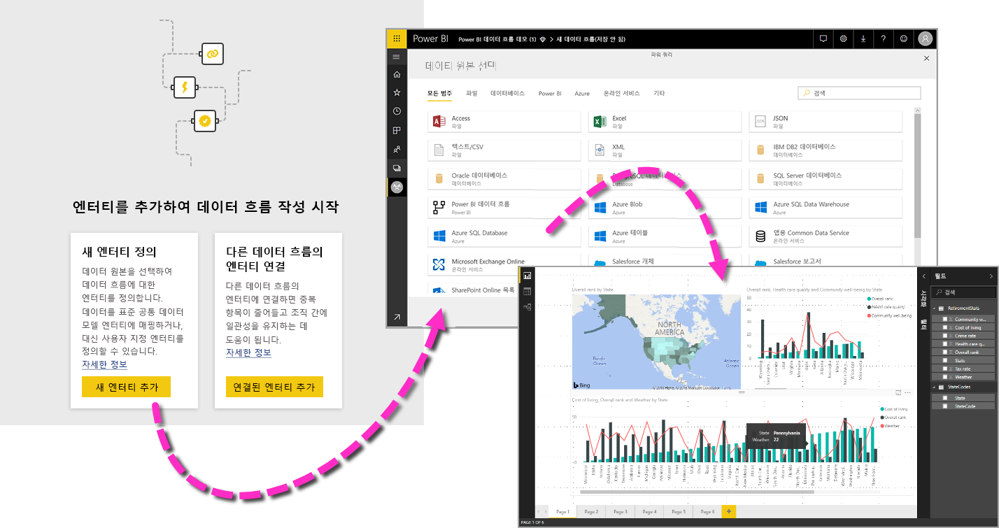

다음과 같이 데이터 흐름을 사용하는 세 가지 기본 단계가 있습니다.

1. 간단하게 제작을 수행할 수 있도록 설계된 Microsoft 도구를 사용하여 데이터 흐름을 제작합니다.
2. 데이터 흐름으로 가져올 데이터의 새로 고침 빈도를 예약합니다.
3. Power BI Desktop으로 데이터 흐름을 사용하는 데이터 세트를 빌드합니다. 

다음 섹션에서는 이러한 단계를 각각 살펴보고 각 단계를 완료하도록 제공되는 도구에 익숙해지도록 합니다. 설명하겠습니다.

## 데이터 흐름 만들기
데이터 흐름을 만들려면, 브라우저에서 Power BI 서비스를 시작하고 다음 화면에 표시된 것처럼 왼쪽 탐색 창에서 **작업 영역**을 선택합니다(Power BI 서비스의 *my-workspace*에서는 데이터 흐름을 사용할 수 없음). 새 데이터 흐름을 만들 새 작업 영역을 만들 수도 있습니다. 

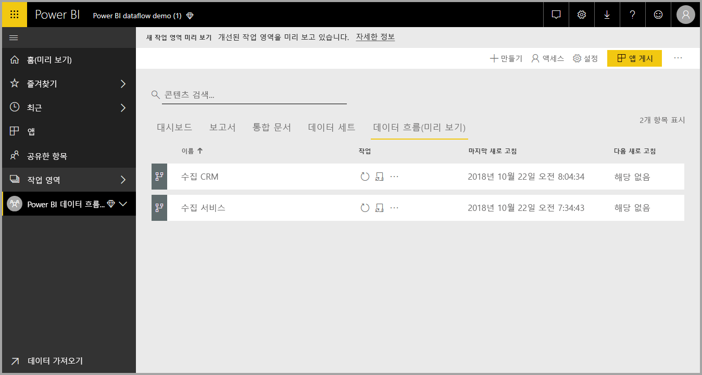

데이터 흐름을 만들 수 있는 **작업 영역**에 있는 경우, 캔버스 오른쪽 위에 **+ 만들기** 단추가 표시됩니다. **+ 만들기** 단추를 선택하고 드롭다운 목록에서 **데이터 흐름**을 선택합니다. 

데이터 흐름에는 ‘한 명의 소유자’만 있으며, 소유자는 데이터 흐름을 만든 사람입니다. 소유자만 데이터 흐름을 편집할 수 있습니다. 데이터 흐름이 만들어진 작업 영역에 대한 읽기 또는 쓰기 권한이 있는 **작업 영역**의 모든 구성원은 이 문서의 뒷부분에 설명된 대로 **Power BI Desktop** 내에서 데이터 흐름에 연결할 수 있습니다.

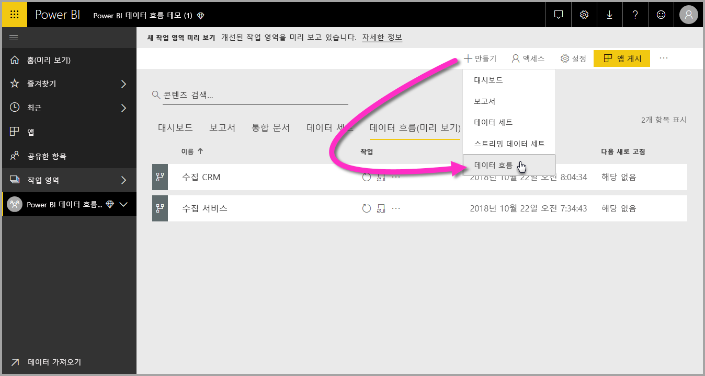

여기서 다음 섹션에 자세히 설명된 **엔터티**를 추가합니다.

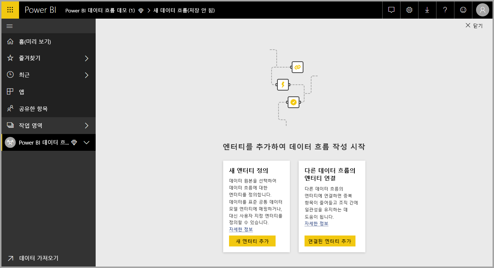

### 엔터티 추가

**엔터티**는 데이터를 저장하는 데 사용되는 필드 집합으로, 데이터베이스 내의 테이블과 매우 유사합니다. 다음 이미지에는 Power BI로 데이터를 수집할 수 있는 데이터 원본 선택 항목이 표시되어 있습니다.

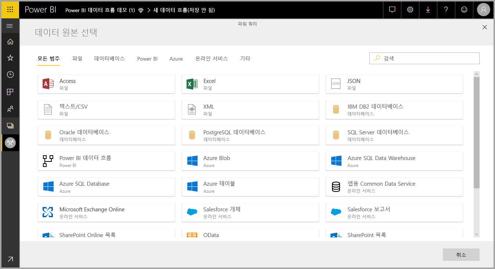

데이터 원본을 선택하면 다음 이미지에 표시된 대로 데이터 원본에 연결할 때 사용할 계정을 비롯한 연결 설정을 입력하라는 메시지가 표시됩니다.

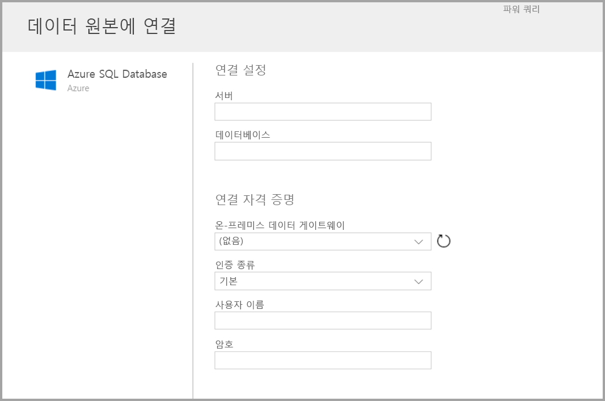

데이터 원본에 연결되면 엔터티에 사용할 데이터를 선택할 수 있습니다. 데이터 및 원본을 선택한 후에는 나중에 설정 프로세스에서 선택하는 빈도로 데이터 흐름의 데이터를 계속 새로 고치도록 Power BI가 데이터 원본에 다시 연결합니다.

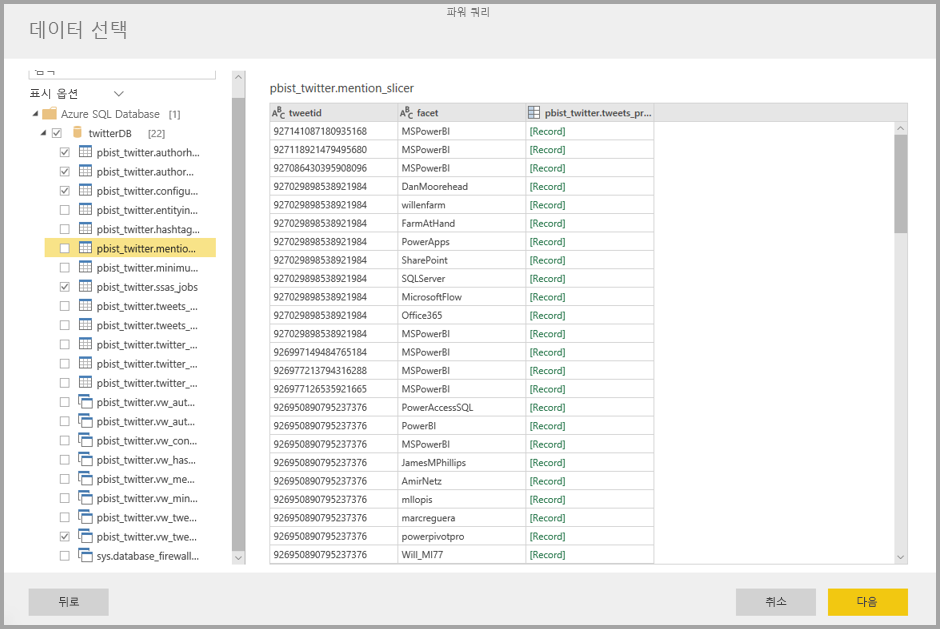

엔터티에 사용할 데이터를 선택하면 데이터 흐름 편집기를 사용하여 해당 데이터를 데이터 흐름에 사용하는 데 필요한 형식으로 구성하거나 변환할 수 있습니다.

### 데이터 흐름 편집기 사용

엔터티에 사용할 데이터를 소스에서 선택하면 **Power BI Desktop**의 **파워 쿼리 편집기**와 유사한 파워 쿼리 편집 환경을 사용하여 엔터티에 가장 적합한 양식으로 데이터 선택 항목을 구성할 수 있습니다. Power BI Desktop의 [쿼리 개요 문서](desktop-query-overview.md)에서 파워 쿼리에 대해 자세히 알아볼 수 있습니다(파워 쿼리는 Power BI Desktop에 파워 쿼리 편집기로 통합됨). 

각 단계에서 쿼리가 만드는 코드를 확인하거나 사용자 고유의 모양 지정 코드를 만들려는 경우 **고급 편집기**를 사용할 수 있습니다. 

### 데이터 흐름 및 CDM(공통 데이터 모델)

데이터 흐름 엔터티에는 쉽게 비즈니스 데이터를 공통 데이터 모델(Microsoft의 표준화된 스키마)에 매핑하고, Microsoft 및 타사 데이터를 보강하며, 기계 학습에 간편하게 액세스할 수 있는 새로운 도구가 포함되어 있습니다. 이러한 새 기능을 활용하여 비즈니스 데이터에 관한 실행 가능 인텔리전트 인사이트를 제공할 수 있습니다. 쿼리 편집 단계에서 변환을 완료했으면 데이터 원본 테이블의 열을 공통 데이터 모델에서 정의한 대로 표준 엔터티 필드로 매핑할 수 있습니다. 표준 엔터티에는 공통 데이터 모델에서 정의한 알려진 스키마가 있습니다.

이 접근 방식과 공통 데이터 모델에 대한 자세한 내용은 [공통 데이터 모델이란](https://docs.microsoft.com/powerapps/common-data-model/overview) 문서에서 알아보세요.

데이터 흐름에서 공통 데이터 모델을 활용하려면 **쿼리 편집** 대화 상자에서 **표준 변환에 매핑**을 클릭하세요. 표시되는 **엔터티 매핑** 화면에서 매핑할 표준 엔터티를 선택할 수 있습니다.

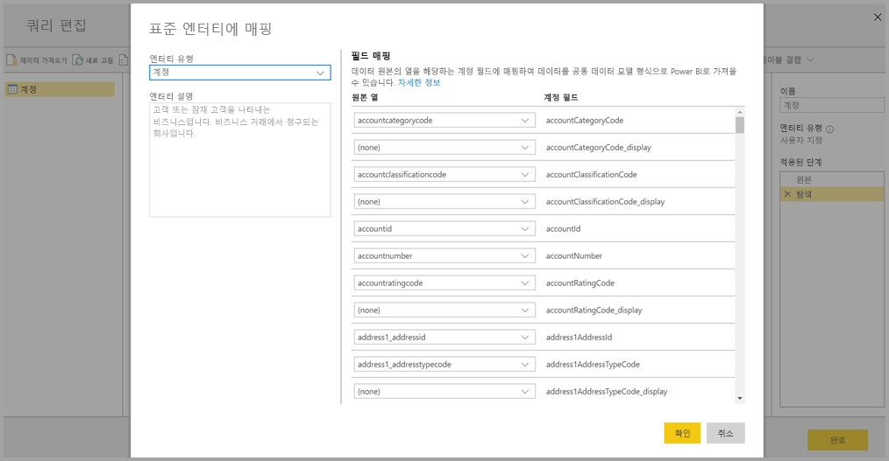

원본 열을 표준 필드에 매핑하면 다음이 발생합니다.

1. 원본 열이 표준 필드 이름을 사용합니다(이름이 다른 경우 열 이름이 바뀜).
2. 원본 열이 표준 필드 데이터 형식이 됩니다.

공통 데이터 모델 표준 엔터티를 유지하도록 매핑되지 않은 모든 표준 필드는 *Null* 값이 됩니다.

매핑 결과가 사용자 지정 필드가 포함된 표준 엔터티가 되도록 매핑되지 않은 모든 원본 열이 그대로 유지됩니다.

항목 선택을 완료했으며 엔터티 및 해당 데이터 설정을 저장할 준비가 되면 메뉴에서 **저장**을 선택할 수 있습니다. **엔터티 추가** 단추를 선택하여 여러 엔터티를 만들 수 있으며 만든 쿼리 및 엔터티가 개선되도록 엔터티를 편집할 수 있습니다.

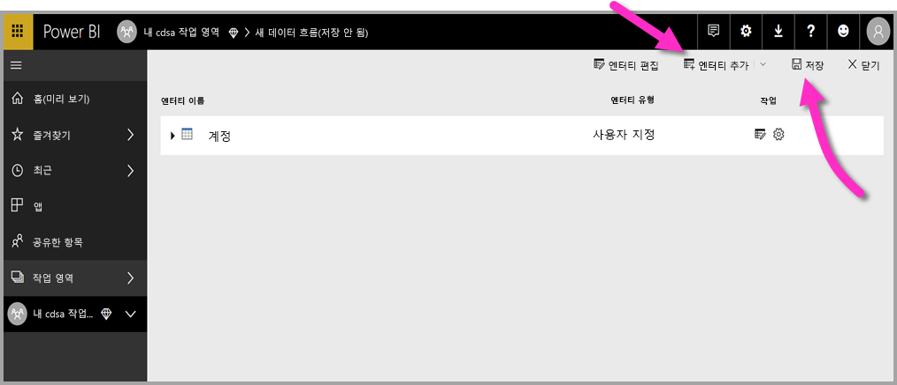

**저장**을 선택하면 데이터 흐름 이름을 지정하고 설명을 입력하라는 메시지가 표시됩니다.

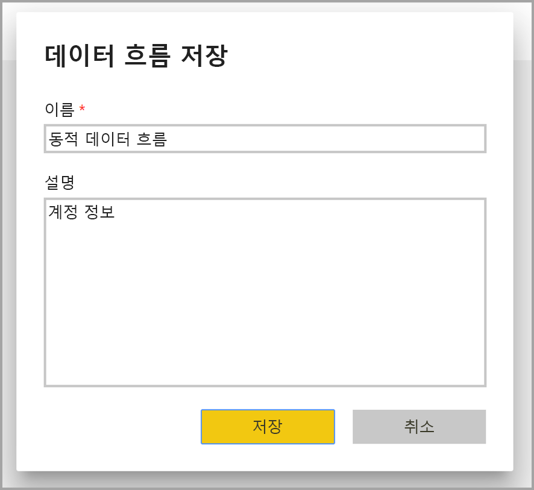

준비를 완료하고 **저장** 단추를 선택하면 **데이터 흐름**이 만들어졌는지 알 수 있는 창이 나타납니다. 

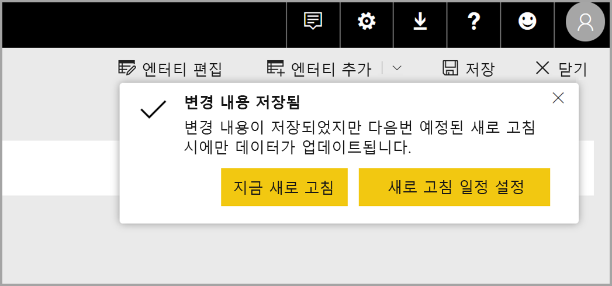

좋습니다. 이제 데이터 원본의 새로 고침 빈도를 예약하는 다음 단계를 수행할 준비가 되었습니다.

## 새로 고침 빈도 예약

데이터 흐름이 저장되면 연결된 각 데이터 원본의 새로 고침 빈도를 예약합니다.

Power BI 데이터 흐름은 Power BI 데이터 새로 고침 프로세스를 사용하여 데이터를 최신 버전으로 유지합니다. **Power BI 서비스**의 **작업 영역** 섹션에는 다음 이미지와 같이 데이터 흐름을 포함한 정보가 나열될 수 있는 영역 컬렉션이 있습니다.

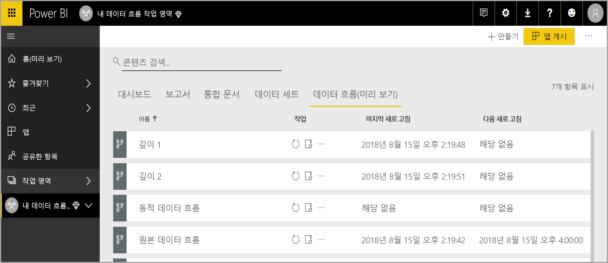

이전 이미지의 ‘Dynamics 데이터 흐름’ 항목은 이전 섹션에서 만든 데이터 흐름입니다. 새로 고침을 예약하려면 다음 이미지에 표시된 대로 **작업** 섹션에서 **새로 고침 예약** 아이콘을 선택합니다. 

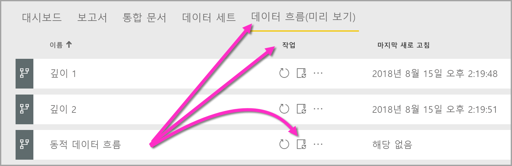

**새로 고침 예약** 아이콘을 선택하면 **새로 고침 예약** 창으로 이동하여 데이터 흐름 새로 고침 빈도 및 시간을 설정할 수 있습니다.

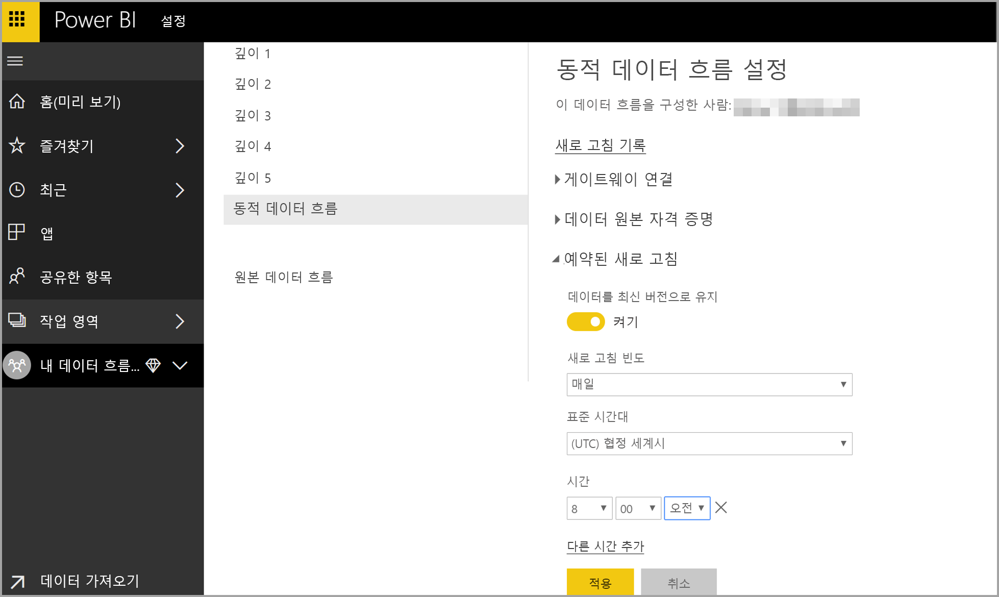

새로 고침 예약에 대한 자세한 내용은 Power BI 데이터 세트의 새로 고침 동작에 대해 설명하는 [예약된 새로 고침 구성](refresh-scheduled-refresh.md) 문서를 참조하세요. 새로 고침 설정 측면에서는 데이터 흐름이 Power BI 데이터 세트와 동일하게 작동합니다. 

## Power BI Desktop에서 데이터 흐름에 연결

데이터 흐름을 만들고 모델을 채울 각 데이터 원본의 새로 고침 빈도를 예약하면 **Power BI Desktop** 내에서 데이터 흐름에 연결하는 세 번째 최종 단계를 수행할 준비가 완료된 것입니다. 

데이터 흐름에 연결하려면 다음 이미지에 표시된 대로 Power BI Desktop에서 **데이터 가져오기 > Power BI > Power BI 데이터 흐름(베타)** 을 선택하세요.

여기서 데이터 흐름을 저장한 **작업 영역**으로 이동하여 데이터 흐름을 선택한 다음, 목록에서 만든 엔터티를 선택합니다.

창 위쪽에 있는 **검색 창**을 사용하여 여러 데이터 흐름 엔터티에서 해당 데이터 흐름 또는 엔터티의 이름을 빠르게 찾을 수도 있습니다.

엔터티를 선택하고 **로드** 단추를 선택하면 **Power BI Desktop**의 **필드** 창에 엔터티가 표시되며 다른 데이터 세트의 **테이블**처럼 표시되고 작동합니다.

## Azure Data Lake Storage Gen2에 저장된 데이터 흐름 사용

일부 조직에서 데이터 흐름의 생성 및 관리를 위해 자체 스토리지를 사용하려고 할 수 있습니다. 요구 사항을 따르고 권한을 제대로 관리하면 데이터 흐름을 Azure Data Lake Storage Gen2와 통합할 수 있습니다. 이 방법의 모든 요구 사항에 대한 설명서는 개요 문서, [데이터 흐름 및 Azure Data Lake 통합(미리 보기)](service-dataflows-azure-data-lake-integration.md)부터 확인할 수 있습니다.

## 데이터 연결 문제 해결

데이터 흐름의 데이터 원본에 연결하는 데 문제가 발생하는 경우가 있을 수 있습니다. 이러한 문제가 발생하는 경우에 대한 문제 해결 팁을 이 섹션에서 제공합니다. 

* **Salesforce 커넥터** - 데이터 흐름과 함께 Salesforce 평가판 계정을 사용하면 제공된 정보가 없는 경우 연결이 실패합니다. 이 문제를 해결하려면 테스트에 프로덕션 Salesforce 계정 또는 개발자 계정을 사용하세요.

* **SharePoint 커넥터** - 하위 폴더 또는 문서가 없는 SharePoint 사이트 루트 주소를 제공해야 합니다. 예를 들어 다음과 유사한 링크를 사용하세요. https://microsoft.sharepoint.com/teams/ObjectModel/ 

* **JSON 파일 커넥터** - 현재 기본 인증만 사용하여 JSON 파일에 연결할 수 있습니다.  URL 내에서 자격 증명을 입력하여 JSON 파일에 연결(예: https://XXXXX.blob.core.windows.net/path/file.json?sv=2019-01-01&si=something&sr=c&sig=123456abcdefg..)하는 작업은 현재 지원되지 **않습니다**.  

* **Azure SQL Data Warehouse** - 데이터 흐름은 현재 Azure SQL Data Warehouse에서 AAD(Azure Active Directory) 인증을 지원하지 않습니다. 이 시나리오에서 기본 인증을 사용하세요.

## 다음 단계

이 문서에는 고유한 **데이터 흐름**을 만들고 이 데이터 흐름을 활용하여 **Power BI Desktop**의 데이터 세트 및 보고서를 만들 수 있는 방법이 설명되어 있습니다. 다음 문서는 데이터 흐름을 사용하는 경우에 대한 자세한 정보 및 시나리오를 참조하는 데 유용합니다.

* [데이터 흐름을 사용하여 셀프 서비스 데이터 준비](service-dataflows-overview.md)
* [Power BI Premium의 계산된 엔터티 사용](service-dataflows-computed-entities-premium.md)
* [온-프레미스 데이터 원본으로 만든 데이터 흐름 사용](service-dataflows-on-premises-gateways.md)
* [Power BI 데이터 흐름에 사용할 수 있는 개발자 리소스](service-dataflows-developer-resources.md)
* [데이터 흐름 및 Azure Data Lake 통합(미리 보기)](service-dataflows-azure-data-lake-integration.md)

공통 데이터 모델에 대한 자세한 내용은 해당 개요 문서를 참조할 수 있습니다.
* [공통 데이터 모델 - 개요 ](https://docs.microsoft.com/powerapps/common-data-model/overview)
* [GitHub에서 공통 데이터 모델 스키마 및 엔터티에 대해 자세히 알아보기](https://github.com/Microsoft/CDM)

관련된 Power BI Desktop 문서는 다음과 같습니다.

* [Power BI Desktop에서 Power BI 서비스의 데이터 세트에 연결](desktop-report-lifecycle-datasets.md)
* [Power BI Desktop을 사용한 쿼리 개요](desktop-query-overview.md)

관련된 Power BI 서비스 문서는 다음과 같습니다.
* [예약된 새로 고침 구성](refresh-scheduled-refresh.md)
