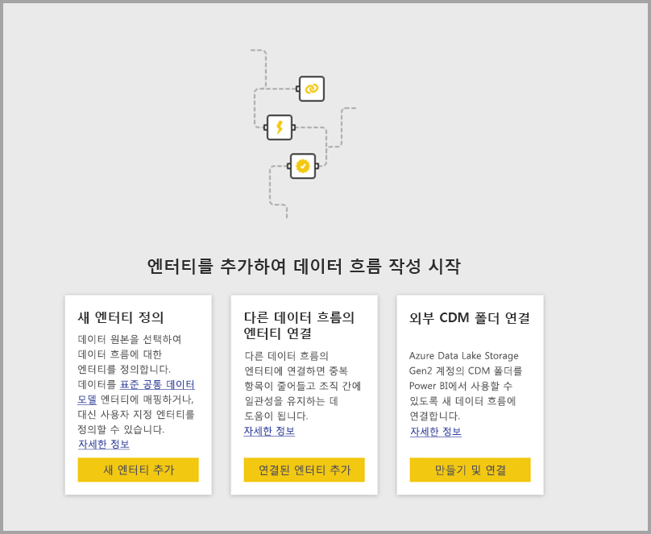
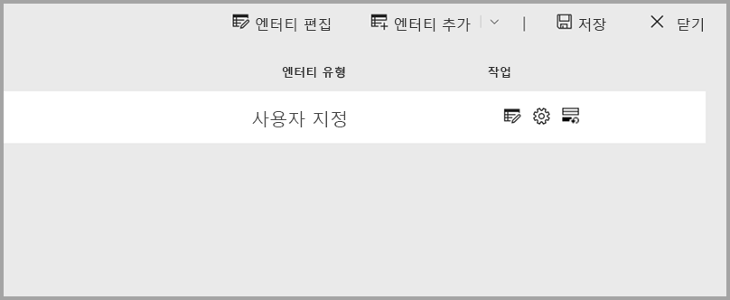
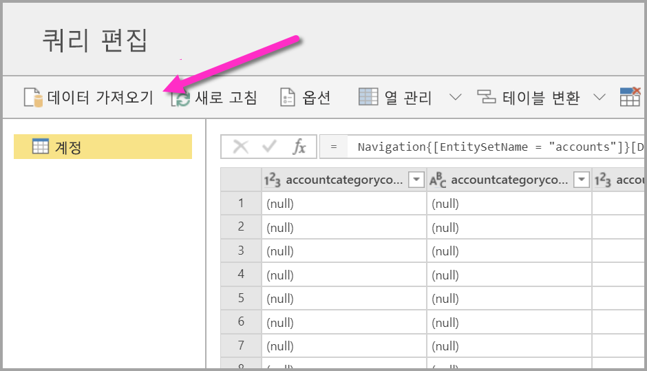
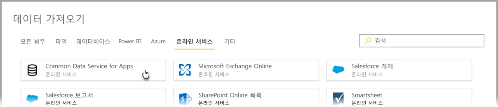
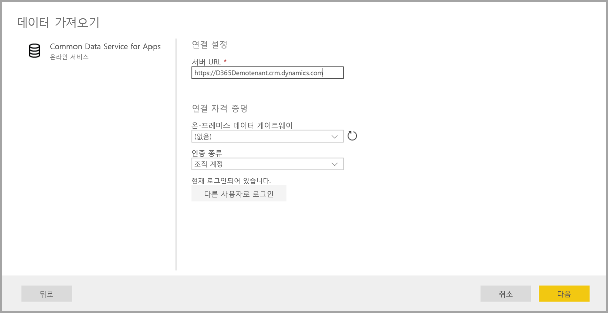
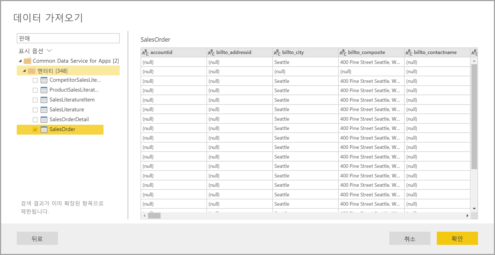
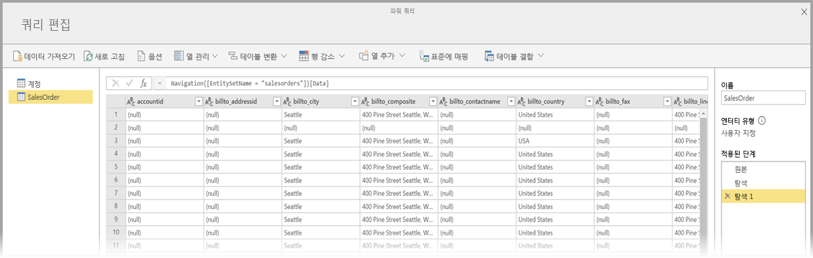
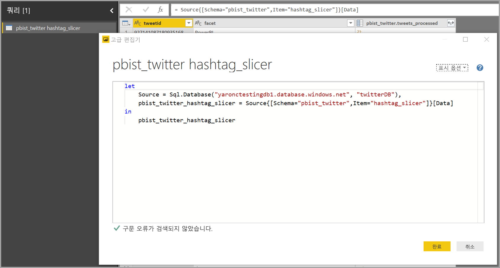
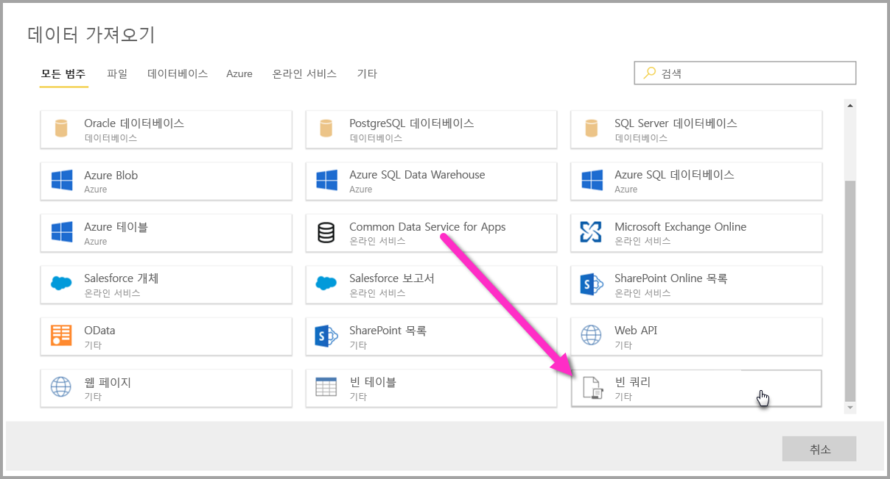
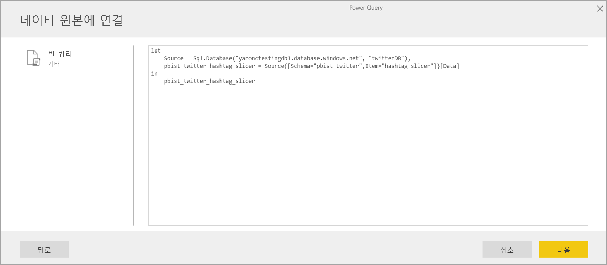

# Power BI 데이터 흐름에 대한 데이터 원본에 연결

Power BI 데이터 흐름을 사용하면 다양한 데이터 원본에 연결하여 새 데이터 흐름을 만들거나 기존 데이터 흐름에 새 엔터티를 추가할 수 있습니다.

이 문서에서는 데이터 흐름을 만들거나 추가하는 데 사용할 수 있는 많은 데이터 원본이 나열되어 있으며, 이러한 데이터 원본을 사용하여 데이터 흐름을 만드는 방법을 설명합니다.

데이터 흐름을 만들고 사용 하는 방법의 개요에 대해서는, [Power BI에서 데이터 흐름을 만들고 사용](service-dataflows-create-use.md)을 참조 하세요.

## 데이터 원본에서 데이터 흐름 만들기

데이터에 연결하려면 **Power BI 서비스**에서 **+ 만들기** 메뉴 항목을 선택한 다음, 나타나는 메뉴에서 **데이터 흐름**을 선택합니다. 선택하면 다음 이미지가 Power BI 서비스의 캔버스에 나타납니다. 

데이터 흐름이 이미 있는 경우 아래에 표시된 **엔터티 추가**를 선택하거나 데이터 흐름 제작 도구에서 **데이터 가져오기**를 선택하여 데이터 흐름에 새 엔터티를 추가할 수 있습니다.

다음 이미지는 데이터 흐름 제작 도구의 **데이터 가져오기** 단추를 보여줍니다. 

## 데이터 흐름용 데이터 원본

데이터 흐름 제작 도구에서 **데이터 가져오기**를 선택한 후, 다음 이미지와 같이 범주 및 각 데이터 원본을 선택하는 대화 상자를 표시하여 사용 가능한 데이터 원본을 볼 수 있습니다.

데이터 흐름에 대한 데이터 원본은 **데이터 가져오기** 대화 상자 맨 위에 나타나는 다음 범주로 구성됩니다.

* 모든 범주
* 파일
* 데이터베이스
* Power BI
* Azure
* 온라인 서비스
* 기타

**모든 범주** 범주에는 모든 범주의 모든 데이터 원본이 포함됩니다. 

**파일** 범주에는 데이터 흐름에 대해 다음과 같은 사용 가능한 데이터 연결이 포함됩니다.

* 액세스
* Excel
* JSON
* 텍스트/CSV
* XML

**데이터베이스** 범주에는 데이터 흐름에 대해 다음과 같은 사용 가능한 데이터 연결이 포함됩니다.

* IBM DB2 데이터베이스
* MySQL 데이터베이스
* Oracle 데이터베이스
* PostgreSQL 데이터베이스
* SQL Server 데이터베이스
* Sybase 데이터베이스
* Teradata 데이터베이스
* Vertica

**Power BI** 범주에는 데이터 흐름에 대해 다음과 같은 사용 가능한 데이터 연결이 포함됩니다.

* Power BI 데이터 흐름

**Azure** 범주에는 데이터 흐름에 대해 다음과 같은 사용 가능한 데이터 연결이 포함됩니다.

* Azure Blob
* Azure Data Explorer
* Azure SQL Data Warehouse
* Azure SQL Database
* Azure 테이블

**온라인 서비스** 범주에는 데이터 흐름에 대해 다음과 같은 사용 가능한 데이터 연결이 포함됩니다.

* Amazon Redshift
* 앱용 Common Data Service
* Microsoft Exchange Online
* Salesforce 개체
* Salesforce 보고서
* SharePoint Online 목록
* Smartsheet

**기타** 범주에는 데이터 흐름에 대해 다음과 같은 사용 가능한 데이터 연결이 포함됩니다.

* Active Directory
* OData
* SharePoint 목록
* Web API
* 웹 페이지
* 빈 테이블
* 빈 쿼리

## 데이터 원본에 연결

데이터 원본에 연결하려면 데이터 원본을 선택합니다. 프로세스 작동 방식을 보여 주기 위해 하나의 예를 사용하겠지만, 데이터 흐름에 대한 각 데이터 연결은 프로세스가 유사합니다. 다른 커넥터에는 특정 자격 증명이나 기타 정보가 필요할 수 있지만 흐름은 비슷합니다. 이 예의 다음 이미지에서 **앱용 Common Data Service**가 **온라인 서비스** 데이터 연결 범주에서 선택되었음을 확인할 수 있습니다.

선택한 데이터 연결에 대한 연결 창이 표시됩니다. 자격 증명이 필요한 경우 제공하라는 메시지가 표시됩니다. 다음 이미지는 앱용 Common Data Service 서버에 연결하기 위해 입력되는 서버 URL을 보여줍니다.

서버 URL 또는 리소스 연결 정보가 제공되면 **로그인**을 선택하여 데이터 액세스에 사용할 자격 증명을 입력한 후, **다음**을 선택합니다.

**파워 쿼리 온라인**이 데이터 원본에 대한 연결을 시작하고 설정한 후, 다음 이미지와 같이 **탐색기** 창에서 해당 데이터 원본의 사용 가능한 데이블을 표시합니다.

왼쪽 창의 각 옆에 있는 확인란을 선택하여 로드할 테이블과 데이터를 선택할 수 있습니다. 데이터를 로드하려면 **탐색기** 창의 맨 아래에서 **확인**을 선택합니다. 쿼리를 편집하고 선택한 데이터에서 수행할 다른 변환을 수행할 수 있는 파워 쿼리 온라인 대화 상자가 나타납니다.

매우 간단합니다. 다른 데이터 원본도 비슷한 흐름을 가지며 파워 쿼리 온라인을 사용하여 데이터 흐름으로 가져온 데이터를 편집하고 변환합니다.

## 추가 데이터 원본에 연결

Power BI 데이터 흐름 사용자 인터페이스에 표시되지 않지만 몇 가지 추가 단계를 통해 지원되는 추가 데이터 커넥터가 있습니다. 

다음 단계에 따라 사용자 인터페이스에 표시되지 않는 커넥터에 대한 연결을 만들 수 있습니다.

1. **Power BI Desktop**을 열고 **데이터 가져오기**를 선택합니다.
2. Power BI Desktop에서 **파워 쿼리 편집기**를 연 다음, 관련 쿼리를 마우스 오른쪽 단추로 클릭하고 다음 그림과 같이 **고급 편집기**를 엽니다. 여기에서 고급 편집기에 나타나는 M 스크립트를 복사할 수 있습니다.

     

3. Power BI 데이터 흐름을 열고 다음 그림과 같이 빈 쿼리에 대해 **데이터 가져오기**를 선택합니다.

     

4. 복사된 쿼리를 데이터 흐름에 대한 빈 쿼리에 붙여넣습니다.

     

그런 다음, 지정한 데이터 원본에 스크립트를 연결합니다. 

다음 목록은 M 쿼리를 복사하여 빈 쿼리에 붙여넣어 현재 사용할 수 있는 커넥터를 보여줍니다.

* SAP Business Warehouse 
* Azure 분석 서비스
* Adobe Analytics
* ODBC
* OLE DB
* 폴더
* SharePoint Online 폴더
* SharePoint 폴더
* Hadoop HDFS
* Azure HDInsight(HDFS)
* Hadoop 파일 HDFS
* Informix(베타)

Power BI 데이터 흐름에서 데이터 원본에 연결하는 데 필요한 작업을 마쳤습니다.

## 다음 단계

이 문서에서는 데이터 흐름을 위해 연결할 수 있는 데이터 원본을 보여줍니다. 다음 문서에서는 데이터 흐름의 공통 사용 시나리오에 대해 자세히 설명합니다. 

* [Power BI의 셀프 서비스 데이터 준비](service-dataflows-overview.md)
* [Power BI에서 데이터 흐름 만들기 및 사용](service-dataflows-create-use.md)
* [Power BI Premium의 계산된 엔터티 사용](service-dataflows-computed-entities-premium.md)
* [온-프레미스 데이터 원본으로 만든 데이터 흐름 사용](service-dataflows-on-premises-gateways.md)
* [Power BI 데이터 흐름에 대한 개발자 리소스](service-dataflows-developer-resources.md)
* [데이터 흐름 및 Azure Data Lake 통합(미리 보기)](service-dataflows-azure-data-lake-integration.md)

파워 쿼리 및 예약된 새로 고침에 대한 자세한 내용은 다음 문서를 참조하세요.
* [Power BI Desktop을 사용한 쿼리 개요](desktop-query-overview.md)
* [예약된 새로 고침 구성](refresh-scheduled-refresh.md)

공통 데이터 모델에 대한 자세한 내용은 해당 개요 문서를 참조할 수 있습니다.
* [공통 데이터 모델 - 개요 ](https://docs.microsoft.com/powerapps/common-data-model/overview)

