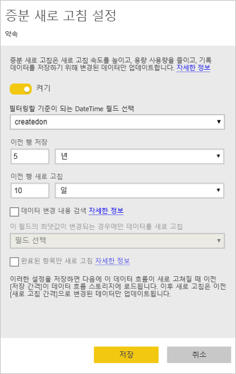
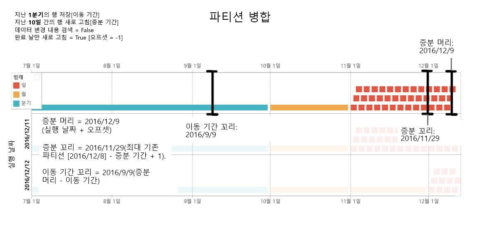
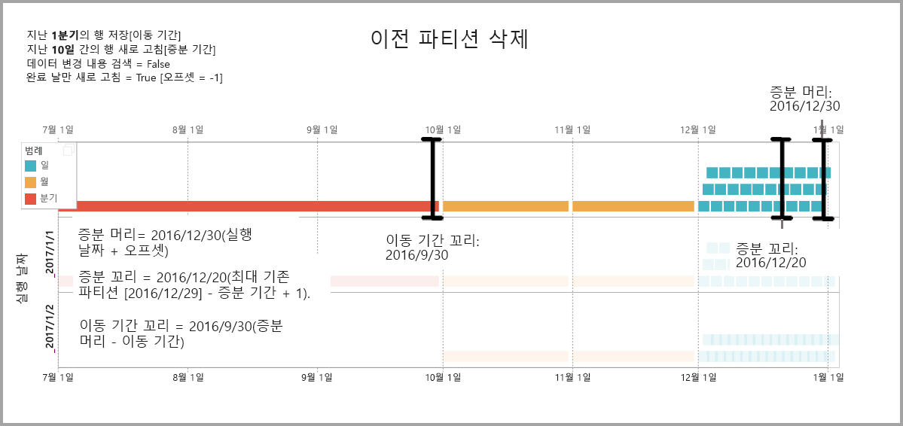
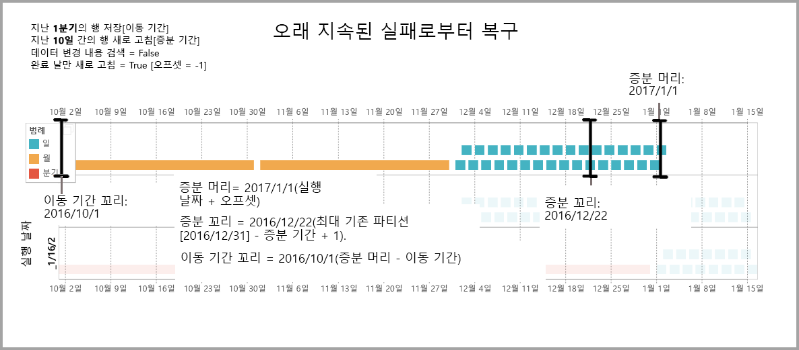

# Power BI 데이터 흐름에 증분 새로 고침 사용(미리 보기)

데이터 흐름을 사용하면 Power BI로 대량의 데이터를 가져와 매력적인 보고서와 분석을 만들 수 있습니다. 그러나 새로 고침을 수행할 때마다 원본 데이터의 전체 복사본을 업데이트하는 것이 실용적이지 않은 경우도 있습니다. 이 경우 **증분 새로 고침**이 좋은 대안이 될 수 있습니다. 증분 새로 고침은 데이터 흐름에 다음과 같은 이점을 제공합니다.

* **새로 고침이 더 빠르게 수행됨** - 변경된 데이터만 새로 고쳐야 합니다. 예를 들어 10년 데이터 흐름의 마지막 5일만 새로 고칩니다.
* **새로 고침이 더 안정적임** - 예를 들어 휘발성 원본 시스템에 대한 장기 실행 연결을 유지할 필요가 없습니다.
* **리소스 사용을 줄여줌** - 새로 고칠 데이터가 적어지므로 메모리 및 기타 리소스 사용을 전반적으로 줄여줍니다.

Power BI 데이터 흐름에 증분 새로 고침을 사용하려면 데이터 흐름이 상주하는 작업 영역이 실행할 [프리미엄 용량](service-premium.md)에 있어야 하며 데이터 흐름으로 수집되는 데이터 원본에 증분 새로 고침이 필터링할 수 있는 ‘날짜/시간’ 필드가 있어야 합니다. 

## 데이터 흐름에 대한 증분 새로 고침 구성

데이터 흐름에는 여러 엔터티가 포함될 수 있습니다. 증분 새로 고침은 엔터티 수준에서 설정되므로 하나의 데이터 흐름에 완전히 새로 고침되는 엔터티와 증분 새로 고침되는 엔터티가 모두 포함될 수 있습니다.

증분 새로 고침되는 엔터티를 설정하려면 다른 엔터티와 마찬가지로 엔터티를 구성하여 시작합니다. 데이터 흐름 설정에 대한 자세한 내용은 [Power BI의 셀프 서비스 데이터 준비(미리 보기)](service-dataflows-overview.md)를 참조하세요.

데이터 흐름을 만들고 저장한 경우 다음 이미지에 표시된 대로 엔터티 보기에서 **증분 새로 고침** 아이콘을 선택합니다.

아이콘을 클릭하면 **증분 새로 고침 설정** 창이 나타납니다. 증분 새로 고침을 **켜기** 위치로 토글하면 증분 새로 고침을 구성할 수 있습니다.

다음 목록에는 **증분 새로 고침 설정** 창의 설정이 설명되어 있습니다. 

1. **증분 새로 고침 켜기/끄기 토글** - 이 슬라이더는 엔터티에 대한 증분 새로 고침 정책 켜기/끄기를 토글합니다.
2. **필터 필드 드롭다운** - 증분에 적용할 엔터티를 필터링할 쿼리 필드를 선택합니다. 이 필드에는 *날짜/시간* 필드만 포함됩니다. 엔터티에 *날짜/시간* 필드가 없는 경우 증분 새로 고침을 사용할 수 없습니다.
3. **이전 행 저장** - 아래 예는 다음 몇 가지 설정을 설명하는 데 도움이 됩니다.

    여기 예에서는 전체적으로 5년 동안의 데이터를 저장하고, 10일 분량의 데이터를 증분 새로 고침하는 새로 고침 정책을 정의합니다. 엔터티를 매일 새로 고치는 경우 새로 고침 작업마다 다음을 수행합니다.

    * 새 날짜의 데이터를 추가합니다.
    * 현재 날짜까지 10일을 새로 고칩니다.
    * 현재 날짜에서 5년을 초과하는 오래된 역년을 삭제합니다. 예를 들어 현재 날짜가 2019년 1월 1일이면 2013년이 제거됩니다.

    첫 번째 데이터 흐름 새로 고침은 5년 동안의 데이터를 모두 가져오는 데 어느 정도 시간이 걸릴 수 있으나 후속 새로 고침은 최초 새로 고침 시간보다 아주 짧은 시간 안에 완료될 가능성이 큽니다.

4. **데이터 변경 내용 검색** - 10일 증분 새로 고침은 5년 전체 새로 고침보다 훨씬 더 효율적이지만 10일 증분 새로 고침보다 더 효율적으로 새로 고침을 수행할 수도 있습니다. **데이터 변경 내용 검색** 확인란을 선택하면 데이터가 변경된 날짜만 식별하여 새로 고치도록 날짜/시간 열을 선택할 수 있습니다. 여기서는 이러한 열이 일반적으로 감사 목적으로 원본 시스템에 있다고 가정합니다. 이 열의 최댓값은 증분 범위의 각 기간에 대해 계산됩니다. 해당 데이터가 마지막 새로 고침 이후 변경되지 않은 경우 기간을 새로 고칠 필요가 없습니다. 예를 들어 이 경우에는 증분 새로 고침되는 기간(일)을 10에서 2로 더 줄일 수 있습니다.

> [!TIP]
> 현재 설계에서는 데이터 변경 내용을 검색하는 열을 유지하고 메모리에 캐시해야 합니다. 카디널리티 및 메모리 사용을 줄이려면 다음 기술 중 하나를 사용하는 것이 좋을 수 있습니다.
>
>    * 파워 쿼리 함수를 사용하여 새로 고침 시간에 이 열의 최댓값만 유지합니다.
>    * 새로 고침 빈도 요구 사항에 따라 허용되는 수준으로 전체 자릿수를 줄입니다.

5. **완료 기간만 새로 고침** - 새로 고침이 매일 오전 4시에 실행되도록 예약되어 있다고 가정하겠습니다. 당일 처음 네 시간 동안의 데이터가 원본 시스템에 표시되는 경우 이러한 데이터는 고려하지 않으려 할 수 있습니다. 석유 및 가스 산업의 일일 배럴과 같은 일부 비즈니스 메트릭에서 하루 미만의 일정 시간을 기준으로 고려하는 것은 비실용적이며 비합리적입니다.

    완료 기간만 새로 고침하는 것이 적합한 또 다른 예로는 재무 시스템의 데이터 새로 고침이 있습니다. 이전 달의 데이터가 이번달 12일에 승인되는 재무 시스템이 있다고 가정해 보겠습니다. 증분 범위를 1개월로 설정하고, 새로 고침이 다음 월의 12일에 실행되도록 예약할 수 있습니다. 이 옵션을 선택하면 2월 12일에 1월 데이터(가장 최근의 완료된 월별 기간)를 새로 고칩니다.

> [!NOTE]
> 데이터 흐름 증분 새로 고침은 다음과 같은 논리에 따라 날짜를 결정합니다. 새로 고침이 예약되면 데이터 흐름에 대한 증분 새로 고침은 새로 고침 정책에 정의된 표준 시간대를 사용합니다. 새로 고침 일정이 없는 경우 증분 새로 고침은 새로 고침을 실행하는 머신의 시간을 사용합니다.

## 증분 새로 고침 쿼리

증분 새로 고침이 구성되면 데이터 흐름에서 자동으로 날짜별 필터를 포함하도록 쿼리를 변경합니다. 자동 생성된 쿼리를 **고급 파워 쿼리 편집기**로 편집하여 새로 고침을 미세 조정하거나 사용자 지정할 수 있습니다. 다음 섹션에서 증분 새로 고침과 이 기능이 작동하는 방식을 자세히 알아보세요.

## 증분 새로 고침과 연결된 엔터티 및 계산된 엔터티

‘연결된’ 엔터티의 경우 증분 새로 고침은 원본 엔터티를 업데이트합니다. 연결된 엔터티는 단지 원래 엔터티에 대한 포인터이므로 증분 새로 고침이 연결된 엔터티에 영향을 주지 않습니다. 원본 엔터티를 해당하는 정의된 새로 고침 정책에 따라 새로 고치는 경우 모든 연결된 엔터티는 원본의 데이터를 새로 고치는 것으로 가정합니다.

‘계산된’ 엔터티는 데이터 저장소에서 실행되는 쿼리를 기반으로 하므로 다른 데이터 흐름일 수 있습니다. 따라서 계산된 엔터티는 연결된 엔터티와 동일한 방식으로 작동합니다.

계산된 엔터티와 연결된 엔터티는 유사한 방식으로 작동하므로 두 엔터티의 요구 사항과 구성 단계는 동일합니다. 한 가지 차이점은 계산된 엔터티의 경우 파티션이 빌드되는 방식으로 인해 특정 구성에서는 최적화된 방식으로 증분 새로 고침을 실행할 수 없다는 점입니다. 

## 증분 및 전체 새로 고침 간 변경

데이터 흐름에서는 증분 및 전체 새로 고침 간 새로 고침 정책 변경을 지원합니다. 전체에서 증분 새로 고침 방향으로 또는 증분에서 전체 새로 고침 방향으로 변경이 일어나면 해당 변경은 다음 새로 고침 이후 데이터 흐름에 영향을 줍니다.

전체 새로 고침에서 증분으로 데이터 흐름을 이동하는 경우 새로운 새로 고침 논리가 증분 새로 고침 설정에 정의된 대로 새로 고침 기간 및 증분에 맞춰 데이터 흐름을 업데이트합니다.

증분에서 전체 새로 고침으로 데이터 흐름을 이동하는 경우 전체 새로 고침에 정의된 정책에 따라 증분 새로 고침에 누적된 모든 데이터를 덮어씁니다. 사용자가 이 작업을 승인해야 합니다.

## 데이터 흐름 증분 새로 고침 및 데이터 세트

데이터 흐름 증분 새로 고침과 데이터 세트 증분 새로 고침은 함께 수행되도록 설계되었습니다. 증분 새로 고침한 데이터 흐름의 엔터티를 데이터 세트에 완전하게 로드할 수도 있고 완전하게 로드된 데이터 흐름의 엔터티를 데이터 세트에 증분 방식으로 로드할 수도 있습니다. 

새로 고침 설정에 지정된 정의에 따라 두 가지 접근 방식이 모두 지원됩니다.
증분 새로 고침에 대한 자세한 내용은 [Power BI Premium의 증분 새로 고침](service-premium-incremental-refresh.md)을 참조하세요.

## 증분 새로 고침의 표준 시간대 지원

데이터 흐름 증분 새로 고침은 실행되는 시간에 따라 달라집니다. 쿼리 필터링은 실행되는 날에 따라 달라집니다.

이러한 종속성을 수용하고 데이터 일관성이 보장되도록 데이터 흐름에 대한 증분 새로 고침에서는 ‘지금 새로 고침’ 시나리오에 대해 다음과 같은 경험적 접근을 구현합니다.

* 예약된 새로 고침이 시스템에 정의된 경우 - 증분 새로 고침에서 일정 새로 고침의 표준 시간대 설정을 사용합니다. 이렇게 하면 데이터 흐름을 새로 고치는 사용자가 속한 표준 시간대와 상관없이 항상 시스템 정의와 일관됩니다.

* 일정 새로 고침이 정의되지 않은 경우 데이터 흐름은 새로 고치는 사용자 컴퓨터의 표준 시간대를 사용합니다.

증분 새로 고침을 API를 사용하여 호출할 수도 있습니다. 이 경우 API 호출이 새로 고침에 사용되는 표준 시간대 설정을 포함할 수 있습니다. API를 사용하면 테스트 및 유효성 검사에 도움이 될 수 있습니다.

## 증분 새로 고침 구현 세부 정보

데이터 흐름은 증분 새로 고침에 분할을 사용합니다. Power BI Premium용 XMLA 엔드포인트를 사용할 수 있으면 파티션을 표시할 수 있습니다. 데이터 흐름의 증분 새로 고침은 새로 고침 정책 요구 사항을 충족하도록 파티션 수를 최소로 유지합니다. 범위를 벗어나는 이전 파티션을 삭제하여 롤링 창을 유지 관리합니다. 파티션이 선택적으로 병합되어 필요한 총 파티션 수를 줄입니다. 이렇게 하면 압축 기능이 향상되며, 쿼리 성능을 개선할 수 있는 경우도 일부 있습니다.

이 섹션의 예에서는 다음 새로 고침 정책을 공유합니다.

* 지난 1분기의 행 저장
* 지난 10일간의 행 새로 고침
* 데이터 변경 내용 검색 = False
* 완료 날만 새로 고침 = True

### 파티션 병합

이 예에서는 일 파티션이 증분 범위를 벗어나면 자동으로 월 수준으로 병합됩니다. 증분 범위의 파티션이 해당 일만 새로 고치도록 허용하려면 일일 단위로 유지 관리되어야 합니다.
‘실행 날짜 2016/12/11’이 사용된 새로 고침 작업에서는 11월의 일이 증분 범위를 벗어나므로 11월의 일을 병합합니다.

### 이전 파티션 삭제

전체 범위를 벗어나는 이전 파티션은 제거됩니다. ‘실행 날짜 2017/1/2’이 사용된 새로 고침 작업에서 2016년 3분기 파티션은 전체 범위를 벗어나므로 2016년 3분기 파티션을 삭제합니다.

### 오래 지속된 실패로부터 복구

이 예에서는 시스템이 오래 지속된 실패로부터 원활하게 복구하는 방법을 시뮬레이션합니다. 데이터 원본 자격 증명이 만료되어 새로 고침이 성공적으로 실행되지 않았으며 이 문제를 해결하는 데 13일이 걸린다고 가정해 보겠습니다. 증분 범위는 단 10일입니다.

‘실행 날짜 2017/1/15’이 사용된 다음 새로 고침 작업이 성공하려면 누락된 13일을 다시 채워 새로 고침을 수행해야 합니다. 이전 9일도 정상 일정에서 새로 고치지 않았으므로 해당 9일도 새로 고쳐야 합니다. 즉, 증분 범위가 10일에서 22일로 증가합니다.

‘실행 날짜 2017/1/16’이 사용된 다음 새로 고침 작업은 12월의 일과 2016년 4분기의 월을 병합합니다.

## 다음 단계

이 문서에는 데이터 흐름에 대한 증분 새로 고침이 설명되어 있습니다. 다음은 몇 가지 유용한 추가 문서입니다.

* [데이터 흐름을 사용하여 셀프 서비스 데이터 준비](service-dataflows-overview.md)
* [Power BI에서 데이터 흐름 만들기 및 사용](service-dataflows-create-use.md)
* [온-프레미스 데이터 원본으로 만든 데이터 흐름 사용(미리 보기)](service-dataflows-on-premises-gateways.md)
* [Power BI 데이터 흐름에 사용할 수 있는 개발자 리소스(미리 보기)](service-dataflows-developer-resources.md)

파워 쿼리 및 예약된 새로 고침에 대한 자세한 내용은 다음 문서를 참조하세요.
* [Power BI Desktop을 사용한 쿼리 개요](desktop-query-overview.md)
* [예약된 새로 고침 구성](refresh-scheduled-refresh.md)

공통 데이터 모델에 대한 자세한 내용은 해당 개요 문서를 참조할 수 있습니다.
* [공통 데이터 모델 - 개요 ](https://docs.microsoft.com/powerapps/common-data-model/overview)

