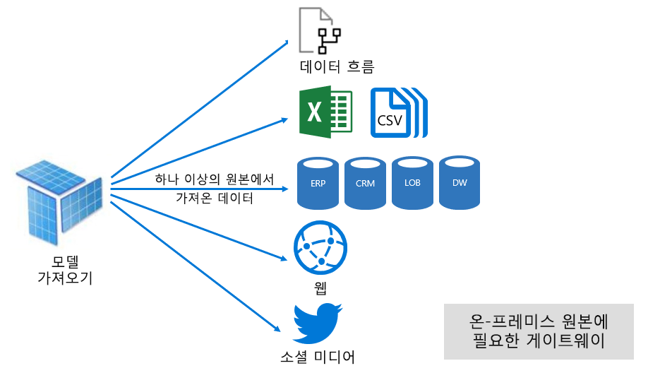

# Power BI 서비스의 데이터 세트 모드

이 문서에서는 Power BI 데이터 세트 모드에 대한 기술적 설명을 제공합니다. 외부 호스트형 Analysis Services 모델에 대한 라이브 연결을 나타내는 데이터 세트와 Power BI Desktop에서 개발된 모델에 적용됩니다. 이 문서에서는 각 모드의 이론적 배경 그리고 Power BI 용량 리소스에 미치는 영향을 강조합니다.

세 가지 데이터 세트 모드는 다음과 같습니다.

- [가져오기](#import-mode)
- [DirectQuery](#directquery-mode)
- [복합](#composite-mode)

## 가져오기 모드

_가져오기_ 모드는 모델을 개발하는 데 가장 일반적으로 사용되는 모드입니다. 이 모드는 메모리 내 쿼리 덕분에 매우 빠른 성능을 자랑합니다. 또한 모델러에게 디자인 유연성을 제공하고 특정 Power BI 서비스 기능(Q & A, 빠른 인사이트 등)을 지원합니다. 이러한 장점 때문에 새 Power BI Desktop 솔루션을 만들 때 기본 모드입니다.

가져온 데이터가 항상 디스크에 저장된다는 것을 이해하는 것이 중요합니다. 쿼리하거나 새로 고칠 때 데이터는 Power BI 용량의 메모리로 완전히 로드되어야 합니다. 메모리에 로드된 상태에서는 가져오기 모델이 매우 빠른 쿼리 결과를 달성할 수 있습니다. 또한 메모리에 부분적으로 로드되는 가져오기 모델의 개념은 없다는 것을 이해하는 것도 중요합니다.

데이터를 새로 고치면 VertiPaq 스토리지 엔진에서 데이터를 압축하고 최적화한 다음 디스크에 저장합니다. 디스크에서 메모리로 로드할 때 10배 압축까지 가능합니다. 따라서 크기가 10GB인 원본 데이터가 약 1GB로 압축될 수 있다고 예측하는 것이 합리적입니다. 디스크의 스토리지 크기는 압축된 크기에서 20% 줄일 수 있습니다. (크기 차이는 Power BI Desktop 파일 크기를 파일의 작업 관리자 메모리 사용량과 비교하여 결정됩니다.)

디자인 유연성은 세 가지 방법으로 구현할 수 있습니다. 데이터 모델러는

- 데이터 원본 유형 또는 형식에 관계없이 데이터 흐름 및 외부 데이터 원본에서 데이터를 캐시하여 데이터를 통합할 수 있습니다.
- 데이터 준비 쿼리를 만들 때 전체 [파워 쿼리 수식 언어](/powerquery-m/)(비공식적으로 M이라고 함) 함수를 활용할 수 있습니다.
- 비즈니스 논리를 사용하여 모델을 향상시킬 때 전체 [DAX(Data Analysis Expressions)](/dax/) 함수를 활용할 수 있습니다. 계산 열, 계산 테이블 및 측정값이 지원됩니다.

다음 그림에 표시된 것처럼 가져오기 모델은 지원되는 데이터 원본 유형의 개수에 관계없이 데이터를 통합할 수 있습니다.

그러나 가져오기 모델과 관련된 뛰어난 장점이 있는 반면 단점도 존재합니다.

- Power BI가 모델을 쿼리할 수 있으려면 먼저 전체 모델이 메모리에 로드되어야 합니다. 이 때문에, 특히 가져오기 모델의 수와 크기가 증가함에 따라 사용 가능한 용량 리소스에 압박이 생길 수 있습니다.
- 모델 데이터는 마지막 새로 고침을 기준으로만 최신 상태이므로 일반적으로 가져오기 모델을 정기적으로 새로 고쳐야 합니다.
- 전체 새로 고침은 모든 테이블에서 모든 데이터를 제거하고 데이터 원본에서 다시 로드합니다. 이 작업은 Power BI 서비스와 데이터 원본에 대한 시간 및 리소스 측면에서 비용이 많이 들 수 있습니다.

    > [!NOTE]
    > Power BI는 전체 테이블을 자르고 다시 로드할 필요 없이 증분 새로 고침을 수행할 수 있습니다. 그러나 이 기능은 데이터 세트가 프리미엄 용량 작업 영역에서 호스트되는 경우에만 지원됩니다. 자세한 내용은 [Power BI Premium의 증분 새로 고침](service-premium-incremental-refresh.md)을 참조하세요.

Power BI 서비스 리소스 관점에서 가져오기 모델에는 다음이 필요합니다.

- 쿼리하거나 새로 고칠 때 모델을 로드하는 데 충분한 메모리
- 데이터 새로 고침을 위한 처리 리소스 및 추가 메모리

## DirectQuery 모드

_DirectQuery_ 모드는 가져오기 모드의 대안입니다. DirectQuery 모드로 개발된 모델은 데이터를 가져오지 않습니다. 대신, 모델 구조를 정의하는 메타 데이터로만 구성됩니다. 모델을 쿼리하면 기본 쿼리를 사용하여 기본 데이터 원본에서 데이터를 검색합니다.

DirectQuery 모델 개발을 고려해야 하는 두 가지 주요 이유는 다음과 같습니다.

- 데이터 볼륨이 너무 커서 [데이터 감소 방법](guidance/import-modeling-data-reduction.md)을 적용하더라도 모델에 로드하거나 실질적으로 새로 고칠 수 없는 경우
- 보고서 및 대시보드가 "근 실시간" 데이터를 제공해야 하는데 예약된 새로 고침 제한 내에서 이를 달성할 수 없는 경우 (예약된 새로 고침 제한은 공유 용량에 대해 하루에 8번, 프리미엄 용량의 경우 48번입니다.)

DirectQuery 모델과 관련하여 다음과 같은 몇 가지 이점이 있습니다.

- 가져오기 모델 크기 제한이 적용되지 않습니다.
- 모델 새로 고침이 필요하지 않습니다.
- 보고서 사용자는 보고서 필터 및 슬라이서와 상호 작용할 때 최신 데이터를 볼 수 있습니다. 또한 보고서 사용자는 전체 보고서를 새로 고쳐 현재 데이터를 검색할 수 있습니다.
- [자동 페이지 새로 고침](desktop-automatic-page-refresh.md) 기능을 사용하여 실시간 보고서를 개발할 수 있습니다.
- DirectQuery 모델을 기반으로 하는 대시보드 타일은 15분 마다 자동으로 업데이트될 수 있습니다.

그러나 다음과 같이 DirectQuery 모델과 관련된 단점 및 제한 사항이 다수 있습니다.

- 모델은 지원되는 데이터 원본 하나를 기반으로 해야 합니다. 이 때문에 데이터 원본에서 이미 데이터 통합이 수행되어야 하는 것입니다. 지원되는 데이터 원본은 널리 사용되는 많은 데이터 저장소를 지원하는 관계형 및 분석 시스템입니다.

    > [!TIP]
    > 많은 Microsoft 데이터 원본이 지원됩니다. Microsoft 데이터 원본에는 SQL Server, Azure Data Brick, Azure HDInsight Spark(베타), Azure SQL Database 및 Azure SQL Data Warehouse가 포함됩니다. 자세한 내용은 [Power BI의 직접 쿼리에서 지원하는 데이터 원본](desktop-directquery-data-sources.md)을 참조하세요.

- 성능이 저하될 수 있으며, Power BI 서비스에 부정적인 영향을 미칠 수 있습니다. 이 문제는 일부 쿼리가 Power BI 서비스를 위해 CPU를 많이 사용하기 때문에 발생할 수 있습니다. 데이터 원본이 Power BI에서 전송하는 쿼리에 대해 최적화되지 않았기 때문일 수도 있습니다.
- 파워 쿼리 쿼리는 폴딩 가능해야 합니다. 이 요구 사항은 파워 쿼리 논리가 지나치게 복잡하면 안 됨을 의미합니다. 또한 논리는 데이터 원본에서 인식하는 기본 쿼리로 바뀔 수 있는 M 식 및 함수를 사용하도록 제한되어야 합니다.
- DAX 수식은 데이터 원본에서 인식하는 기본 쿼리로 바뀔 수 있는 함수만 사용하도록 제한됩니다. 또한 계산 테이블이나 DAX 시간 인텔리전스 함수는 지원되지 않습니다.
- 100만 개를 초과하는 행을 검색해야 하는 모델 쿼리는 실패합니다.
- 여러 시각적 개체가 포함된 보고서 및 대시보드는 특히 데이터 원본이 일시적인 경우 일관되지 않은 결과를 표시할 수 있습니다.
- Q&A 및 빠른 인사이트 기능은 지원되지 않습니다.

Power BI 서비스 리소스 관점에서 DirectQuery 모델에는 다음이 필요합니다.

- 쿼리 시 모델(메타데이터만 해당)을 로드하기 위한 최소 메모리
- 경우에 따라 Power BI 서비스는 데이터 원본에 전송되는 쿼리를 생성하고 처리하는 데 상당한 프로세서 리소스를 사용해야 합니다. 이러한 상황이 발생하면, 특히 동시 사용자가 모델을 쿼리하는 경우, 처리량에 영향을 줄 수 있습니다.

자세한 내용은 [Power BI Desktop에서 직접 쿼리 사용](desktop-use-directquery.md)을 참조하세요.

## 복합 모델

_복합_ 모드에서는 가져오기 모드와 DirectQuery 모드를 혼합하거나 여러 DirectQuery 데이터 원본을 통합할 수 있습니다. 복합 모드에서 개발된 모델은 각 모델 테이블에 대해 스토리지 모드를 구성하는 기능을 지원합니다. 이 모드는 계산 테이블(DAX로 정의됨)도 지원합니다.

테이블 스토리지 모드를 가져오기, DirectQuery 또는 이중으로 구성할 수 있습니다. 이중 스토리지 모드로 구성된 테이블은 가져오기 모드인 동시에 DirectQuery 모드이며, 이 설정을 사용하면 Power BI 서비스가 쿼리마다 가장 효율적인 모드를 결정할 수 있습니다.

복합 모델은 가져오기 및 DirectQuery 중에서 가장 적합한 모드를 제공합니다. 적절하게 구성하면 메모리 내 모델의 뛰어난 쿼리 성능을 데이터 원본에서 거의 실시간으로 데이터를 검색하는 기능과 결합할 수 있습니다.

복합 모델을 개발하는 데이터 모델러는 가져오기 또는 이중 스토리지 모드에서 차원 유형 테이블을 구성하고 DirectQuery 모드에서 팩트 유형 테이블을 구성할 수 있습니다. 모델 테이블 역할에 대한 자세한 내용은 [Power BI의 별모양 스키마 및 중요도 이해](guidance/star-schema.md)를 참조하세요.

예를 들어 이중 모드의 **제품** 차원 유형 테이블 및 DirectQuery 모드의 **판매** 팩트 유형 테이블을 포함하는 모델이 있다고 가정해 보겠습니다. **제품** 테이블을 메모리 내에서 효율적이 고 신속하게 쿼리하여 보고서 슬라이서를 렌더링할 수 있습니다. **판매** 테이블은 관련 **제품** 테이블을 사용하여 DirectQuery 모드에서 쿼리할 수도 있습니다. 후자의 쿼리를 사용하면 **제품** 테이블과 **판매** 테이블을 조인하는 효율적인 단일 기본 SQL 쿼리를 생성하고 슬라이서 값을 기준으로 필터링할 수 있습니다.

일반적으로 복합 모델의 경우 각 테이블이 구성된 방식에 따라 가져오기 및 DirectQuery와 관련된 장점과 단점이 있습니다.

자세한 내용은 [Power BI Desktop에서 복합 모델 사용](desktop-composite-models.md)을 참조하세요.

## 다음 단계

- [Power BI 서비스의 데이터 세트](service-dataset-modes-understand.md)
- [Power BI Desktop의 스토리지 모드](desktop-storage-mode.md)
- [Power BI의 DirectQuery 사용](desktop-directquery-about.md)
- [Power BI Desktop에서 복합 모델 사용](desktop-composite-models.md)
- 궁금한 점이 더 있나요? [Power BI 커뮤니티에 질문합니다.](https://community.powerbi.com/)
