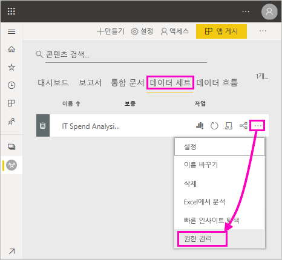
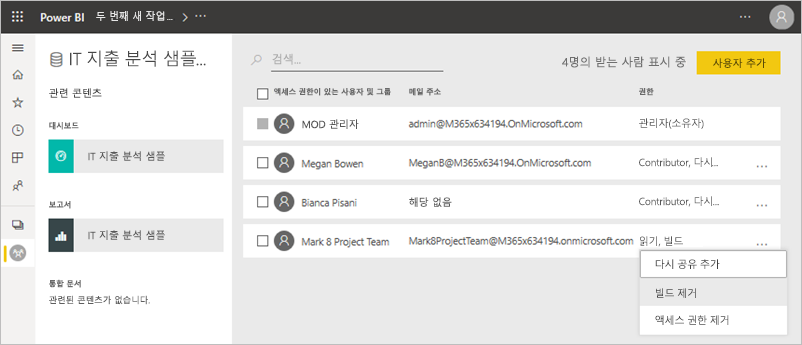
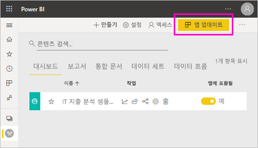
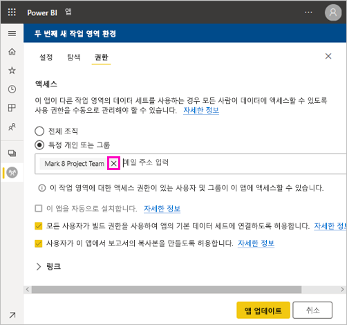
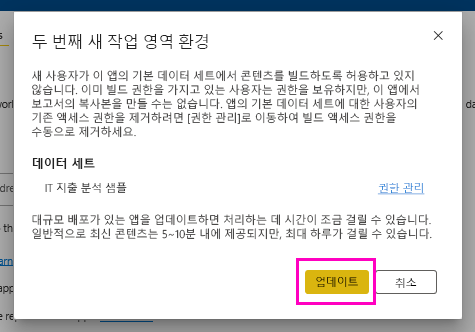

# 공유 데이터 세트에 대한 빌드 권한(미리 보기)

Power BI Desktop의 *데이터 모델* 작성자는 Power BI 서비스에서 *데이터 세트*로 공유할 수 있습니다. 그런 다음, 보고서 작성자는 공유한 데이터 세트를 쉽게 검색하고 다시 사용할 수 있습니다. 빌드 권한을 사용하여 해당 데이터에 액세스할 수 있는 사용자를 제어하는 방법에 대해 알아봅니다.

빌드 권한은 데이터 세트에만 관련이 있습니다. 사용자에게 빌드 권한을 부여하면 해당 사용자는 보고서, 대시보드, Q&A의 고정된 타일 및 Insights Discovery와 같은 데이터 세트에 새로운 콘텐츠를 빌드할 수 있습니다. Excel에서 분석을 통한 Excel 시트, XMLA 및 기본 데이터 내보내기와 같이 Power BI 외부의 데이터 세트를 기반으로 새 콘텐츠를 빌드할 수도 있습니다.

## 빌드 권한을 부여하는 방법

데이터 세트에 대한 빌드 권한을 부여하는 방법은 여러 가지가 있습니다.

- 참가자 역할 이상이 지정된 작업 영역의 구성원은 해당 작업 영역에서 데이터 세트 빌드 권한과 보고서 복사 권한이 자동으로 부여됩니다.
 
- 데이터 세트가 있는 작업 영역의 멤버는 권한 센터의 특정 사용자 또는 보안 그룹에 권한을 할당할 수 있습니다. 작업 영역의 구성원인 경우 데이터 세트 옆에 있는 줄임표(...) > **권한 관리**를 선택합니다.

    

    그러면 권한을 설정하고 변경할 수 있는 해당 데이터 세트에 대한 권한 센터가 열립니다.

    

- 데이터 세트가 상주하는 작업 영역의 관리자 또는 멤버는 앱 게시 중에 앱에 대한 사용 권한이 있는 사용자에게도 기본 데이터 세트에 대한 빌드 권한을 부여할 수 있습니다. 자세한 내용은 [데이터 세트 공유](service-datasets-share.md)를 참조하세요.

- 데이터 세트에 대한 공유 및 빌드 권한이 있다고 가정합니다. 해당 데이터 세트에서 빌드된 보고서 또는 대시보드를 공유할 때 수신자가 기본 데이터 세트에 대한 빌드 권한도 갖도록 지정할 수 있습니다.

    

개인의 데이터 세트 빌드 권한을 제거할 수 있습니다. 이렇게 하면 공유 데이터 세트를 기반으로 빌드된 보고서를 계속 볼 수 있지만 더 이상 편집할 수는 없습니다. 자세한 내용은 다음 섹션을 참조하세요.

## 데이터 세트에 대한 빌드 권한 제거

특정 시점에 공유 데이터 세트의 일부 사용자에 대한 빌드 권한을 제거해야 할 수 있습니다. 

1. 작업 영역에서 **데이터 세트** 목록 페이지로 이동합니다. 
1. 데이터 세트 옆에 있는 줄임표(...) > **권한 관리**를 선택합니다.

    

1. 이름 옆에 있는 줄임표(...) > **빌드 제거**를 선택합니다.

    

    해당 사용자가 공유 데이터 세트에서 빌드된 보고서를 계속 볼 수 있지만 더 이상 편집할 수는 없습니다.

### 앱에서 데이터 세트에 대한 빌드 권한 제거

작업 영역에서 사용자 그룹으로 앱을 배포했다고 가정합니다. 나중에 일부 사용자의 앱 액세스 권한을 제거하기로 결정했습니다. 앱에 대한 액세스 권한을 제거해도 해당 빌드 및 다시 공유 권한이 자동으로 제거되지 않습니다. 추가 단계가 있습니다. 

1. 작업 영역 목록 페이지에서 **앱 업데이트**를 선택합니다. 

    

1. **권한** 탭에서 **X**를 선택하여 개인 또는 그룹을 삭제합니다. 

    
1. **업데이트**를 선택합니다.

    기존 액세스 권한이 있는 사용자의 빌드 권한을 제거하려면 **권한 관리**로 이동해야 함을 설명하는 메시지가 표시됩니다. 

    

1. **업데이트**를 선택합니다.

1. 작업 영역에서 **데이터 세트** 목록 페이지로 이동합니다. 
1. 데이터 세트 옆에 있는 줄임표(...) > **권한 관리**를 선택합니다.

    

1. 이름 옆에 있는 줄임표(...) > **빌드 제거**를 선택합니다.

    

    해당 사용자가 공유 데이터 세트에서 빌드된 보고서를 계속 볼 수 있지만 더 이상 편집할 수는 없습니다.

## 보다 세부적인 사용 권한

Power BI는 기존 권한인 읽기 및 재공유를 보완하기 위해 2019년 6월에 빌드 권한을 도입했습니다. 그 당시에 앱 사용 권한, 공유 또는 작업 영역 액세스를 통해 이미 데이터 세트에 대한 읽기 권한이 있었던 모든 사용자도 동일한 데이터 세트에 대한 빌드 권한을 갖게 되었습니다. 읽기 권한은 이미 Excel 또는 내보내기의 분석을 사용하여 데이터 세트 위에 새 콘텐츠를 빌드할 수 있는 권한을 부여했기 때문에 자동으로 빌드 권한이 부여됩니다.

보다 세분화된 빌드 권한을 통해 기존 보고서나 대시보드의 콘텐츠만 볼 수 있는 사용자와 기본 데이터 세트에 연결된 콘텐츠를 만들 수 있는 사용자를 선택할 수 있습니다.

데이터 세트가 데이터 세트 작업 영역 외부의 보고서에서 사용되고 있는 경우 해당 데이터 세트를 삭제할 수 없습니다. 대신 오류 메시지가 표시됩니다.

빌드 권한을 제거할 수 있습니다. 이렇게 하면 권한을 해지한 사용자는 여전히 보고서를 볼 수 있지만 더 이상 보고서를 편집하거나 기본 데이터를 내보낼 수는 없습니다. 읽기 권한만 있는 사용자도 여전히 요약된 데이터를 내보낼 수 있습니다. 

## 다음 단계

- [작업 영역에서 데이터 세트 사용(미리 보기)](service-datasets-across-workspaces.md)
- 궁금한 점이 더 있나요? [Power BI 커뮤니티에 질문합니다.](http://community.powerbi.com/)
