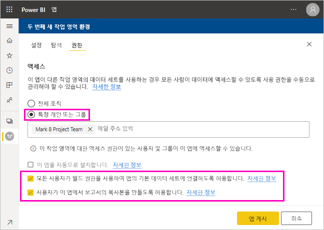

# 데이터 세트 공유(미리 보기)

Power BI Desktop에서 *데이터 모델*의 작성자로서 Power BI 서비스에서 배포할 수 있는 *데이터 세트*를 만듭니다. 그러면 다른 보고서 작성자가 이 데이터 세트를 자체 보고서의 기준으로 사용할 수 있습니다. 이 문서에서는 데이터 세트를 공유하는 방법을 알아봅니다. 공유 데이터 세트에 대한 액세스 권한을 부여하고 제거하는 방법에 대한 자세한 내용은 [빌드 권한](service-datasets-build-permissions.md)을 참조하세요.

## 데이터 세트 공유 단계

1. 먼저 Power BI Desktop에서 데이터 모델을 사용하여 .pbix 파일을 만듭니다. 이 데이터 세트를 다른 사용자에게 제공하여 보고서를 빌드할 계획이라면 .pbix 파일에서 보고서를 디자인하지 않을 수도 있습니다.

    .pbix 파일을 Office 365 그룹에 저장하는 것이 가장 좋습니다.

1. .pbix 파일을 Power BI 서비스의 [새 환경 작업 영역](service-create-the-new-workspaces.md)에 게시합니다.
    
    이미 이 작업 영역의 다른 멤버는 이 데이터 세트를 기반으로 다른 작업 영역에서 보고서를 만들 수 있습니다.

1. 이 작업 영역에서 [앱을 게시](service-create-distribute-apps.md)할 수도 있습니다. 이렇게 하면 **권한** 페이지에서 권한이 있는 사용자와 수행할 수 있는 사용자를 지정할 수 있습니다.

    > [!NOTE]
    > **전체 조직**을 선택하면 조직 내 어느 누구도 빌드 권한을 갖지 못합니다. 이 문제는 이미 알려져 있습니다. 대신 **특정 개인 또는 그룹**에 이메일 주소를 지정합니다.  전체 조직에 빌드 권한을 부여하려면 전체 조직에 대한 이메일 별칭을 지정합니다.

    

1. 이미 게시된 경우 **앱 게시**를 선택하거나 **앱 업데이트**를 선택합니다.

## 데이터 세트 사용 현황 추적

작업 영역에 공유 데이터 세트가 있는 경우 다른 작업 영역의 보고서가 이를 기반으로 하는지를 알아야 할 수 있습니다.

1. 데이터 세트 목록 보기에서 **관련 항목 보기**를 선택합니다.

    

1. **관련 콘텐츠** 대화 상자에 모든 관련 항목이 표시됩니다. 이 목록에는 이 작업 영역 및 **기타 작업 영역**에서 관련 항목이 표시됩니다.
 
    

## 다음 단계

- [작업 영역에서 데이터 세트 사용(미리 보기)](service-datasets-across-workspaces.md)
- 궁금한 점이 더 있나요? [Power BI 커뮤니티에 질문합니다.](http://community.powerbi.com/)
