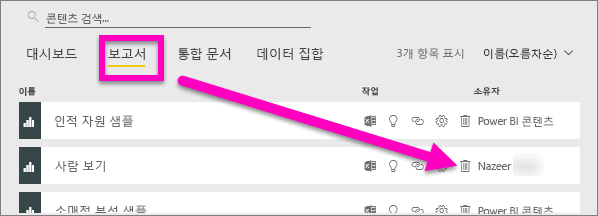
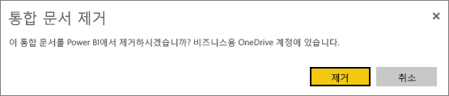
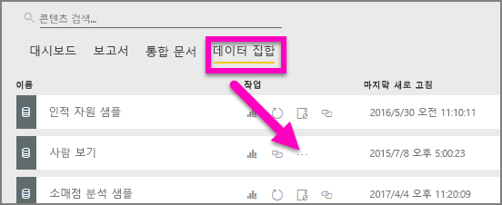
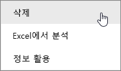
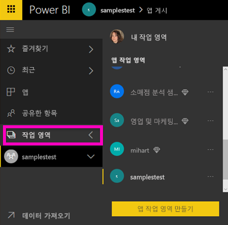
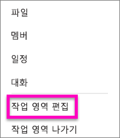
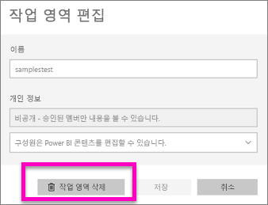
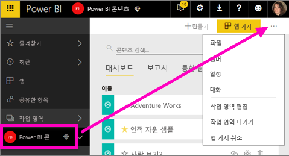
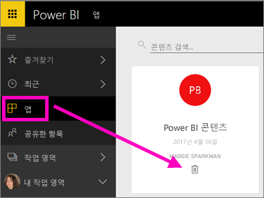

# Power BI 서비스에서 거의 모든 요소 삭제
이 문서에서는 Power BI 서비스에서 대시보드, 보고서, 통합 문서, 데이터 세트, 앱, 시각화 및 작업 영역을 삭제하는 방법을 안내합니다.

## 대시보드 삭제
대시보드를 제거할 수 있습니다. 대시보드를 제거해도 기본 데이터 세트 또는 해당 대시보드와 연결된 보고서가 삭제되지 않습니다.

* 대시보드의 소유자인 경우 대시보드를 제거할 수 있습니다. 동료와 대시보드를 공유한 경우 Power BI 작업 영역에서 대시보드를 제거하면 동료의 Power BI 작업 영역에서 해당 대시보드가 제거됩니다.
* 대시보드가 공유되지만 더 이상 보고 싶지 않은 경우 제거할 수 있습니다.  대시보드를 제거해도 다른 사람의 Power BI 작업 영역에서는 제거되지 않습니다.
* 대시보드가 [조직 콘텐츠 팩](service-organizational-content-pack-disconnect.md)에 포함된 경우 제거하는 유일한 방법은 연결된 데이터 세트를 제거하는 것입니다.

### 대시보드를 삭제하려면
1. 작업 영역에서 **대시보드** 탭을 선택합니다.
2. 삭제할 대시보드를 찾은 후 삭제 아이콘 을 선택합니다. .

    

## 보고서 삭제
보고서를 삭제한다고 해서 보고서의 기반이 되는 데이터 세트가 삭제되는 것은 아니므로 염려하지 마세요.  보고서에서 고정한 모든 시각화 역시 안전하며 개별적으로 삭제할 때까지 대시보드에 남아 있습니다.

### 보고서를 삭제하려면
1. 내 작업 영역에서 **보고서** 탭을 선택합니다.
2. 삭제할 보고서를 찾은 후 삭제 아이콘을 선택합니다.   .   

    
3. 삭제를 확인합니다.

   

   > [!NOTE]
   > 보고서가 [콘텐츠 팩](service-organizational-content-pack-introduction.md)의 일부인 경우 이 방법으로 삭제할 수 없습니다.  [조직 콘텐츠 팩에 대한 연결 제거](service-organizational-content-pack-disconnect.md)를 참조하세요.
   >
   >

## 통합 문서 삭제
통합 문서를 제거할 수 있습니다. 그러나 통합 문서를 제거하면 이 통합 문서의 데이터가 포함된 모든 보고서와 대시보드 타일이 제거됩니다.

통합이 비즈니스용 OneDrive에 저장되어 있을 경우 Power BI에서 삭제해도 OneDrive에서 삭제되지는 않습니다.

### 통합 문서를 삭제하려면
1. 내 작업 영역에서 **통합 문서** 탭을 선택합니다.
2. 삭제할 통합 문서를 찾은 후 삭제 아이콘을 선택합니다.  아이콘.

    
3. 삭제를 확인합니다.

   

## 데이터 세트 삭제
데이터 세트를 삭제할 수 있습니다. 그러나 데이터 세트를 삭제하면 해당 데이터 세트의 데이터가 포함된 모든 보고서와 대시보드 타일도 삭제됩니다.

데이터 세트가 하나 이상의 [조직 콘텐츠 팩](service-organizational-content-pack-disconnect.md)에 속해 있는 경우 삭제하는 유일한 방법은 사용 중인 콘텐츠 팩에서 제거하는 것입니다. 따라서 처리될 때까지 기다린 후 다시 삭제를 시도해 보세요.

### 데이터 세트에서 삭제하려면
1. 작업 영역에서 **데이터 세트** 탭을 선택합니다.
2. 삭제할 데이터 세트를 찾고 줄임표(...)를 선택합니다.  

    
3. 드롭다운 목록에서 **삭제**를 선택합니다.

   
4. 삭제를 확인합니다.

   

## 앱 작업 영역 삭제
> [!WARNING]
> 앱 작업 영역을 만들 때 Office 365 그룹을 만듭니다. 앱 작업 영역을 삭제할 때 해당 Office 365 그룹을 삭제합니다. 즉, 그룹은 SharePoint 및 Microsoft 팀과 같은 다른 O365 제품에서도 삭제됩니다.
>
>

앱 작업 영역 작성자는 삭제할 수 있습니다. 삭제하면 모든 그룹 구성원에 대해 연결된 앱도 삭제되며 해당 앱을 조직 전체에 게시한 경우 AppSource에서 제거됩니다. 앱 작업 영역을 삭제하는 것은 앱 작업 영역에서 나가는 것과는 다릅니다.

### 앱 작업 영역을 삭제하려면(관리자인 경우)
1. 탐색 창에서 **작업 영역**을 선택합니다.

    
2. 삭제할 보고서 오른쪽의 줄임표(...)를 선택한 후 **작업 영역 편집**을 선택합니다.

   
3. **작업 영역 편집** 창에서 **작업 영역 삭제** > **삭제**를 선택합니다.

    

### 목록에서 한 앱 작업 영역을 제거하려면
더 이상 앱 작업 영역의 구성원이 되고 싶지 않을 경우 해당 작업 영역에서 ***나가면*** 목록에서 제거됩니다. 작업 영역에서 나가면 다른 모든 작업 영역 구성원은 그대로 유지됩니다.  

> [!IMPORTANT]
> Power BI에서 해당 앱 작업 영역의 유일한 관리자는 나갈 수 없습니다.
>
>

1. 제거하려는 앱 작업 영역에서 시작합니다.
2. 오른쪽 위의 모서리에서 줄임표(...)를 선택하고 **작업 영역 나가기** > **나가기**를 선택합니다.

      

   > [!NOTE]
   > 드롭다운에 표시되는 옵션은 해당 앱 작업 영역의 관리자 또는 구성원인지에 따라 다릅니다.
   >
   >

## 앱 삭제 또는 제거
앱은 앱 목록 페이지에서 쉽게 제거할 수 있습니다. 하지만 앱 관리자만 앱을 영구 삭제할 수 있습니다.

### 앱 목록 페이지에서 앱 제거
앱 목록 페이지에서 앱을 삭제해도 다른 구성원에 대한 앱은 삭제되지 않습니다.

1. 왼쪽 탐색 창에서 **앱**을 선택하여 앱 목록 페이지를 엽니다.
2. 삭제할 앱에 마우스를 올려 놓은 후 삭제 아이콘 을 선택합니다.

   

   실수로 앱을 제거할 경우 복구할 수 있는 몇 가지 옵션이 있습니다.  앱 작성자에게 다시 보내달라고 요청하거나, 앱 링크가 포함된 메일 원본을 찾거나 [알림 센터](service-notification-center.md)를 확인하여 해당 앱에 대한 알림이 목록에 남아 있는지 살펴보거나 [조직의 AppSource](consumer/end-user-apps.md)를 확인할 수 있습니다.

## 고려 사항 및 문제 해결
이 문서는 Power BI 서비스의 주요 구성 요소를 삭제하는 방법을 소개했습니다. 그러나 Power BI에서 삭제할 수 있는 몇 가지가 더 있습니다.  

* [주요 대시보드 제거](service-dashboard-featured.md)
* [대시보드 제거(즐겨찾기 해제)](service-dashboard-favorite.md)
* [보고서 페이지 삭제](service-delete.md)
* [대시보드 타일 삭제](service-dashboard-edit-tile.md)
* [보고서 시각화 삭제](service-delete.md)

궁금한 점이 더 있나요? [Power BI 커뮤니티를 이용하세요.](http://community.powerbi.com/)
