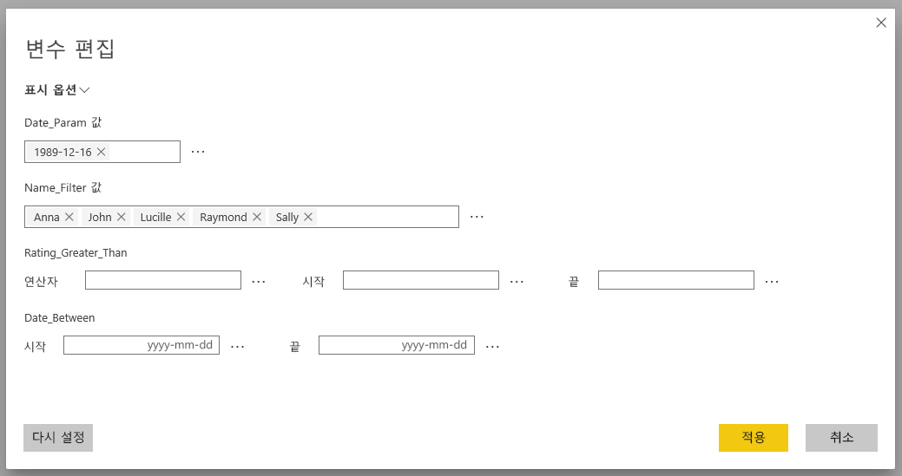
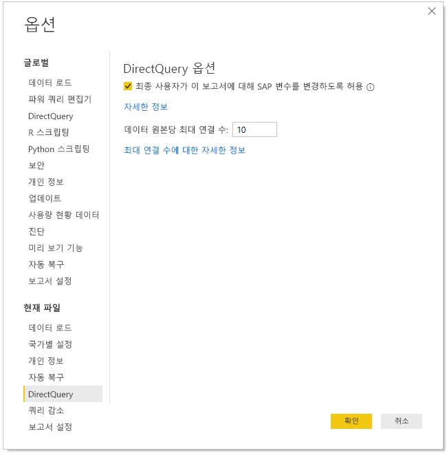
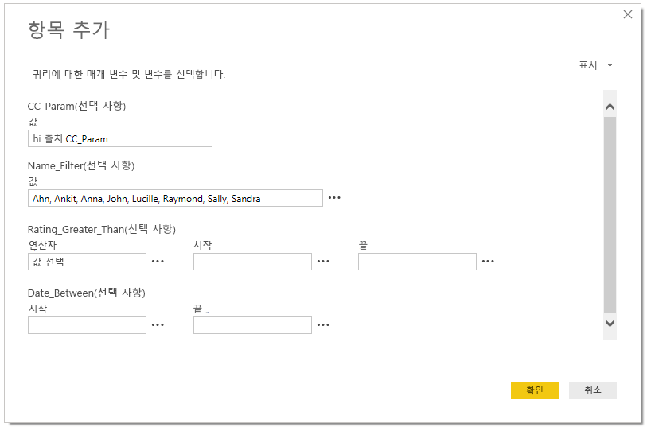
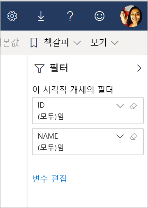

# Power BI 서비스에서 SAP 변수 편집

DirectQuery와 함께 SAP Business Warehouse 또는 SAP HANA를 사용하는 경우, 이제 보고서 작성자는 최종 사용자가 프리미엄 및 공유 작업 영역에 대한 **Power BI 서비스**에서 SAP 변수를 편집하도록 허용할 수 있습니다. 이 기능은 내 작업 영역의 [공유한 항목] 탭에 있는 보고서에 대해 작동하지 않습니다. 

이 문서에서는 Power BI에서 변수를 편집하기 위한 요구 사항, 이 기능을 사용하도록 설정하는 방법 및 Power BI 서비스에서 변수를 편집할 수 있는 위치를 설명합니다.

## SAP 변수 편집을 위한 요구 사항

SAP 변수 편집 기능을 사용하기 위한 몇 가지 요구 사항이 있습니다. 다음 목록에서는 이러한 요구 사항을 설명합니다.

**새 필터 환경 필요** – 보고서에 대해 [새 필터 환경](power-bi-report-filter.md)이 사용하도록 설정되어 있어야 합니다. Power BI Desktop에서 보고서에 대해 이 기능을 사용하도록 설정하는 방법은 다음과 같습니다.
- Power BI Desktop에서 **파일** > **옵션 및 설정** > **옵션**을 선택합니다.
- 탐색 창의 **현재 파일**에서 **보고서 설정**을 선택합니다.
- **필터링 환경**에서 **업데이트된 필터 창 사용**을 선택합니다.

**DirectQuery 연결 필요** - DirectQuery를 사용하여 SAP 데이터 원본에 연결해야 합니다. 가져오기 연결은 지원되지 않습니다.

**SSO 설치 필요** - 이 기능이 작동하려면 SSO(Single Sign-On)를 구성해야 합니다. 자세한 내용은 [SSO(Single Sign-On) 개요](service-gateway-sso-overview.md)를 참조하세요.

**새 게이트웨이 비트 필요** - 최신 게이트웨이를 다운로드하고 기존 게이트웨이를 업데이트합니다. 자세한 내용은 [서비스 게이트웨이](service-gateway-onprem.md)를 참조하세요.

**SAP HANA의 경우 다차원에만 해당** - SAP HANA의 경우 SAP 변수 편집 기능은 다차원 모델에서만 작동하고 관계형 원본에서는 작동하지 않습니다.

**소버린 클라우드에서 지원되지 않음** - 현재 파워 쿼리 온라인은 소버린 클라우드에서 사용할 수 없으므로, 이 기능도 소버린 클라우드에서 지원되지 않습니다.

## 기능을 사용하도록 설정하는 방법

**SAP 변수 편집** 기능을 사용하도록 설정하려면 Power BI Desktop에서 SAP HANA 또는 SAP BW 데이터 원본에 연결합니다. **파일 > 옵션 및 설정 > 옵션**으로 이동한 다음, 왼쪽 창의 현재 파일 섹션에서 **DirectQuery**를 선택합니다. 이 항목을 선택하면 오른쪽 창에 DirectQuery 옵션이 표시되고, 다음 그림과 같이 **최종 사용자가 보고서에서 SAP 변수를 변경하도록 허용** 확인란이 표시됩니다.

## Power BI Desktop에서 SAP 변수 편집 사용

Power BI Desktop에서 SAP 변수 편집을 사용하는 경우, 리본의 **쿼리 편집** 메뉴에서 변수 편집 링크를 선택하여 변수를 편집할 수 있습니다. 여기에서 다음과 같은 대화 상자가 나타납니다. 이 기능은 오래전부터 Power BI Desktop에서 사용할 수 있었습니다. 보고서 작성자는 다음 대화 상자를 사용하여 보고서의 변수를 선택할 수 있습니다.

## 서비스에서 SAP 변수 편집 사용

보고서가 Power BI 서비스에 게시되면, 사용자는 새 필터 창에서 **변수 편집** 링크를 볼 수 있습니다. 처음으로 보고서를 게시하는 경우 변수 편집 링크가 표시되기까지 최대 5분이 걸릴 수 있습니다. 링크가 표시되지 않으면 데이터 세트를 수동으로 새로 고쳐야 합니다.
이렇게 하려면 다음을 수행합니다.

1. Power BI 서비스의 작업 영역 콘텐츠 목록에서 **데이터 세트** 탭을 선택합니다.

2. 새로 고쳐야 하는 데이터 세트를 찾은 다음, **새로 고침** 아이콘을 선택합니다.

    

3. 변수 편집 링크를 선택하면 사용자가 변수를 재정의할 수 있는 **변수 편집** 대화 상자가 나타납니다. **다시 설정** 단추를 선택하면 이 대화 상자를 열었을 때 표시된 원래 값으로 변수가 다시 설정됩니다.

    

4. **변수 편집** 대화 상자의 변경 내용은 이 사용자에 대해서만 유지됩니다(Power BI의 다른 지속성 동작과 비슷함). 다음 그림에 표시된 **기본값으로 다시 설정**을 선택하면, 변수를 포함하여 보고서 작성자의 원래 상태로 보고서가 다시 설정됩니다.

    

**변수 편집** 기능이 사용하도록 설정된 SAP HANA 또는 SAP BW를 사용하는 Power BI 서비스에서 게시된 보고서를 작업하는 경우, 보고서 소유자는 해당 기본값을 변경할 수 있습니다. 보고서 소유자는 편집 모드에서 변수를 변경하고 보고서를 저장하여 해당 설정을 보고서의 *새 기본 설정*으로 사용할 수 있습니다. 보고서 소유자가 이러한 변경을 수행한 후에 보고서에 액세스하는 다른 모든 사용자에게는 새 설정이 기본값으로 표시됩니다.

## 다음 단계

SAP HANA, SAP BW 또는 DirectQuery에 대한 자세한 내용은 다음 문서를 참조하세요.

- [Power BI Desktop에서 SAP HANA 사용](desktop-sap-hana.md)
- [DirectQuery 및 SAP BW(Business Warehouse)](desktop-directquery-sap-bw.md)
- [DirectQuery 및 SAP HANA](desktop-directquery-sap-hana.md)
- [Power BI의 DirectQuery 사용](desktop-directquery-about.md)
