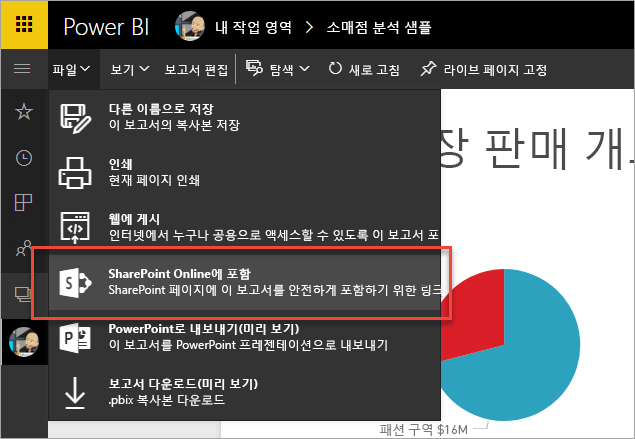
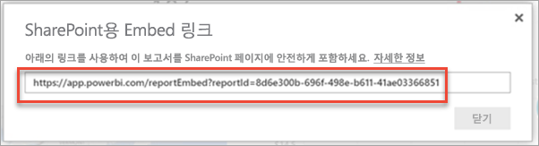
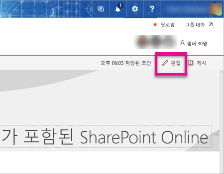
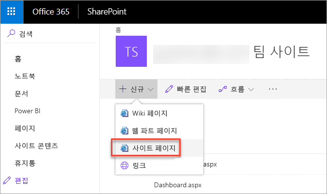
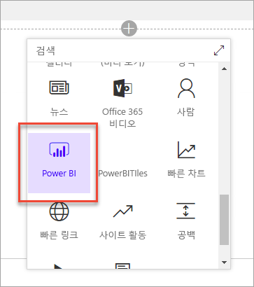
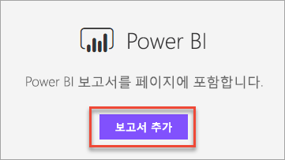
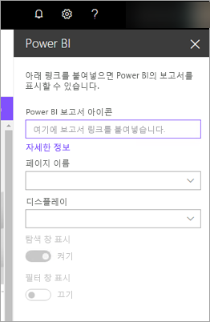
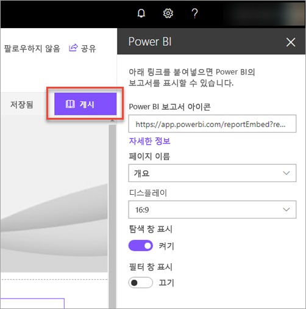
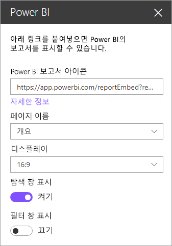
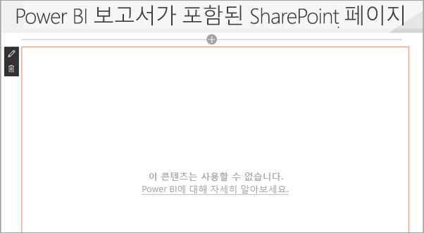

# SharePoint Online에 보고서 웹 파트 포함

SharePoint Online용 Power BI의 새로운 보고서 웹 파트를 사용하면 SharePoint Online 페이지에서 대화형 Power BI 보고서를 쉽게 포함시킬 수 있습니다.

새로운 **SharePoint Online에 포함** 옵션을 사용하는 경우 포함된 보고서는 매우 안전해져 안전한 내부 포털을 쉽게 만들 수 있습니다.

## 요구 사항

**SharePoint Online에 포함** 보고서가 작동하도록 하면 몇 가지 요구 사항이 있습니다.

* SharePoint Online용 Power BI 웹 파트는 [최신 페이지](https://support.office.com/article/Allow-or-prevent-creation-of-modern-site-pages-by-end-users-c41d9cc8-c5c0-46b4-8b87-ea66abc6e63b)가 필요합니다.

## 보고서 포함

SharePoint Online에 보고서를 포함하려면, 먼저 보고서의 URL을 가져온 다음에 SharePoint Online 내의 새로운 Power BI 웹 파트로 해당 URL을 사용합니다.

### URL를 보고서로 가져오기

1. Power BI 서비스에서 보고서를 봅니다.

2. **파일** 메뉴 항목을 선택합니다.

3. **SharePoint Online에 포함**를 선택합니다.
   
    

4. 대화 상자에서 URL을 복사합니다.

    

   > [!NOTE]
   > 또한 보고서를 볼 때 웹 브라우저의 주소 표시줄에 표시되는 URL을 사용할 수 있습니다. 해당 URL은 현재 보고 있는 보고서 페이지에 포함됩니다. 다른 페이지를 사용하려는 경우 URL에서 보고서 섹션을 제거해야 합니다.

### SharePoint Online 페이지에 Power BI 보고서 추가

1. SharePoint Online에서 원하는 페이지를 열고 **편집**을 선택합니다.

    

    또는 SharePoint Online에서 **+ 새로 만들기**를 선택하여 새 최신 사이트 페이지를 만듭니다.

    

2. **+**를 선택하고 **Power BI** 웹 파트를 선택합니다.

    

3. **앱 보고서**를 선택합니다.

    

4. 속성 창에 보고서 URL을 붙여 넣습니다. 이것이 위의 단계에서 복사한 URL입니다. 보고서가 자동으로 로드됩니다.

    

5. **게시**를 선택하여 변경 사항을 SharePoint Online 사용자가 볼 수 있도록 합니다.

    

## 보고서에 액세스 부여

SharePoint Online에 보고서를 포함시키는 것이 사용자에게 보고서를 볼 수 있는 권한을 자동으로 주는 것은 아닙니다. 보고서를 볼 수 있는 권한은 Power BI 서비스 내에서 설정됩니다.

> [!IMPORTANT]
> Power BI 서비스 내에서 보고서를 볼 수 있는 사람이 누구인지 확인하고 목록에 없는 사람에게 액세스 권한을 부여합니다.

Power BI 서비스 내에서 보고서에 액세스 권한을 부여하는 방법에는 두 가지가 있습니다. SharePoint Online 팀 사이트를 만들기 위해 Office 365 그룹을 사용하는 경우 사용자를 Power BI 서비스 내 앱 작업 영역 그룹의 구성원으로 목록에 나열합니다. 그러면 사용자가 해당 그룹의 콘텐츠를 볼 수 있게 됩니다. 자세한 내용은 [Power BI에서 앱 만들기 및 배포](service-create-distribute-apps.md)를 참조하십시오.

또는 다음을 수행하여 사용자에게 보고서 액세스 권한을 부여할 수 있습니다.

1. 보고서의 타일을 대시보드에 추가합니다.

2. 보고서에 액세스해야 하는 사용자와 대시보드를 공유합니다. 자세한 내용은 [동료 및 다른 사용자와 대시보드 공유](service-share-dashboards.md)를 참조하세요.

## 웹 파트 설정

다음은 SharePoint Online용 Power BI 웹 파트에 필요한 조정할 수 있는 설정에 대한 설명입니다.

| 속성 | 설명 |
| --- | --- |
| 페이지 이름 |웹 파트에 의해 표시되는 기본 페이지를 설정합니다. 드롭다운에서 값을 선택합니다. 페이지가 표시되지 않는 경우는 보고서가 한 페이지이거나 붙여 넣은 URL에 페이지 이름이 포함된 경우입니다. URL에서 보고서 섹션을 제거하여 특정 페이지를 선택합니다. |
| 디스플레이 |보고서를 SharePoint Online 페이지 내에 맞추는 옵션입니다. |
| 탐색 창 표시 |페이지 탐색 창을 표시하거나 숨깁니다. |
| 필터 창 표시 |필터 창을 표시하거나 숨깁니다. |

## Multi-Factor Authentication

Power BI 환경에서 다단계 인증을 사용하여 로그인해야 하는 경우 ID를 확인하기 위해 보안 장치에 로그인하라는 메시지가 나타날 수 있습니다. 이는 다단계 인증을 사용하여 SharePoint Online에 로그인하지 않았지만 Power BI 환경에서 보안 장치에 의해 유효성이 검사된 계정이 필요한 경우 발생합니다.

> [!NOTE]
> 다단계 인증은 아직 Azure Active Directory 2.0으로 지원되지 않습니다. 사용자는 오류라는 내용의 메시지를 받게 됩니다. 사용자가 보안 장치를 사용하여 SharePoint Online에 다시 로그인하면 보고서를 볼 수 있습니다.

## 로드되지 않는 보고서

Power BI 웹 파트 내에서 보고서가 로드되지 않고 다음과 같은 메시지가 표시될 수 있습니다.

*이 콘텐츠는 사용할 수 없습니다.*

이 메시지가 표시되는 데는 일반적으로 두 가지 이유가 있습니다.

1. 보고서에 대한 액세스 권한이 없습니다.
2. 보고서가 삭제되었습니다.

이 문제를 해결하려면 SharePoint Online 페이지의 소유자에게 문의해야 합니다.

## 알려진 문제 및 제한 사항

* **오류: "An error occurred, please try logging out and back in and then revisiting this page.(오류가 발생했습니다. 로그아웃했다가 다시 로그인한 후 이 페이지를 다시 방문하세요.) 관련 ID: 정의되지 않음, http 응답 상태: 400, 서버 오류 코드 10001, 메시지: 누락된 새로 고침 토큰"**
  
  이 오류가 발생한 경우 다음 중 한 가지를 시도하세요.
  
  1. SharePoint에서 로그아웃했다가 다시 로그인합니다. 다시 로그인하기 전에 모든 브라우저 창을 닫아야 합니다.

  2. 사용자 계정에 MFA(Multi-Factor Authentication)이 필요한 경우 다단계 인증 장치(휴대폰 앱, 스마트 카드 등)를 사용하여 SharePoint에 로그인합니다.

* Power BI는 SharePoint Online에서 지원하는 것과 동일한 지역화된 언어를 지원하지 않습니다. 결과적으로 포함된 보고서 내에 적절한 지역화가 표시되지 않을 수 있습니다.

* Internet Explorer 10을 사용하는 경우 문제가 발생할 수 있습니다. [Power BI](service-browser-support.md) 및 [Office 365](https://products.office.com/office-system-requirements#Browsers-section)에 대한 브라우저 지원을 보면 됩니다.

* [national clouds](https://powerbi.microsoft.com/en-us/clouds/)에서는 Power BI 웹 파트를 사용할 수 없습니다. 

## 다음 단계

[최종 사용자의 최신 사이트 페이지 작성 허용 또는 금지](https://support.office.com/article/Allow-or-prevent-creation-of-modern-site-pages-by-end-users-c41d9cc8-c5c0-46b4-8b87-ea66abc6e63b)  
[Power BI에서 앱 만들기 및 배포](service-create-distribute-apps.md)  
[동료 및 다른 사용자와 대시보드 공유](service-share-dashboards.md)  
[Power BI 프리미엄이란?](service-premium.md)  

궁금한 점이 더 있나요? [Power BI 커뮤니티에 질문합니다.](http://community.powerbi.com/) 

