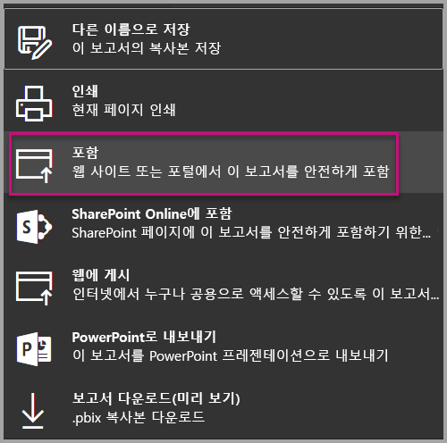
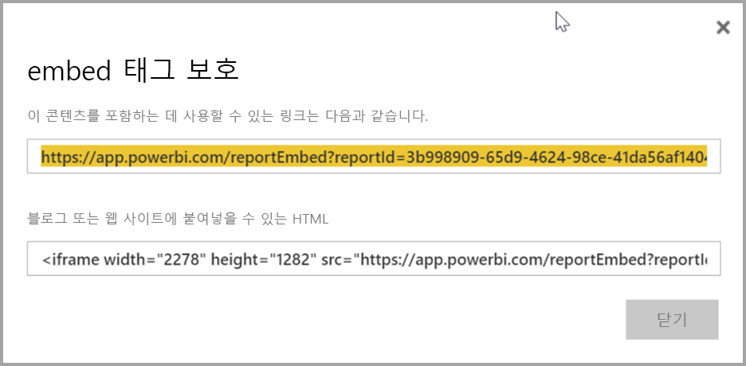
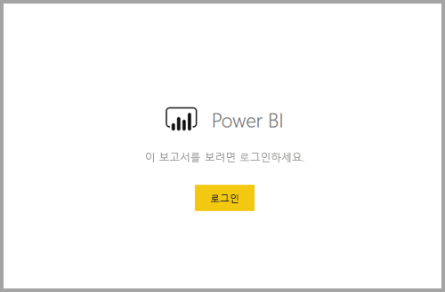
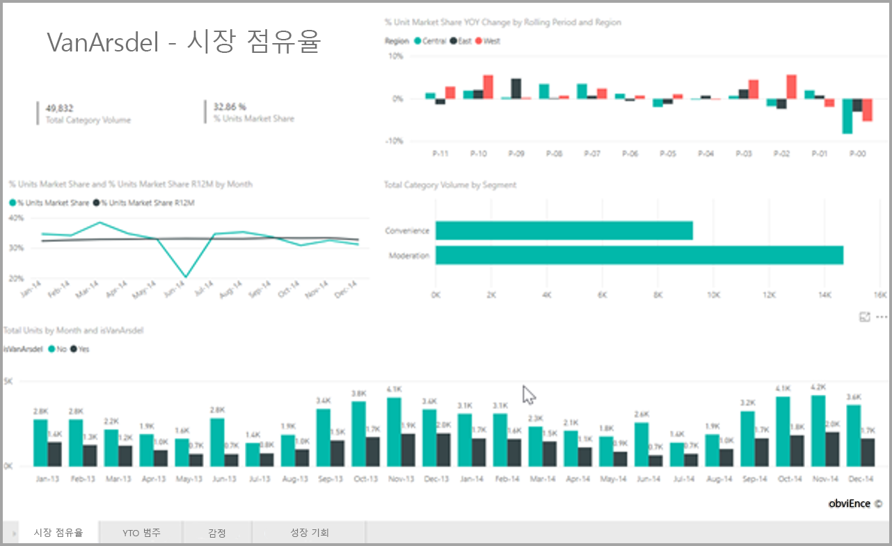

# <a name="embed-a-report-in-a-secure-portal-or-website"></a>보안 포털 또는 웹 사이트에 보고서 포함

Power BI의 보고서에 대한 새롭고 안전한 **포함** 옵션을 통해 사용자는 **클라우드 기반** 또는 **온-프레미스 호스팅** 여부와 무관하게 SharePoint 2019와 같은 내부 웹 포털에 보고서를 쉽고 안전하게 포함할 수 있습니다. 이러한 방식으로 포함된 보고서는 RLS(행 수준 보안)를 통해 모든 항목 사용 권한 및 데이터 보안을 준수합니다. 이 기능은 URL 또는 iFrame의 포함을 허용하는 모든 포털에 대한 코드 없는 포함을 허용하도록 설계되었습니다.

**포함** 옵션은 또한 [URL 필터](service-url-filters.md) 및 URL 설정을 지원합니다. **포함** 옵션을 통해 기본 HTML 및 JavaScript 지식을 필요로 하는 로우 코드 접근 방식을 사용하는 포털과의 통합이 가능합니다.

## <a name="how-to-embed-power-bi-reports-into-portals"></a>Power BI 보고서를 포털에 **포함**하는 방법

1. 새로운 **포함** 옵션은 Power BI 서비스의 보고서에 대한 **파일** 메뉴에서 사용 가능합니다.

    

2. 포함 옵션을 선택하면 보고서를 안전하게 포함하는 데 사용되는 링크와 iFrame을 제공하는 대화 상자가 열립니다.

    

3. URL을 웹 포털에 포함한 이후, 또는 URL을 직접 연 경우 사용자는 보고서에 액세스하기 전에 인증됩니다. 아래에서 사용자는 브라우저 세션에서 Power BI에 로그인하지 않았습니다. 사용자가 **로그인**을 누르면 새 브라우저 창 또는 탭이 열릴 수 있습니다. 로그인 메시지가 표시되지 않는 경우 팝업 차단을 확인하세요.

    

4. 사용자가 로그인한 이후 보고서가 열리고, 데이터가 표시되어 사용자가 페이지 사이를 이동하거나 필터를 설정할 수 있습니다. 보고서는 Power BI에서 보고서를 볼 수 있는 권한을 가진 사용자에게만 표시됩니다. 모든 RLS(행 수준 보안) 규칙 또한 적용됩니다. 마지막으로 사용자는 올바른 사용 허가가 있어야 합니다. 사용자에게 Power BI Pro 라이선스가 필요하거나 보고서가 Power BI Premium 용량 내 작업 영역에 있어야 합니다. 사용자는 새 브라우저 창을 열 때마다 로그인해야 하지만 로그인이 완료된 후에는 보고서가 자동으로 로드됩니다.

    

5. iFrame 옵션을 사용할 때 포털의 웹 페이지에 맞게 원하는 높이 및 너비를 지정하도록 제공된 HTML을 편집하는 것이 좋습니다.

    

## <a name="granting-access-to-reports"></a>보고서에 액세스 부여

포함 옵션은 자동으로 사용자가 보고서를 볼 수 있도록 허용하지 않습니다. 보고서를 볼 수 있는 권한은 Power BI 서비스 내에서 설정됩니다.

Power BI 서비스 내에 있는 보고서에 대한 액세스를 제공하는 방법으로, 포함된 보고서에 대한 액세스가 필요한 사용자와 보고서를 공유할 수 있습니다. Office 365 그룹을 사용하는 경우 Power BI 서비스 내에서 앱 작업 영역의 구성원으로 사용자를 나열할 수 있습니다. 자세한 내용은 [앱 작업 영역을 관리](service-manage-app-workspace-in-power-bi-and-office-365.md)하는 방법을 참조하세요.

## <a name="licensing"></a>라이선싱

포함된 보고서를 보는 사용자는 Power BI Pro 라이선스가 필요하거나, [Power BI Premium 용량(EM 또는 P SKU)](service-admin-premium-purchase.md)에 있는 작업 영역에 있어야 합니다.

## <a name="customize-your-embed-experience-using-url-settings"></a>URL 설정을 사용한 포함 환경 사용자 지정

포함 URL은 사용자 환경 사용자 지정에 도움이 되는 여러 입력 설정을 지원합니다. 제공된 iFrame을 사용하는 경우 iFrame의 src 설정에서 URL을 업데이트해야 합니다.

| 속성  | 설명  |  |  |  |
|--------------|-----------------------------------------------------------------------------------------------------------------------------------------------------------------------------------------------------------------------|---|---|---|
| pageName  | **pageName** 쿼리 문자열 매개 변수를 사용하여 보고서에서 어떤 페이지를 열지 설정할 수 있습니다. **pageName** 값은 Power BI 서비스에 있는 보고서를 볼 때 아래 표시된 것과 같이 보고서 URL의 끝과 일치합니다. |  |  |  |
| URL 필터  | Power BI UI로부터 받은 포함 URL의 [URL 필터](service-url-filters.md)를 사용하여 포함된 내용을 필터링할 수 있습니다. 이러한 방식으로 기본 HTML 및 JavaScript 환경만으로 로우 코드 통합을 빌드할 수 있습니다.  |  |  |  |

## <a name="set-which-page-opens-when-the-report-is-embedded"></a>보고서 포함 시 열리는 페이지 설정

*pageName* 설정에 제공된 값은 Power BI 서비스에서 보고서를 볼 때 보고서 URL의 끝과 일치합니다.

1. 웹 브라우저에서 Power BI 서비스의 보고서를 연 다음 주소 표시줄에서 URL을 복사합니다.

    

2. *pageName* 설정을 URL에 추가합니다.

    

## <a name="filter-report-content-using-url-filters"></a>URL 필터를 사용하여 보고서 내용 필터링

일부 고급 기능의 경우 [URL 필터](service-url-filters.md)를 통해 보고서를 사용하여 더 많은 환경을 빌드할 수 있습니다. 예를 들어 아래 URL은 보고서를 필터링하여 에너지 산업에 대한 데이터를 표시합니다.

**pageName** 및 [URL 필터](service-url-filters.md)의 조합은 강력할 수 있습니다. 기본 HTML 및 JavaScript를 사용하여 환경을 빌드할 수 있습니다.

예를 들어 HTML 페이지에 대한 단추를 추가할 수 있습니다.

```html
<button class="textLarge" onclick='show("ReportSection", "Energy");' style="display: inline-block;">Show Energy</button>
```

단추를 누르면 iFrame을 업데이트된 URL로 업데이트하는 기능이 호출됩니다. 여기에는 에너지 산업에 대한 필터가 포함됩니다.

```javascript
function show(pageName, filterValue)

{

var newUrl = baseUrl + "&pageName=" + pageName;

if(null != filterValue && "" != filterValue)

{

newUrl += "&$filter=Industries/Industry eq '" + filterValue + "'";

}

//Assumes there’s an iFrame on the page with id=”iFrame”

var report = document.getElementById("iFrame")

report.src = newUrl;

}
```


원하는 만큼 단추를 추가하여 로우 코드 사용자 지정 환경을 생성할 수 있습니다. 

## <a name="considerations-and-limitations"></a>고려 사항 및 제한 사항

* Azure B2B(Business to Business)를 사용한 외부 게스트 사용자를 지원하지 않습니다.

* 보안 포함은 Power BI 서비스에 게시된 보고서에 대해 작동합니다.

* 사용자는 새 브라우저 창을 열 때마다 보고서를 보려면 로그인해야 합니다.

* 일부 브라우저의 경우, 특히 InPrivate 또는 시크릿 모드를 사용하는 경우 로그인 이후 페이지를 새로 고쳐야 합니다.

* Single Sign-On 환경을 위해 SharePoint Online 옵션의 포함 기능을 사용하거나 [사용자 소유 데이터](developer/embed-sample-for-your-organization.md) 접근 방식을 사용하여 사용자 지정 통합을 빌드합니다. [사용자 소유 데이터](developer/embed-sample-for-your-organization.md)에 대해 자세히 알아보세요.

* **포함** 옵션에 제공되는 자동 인증 기능은 Power BI JavaScript API에서 작동하지 않습니다. Power BI JavaScript API의 경우 포함에 대해 [사용자 소유 데이터](developer/embed-sample-for-your-organization.md) 접근 방식을 사용합니다. [사용자 소유 데이터](developer/embed-sample-for-your-organization.md)에 대해 자세히 알아보세요.

## <a name="next-steps"></a>다음 단계

* [작업 공유 방법](service-how-to-collaborate-distribute-dashboards-reports.md)

* [URL 필터](service-url-filters.md)

* [SharePoint Online 보고서 웹 파트](service-embed-report-spo.md)

* [웹에 게시](service-publish-to-web.md)