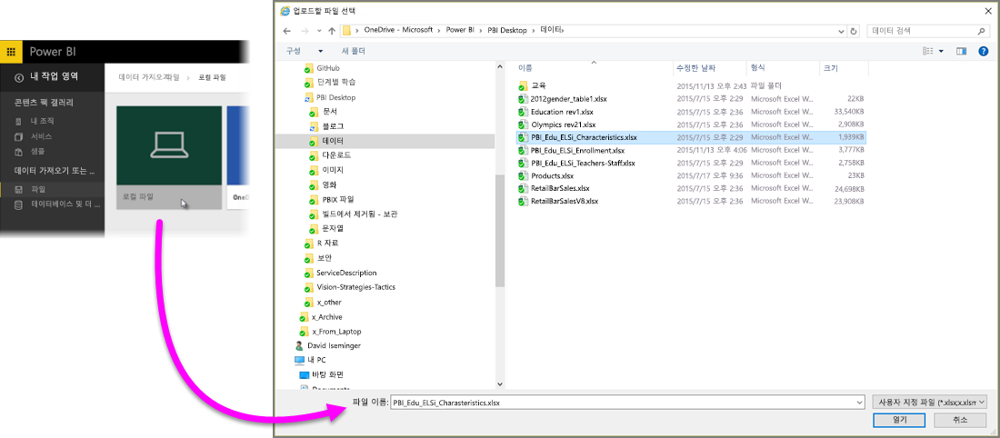
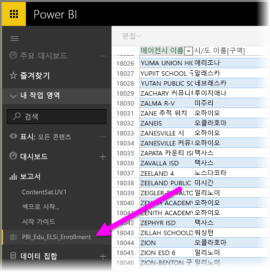

# Excel 통합 문서 파일에서 데이터 가져오기

Microsoft Excel은 가장 널리 사용하는 업무용 애플리케이션 중 하나로서, Power BI로 데이터를 가져오는 가장 일반적인 방법 중 하나이기도 합니다.

## Power BI에서 지원하는 통합 문서 형식
Power BI에서는 Excel 2007 이상에서 만들어진 통합 문서 가져오기 또는 연결을 지원합니다. 통합 문서는 1GB 미만인 .xlsx 또는 .xlsm 파일 형식으로 저장되어야 합니다. 이 문서에서 설명된 일부 기능은 이후 버전의 Excel에서만 사용 가능합니다.

### 데이터 범위 또는 테이블이 포함된 통합 문서
통합 문서에 데이터 범위가 포함된 단순한 워크시트가 있는 경우 Power BI에서 데이터를 최대한 활용하려면 해당 범위를 테이블로 서식 지정해야 합니다. 이러한 방식으로, Power BI에서 보고서를 생성하면 필드 창에서 명명된 테이블과 열을 볼 수 있어 데이터를 훨씬 쉽게 시각화할 수 있습니다.

### 데이터 모델 포함 통합 문서
통합 문서는 연결된 테이블, 파워 쿼리(Excel 2016에서 데이터 가져오기 및 변환) 또는 파워 피벗을 사용하여 로드한 데이터의 하나 이상의 테이블이 있는 데이터 모델을 포함할 수 있습니다. Power BI는 관계, 측정값, 계층 구조 및 KPI 등의 모든 데이터 모델 속성을 지원합니다.

> [!NOTE]
> 데이터 모델을 사용하는 통합 문서는 Power BI 테넌트에서 공유할 수 없습니다. 예를 들어 *contoso.com* 계정으로 Power BI에 로그인하는 사용자는 woodgrovebank.com에서 Power BI 로그인 계정으로 로그인하는 사용자와 Excel 통합 문서를 공유할 수 없습니다. 
> 
> 

### 외부 데이터 소스에 연결된 통합 문서
Excel을 사용하여 외부 데이터 원본에 연결할 경우 통합 문서가 Power BI에 있으면 해당 연결된 데이터 원본에서 데이터에 기반하여 보고서와 대시보드를 만들 수 있습니다. 또한, 예약된 새로 고침을 설정하여 데이터 원본에 바로 자동 연결하고 업데이트를 받을 수 있도 있습니다. 더 이상 Excel의 데이터 리본에서 수동으로 새로 고침할 필요가 없습니다. 해당 데이터 원본의 데이터에 기반한 보고서의 모든 시각화와 대시보드의 타일이 자동으로 업데이트됩니다. 자세한 내용은 [Power BI에서 데이터 새로 고침](refresh-data.md)을 참조하십시오.

### 파워 뷰 시트, 피벗 테이블 및 차트 포함 문서
Power BI에서 파워 뷰 시트와 피벗 테이블 및 차트가 어떻게 나타나는지 또는 나타나지 않을지는 통합 문서가 저장된 위치와 Power BI로 가져오기 위해 선택한 방식에 따라 달라집니다. 아래에서 더 자세히 다루겠습니다.

## 데이터 형식
Power BI는 다음 데이터 형식을 지원합니다. 정수, 10진수 숫자, 통화, 날짜, True/False, 텍스트. Excel에서 데이터를 특정 데이터 형식으로 표시하면 Power BI 환경이 향상됩니다.

## Power BI에 사용할 통합 문서 준비
Power BI에 사용할 통합 문서를 준비하는 방법에 대해 자세히 알아보려면 이 유용한 비디오를 보세요.

<iframe width="500" height="281" src="https://www.youtube.com/embed/l2wy4XgQIu0" frameborder="0" allowfullscreen></iframe>

## 통합 문서 파일의 저장 위치는 중요합니다.
**로컬** - 통합 문서 파일을 사용자 컴퓨터의 로컬 드라이브 또는 조직의 다른 위치에 저장하는 경우 Power BI에서 파일을 Power BI로 로드할 수 있습니다. 파일은 사실 로컬 드라이브에 그대로 남아 있으므로, 전체 파일을 실제로 Power BI로 가져온 것은 아닙니다. 실제로는, 새 데이터 세트가 Power BI에서 만들어지고 통합 문서의 데이터와 데이터 모델(있는 경우) 파일의 데이터가 데이터 세트로 로드되는 것입니다. 통합 문서에 파워 뷰 시트가 있는 경우 해당 시트는 Power BI 사이트의 보고서에 나타납니다. 또한, Excel 2016에는 **게시** 기능(**파일** 메뉴 아래)도 있습니다. **게시**를 사용하면 Power BI에서 **데이터 가져오기 &gt; 파일 &gt; 로컬 파일**을 사용하는 것과 사실상 같지만, 통합 문서를 정기적으로 변경하는 경우에는 Power BI에서 데이터 세트를 업데이트하는 것이 훨씬 더 쉽습니다.

**OneDrive - 비즈니스** – 비즈니스용 OneDrive가 있고 Power BI에 로그인하는 같은 계정으로 로그인할 경우 Excel의 작업과 Power BI의 데이터 세트, 보고서 그리고 대시보드의 동기화를 유지하는 가장 효율적인 방법입니다. Power BI와 OneDrive가 클라우드에 있으므로 Power BI는 매시간 OneDrive의 통합 문서 파일에 연결합니다.  변경 내용이 발견되면 데이터 세트, 보고서 및 대시보드가 Power BI에서 자동으로 업데이트됩니다. 통합 문서를 로컬 드라이브에 저장한 것과 같이 게시를 사용하여 Power BI에서도 데이터 세트와 보고서를 즉시 업데이트할 수 있습니다. 그렇지 않으면, Power BI는 일반적으로 한 시간 이내에 자동으로 동기화합니다.

**OneDrive - 개인** – 본인의 OneDrive 계정으로 통합 문서 파일을 저장할 경우 비즈니스용 OneDrive에 제공하는 것과 동일한 많은 혜택을 누릴 수 있습니다. 가장 큰 차이점은 파일에 처음 연결할 때(‘데이터 가져오기’ > ‘파일’ > ‘OneDrive - 개인’ 사용) Microsoft 계정으로 OneDrive에 로그인해야 한다는 점이 가장 큰 차이점이며, 일반적으로 Power BI에 로그인하기 위해 사용하는 것과는 다릅니다. Microsoft 계정으로 OneDrive에 로그인할 경우 로그인 유지 옵션을 선택해야 합니다. 이러한 방식으로 Power BI는 매시간 통합 문서에 연결할 수 있으며 Power BI의 데이터 세트 및 보고서는 동기화를 유지하게 됩니다.

**SharePoint 팀 사이트** – Power BI Desktop 파일을 SharePoint 팀 사이트에 저장하는 것은 비즈니스용 OneDrive에 저장하는 것과 상당히 같습니다. 가장 큰 차이점은 Power BI에서 파일에 연결하는 방법입니다. URL을 지정하거나 루트 폴더에 연결할 수 있습니다.

## 하나의 Excel 통합 문서로 두 가 지 사용 방법
통합 문서 파일을 **OneDrive**에 저장하는 경우 Power BI에서 데이터를 탐색할 수 있는 여러 방법이 있습니다.

### Power BI로 Excel 데이터 가져오기
**가져오기**를 선택할 경우 테이블에서 지원되는 데이터 및/또는 데이터 모델을 Power BI에서 새로운 데이터 세트로 가져옵니다. 파워 뷰 시트가 있는 경우 Power BI에서 보고서로 다시 생성됩니다.

통합 문서 편집을 계속할 수 있습니다. 변경 내용이 저장되면 일반적으로 한 시간 이내에 Power BI에서 해당 데이터 세트와 동기화됩니다. 더 즉각적인 결과가 필요할 경우 게시를 다시 클릭하면 변경 내용이 즉시 내보내집니다. 보고서에 있는 모든 시각화 및 대시보드도 업데이트됩니다.

데이터 가져오기 및 변환 또는 파워 피벗을 사용하여 데이터 모델로 데이터를 로드했거나 통합 문서에 Power BI에서 보려고 하는 시각화가 있는 파워 뷰 시트가 있을 경우 이 옵션을 선택합니다.

Excel 2016에는 게시 > 내보내기를 사용할 수도 있습니다. 유사한 사항이 꽤 많습니다. 자세한 내용은 [Excel 2016에서 게시](service-publish-from-excel.md)를 참조하세요.

### Power BI에서 Excel 연결, 관리 및 보기
**연결**을 선택하면 통합 문서가 Excel Online에서와 같이 Power BI에 나타납니다. 하지만, Excel Online과는 달리 통합 문서의 요소를 대시보드에 고정하는 데 도움이 되는 몇 가지 훌륭한 기능이 제공됩니다.

Power BI에서는 통합 문서를 편집할 수 없습니다. 하지만 일부 내용을 변경해야 할 경우 편집을 클릭한 다음 Excel Online에서 통합 문서를 편집하거나 컴퓨터의 Excel에서 열어볼 수 있습니다. 적용한 모든 변경 내용이 OneDrive의 통합 문서에 저장됩니다.

이 방법을 선택하면 Power BI가 연결된 통합 문서에 해당하는 데이터 세트를 만듭니다. 필요한 경우 이 데이터 세트를 사용하여 Power BI 보고서를 만들 수 있습니다. 통합 문서는 보고서 아래의 Power BI 작업 영역 탐색 창에도 나타납니다. 연결된 통합 문서에는 특별한 Excel 아이콘이 있습니다.

워크시트에 데이터만 있거나 대시보드에 고정하려는 범위, 피벗 테이블 및 차트가 있는 경우 이 옵션을 선택합니다.

Excel 2016에서는 게시 > 업로드를 사용할 수도 있습니다. 유사한 사항이 꽤 많습니다. 자세한 내용은 [Excel 2016에서 게시](service-publish-from-excel.md)를 참조하세요.

## Power BI에서 Excel 통합 문서로 가져오기 또는 연결
1. Power BI의 탐색 창에서 **데이터 가져오기**를 클릭합니다.
   
   
2. 파일에서 **가져오기**를 클릭합니다.
   
   
3. 파일을 찾습니다.
   
   
4. 통합 문서가 OneDrive 또는 SharePoint - 팀 사이트에 있는 경우 **가져오기** 또는 **연결**을 선택합니다.

## 로컬 Excel 통합 문서
로컬 Excel 파일을 사용하고 Power BI로 업로드할 수도 있습니다. 단순히 이전 메뉴에서 **로컬 파일**을 선택한 다음 저장된 Excel 통합 문서가 있는 위치로 이동합니다.

선택하면 Power BI에 파일을 업로드하도록 선택합니다.

통합 문서를 업로드하면 통합 문서가 준비되었다는 알림을 받게 됩니다.

통합 문서가 준비되면 Power BI의 **보고서** 섹션에서 찾을 수 있습니다.

## Excel 2016에서 Power BI 사이트에 게시
Excel 2016에서 **Power BI에 게시** 기능을 사용하면 파일을 가져오거나 연결하기 위해 Power BI에서 **데이터 가져오기**를 사용하는 것과 사실상 같습니다. 여기서 자세히 다루지는 않겠지만 자세한 내용은 [Excel 2016에서 Power BI에 게시](service-publish-from-excel.md)를 참조하세요.

## 문제 해결
통합 문서 파일이 너무 큰가요? [Power BI에서 보기 위해 Excel 통합 문서 크기 줄이기](reduce-the-size-of-an-excel-workbook.md)를 확인하세요.

현재 가져오기를 선택할 때 Power BI는 명명된 표 또는 데이터 모델에 포함된 데이터만 가져옵니다. 결과적으로 통합 문서에 명명된 테이블, 파워 뷰 시트 또는 Excel 데이터 모델이 포함되지 않은 경우 다음 오류가 표시될 수 있습니다. **“Excel 통합 문서에서 데이터를 찾을 수 없습니다.”** . [이 문서](service-admin-troubleshoot-excel-workbook-data.md)에서는 통합 문서를 수정하고 다시 가져오는 방법을 설명합니다.

## 다음 단계
**데이터 탐색** - 파일에서 Power BI로 데이터 및 보고서를 가져오면 이제 살펴볼 차례입니다. 새 데이터 세트를 마우스 오른쪽 단추로 클릭한 다음, 탐색을 클릭합니다. 4단계에서 OneDrive의 통합 문서 파일에 연결하는 경우 통합 문서는 보고서에 나타납니다. 클릭하면 마치 Excel Online에서와 같이 Power BI에서 열립니다.

**새로 고침 예약** - Excel 통합 문서 파일이 외부 데이터 원본에 연결하거나 로컬 드라이브에서 가져온 경우 데이터 세트 또는 보고서가 항상 최신 상태로 업데이트되도록 예약된 새로 고침을 설정할 수 있습니다. 대부분의 경우에 예약된 새로 고침을 설정하는 방법은 아주 쉽지만 이 문서에서는 자세히 다루지 않겠습니다. 자세한 내용은 [Power BI에서 데이터 새로 고침](refresh-data.md)을 참조하세요.

[Excel 2016에서 Power BI로 게시](service-publish-from-excel.md)

[Excel용 Power BI 게시자](publisher-for-excel.md)

[Power BI에서 데이터 새로 고침](refresh-data.md)

