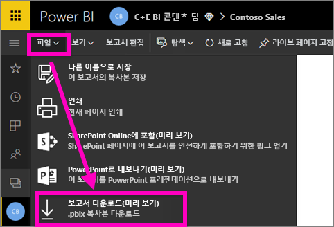
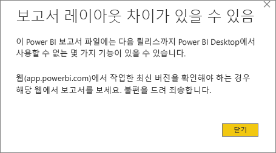
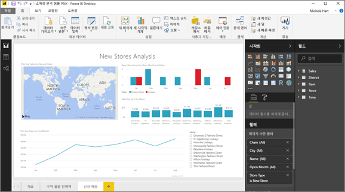

# Power BI 서비스에서 데스크톱에 보고서 내보내기(미리 보기)
Power BI Desktop에서 보고서를 저장하고 **게시**를 선택하여 Power BI 서비스에 보고서를 내보낼(또는 다운로드할) 수 있습니다. 반대 방향으로도 내보내기할 수 있을 뿐 아니라 Power BI 서비스에서 바탕화면으로 보고서를 다운로드할 수 있습니다. 어느 방향으로든 내보내는 파일의 파일 확장명은 *.pbix*입니다.

이 문서의 뒷부분에서 유의해야 할 몇 가지 제한 사항과 고려 사항을 설명합니다.

## .pbix 파일로 보고서 다운로드
.Pbix 파일을 다운로드하려면 다음 단계를 따르세요.

1. **Power BI 서비스**에서 다운로드하려는 보고서를 [편집용 보기](service-reading-view-and-editing-view.md)로 엽니다.
2. 메뉴 모음에서 **파일 > 보고서 다운로드**를 선택합니다.
   
   > [!NOTE]
   > 보고서 다운로드를 가능하게 하려면 2016년 11월 23일 이후(또는 그 이후 업데이트된) 버전의 [Power BI Desktop을 사용하여](guided-learning/publishingandsharing.yml#step-2) 만들었어야 합니다. 그렇지 않으면 Power BI 서비스의 *보고서 다운로드* 메뉴 옵션이 회색으로 표시됩니다.
   > 
   > 
3. .pbix 파일을 만드는 동안 상태 배너가 진행 상태를 표시합니다. 파일이 준비되면 .pbix 파일을 열거나 저장할지 묻는 메시지가 나타납니다. 파일의 이름은 보고서의 제목과 일치합니다.
   
    
   
    이제 Power BI 서비스(app.powerbi.com) 또는 Power BI Desktop에서 .pbix 파일을 여는 옵션이 제공됩니다.     
4. Desktop에서 보고서를 즉시 열려면 **열기**를 선택합니다. 파일을 특정 위치에 저장하려면 **저장 > 다른 이름으로 저장**을 선택합니다. 아직 없는 경우 [Power BI Desktop을 설치](desktop-get-the-desktop.md)합니다.
   
    Desktop에서 보고서를 여는 경우 경고 메시지를 통해 Power BI 서비스 보고서에 사용할 수 있는 일부 기능을 Desktop에서는 사용하지 못할 수 있다는 것을 알 수 있습니다.
   
    

5. Power BI Desktop의 보고서 편집기는 Power BI 서비스의 보고서 편집기와 매우 유사합니다.  
   
    

## 고려 사항 및 문제 해결
Power BI 서비스에서 *.pbix* 파일의 다운로드(내보내기)와 관련된 몇 가지 중요한 고려 사항 및 제한 사항이 있습니다.

* 파일을 다운로드하려면 보고서에 대한 액세스를 편집해야 합니다.
* 보고서가 **Power BI Desktop**에서 만들어지고 **Power BI 서비스**에 게시되었거나, .pbix 파일이 서비스에 업로드되었어야 합니다.
* 보고서는 2016년 11월 23일 이후 게시되거나 업데이트되어야 합니다. 보고서를 게시하기 전에는 다운로드되지 않습니다.
* 이 기능은 콘텐츠 팩을 포함하여 **Power BI 서비스**에서 만든 보고서는 실행하지 않습니다.
* 다운로드한 파일을 열 때는 항상 최신 버전의 **Power BI Desktop**을 사용해야 합니다. 다운로드한 *.pbix* 파일은 이전 버전의 **Power BI Desktop**에서는 열리지 않을 수 있습니다.
* 관리자가 데이터를 내보내는 기능을 해제하는 경우 이 기능은 **Power BI 서비스**에 표시되지 않습니다.

## 다음 단계
이 기능에 대한 1분 비디오 **큐브에서 Guy**를 참조하세요.

<iframe width="560" height="315" src="https://www.youtube.com/embed/ymWqU5jiUl0" frameborder="0" allowfullscreen></iframe>

또한 여기에 **Power BI 서비스**를 사용 방법을 학습하는 데 도움이 되는 몇 가지 추가 문서가 나와 있습니다.

* [Power BI의 보고서](service-reports.md)
* [Power BI - 기본 개념](service-basic-concepts.md)

**Power BI Desktop**을 설치하면 다음 콘텐츠는 빠르게 시작하고 실행하는 데 도움을 줄 수 있습니다.

* [Power BI Desktop 시작](desktop-getting-started.md)

궁금한 점이 더 있나요? [Power BI 커뮤니티를 이용하세요.](http://community.powerbi.com/)   

