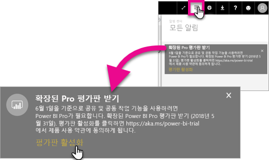
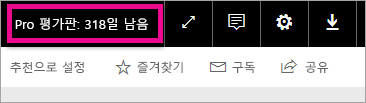

# Extended Pro 평가판 활성화
2017년 6월 1일부터 모든 자격이 있는 사용자는 Power BI 서비스에 대한 Extended Pro 평가판에 참여할 수 있게 됩니다.

<iframe width="640" height="360" src="https://www.youtube.com/embed/tPsNoPyY9aA?showinfo=0" frameborder="0" allowfullscreen></iframe>

[2017년 5월 3일 Power BI 프리미엄 알림](https://powerbi.microsoft.com/blog/microsoft-accelerates-modern-bi-adoption-with-power-bi-premium/)의 일환으로, Microsoft는 무료 Power BI 서비스에 대한 변경 사항이 2017년 6월 1일부터 적용되었음을 알렸습니다. 이러한 변경 내용에는 모든 데이터 원본, 더 높은 작업 영역 저장소 용량 한도 및 더 높은 새로 고침 및 스트리밍 속도에 대한 액세스를 무료 서비스로 확장하여 Power BI Pro와 동일하게 하는 것이 포함됩니다.

또한 공유 및 공동 작업 기능은 Power BI Pro 사용자에게 독점으로 제공되며, 피어 투 피어 대시보드 공유, 그룹 작업 영역(현재 앱 작업 영역이라고 함), PowerPoint로 내보내기 및 Power BI 앱을 사용하여 Excel에서 분석을 포함한다고 발표하였습니다. CSV/Excel 및 PowerPoint로 내보내기는 5월 3일 통신에서 Power BI Pro에 제한된 기능으로 확인되었으나, 광범위한 사용자 커뮤니티에서 의견을 수렴한 후에 무료 서비스 사용자에게도 제공되도록 전략이 발전되었습니다.

지난 1년 내(2017년 5월 2일 이전) 활성화된 무료 서비스의 기존 사용자는 2017년 6월 1일부터 Power BI Pro의 12개월 연장 평가판을 무료로 사용할 수 있게 됩니다. 커뮤니티에 대한 감사의 표시로 사용자는 내년에 Power BI Pro의 전체 기능을 활용할 수 있어 변경 사항에 적응하는 시간을 가질 수 있습니다.

2017년 6월 1일에 자격이 있는 사용자가 서비스에 로그인하면 변경 사항이 적용되었음을 알리는 알림을 Extended Power BI Pro 평가판 제품에 등록하라는 메시지와 함께 받게 됩니다. 사용자의 IT 관리자는 제품 내 알림을 제어하지 않으며, IT 관리자가 사용자를 대신하여 Extended Power BI Pro 평가판에 등록할 수는 없습니다. 자격이 있는 사용자는 이 과정을 완료하기 위한 작업을 개별적으로 수행해야 합니다.

사용자는 12개월 동안 언제든지 제품을 등록할 수 있으나, Extended Pro 평가판은 제품을 수락하는 시기와 상관 없이 2018년 5월 31일에 모든 사용자에게 종료됩니다. 지금은 사용자가 Power BI Pro를 구입하거나, 조치를 취하지 않거나 Power BI Pro를 구매하지 않을 경우 공유 및 공동 작업 기능이 없는 Power BI의 무료 버전으로 변환하도록 선택할 수 있는 옵션이 있습니다.

Power BI Pro는 변경되지 않습니다. 이러한 사용자는 영향을 받지 않으며 2017년 6월 1일 이후에 서비스에 로그인할 때에도 알림을 받지 않습니다. Extended Power BI Pro 평가판 제품을 거부하거나 제품 이용 자격이 없는 사용자는 공유 및 공동 작업 기능이 없이 Power BI의 무료 버전을 계속 사용하게 됩니다. Power BI [웹 사이트](https://powerbi.microsoft.com/get-started/)를 방문하여 언제든지 표준 60일 Power BI Pro 평가판에 등록할 수 있습니다.

## Extended Pro 평가판에 대한 자격
사용자 계정이 Extended Pro 평가판 제품에 대한 자격을 갖추기 위해서는 다음 요구 사항을 충족해야 합니다.

* 2016년 5월 3일부터 2017년 5월 2일 사이에 활성화된 Power BI 무료 사용자는 Extended Pro 평가판에 대한 자격이 있습니다.
* 사용자가 *60일 제품 내 Pro 평가판*을 이전에 사용하였거나 현재 사용 중이라면 Extended Pro 평가판에 대한 자격이 있습니다.

> [!NOTE]
> Power BI Pro 또는 Office 365 내 Power BI Pro 평가판 구독에서 할당된 라이선스가 있는 사용자는 이 제품에서 제외됩니다.
> 
> 

## 활성화하는 방법
Extended Pro 평가판을 활성화하는 방법에는 두 가지가 있습니다. 첫 번째는 Power BI에 로그인할 때입니다. 해당 항목을 해제한 경우 알림 영역 내에서 옵션이 표시됩니다.

> [!NOTE]
> 제품 내 통신은 관리자가 제어하지 않으며 적합한 사용자로 이동하게 됩니다.
> 
> 

### 로그인 시 발생
Power BI 서비스에 로그인할 때 자격이 있는 경우 팝업 알림을 받게 됩니다. **평가판 활성화**를 선택하면 Extended Pro 평가판이 시작됩니다. 추가 작업은 필요하지 않습니다.

그런 다음 평가판 기간에 모든 기존 공유 대시보드 및 보고서에 액세스할 수 있게 됩니다.

**나중에**를 선택하면 평가판 기간이 끝나는 2018년 5월 31일까지 Extended Pro 평가판을 언제든지 활성화할 수 있습니다.

### 나중에 활성화
**나중에**를 선택하여 팝업을 해제한 경우 평가판 기간이 끝나는 2018년 5월 31일까지 Extended Pro 평가판을 언제든지 활성화할 수 있습니다. 이 작업은 **알림 센터**에서 수행할 수 있습니다.

알림 센터 내에서 Extended Pro 평가판에 대한 알림이 표시됩니다. 알림은 사용자가 해제할 때까지 표시됩니다.

알림 내에서 **평가판 활성화**를 선택하여 평가판을 시작할 수 있습니다. 추가 작업은 필요하지 않습니다.

그런 다음 평가판 기간에 모든 기존 공유 대시보드 및 보고서에 액세스할 수 있게 됩니다.

## 활성화된 후
활성화된 후 평가판의 남은 일 수가 오른쪽 맨 위에 표시됩니다.

[Extended Pro 평가판 제품 사용 약관](https://aka.ms/power-bi-trial) 내에서 조건을 검토할 수 있습니다. Extended Pro 평가판은 2018년 5월 31일까지 적합한 모든 사용자에 대해 실행됩니다.

## 질문과 대답
**2017년 5월 3일 이후에 등록한 새로운 사용자는 어떻게 됩니까?**

2017년 5월 3일 이후에 Power BI 무료에 등록한 사용자는 Extended Pro 평가판을 사용할 자격이 없습니다. 그러나 표준 60일 Pro 평가판을 사용할 자격은 있습니다.

**조직에서 Extended Pro 평가판을 사용할 자격이 있는 사람을 어떻게 찾을 수 있습니까?**

이를 알아내는 직접적인 방법은 없지만, Power BI에 대한 Azure Active Directory 통합 응용 프로그램 보고서를 보면 지난 30일 동안 조직 내 활성 사용자가 누구인지 확인할 수 있습니다. 그러면 자격이 있는 사람이 누구인지 알 수 있을 것입니다. 자세한 내용은 [로그인한 Power BI 사용자 찾기](service-admin-access-usage.md)를 참조하세요.

적격성 기간이거나 무료 라이선스를 받은 활성 사용자는 팝업 알림을 받게 됩니다. 

> [!NOTE]
> Azure AD 보고서에는 사용자가 Power BI 내에서 무료인지 아니면 Pro인지 여부가 표시되지 않습니다. Power BI에 로그인한 사용자가 누구이며 언제 로그인하였는지만 보고됩니다. 사용자가 이 보고서 목록에 있다고 해서 반드시 Extended Pro 평가판을 사용할 자격이 있는 것은 아닙니다.
> 
> 

**관리자가 Extended Pro 평가판을 활성화하지 못하도록 사용자를 제한할 수 있습니까?**

아니요. 관리자는 Extended Pro 평가판 또는 서비스 중인 Power BI Pro 60일 평가판을 활성화하지 못하도록 사용자를 제한하지 못합니다.

## 다음 단계
[Extended Pro 평가판 제품 사용 약관](https://aka.ms/power-bi-trial)  
[개별 사용자에 대한 Power BI 서비스 규약](https://powerbi.microsoft.com/terms-of-service/)  
[Power BI 프리미엄 알림](https://aka.ms/pbipremium-announcement)  
[로그인한 Power BI 사용자 찾기](service-admin-access-usage.md)

궁금한 점이 더 있나요? [Power BI 커뮤니티에 질문합니다.](https://community.powerbi.com/)

