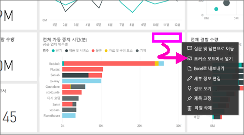
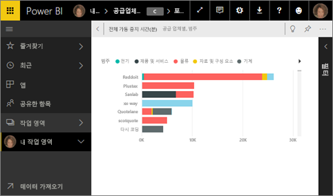
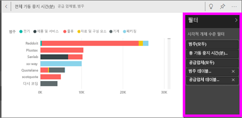
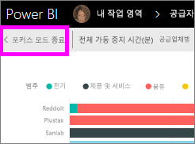
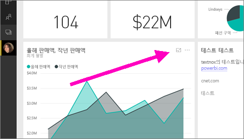
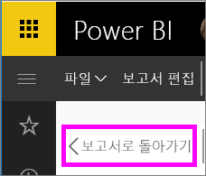

# 포커스 모드에서 대시보드 타일 또는 보고서 시각적 개체 표시

<iframe width="560" height="315" src="https://www.youtube.com/embed/dtdLul6otYE" frameborder="0" allowfullscreen></iframe>

## 포커스 모드란?

***포커스*** 모드를 사용하면 콘텐츠를 확장(팝아웃)하여 자세한 정보를 볼 수 있습니다.  포커스 모드에서 이 시각화 개체를 만들 때 적용된 필터를 확인하고 수정할 수 있습니다.  Power BI 서비스에서는 대시보드 타일 또는 보고서 시각적 개체에서 포커스 모드를 사용할 수 있고 Power BI Desktop에서는 [보고서 시각적 개체](desktop-report-view.md)에서 포커스 모드를 사용할 수 있습니다.

> [!NOTE]
> 포커스 모드는 [전체 화면 모드](service-fullscreen-mode.md)와 다릅니다.
> 

## 대시보드 타일에 대한 포커스 모드

1. 타일 시각화를 마우스로 가리키고, 줄임표(...)를 선택하고, **포커스 모드로 열기**를 선택합니다. 

    .

2. 타일이 열리고 전체 보고서 캔버스를 채웁니다. 

   

3. 필터 창을 확장하여 이 시각적 개체에 적용된 모든 필터를 확인합니다.
   
   

4. 필터를 수정하여 추가로 탐색하고 흥미로운 점을 발견하는 경우 시각적 요소를 대시보드에 고정합니다.

5. 포커스 모드에서 나와 시각적 개체의 왼쪽 위 모퉁이에서 **<포커스 모드 종료**를 선택하여 대시보드로 돌아갑니다.
   
        

## 보고서 시각화에 대한 포커스 모드

1. 보고서 시각화를 마우스로 가리키고 **포커스 모드** 아이콘 을 선택합니다.  
   
   
2. 시각화가 열리고 전체 캔버스를 채웁니다. 

   
3. 필터 창을 확장하여 이 시각적 개체에 적용된 모든 필터를 확인합니다.
   
   
4. 필터를 수정하여 추가로 탐색하고 흥미로운 점을 발견하는 경우 시각적 요소를 대시보드에 고정합니다.   
5. 포커스 모드에서 나와 시각적 개체의 왼쪽 위 모퉁이에서 **보고서로 돌아가기**를 선택하여 보고서로 돌아갑니다. 
   
      

## 포커스 모드에서 전체 화면 모드로 이동
포커스 모드에서 타일 또는 시각적 개체를 [전체 화면(TV 모드)에서 볼](service-fullscreen-mode.md) 수 있습니다. 전체 화면 모드는 메뉴 및 탐색 단추 없이 표시됩니다.

## 고려 사항 및 문제 해결
* 보고서에서 포커스 모드를 시각화와 함께 사용할 때에는 모든 필터: 시각적 수준, 페이지 수준, 드릴스루 및 보고서 수준을 보고 수정할 수 있습니다.    
* 대시보드에서 포커스 모드를 시각화와 함께 사용할 때에는 시각적 수준 필터만을 보고 수정할 수 있습니다.

궁금한 점이 더 있나요? [Power BI 커뮤니티를 이용하세요.](http://community.powerbi.com/)

