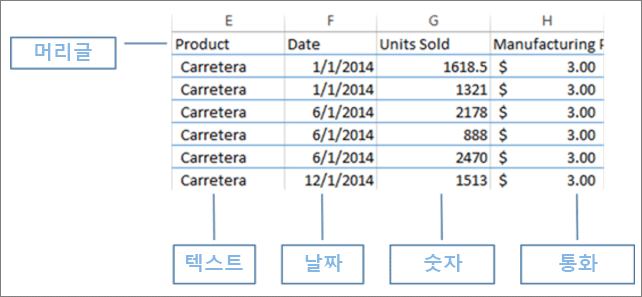
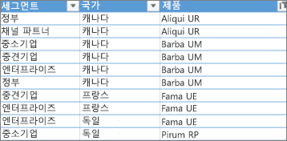
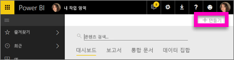
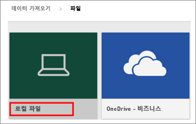
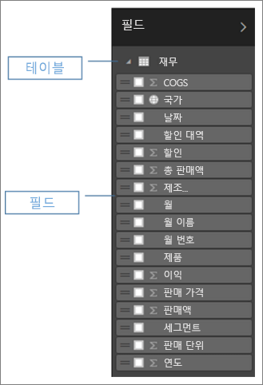
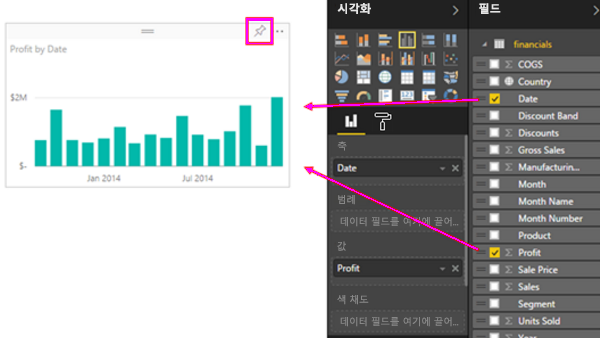
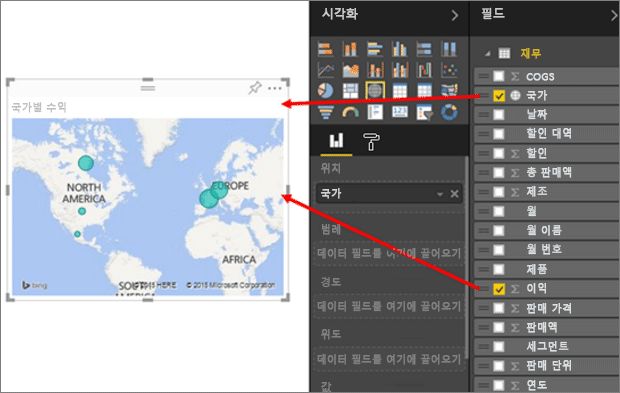
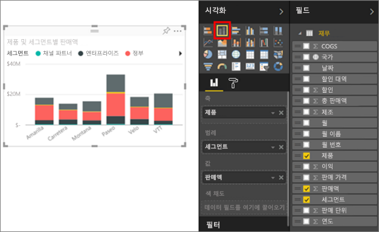
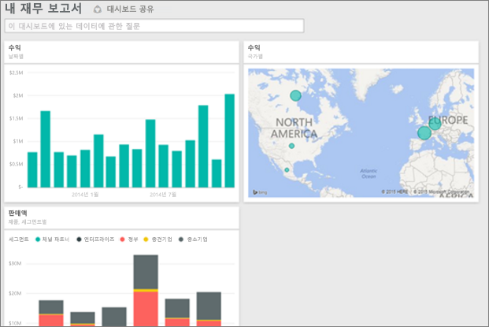
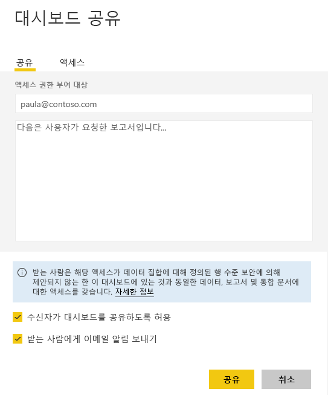

# 빠르게 Excel 통합 문서에서 멋진 보고서 작성
상사가 퇴근 전에 최근 판매 실적과 지난 캠페인에 대한 의견이 포함된 보고서를 제출하도록 요구합니다. 하지만 최신 데이터는 다양한 타사 시스템과 노트북의 파일에 있습니다. 이전에는 시각적 개체를 만들고 보고서 형식을 지정하는 데 몇 시간이 걸렸습니다. 걱정이 되기 시작합니다.

염려하지 마세요. Power BI를 사용하면 멋진 보고서를 빠르게 만들 수 있습니다.

이 예제에서는 Power BI 내에서 로컬 시스템의 Excel 파일을 업로드하고, 새 보고서를 만들고, 동료와 공유합니다.

## 데이터 준비
예를 들어 간단한 Excel 파일을 살펴보겠습니다. Excel 파일을 Power BI에 로드하려면 먼저 2차원 표에 데이터를 구성해야 합니다. 즉, 각 열에 동일한 데이터 형식(예: 텍스트, 날짜, 숫자 또는 통화)이 포함됩니다. 머리글 행이 있어야 하지만 합계를 표시하는 열이나 행은 없어야 합니다.

다음에는 데이터 형식을 표로 지정됩니다. Excel의 홈 탭, 스타일 그룹에서 **표 서식**을 선택합니다. 워크시트에 적용할 표 스타일을 선택합니다. 이제 Excel 워크시트를 Power BI에 로드할 수 있습니다.

## Power BI에 Excel 파일 업로드
Power BI는 컴퓨터에 있는 Excel 파일을 포함하여 여러 데이터 원본에 연결합니다. 먼저 Power BI 서비스에 로그인합니다. 아직 등록하지 않은 경우 [무료로 등록할 수 있습니다](https://powerbi.com).

새 대시보드를 만들려고 합니다. **내 작업 영역**을 열고 **+ 만들기** 아이콘을 선택합니다.

**대시보드**를 선택하고 이름을 입력한 다음 **만들기**를 선택합니다. 새 대시보드가 데이터 없이 표시됩니다.

왼쪽 탐색 창의 맨 아래에서 **데이터 가져오기**를 선택합니다. 데이터 가져오기 페이지의 데이터 가져오기 또는 연결 아래에 있는 파일 상자에서 **가져오기**를 선택합니다.

파일 페이지에서 **로컬 파일**을 선택합니다. 컴퓨터의 Excel 통합 문서 파일로 이동한 다음 선택하여 Power BI에 로드합니다. **가져오기**를 선택합니다.

> **참고**: 이 자습서의 나머지 부분을 따라가려면 [재무 샘플 통합 문서](sample-financial-download.md)를 사용합니다.
> 
> 

## 보고서 작성
Power BI가 Excel 파일을 가져온 후 보고서 작성을 시작합니다. **데이터 세트가 준비됨** 메시지가 표시되면 **데이터 세트 보기**를 선택합니다.  Power BI가 편집용 보기에서 열리고 보고서 캔버스를 표시합니다. 오른쪽에는 시각화, 필터 및 필드 창이 있습니다.

Excel 통합 문서 표 데이터가 필드 창에 나타납니다. 표 이름 아래에 열 머리글이 개별 필드로 나열됩니다.

이제 시각화를 만들 수 있습니다. 상사가 시간별 수익을 보고 싶어 하는 경우 다음과 같이 하세요. 필드 창에서 **Profit** 을 보고서 캔버스로 끌어다 놓습니다. Power BI는 기본적으로 가로 막대형 차트를 표시합니다. 다음에는 **Date** 를 보고서 캔버스로 끌어다 놓습니다. Power BI가 날짜별 수익을 표시하도록 가로 막대형 차트를 업데이트합니다.

> **팁**: 차트가 예상과 같지 않으면 집계를 확인합니다. 예를 들어, **값** 웹에서 방금 추가한 필드를 마우스 오른쪽 단추로 클릭하고 데이터가 원하는 방식으로 집계되고 있는지 확인합니다.  이 예에서는 **합계**를 사용합니다.
> 
> 

상사가 수익성이 가장 높은 국가를 알고 싶어 하는 경우 지도 시각화를 활용해 보세요. 캔버스에서 빈 영역을 선택하고 필드 창에서 **국가** 및 **수익** 필드를 차례로 끌어옵니다. Power BI가 각 위치의 상대 수익을 나타내는 거품이 포함된 맵 시각적 개체를 만듭니다.

제품 및 세분 시장별 매출을 보여 주는 시각적 개체를 표시하는 작업도 간단합니다. 필드 창에서 Sales, Product 및 Segment 필드 옆에 있는 확인란을 선택합니다. Power BI가 즉시 가로 막대형 차트를 만듭니다. 시각화 메뉴에서 아이콘 중 하나를 선택하여 차트의 종류를 변경합니다. 예를 들어, 누적 막대형 차트로 변경합니다.  차트를 정렬하려면 줄임표(...) > **정렬 기준**을 선택합니다.

모든 시각적 개체를 대시보드에 고정합니다. 이제 동료와 공유할 수 있습니다.

## 대시보드 공유
상사인 Paula와 대시보드를 공유하려고 합니다. Power BI 계정을 가진 동료와 대시보드 및 기본 보고서를 공유할 수 있습니다. 동료는 보고서와 상호 작용할 수 있지만 변경 내용을 저장할 수는 없습니다.

보고서를 공유하려면 대시보드의 맨 위에서 **공유**를 선택합니다.

Power BI에 대시보드 공유 페이지가 표시됩니다. 위쪽 영역에 받는 사람의 메일 주소를 입력합니다. 아래 필드에 메시지를 추가합니다. 받는 사람이 대시보드를 다른 사람과 공유할 수 있게 하려면 **수신자가 대시보드를 공유할 수 있도록 허용**을 선택합니다. **공유**를 선택합니다.

다음 단계

* [Power BI 서비스 시작](service-get-started.md)
* [Power BI Desktop 시작](desktop-getting-started.md)
* [Power BI 서비스의 디자이너를 위한 기본 개념](service-basic-concepts.md)
* 궁금한 점이 더 있나요? [Power BI 커뮤니티를 이용하세요.](http://community.powerbi.com/)

