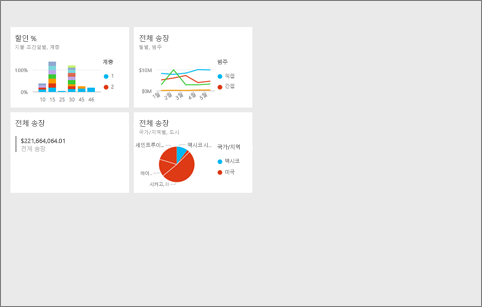
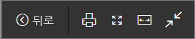
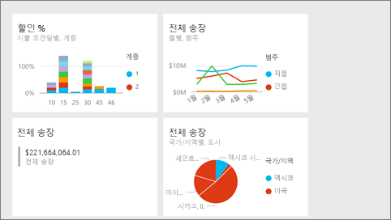

# Power BI에서 전체 화면 모드
## 전체 화면 모드란?

메뉴 및 탐색 바 없이 콘텐츠(대시보드, 보고서 페이지,타일 및 시각적 개체)를 표시합니다.  항상 한 눈에 콘텐츠 전체를 볼 수 있습니다. 이를 TV 모드라고도 합니다. 전체 화면 모드에서 사용할 수 있는 기능은 콘텐츠에 따라 다릅니다.  

다음과 같은 경우에 전체 화면 모드를 사용합니다.

* 모임이나 회의에서 대시보드, 타일, 시각적 개체 또는 보고서 프레젠테이션
* 사무실의 큰 전용 화면이나 프로젝터에 표시
* 작은 화면으로 보기
* 잠금 모드에서 검토 - 기본 보고서 또는 대시보드를 열지 않고 화면을 터치하거나 타일을 마우스로 가리킬 수 있습니다.

> **참고**: 전체 화면 모드는 [포커스(팝업) 모드](service-focus-mode.md)와 다릅니다.
> 
> 

Amanda가 대시보드를 전체 화면 모드로 열어서 탐색한 다음 일부 URL 매개 변수를 적용하여 기본 디스플레이를 제어하는 과정을 시청합니다. 그런 다음 비디오 아래에 있는 단계별 지침을 따라서 직접 시도해 볼 수 있습니다.

<iframe width="560" height="315" src="https://www.youtube.com/embed/c31gZkyvC54" frameborder="0" allowfullscreen></iframe>

## 전체 화면 모드의 대시보드 및 보고서 페이지
1. 대시보드 또는 보고서 위의 Power BI 메뉴 모음에서 **전체 화면** 아이콘을 선택합니다. 대시보드 캔버스 또는 보고서 페이지는 전체 화면을 채웁니다. 아래 예제는 대시보드입니다.
   
      
2. 전체 화면 모드에서 여러 메뉴 옵션을 사용할 수 있습니다.  메뉴를 표시하려면 마우스 또는 커서를 움직이기만 하면 됩니다. 
   
     대시보드에 대한 메뉴    
         
   
     보고서 페이지에 대한 메뉴    
        
   
        
    **뒤로** 단추를 사용하여 브라우저에서 이전 페이지로 이동합니다. 이전 페이지가 Power BI 페이지였다면 그것 또한 전체 화면 모드로 표시됩니다.  전체 화면 모드는 종료할 때까지 지속됩니다.
   
        
    전체 화면 모드에서 대시보드 또는 보고서 페이지를 인쇄하려면 이 단추를 사용합니다. 
   
        
    스크롤 바에 의지하지 않고 가능한 가장 큰 크기로 대시보드를 표시하려면 **화면에 맞춤** 버튼을 사용합니다.     
   
    
   
           
    때로 종종 스크롤 막대를 신경 쓰지 않지만 대시보드로 사용 가능한 공간의 전체 너비를 채우려면. **너비에 맞춤** 버튼을 선택합니다.    
   
    
   
           
    전체 화면 보기에서 이러한 화살표를 사용하여 보고서의 페이지 간을 이동합니다.    
3. 전체 화면 모드를 종료하려면 **전체 화면 종료** 아이콘을 선택합니다.
   
      

## 전체 화면 모드의 시각적 개체 및 대시보드 타일
1. 전체 화면 모드에서 대시보드 타일 및 보고서 시각적 개체를 표시하려면 [포커스 모드](service-focus-mode.md)에 이미 들어 있는 타일이나 시각적 개체로 시작해야 합니다. 
   
    
2. 그런 다음 그 타일이나 시각적 개체에 대한   전체 화면 아이콘을 선택합니다. 타일 또는 시각적 개체는 메뉴 또는 탐색바 없이 전체 화면에 표시됩니다.
   
    

## 다음 단계
[Power BI의 대시보드](service-dashboards.md)  
[포커스 모드](service-focus-mode.md)    

궁금한 점이 더 있나요? [Power BI 커뮤니티를 이용하세요.](http://community.powerbi.com/)

