# 데이터 원본 관리

[!INCLUDE [gateway-rewrite](includes/gateway-rewrite.md)]

Power BI는 다양한 [온-프레미스 데이터 원본](power-bi-data-sources.md)을 지원하고 각 데이터 원본에는 고유한 요구 사항이 있습니다. 단일 데이터 원본이나 여러 데이터 원본에 게이트웨이를 사용할 수 있습니다. 이 예에서는 SQL Server를 데이터 원본으로 추가하는 방법을 보여줍니다. 다른 데이터 원본의 경우에도 해당 단계는 비슷합니다.

API를 사용하여 대부분의 데이터 원본 관리 작업을 수행할 수도 있습니다. 자세한 내용은 [Rest API(게이트웨이)](/rest/api/power-bi/gateways)를 참조하세요.

## 데이터 원본 추가

1. Power BI 서비스의 오른쪽 위 모서리에서 기어 아이콘  > **게이트웨이 관리**를 선택합니다.

    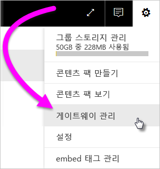

2. 게이트웨이를 선택하고 **데이터 원본 추가**를 선택합니다. 또는 **게이트웨이** > **데이터 원본 추가**로 이동합니다.

    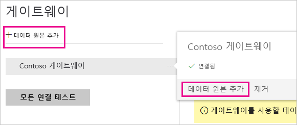

3. **데이터 원본 유형**을 선택합니다.

    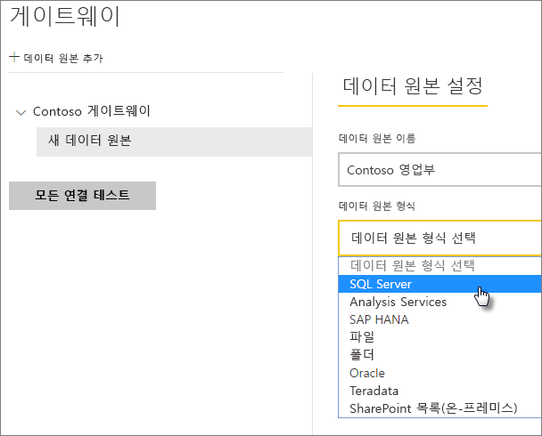

4. 데이터 원본에 대한 정보를 입력합니다. 이 예제에서는 **서버**, **데이터베이스** 및 기타 정보입니다. 

    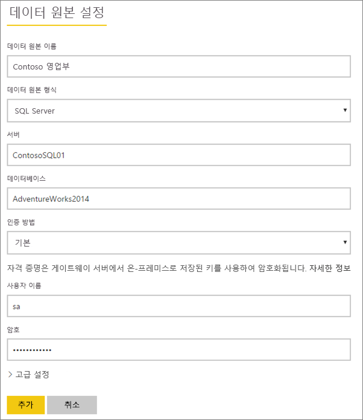

5. SQL Server의 경우 **Windows** 또는 **기본**(SQL 인증)의 **인증 방법**을 선택합니다. **기본**을 선택하는 경우 데이터 원본에 대한 자격 증명을 입력합니다.

6. **고급 설정**에서 선택적으로 데이터 원본에 대한 [개인 정보 수준](https://support.office.com/article/Privacy-levels-Power-Query-CC3EDE4D-359E-4B28-BC72-9BEE7900B540)을 구성합니다([DirectQuery](desktop-directquery-about.md)에 적용되지 않음).

    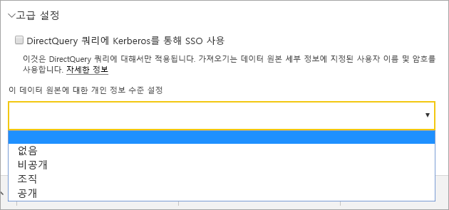

7. **추가**를 선택합니다. 프로세스가 성공하면 ‘연결 성공’이 표시됩니다. 

    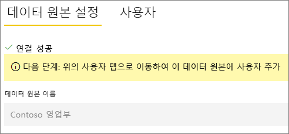

이제 이 데이터 원본을 사용하여 Power BI 대시보드 및 보고서에 SQL Server의 데이터를 포함할 수 있습니다.

## 데이터 원본 제거

더 이상 사용하지 않는 경우 데이터 원본을 제거할 수 있습니다. 데이터 원본을 제거하면 해당 데이터 원본을 사용하는 모든 대시보드와 보고서가 제거됩니다.

데이터 원본을 제거하려면 데이터 원본으로 이동한 다음, **제거**를 선택합니다.

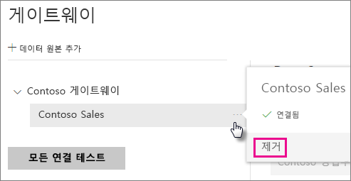

## 예약된 새로 고침 또는 DirectQuery에 데이터 원본 사용

데이터 원본을 만든 후 DirectQuery 연결 또는 예약된 새로 고침을 통해 사용할 수 있습니다.

> [!NOTE]
>서버 및 데이터베이스 이름은 온-프레미스 데이터 게이트웨이 내에서 Power BI Desktop 및 데이터 원본 간에 일치해야 합니다.

게이트웨이에서 데이터 세트 및 데이터 원본 간의 링크는 서버 이름 및 데이터베이스 이름을 기반으로 합니다. 해당 이름은 서로 일치해야 합니다. 예를 들어 Power BI Desktop에서 서버 이름에 대한 IP 주소를 제공하는 경우 게이트웨이 구성에서 데이터 원본에 대한 IP 주소를 사용해야 합니다. Power BI Desktop에서 *SERVER\INSTANCE*를 사용하는 경우 게이트웨이에 대해 구성된 데이터 원본에서 동일한 것을 사용해야 합니다.

게이트웨이에서 구성된 데이터 원본의 **사용자** 탭에 나열되고 서버 및 데이터베이스 이름이 일치하는 경우 예약된 새로 고침으로 사용하기 위한 옵션으로 게이트웨이가 표시됩니다.

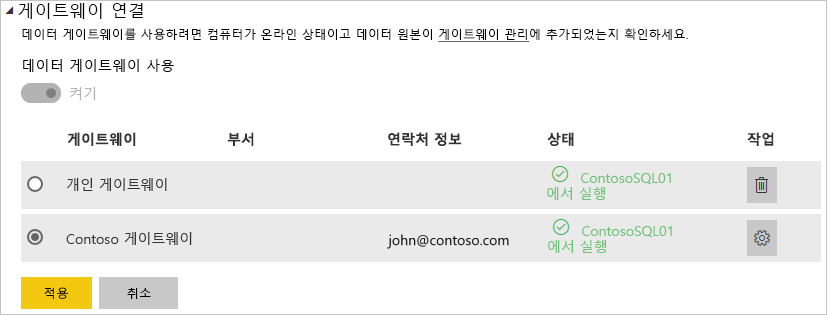

> [!WARNING]
> 데이터 세트에 여러 데이터 원본이 포함된 경우 각 데이터 원본을 게이트웨이에 추가해야 합니다. 게이트웨이에 하나 이상의 데이터 원본을 추가하지 않으면 예약된 새로 고침에 사용 가능한 게이트웨이가 표시되지 않습니다.

### 제한 사항

OAuth는 온-프레미스 데이터 게이트웨이를 통해 사용자 지정 커넥터에만 지원되는 인증 체계입니다. OAuth가 필요한 다른 데이터 원본을 추가할 수 없습니다. OAuth가 필요한 데이터 원본이 데이터 세트에 있고 이 데이터 원본이 사용자 지정 커넥터가 아니면 예약된 새로 고침에 게이트웨이를 사용할 수 없습니다.

## 사용자 관리

게이트웨이에 데이터 원본을 추가한 후 사용자 및 이메일 사용 보안 그룹에 특정 데이터 원본(전체 게이트웨이가 아님)에 대한 액세스 권한을 부여합니다. 데이터 원본 사용자 목록은 데이터 원본의 데이터를 포함하는 보고서를 게시할 수 있는 사용자만 제어합니다. 보고서 소유자는 대시보드, 콘텐츠 팩 또는 앱을 만든 다음, 이 항목을 다른 사용자와 공유할 수 있습니다.

사용자 및 보안 그룹에게 게이트웨이에 대한 관리 권한을 부여할 수도 있습니다.

### 데이터 원본에 사용자 추가

1. Power BI 서비스의 오른쪽 위 모서리에서 기어 아이콘  > **게이트웨이 관리**를 선택합니다.

2. 사용자를 추가할 데이터 원본을 선택합니다.

3. **사용자**를 선택하고 선택한 데이터 원본에 대한 액세스 권한을 부여하려는 조직 내 사용자를 입력합니다. 예를 들어 다음 화면에서는 Maggie와 Adam을 추가하고 있습니다.

    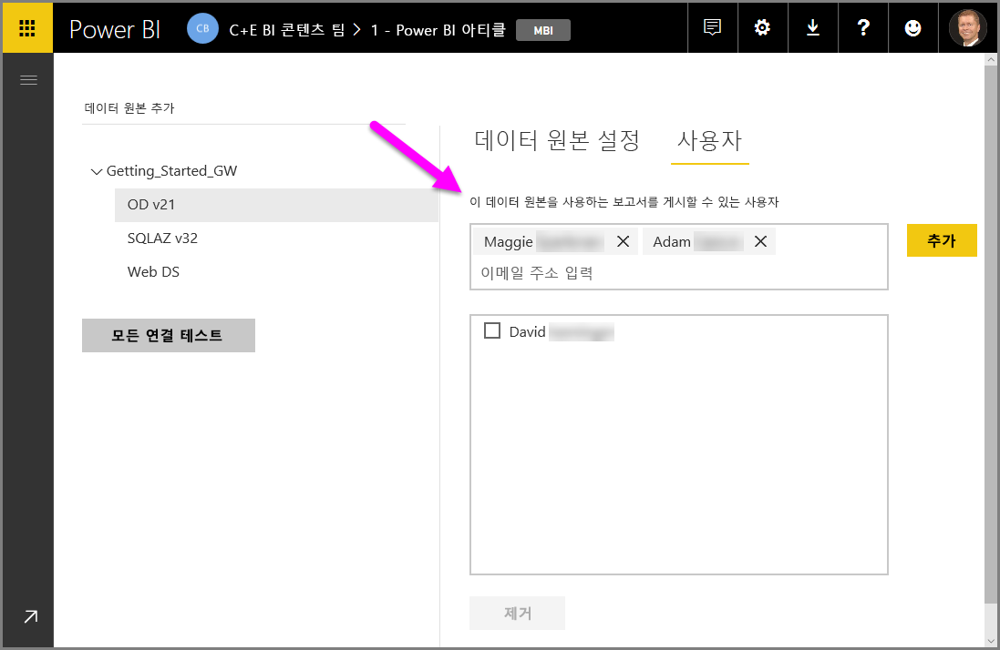

4. **추가**를 선택하면 추가된 구성원의 이름이 상자에 표시됩니다.

    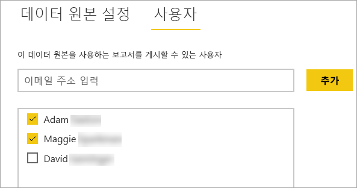

액세스를 부여하려는 각각의 데이터 원본에 사용자를 추가해야 합니다. 각 데이터 원본에는 별도의 사용자 목록이 있습니다. 각 데이터 원본에 개별적으로 사용자를 추가합니다.

### 데이터 원본에서 사용자 제거

데이터 원본에 대한 **사용자** 탭에서 이 데이터 원본을 사용하는 사용자 및 보안 그룹을 제거할 수 있습니다.

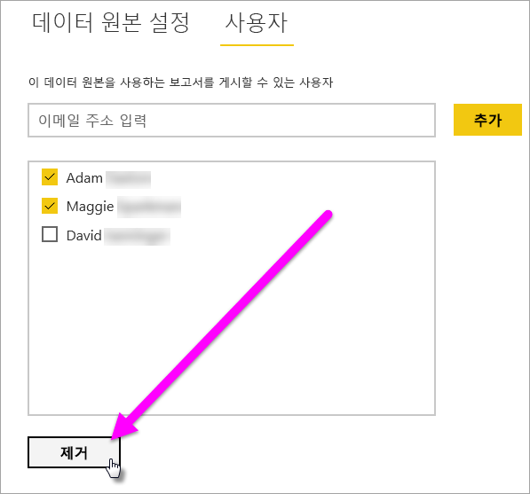

## 클라우드에 암호화된 자격 증명 저장

게이트웨이에 데이터 원본을 추가할 때 해당 데이터 원본에 대한 자격 증명을 제공해야 합니다. 데이터 원본에 대한 모든 쿼리는 이러한 자격 증명을 사용하여 실행됩니다. 자격 증명이 안전하게 암호화됩니다. 자격 증명은 클라우드에 저장하기 전에 클라우드에서 암호를 해독할 수 없도록 대칭형 암호화를 사용합니다. 자격 증명은 게이트웨이를 실행 중인 머신으로 전송되어 데이터 원본이 액세스될 때 온-프레미스에서 암호 해독됩니다.

## 사용 가능한 데이터 원본 유형 목록

온-프레미스 데이터 게이트웨이에서 지원하는 데이터 원본에 대한 자세한 내용은 [Power BI 데이터 원본](power-bi-data-sources.md)을 참조하세요.

## 다음 단계

* [데이터 원본 관리 - Analysis Services](service-gateway-enterprise-manage-ssas.md)
* [데이터 원본 관리 - SAP HANA](service-gateway-enterprise-manage-sap.md)
* [데이터 원본 관리 - SQL Server](service-gateway-enterprise-manage-sql.md)
* [데이터 원본 관리 - Oracle](service-gateway-onprem-manage-oracle.md)
* [데이터 원본 관리 - 가져오기/예약된 새로 고침](service-gateway-enterprise-manage-scheduled-refresh.md)
* [데이터 게이트웨이 배포 지침](service-gateway-deployment-guidance.md)

궁금한 점이 더 있나요? [Power BI 커뮤니티](https://community.powerbi.com/)를 사용해 보세요.
