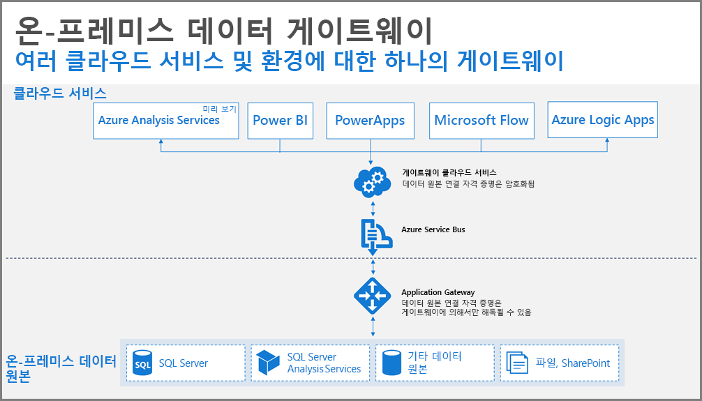
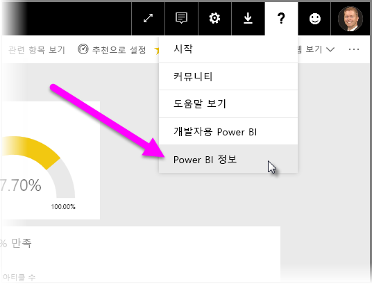
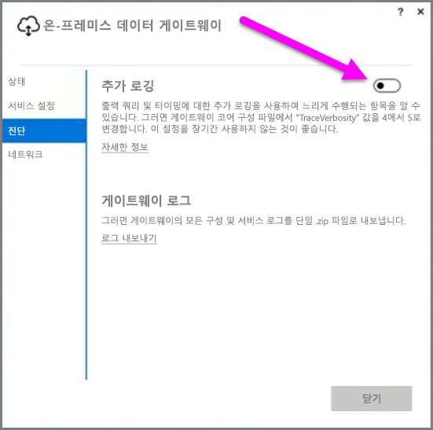
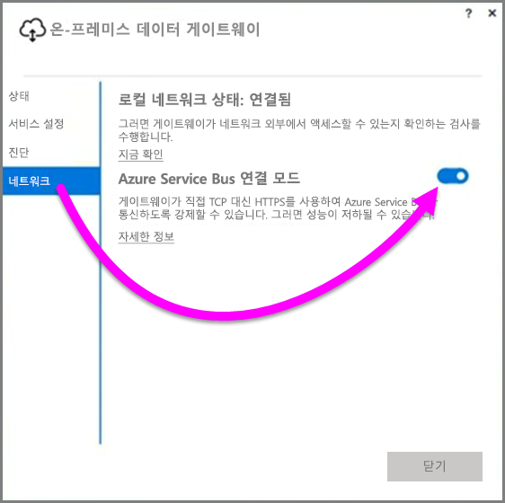
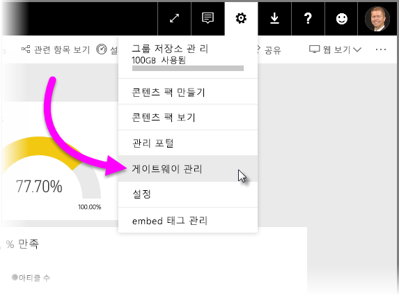

# Power BI에 대한 데이터 게이트웨이 배포 지침
이 문서는 네트워크 환경에서 데이터 게이트웨이를 배포하기 위한 고려 사항 및 지침을 제공합니다. **게이트웨이**는 사설 온-프레미스 네트워크에 상주하는 데이터가 차후 Power BI 등의 클라우드 서비스에서 사용될 수 있게 데이터 액세스를 용이하게 하는 소프트웨어입니다. 이 문서는 배포를 안내하고 **온-프레미스 데이터 게이트웨이** 설정에 대한 지침을 제공합니다.

설치를 위한 링크를 포함한 **온-프레미스 데이터 게이트웨이**에 대한 자세한 내용은 [블로그 게시물](https://powerbi.microsoft.com/blog/power-bi-gateways-march-update/)에서 살펴보겠습니다.

## 온-프레미스 데이터 게이트웨이에 대한 설치 고려 사항
설치 및 배포의 세부 정보에 대해 자세히 알아보기 전에 몇 가지 유념해야 할 고려 사항이 있습니다. 다음 섹션에서는 염두에 둬야 할 중요한 사항을 설명합니다.

### 사용자 수
게이트웨이를 사용하는 보고서를 사용하는 사용자 수는 게이트웨이 설치 위치를 결정하는 중요한 메트릭입니다. 다음은 고려해야 할 몇 가지 질문입니다.

* 사용자는 서로 다른 시간에 이러한 보고서를 사용하고 있습니까?
* 어떤 유형의 연결을 사용하고 있습니까(DirectQuery 또는 가져오기)?
* 모든 사용자가 동일한 보고서를 사용하고 있습니까?

사용자가 매일 동시에 지정된 보고서에 모두 액세스하는 경우 이러한 모든 요청을 처리할 수 있는 컴퓨터에 게이트웨이를 설치했는지 확인해야 합니다(이를 결정하는 데 도움을 줄 수 있는 성능 카운터 및 최소 요구 사항에 대해 다음 섹션 참조).

*보고서*당 *하나*의 게이트웨이만 허용하는 **Power BI**에는 제약 조건이 있으므로 보고서가 여러 데이터 원본을 기반으로 하는 경우에도 이러한 모든 데이터 원본은 단일 게이트웨이를 거쳐야 합니다. 그러나 대시보드가 *여러* 보고서를 기반으로 하는 경우 각 제공 보고서에 대해 전용 게이트웨이를 사용할 수 있으므로 해당 단일 대시보드에 제공하는 이러한 여러 보고서 간에 게이트웨이 부하를 분산합니다.

### 연결 유형
**Power BI**는 두 가지 유형의 연결, **DirectQuery** 및 **가져오기**를 제공합니다. 모든 데이터 원본은 두 연결 유형을 모두 제공하지 않으며 보안 요구 사항, 성능, 데이터 제한 사항 및 데이터 모델 크기와 같은 많은 이유는 하나를 선택하는 데 원인이 될 수 있습니다. [온-프레미스 데이터 게이트웨이 문서](service-gateway-onprem.md)의 *사용 가능한 데이터 원본 유형 목록* 섹션에서 연결 유형 및 지원되는 데이터 원본에 대해 자세히 알아볼 수 있습니다.

사용되는 연결의 유형에 따라 게이트웨이 사용량은 다를 수 있습니다. 예를 들어 가능할 때마다 **DirectQuery** 데이터 원본을 **예약된 새로 고침** 데이터 원본에서 분리하려고 시도해야 합니다(다른 보고서에 있고 구분될 수 있다고 가정). 이렇게 하면 회사의 기본 대시보드에 사용되는 대형 데이터 모델의 아침의 예약된 새로 고침처럼 게이트웨이에 수천 개의 DirectQuery 요청이 동시에 대기하는 것을 방지합니다. 다음은 각각에 대해 고려해야 할 사항입니다.

* **예약된 새로 고침**의 경우: 쿼리 크기 및 하루당 발생하는 새로 고침 수에 따라 권장되는 최소 하드웨어 요구 사항 간의 상태를 유지하거나 더 높은 성능 컴퓨터로 업그레이드하도록 선택할 수 있습니다. 지정된 쿼리가 폴딩되지 않거나 게이트웨이 컴퓨터에 변환이 발생하는 경우 게이트웨이 컴퓨터는 사용 가능한 더 많은 RAM을 가짐으로써 혜택을 받습니다.
* **DirectQuery**의 경우: 사용자가 보고서를 열거나 데이터를 볼 때마다 쿼리가 전송됩니다. 따라서 데이터에 동시에 액세스하는 1,000명 이상의 사용자를 예상하는 경우 컴퓨터에 강력하고 가능한 하드웨어 구성 요소가 있는지 확인합니다. 더 많은 CPU 코어는 **DirectQuery** 연결에 대한 더 나은 처리량을 가져옵니다.

**온-프레미스 데이터 게이트웨이**를 설치하는 컴퓨터에 대한 요구 사항은 다음과 같습니다.

**최소값:**

* .NET 4.5 Framework
* 64비트 버전의 Windows 7/Windows Server 2008 R2(또는 그 이상)

**권장:**

* 8코어 CPU
* 8GB 메모리
* 64비트 버전의 Windows 2012 R2(또는 그 이상)

### 위치
게이트웨이 설치 위치는 쿼리 성능에 큰 영향을 줄 수 있으므로 네트워크 대기 시간을 최소화하기 위해 게이트웨이, 데이터 원본 위치 및 Power BI 테넌트가 최대한 서로 가까이 있는지 확인합니다. Power BI 서비스 선택에서 Power BI 테넌트 위치를 결정하려면 오른쪽 위 모퉁이에서 **?** 아이콘을 선택하고 **Power BI 정보**를 선택합니다.

### 게이트웨이 모니터링
설치된 게이트웨이의 사용 및 성능을 모니터링하는 데 사용할 수 있는 몇 가지 도구가 있습니다.

#### 성능 카운터
게이트웨이에서 발생하는 작업을 평가하고 액세스하는 데 사용할 수 있는 많은 성능 카운터가 있습니다. 카운터는 특정 형식으로 많은 양의 작업이 있는지를 이해하는 데 유용할 수 있으며 새 게이트웨이를 배포할 것인지 묻는 메시지를 표시할 수 있습니다.

> [!NOTE]
> 이러한 카운터는 특정 작업 기간 시간을 캡처하지 않습니다.
> 
> 

컴퓨터의 카운터 외에도 *게이트웨이 카운터*는 컴퓨터가 처리하는 작업의 양을 제공하고 서버 리소스 용량이 확대 또는 초과되는지 여부의 표시를 제공할 수 있습니다.

이러한 카운터는 **Windows 성능 모니터**에서 액세스할 수 있으며 이 목적을 위해 사용하는 모든 보고 도구에서 사용될 수 있습니다. Power BI로 게이트웨이 성능 모니터를 사용하는 방법에 대한 자세한 안내는 다음 커뮤니티-작성 블로그 게시물을 살펴보세요.

* [온-프레미스 데이터 게이트웨이 모니터링](https://insightsquest.com/2016/08/08/monitor-on-premises-data-gateways/)

#### 로그
구성 및 서비스 로그는 게이트웨이를 통해 발생하는 작업에 대한 다른 차원을 제공합니다. 모든 오류 메시지가 Power BI 서비스에 표시되지 않으므로 연결이 예상대로 작동하지 않을 경우 항상 게이트웨이 로그를 확인합니다.

로컬 컴퓨터의 모든 로그 파일을 볼 수 있는 쉬운 방법은 초기 설치가 완료된 후 게이트웨이를 다시 열 때 **온-프레미스 데이터 게이트웨이**의 *로그 내보내기* 단추를 사용한 다음 **진단 > 로그 내보내기**를 선택하는 것입니다.

#### 추가 로깅
기본적으로 게이트웨이는 기본 로깅을 수행합니다. 게이트웨이 문제를 조사하고 쿼리 연결 세부 정보에 대한 자세한 정보가 필요한 경우 일시적으로 *자세한 정보 로깅*을 사용하여 추가 로그 정보를 수집할 수 있습니다. 이를 위해 설치된 게이트웨이에서 **진단 > 추가 로깅**을 선택합니다.

이 설정을 사용하면 게이트웨이 사용에 따라 로그 크기가 증가할 가능성이 큽니다. 로그를 검토한 후 **추가 로깅**을 비활성화하는 것이 좋습니다. 이 설정을 일반 게이트웨이 사용 동안 활성화하는 것은 좋지 않습니다.

#### 네트워크 구성
게이트웨이는 **Azure Service Bus**에 대한 아웃바운드 연결을 만듭니다. 게이트웨이는 다음 아웃바운드 포트에서 통신합니다.

* TCP 443(기본값)
* 5671
* 5672
* 9350 ~ 9354

게이트웨이에는 인바운드 포트가 필요하지 *않습니다*. 모든 필수 포트는 위 목록에 나와 있습니다.

방화벽에, 데이터 영역에 대한, IP 주소 허용 목록을 작성하는 것이 좋습니다. [Microsoft Azure 데이터 센터 IP 목록](https://www.microsoft.com/download/details.aspx?id=41653)에 있는 IP 주소의 목록을 다운로드할 수 있습니다. 해당 목록은 매주 업데이트됩니다. 게이트웨이는 정규화된 도메인 이름(FQDN)과 함께 특정 IP 주소를 사용하여 **Azure Service Bus**와 통신합니다. 게이트웨이가 HTTPS를 사용하여 통신하도록 강제 적용하는 경우 게이트웨이는 엄격하게 FQDN만을 사용하며 IP 주소를 사용하여 통신이 발생하지 않습니다.

#### HTTPS가 Azure Service Bus와 통신하도록 강제 적용
게이트웨이가 직접 TCP 대신 HTTPS를 사용하여 **Azure Service Bus**와 통신하도록 강제할 수 있습니다. 이렇게 하면 성능이 약간 저하됩니다. 또한 게이트웨이의 사용자 인터페이스를 사용하여 HTTPS를 사용하여 게이트웨이가 **Azure Service Bus**와 통신하도록 강제할 수도 있습니다(게이트웨이의 2017년 3월 릴리스 시작).

이를 위해 게이트웨이에서 **네트워크**를 선택한 다음 **Azure Service Bus 연결 모드**를 **설정**으로 전환합니다.

### 추가 지침
이 섹션에서는 게이트웨이 배포 및 관리에 대한 추가 지침을 제공합니다.

* 단일 실패 지점이 없도록 해야 합니다. 가능하면 온-프레미스 데이터 원본을 여러 게이트웨이에 분산합니다. 이 경우 컴퓨터 하나를 사용할 수 없는 경우 여전히 데이터의 일부를 새로 고칠 수 있으며 해당 기능을 완전히 손실하지 않습니다.
* 도메인 컨트롤러에 게이트웨이를 설치할 수 없으므로 이렇게 하려고 계획하거나 시도하지 마십시오.
* 꺼져 있고 절전 모드가 되거나 인터넷에 연결할 수 없는 컴퓨터에 게이트웨이를 설치하지 마십시오(예: 노트북 컴퓨터). 게이트웨이는 이러한 상황에서 실행할 수 없습니다.
* 무선 네트워크를 통해 성능이 저하될 수 있으므로 무선 네트워크에 게이트웨이를 설치하지 마십시오.

#### 게이트웨이 복구
**복구 키**를 사용하여 기존 게이트웨이를 복구하거나 새 컴퓨터로 이동할 수 있습니다. 복구 키는 게이트웨이를 설치하는 사용자에게 제공되며 나중에 변경할 수 *없습니다*. 복구 키는 데이터 암호화 및 게이트웨이 복구 모두에 사용됩니다.

게이트웨이를 복구하려면 게이트웨이의 관리자이며, 게이트웨이 이름을 알고 있고, 올바른 복구 키가 있으며 유사한 성능 특성으로 사용할 수 있는 새 컴퓨터가 있는지 확인합니다.

로그인한 후 **기존 게이트웨이 마이그레이션** 옵션을 선택합니다. 다음으로 복구하거나 마이그레이션하려는 게이트웨이를 선택하고 마지막으로 복구 키를 제공하고 구성을 눌러야 합니다. 해당 단계가 완료되면 이전 게이트웨이는 새 게이트웨이로 교체되고 새 게이트웨이는 이전에 구성된 해당 이름 및 모든 데이터 원본을 상속합니다. 모든 데이터 원본은 이제 아무 것도 다시 게시할 필요 없이 새 컴퓨터를 통해 진행합니다. 자동 장애 조치는 아직 지원되지 않지만 게이트웨이 팀에서 적극적으로 고려 중인 기능입니다.

#### 관리자
**Power BI 서비스**에서 게이트웨이 관리자 목록을 찾을 수 있습니다. **Power BI** 서비스에 로그인 할 때 **설정**(기어 아이콘) **> 게이트웨이 관리 > 게이트웨이 UI**를 선택합니다.  

여기에서 게이트웨이를 선택하고 게이트웨이 관리자 목록을 확인할 수 있습니다. 나열된 관리자는 게이트웨이에 액세스하고 복구 및 삭제할 수 있습니다. 또한 게이트웨이에 데이터 원본을 추가 및 삭제할 수도 있습니다. 조직의 모든 관리자가 해당 그룹의 모든 게이트웨이에 액세스하려면 다음이 권장됩니다.

* **AAD** 보안 그룹을 만들고 다른 사용자를 추가한 후 이 보안 그룹을 해당 게이트웨이 관리자 목록에 추가합니다. 이렇게 하면 게이트웨이 오류가 발생하거나 게이트웨이를 복구하거나 마이그레이션해야 할 경우 둘 이상의 사용자가 게이트웨이에 대한 액세스를 갖게 됩니다. 또한 다른 관리자에게 해당 그룹에서 사용 중인 게이트웨이 및 각 게이트웨이에 존재하는 데이터 원본 보기를 제공합니다.

## 다음 단계
[프록시 설정 구성](service-gateway-proxy.md)  
[온-프레미스 데이터 게이트웨이 문제 해결](service-gateway-onprem-tshoot.md)  
[온-프레미스 데이터 게이트웨이 FAQ](service-gateway-onprem-faq.md)  

궁금한 점이 더 있나요? [Power BI 커뮤니티를 이용하세요.](http://community.powerbi.com/)

