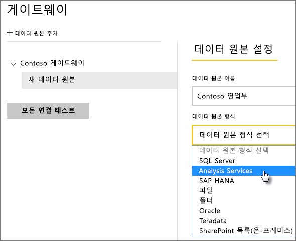
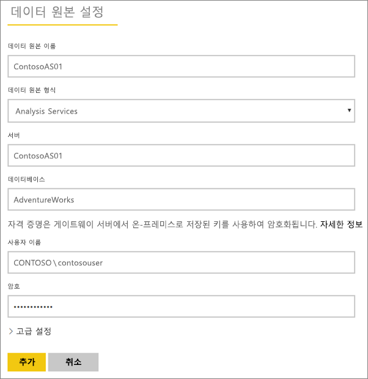
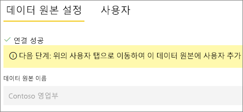
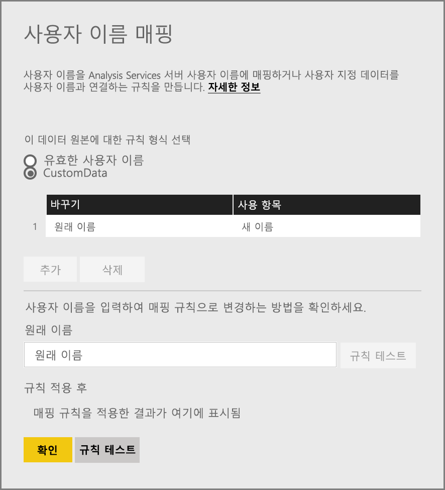
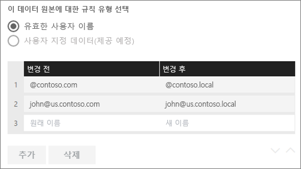
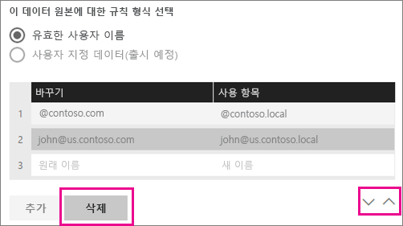
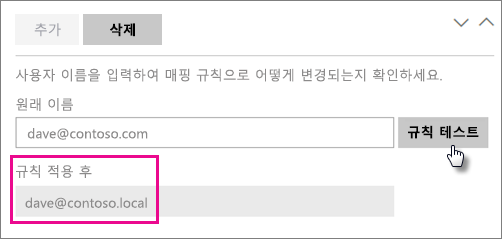
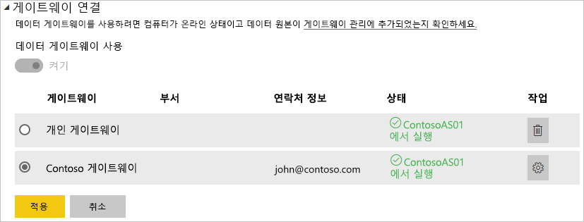

# <a name="manage-your-data-source---analysis-services"></a>데이터 원본 관리 - Analysis Services

[!INCLUDE [gateway-rewrite](includes/gateway-rewrite.md)]

[온-프레미스 데이터 게이트웨이를 설치](/data-integration/gateway/service-gateway-install)한 후에는 게이트웨이와 함께 사용할 수 있는 [데이터 원본을 추가](service-gateway-data-sources.md#add-a-data-source)해야 합니다. 이 문서에서는 예약된 새로 고침 또는 라이브 연결에 사용되는 게이트웨이 및 Analysis Services 데이터 원본으로 작업하는 방법을 살펴봅니다.

Analysis Services에 대한 라이브 연결을 설정하는 방법에 대한 자세한 내용은 [이 비디오를 시청](https://www.youtube.com/watch?v=GPf0YS-Xbyo&feature=youtu.be)하세요.

> [!NOTE]
> Analysis Services 데이터 원본이 있으면 Analysis Services 서버와 동일한 포리스트/도메인에 조인된 컴퓨터에 게이트웨이를 설치해야 합니다.

## <a name="add-a-data-source"></a>데이터 소스 추가

데이터 원본을 추가하는 방법에 대한 자세한 내용은 [데이터 원본 추가](service-gateway-data-sources.md#add-a-data-source)를 참조하세요. 다차원 또는 테이블 형식 서버에 연결하는 경우 **데이터 원본 형식**에 대해 Analysis Services를 선택합니다.



그런 다음, **서버** 및 **데이터베이스**를 포함하는 데이터 원본에 대한 정보를 입력합니다. 입력한 **사용자 이름** 및 **암호** 는 게이트웨이가 Analysis Services 인스턴스에 연결하는 데 사용됩니다.

> [!NOTE]
> 입력하는 Windows 계정에는 연결할 인스턴스에 대한 서버 관리자 권한이 있어야 합니다. 이 계정의 암호가 만료되도록 설정되면 데이터 원본에 대한 암호를 업데이트하지 않은 경우 사용자에게 연결 오류가 발생할 수 있습니다. 자격 증명을 저장하는 방법에 대한 자세한 내용은 [클라우드에 암호화된 자격 증명 저장](service-gateway-data-sources.md#storing-encrypted-credentials-in-the-cloud)을 참조하세요.



모든 항목을 입력한 후 **추가**를 선택합니다. 이제 온-프레미스에 있는 Analysis Services 인스턴스에 대한 예약된 새로 고침 또는 라이브 연결에 이 데이터 원본을 사용할 수 있습니다. 성공한 경우 *연결 성공* 이 표시됩니다.



### <a name="advanced-settings"></a>고급 설정

필요한 경우 데이터 원본의 프라이버시 수준을 구성할 수 있습니다. 데이터가 결합하는 방식을 제어합니다. 예약된 새로 고침에만 사용됩니다. 라이브 연결에는 적용되지 않습니다. 데이터 원본의 프라이버시 수준에 대한 자세한 내용은 [프라이버시 수준(파워 쿼리)](https://support.office.com/article/Privacy-levels-Power-Query-CC3EDE4D-359E-4B28-BC72-9BEE7900B540)을 참조하세요.


## <a name="usernames-with-analysis-services"></a>Analysis Services를 사용하는 사용자 이름

<iframe width="560" height="315" src="https://www.youtube.com/embed/Qb5EEjkHoLg" frameborder="0" allowfullscreen></iframe>

사용자가 Analysis Services에 연결된 보고서를 조작할 때마다 유효 사용자 이름은 게이트웨이에 전달된 다음 온-프레미스 Analysis Services 서버에 전달됩니다. Power BI에 로그인하는 메일 주소는 유효한 사용자로 Analysis Services에 통과됩니다. 연결 속성 [EffectiveUserName](https://msdn.microsoft.com/library/dn140245.aspx#bkmk_auth)에 전달됩니다. 이 메일 주소는 로컬 Active Directory 도메인 내에서 정의된 UPN(사용자 계정 이름)과 일치해야 합니다. UPN은 Active Directory 계정의 속성입니다. 그런 다음 해당 Windows 계정은 Analysis Services 역할에 있어야 합니다. 일치하는 항목이 없는 경우 Active Directory에서 로그인이 성공적으로 수행되지 않습니다. Active Directory 및 사용자 이름 지정에 대한 자세한 내용은 [사용자 이름 지정 특성](https://msdn.microsoft.com/library/ms677605.aspx)을 참조하세요.

[로컬 디렉터리 UPN으로 Power BI 로그인 이름을 매핑](service-gateway-enterprise-manage-ssas.md#mapping-usernames-for-analysis-services-data-sources)할 수도 있습니다.

## <a name="mapping-usernames-for-analysis-services-data-sources"></a>Analysis Services 데이터 원본의 사용자 이름 매핑

<iframe width="560" height="315" src="https://www.youtube.com/embed/eATPS-c7YRU" frameborder="0" allowfullscreen></iframe>

Power BI에서는 Analysis Services 데이터 원본의 사용자 이름 매핑이 허용됩니다. Analysis Services 연결에서 EffectiveUserName에 대해 전달되는 이름에 Power BI를 사용하여 로그인된 사용자 이름을 매핑하는 규칙을 구성할 수 있습니다. 사용자 이름 매핑 기능은 AAD에 대한 사용자 이름이 로컬 Active Directory의 UPN과 일치하지 않는 경우 문제를 해결하는 좋은 방법입니다. 예를 들어 전자 메일 주소가 nancy@contoso.onmicrsoft.com인 경우 nancy@contoso.com에 매핑할 수 있으며 이 값을 게이트웨이에 전달합니다.

Analysis Services의 사용자 이름은 다음과 같은 별도의 두 가지 방법으로 매핑할 수 있습니다.

* 수동 사용자 다시 매핑
* AAD UPN을 Active Directory 사용자로 다시 매핑하기 위한 온-프레미스 Active Directory 속성 조회(AD 조회 매핑)

두 번째 방법을 사용하여 수동 매핑을 수행할 수 있지만, 이 경우 시간이 오래 걸리며 유지 관리가 어려울 수 있습니다. 특히 패턴 일치가 충분하지 않은 경우(예: AAD와 온-프레미스 AD 간에 도메인 이름이 다른 경우 또는 AAD와 AD 간에 사용자 계정 이름이 다른 경우) 어렵습니다. 따라서 두 번째 방법의 수동 매핑은 사용하지 않는 것이 좋습니다.

여기서는 이 두 가지 방법에 대해 다음의 두 섹션에서 차례로 설명합니다.

### <a name="manual-user-name-re-mapping"></a>수동 사용자 이름 다시 매핑

Analysis Services 데이터 원본의 경우 사용자 지정 UPN(사용자 계정 이름) 규칙을 구성할 수 있습니다. Power BI 서비스 로그인 이름이 로컬 디렉터리 UPN과 일치하지 않는 경우 도움이 됩니다. 예를 들어 john@contoso.com으로 Power BI에 로그인하지만 로컬 디렉터리 UPN이 john@contoso.local이 아닌 경우 john@contoso.local을 Analysis Services에 전달하도록 매핑 규칙을 구성할 수 있습니다.

UPN 매핑 화면을 가져오려면 다음을 수행합니다.

1. **기어 아이콘**으로 이동하고 **게이트웨이 관리**를 선택합니다.
2. Analysis Services 데이터 원본을 포함하는 게이트웨이를 확장합니다. 또는 Analysis Services 데이터 원본을 만들지 않은 경우 지금 만들 수 있습니다.
3. 데이터 원본을 선택한 다음 **사용자** 탭을 선택합니다.
4. **사용자 이름 매핑**을 선택합니다.

    

그러면 규칙을 추가하고 지정된 사용자에 대해 테스트하는 옵션이 표시됩니다.

> [!NOTE]
> 의도하지 않은 사용자를 실수로 변경할 수도 있습니다. 예를 들어 **대체(원본 값)** 가 @contoso.com이고 **(새 이름)으로**가 @contoso.local인 경우 @contoso.com을 포함하는 로그인을 사용하는 모든 사용자는 @contoso.local로 대체됩니다. 또한 **대체(원본 이름)** 가 dave@contoso.com이고 **(새 이름)으로**가 dave@contoso.local인 경우 v-dave@contoso.com의 로그인한 사용자는 v-dave@contoso.local로 전송됩니다.

### <a name="ad-lookup-mapping"></a>AD 조회 매핑

온-프레미스 AD 속성 조회를 수행하여 AAD UPN을 Active Directory 사용자로 다시 매핑하려면 이 섹션의 단계를 수행합니다. 먼저 이 기능이 작동하는 방식을 검토해 보겠습니다.

**Power BI 서비스**에서 다음이 수행됩니다.

* 온-프레미스 SSAS 서버에 대한 Power BI AAD 사용자의 각 쿼리에 대해 UPN 문자열(예: firstName.lastName@contoso.com)이 전달됩니다.

> [!NOTE]
> 사용자 이름 문자열을 온-프레미스 데이터 게이트웨이로 보내기 *전에도* Power BI 데이터 원본 구성에 정의된 수동 UPN 사용자 매핑이 계속 적용됩니다.

구성 가능한 사용자 지정 사용자 매핑을 사용하는 온-프레미스 데이터 게이트웨이에서 다음을 수행합니다.

1. 검색할 Active Directory를 찾습니다(자동 또는 구성 가능).
2. **Power BI 서비스**에서 들어오는 UPN 문자열("firstName.lastName@contoso.com")을 기반으로 하여 AD 사용자의 특성(예: *전자 메일*)을 조회합니다.
3. AD 조회가 실패하면 전달된 UPN을 SSAS에 대한 EffectiveUser로 사용하려고 시도합니다.
4. AD 조회가 성공하면 해당 AD 사용자의 *UserPrincipalName*을 검색합니다.
5. *UserPrincipalName* 메일(예: <em>Alias@corp.on-prem.contoso</em>)을 *EffectiveUser*로 SSAS에 전달합니다.

AD 조회를 수행하도록 게이트웨이를 구성하려면:

1. [최신 게이트웨이를 다운로드하여 설치합니다](/data-integration/gateway/service-gateway-install).

2. 게이트웨이에서 로컬 서비스 계정 대신 도메인 계정으로 실행하려면 **온-프레미스 데이터 게이트웨이 서비스**를 변경해야 합니다. 그렇지 않으면 런타임에 AD 조회가 제대로 작동하지 않습니다. 머신의 [온-프레미스 데이터 게이트웨이 앱](/data-integration/gateway/service-gateway-app)으로 이동한 다음, **서비스 설정 > 서비스 계정 변경**으로 이동합니다. 새 게이트웨이를 대신 만들려는 경우가 아니라면 동일한 시스템에서 복구 키를 복원해야 하므로 이 게이트웨이에 대한 복구 키가 있는지 확인합니다. . 변경 내용을 적용하려면 게이트웨이 서비스를 다시 시작해야 합니다.

3. 쓰기 권한이 있는지 확인하려면 관리자로 게이트웨이의 설치 폴더인 *C:\Program Files\On-premises data gateway*로 이동하고 *Microsoft.PowerBI.DataMovement.Pipeline.GatewayCore.dll.config* 파일을 엽니다.

4. AD 사용자에 대한 ‘자신’의 Active Directory 특성 구성에 따라 다음 두 가지 구성 값을 편집합니다.  아래에 표시된 구성 값은 단지 예일 뿐이므로 Active Directory 구성에 따라 해당 구성 값을 지정해야 합니다. 이 구성은 대/소문자를 구분하므로 Active Directory의 값과 일치하는지 확인합니다.

    

    ADServerPath 구성의 값이 제공되지 않은 경우 게이트웨이는 기본 글로벌 카탈로그를 사용합니다. ADServerPath에 대해 여러 개의 값을 지정할 수도 있습니다. 각 값은 다음 예제와 같이 세미콜론으로 구분해야 합니다.

    ```xml
    <setting name="ADServerPath" serializeAs="String">
        <value> >GC://serverpath1; GC://serverpath2;GC://serverpath3</value>
    </setting>
    ```

    게이트웨이는 일치 항목을 찾을 때까지 ADServerPath의 값을 왼쪽에서 오른쪽으로 구문 분석합니다. 일치 항목이 없으면 원래 UPN이 사용됩니다. 게이트웨이 서비스(PBIEgwService)를 실행하는 계정에 ADServerPath에 지정한 모든 AD 서버에 대한 쿼리 권한이 있는지 확인합니다.

    게이트웨이는 다음 예제와 같이 두 가지 유형의 ADServerPath를 지원합니다.

    **WinNT**

    ```xml
    <value="WinNT://usa.domain.corp.contoso.com,computer"/>
    ```

    **GC**

    ```xml
    <value> GC://USA.domain.com </value>
    ```

5. **온-프레미스 데이터 게이트웨이** 서비스를 다시 시작하여 구성 변경 내용을 적용합니다.

### <a name="working-with-mapping-rules"></a>매핑 규칙 작업

매핑 규칙을 만들려면 **원래 이름** 및 **새 이름**에 대한 값을 입력한 다음 **추가**를 선택합니다.

| 필드 | 설명 |
| --- | --- |
| 대체(원래 값) |Power BI에 로그인하는 전자 메일 주소. |
| (새 이름)으로 |대체하려는 값. 대체의 결과는 Analysis Services 연결에 대한 *EffectiveUserName* 속성으로 전달되는 것입니다. |



목록에서 항목을 선택하는 경우 **아이콘 펼침** 또는 항목 **삭제**를 사용하여 다시 정렬하도록 선택할 수 있습니다.



### <a name="using-wildcard-"></a>와일드카드(\*) 사용

**대체 (원본 이름)** 문자열에서 와일드 카드를 사용할 수 있습니다. 다른 문자열 부분이 아닌 자체 문자열에 사용할 수 있습니다. 이렇게 하면 모든 사용자를 선택하여 단일 값을 데이터 원본에 전달할 수 있습니다. 로컬 환경에서 동일한 사용자를 사용하는 조직에서 모든 사용자를 원하는 경우에 유용합니다.

### <a name="test-a-mapping-rule"></a>매핑 규칙 테스트

**원래 이름**에 대한 값을 입력하고 **규칙 테스트**를 선택하여 대체될 원래 이름의 유효성을 검사할 수 있습니다.



> [!NOTE]
> 저장된 규칙을 서비스에서 사용하기 시작하는 데에는 몇 분이 걸립니다. 하지만 브라우저에서는 규칙이 즉시 작동합니다.

### <a name="limitations-for-mapping-rules"></a>매핑 규칙에 대한 제한

매핑은 구성되는 중인 특정 데이터 원본에 대한 것입니다. 전역 설정이 아닙니다. 여러 Analysis Services 데이터 원본이 있는 경우 각 데이터 원본에 대한 사용자를 매핑해야 합니다.

## <a name="authentication-to-a-live-analysis-services-data-source"></a>라이브 Analysis Services 데이터 원본에 대한 인증

사용자가 Analysis Services와 상호 작용할 때마다 유효 사용자 이름은 게이트웨이에 전달된 다음 온-프레미스 Analysis Services 서버에 전달됩니다. 클라우드에 로그인하는 UPN(사용자 계정 이름)은 일반적으로 메일 주소이며 유효한 사용자로 Analysis Services에 통과됩니다. UPN은 연결 속성 EffectiveUserName에 전달됩니다. 이 전자 메일 주소는 로컬 Active Directory 도메인 내에서 정의된 UPN과 일치해야 합니다. UPN은 Active Directory 계정의 속성입니다. 그런 다음 해당 Windows 계정은 서버에 액세스할 수 있도록 Analysis Services 역할에 있어야 합니다. Active Directory에 일치하는 항목이 없는 경우 로그인이 성공적으로 수행되지 않습니다.

Analysis Services에서도 이 계정에 따라 필터링을 제공할 수 있습니다. 보안 또는 행 수준 보안에 따라 한 쪽 역할에 필터링이 발생할 수 있습니다.

## <a name="role-based-security"></a>역할 기반 보안

모델은 사용자 역할 기반 보안을 제공합니다. 역할은 SSDT-BI(SQL Server Data Tools – Business Intelligence)에서 작성하는 동안이나 모델이 배포된 후 SSMS(SQL Server Management Studio)를 사용하여 특정 모델 프로젝트에 대해 정의됩니다. 역할에는 Windows 사용자 이름 또는 Windows 그룹별로 멤버가 포함됩니다. 역할은 사용자가 모델에서 쿼리하거나 작업을 수행하는 데 필요한 권한을 정의합니다. 대부분의 사용자는 읽기 권한을 가진 역할에 속합니다. 다른 역할은 항목 처리, 데이터베이스 함수 관리, 기타 역할 관리 등을 수행할 권한이 있는 관리자를 위한 것입니다.

## <a name="row-level-security"></a>행 수준 보안

행 수준 보안은 Analysis Services 행 수준 보안과 관련됩니다. 모델은 동적 행 수준 보안을 제공할 수 있습니다. 사용자가 속한 역할이 하나 이상 있어야 하는 것과 달리 동적 보안은 일부 테이블 형식 모델에 필요하지 않습니다. 상위 수준의 동적 보안은 데이터에 대한 사용자의 읽기 권한을 특정 테이블에 있는 특정 행 바로 아래로 정의합니다. 역할과 마찬가지로 동적 행 수준 보안에서는 사용자의 Windows 사용자 이름을 사용합니다.

모델 데이터를 쿼리하고 보는 사용자 권한이 Windows 사용자 계정이 멤버인 역할에 의해 먼저 결정된 다음 동적 행 수준 보안(구성된 경우)에 의해 두 번째로 결정됩니다.

모델에서 역할 및 동적 행 수준 보안을 구현하는 작업은 이 문서의 범위를 벗어납니다. MSDN에서 [역할(SSAS 테이블 형식)](https://msdn.microsoft.com/library/hh213165.aspx) 및 [보안 역할(Analysis Services - 다차원 데이터)](https://msdn.microsoft.com/library/ms174840.aspx)을 자세히 알아볼 수 있습니다. 테이블 형식 모델 보안을 가장 깊이 있게 이해하려면 [Securing the Tabular BI Semantic Model(테이블 형식 BI 의미 체계 모델 보안 설정) 백서](https://msdn.microsoft.com/library/jj127437.aspx)를 다운로드하여 읽어 보세요.

## <a name="what-about-azure-active-directory"></a>Azure Active Directory의 경우

Microsoft 클라우드 서비스는 [Azure Active Directory](/azure/active-directory/fundamentals/active-directory-whatis)를 사용하여 사용자 인증을 수행합니다. Azure Active Directory는 사용자 이름 및 보안 그룹을 포함하는 테넌트입니다. 일반적으로 사용자가 로그인하는 전자 메일 주소는 계정의 UPN과 같습니다.

내 로컬 Active Directory의 역할이란?

Analysis Services에서 연결되어 있는 사용자가 데이터 읽기 권한이 있는 역할에 속하는지 확인하려면 서버가 AAD에서 전달된 유효 사용자 이름을 게이트웨이로 변환한 다음 Analysis Services 서버로 변환해야 합니다. Analysis Services 서버는 유효 사용자 이름을 Windows Active Directory 도메인 컨트롤러(DC)에 전달합니다. 그러면 Active Directory DC에서 유효 사용자 이름이 유효한 UPN인지를 검사하고 로컬 계정에서 해당 사용자의 Windows 사용자 이름을 Analysis Services 서버에 다시 반환합니다.

도메인에 조인되지 않은 Analysis Services 서버에서는 EffectiveUserName을 사용할 수 없습니다. 로그인 오류를 피하기 위해 Analysis Services 서버는 도메인에 조인되어야 합니다.

### <a name="how-do-i-tell-what-my-upn-is"></a>내 UPN이 무엇인지 어떻게 확인합니까?

사용자 UPN이 무엇인지 알 수 없으며 도메인 관리자가 되지 못할 수도 있습니다. 워크스테이션에서 다음 명령을 사용하여 계정에 대한 UPN을 알아볼 수 있습니다.

    whoami /upn

결과는 메일 주소와 유사하지만 도메인 계정에 있는 UPN입니다. 라이브 연결에 대해 Analysis Services 데이터 원본을 사용하고 Power BI에 로그인하는 메일 주소와 일치하지 않는 경우 [사용자 이름을 매핑](#mapping-usernames-for-analysis-services-data-sources)하는 방법을 살펴볼 수 있습니다.

## <a name="synchronize-an-on-premises-active-directory-with-azure-active-directory"></a>Azure Active Directory와 온-프레미스 Active Directory 동기화

Analysis Services 라이브 연결을 사용할 예정인 경우 로컬 Active Directory 계정을 Azure Active Directory에 일치시키려 할 수 있습니다. 계정 간에 UPN을 일치시켜야 하기 때문입니다.

클라우드 서비스만 Azure Active Directory 내의 계정에 대해 알고 있습니다. 로컬 Active Directory에서 계정을 추가했는지 여부는 중요하지 않으며 AAD에 존재하지 않는 경우 사용할 수 없습니다. 로컬 Active Directory 계정을 Azure Active Directory와 일치시킬 수 있는 다양한 방법이 있습니다.

1. Azure Active Directory에 계정을 수동으로 추가할 수 있습니다.

   Azure Prtal 또는 Microsoft 365 관리 센터 내에 계정을 만들 수 있으며 계정 이름은 로컬 Active Directory 계정의 UPN과 일치합니다.

2. [Azure AD Connect](/azure/active-directory/hybrid/how-to-connect-sync-whatis) 도구를 사용하여 로컬 계정을 Azure Active Directory 테넌트와 동기화할 수 있습니다.

   Azure AD Connect 도구는 암호 해시 동기화, 통과 인증 및 페더레이션을 비롯한 인증 설정 및 디렉터리 동기화를 위한 옵션을 제공합니다. 테넌트 관리자 또는 로컬 도메인 관리자가 아닌 경우 IT 관리자에게 이 내용이 구성되었는지 문의해야 합니다.

Azure AD Connect를 사용하면 UPN이 AAD와 로컬 Active Directory 간에 일치하도록 할 수 있습니다.

> [!NOTE]
> 계정을 Azure AD Connect 도구와 동기화하면 AAD 테넌트 내에 새 계정이 만들어집니다.

## <a name="using-the-data-source"></a>데이터 원본 사용

데이터 원본을 만든 후 라이브 연결 또는 예약된 새로 고침을 통해 사용할 수 있습니다.

> [!NOTE]
> 서버 및 데이터베이스 이름은 온-프레미스 데이터 게이트웨이 내에서 Power BI Desktop 및 데이터 원본 간에 일치해야 합니다.

게이트웨이 내에서 데이터 세트 및 데이터 원본 간의 링크는 서버 이름 및 데이터베이스 이름을 기반으로 합니다. 이는 일치해야 합니다. 예를 들어 Power BI Desktop 내에서 서버 이름에 대한 IP 주소를 제공하는 경우 게이트웨이 구성 내에서 데이터 원본에 대한 IP 주소를 사용해야 합니다. Power BI Desktop에서 *SERVER\INSTANCE*를 사용하는 경우 게이트웨이에 대해 구성된 데이터 원본 내에서 동일한 것을 사용해야 합니다.

라이브 연결과 예약된 새로 고침에 대한 경우입니다.

### <a name="using-the-data-source-with-live-connections"></a>라이브 연결로 데이터 원본 사용

서버 및 데이터베이스 이름이 Power BI Desktop 및 게이트웨이에 대해 구성된 데이터 원본 간과 일치하는지 확인해야 합니다. 라이브 연결 데이터 세트를 게시하기 위해 사용자가 데이터 원본의 **사용자** 탭에 나열되는지 확인해야 합니다. 라이브 연결의 경우 처음으로 데이터를 가져올 때 Power BI Desktop 내에서 선택이 발생합니다.

게시한 후 Power BI Desktop 또는 **데이터 가져오기**에서 보고서 작업을 시작해야 합니다. 연결을 사용할 수 있으려면 게이트웨이 내에서 데이터 원본을 만든 후 몇 분 정도가 걸릴 수 있습니다.

### <a name="using-the-data-source-with-scheduled-refresh"></a>예약된 새로 고침으로 데이터 원본 사용

게이트웨이 내에서 구성된 데이터 원본의 **사용자** 탭에 나열되고 서버 및 데이터베이스 이름이 일치하는 경우 예약된 새로 고침으로 사용하기 위한 옵션으로 게이트웨이가 표시됩니다.



### <a name="limitations-of-analysis-services-live-connections"></a>Analysis Services 라이브 연결의 제한 사항

테이블 형식 또는 다차원 인스턴스에 대해 라이브 연결을 사용할 수 있습니다.

| **서버 버전** | **필수 SKU** |
| --- | --- |
| 2012 SP1 CU4 이상 |비즈니스 인텔리전스 및 Enterprise SKU |
| 2014 |비즈니스 인텔리전스 및 Enterprise SKU |
| 2016 |표준 SKU 이상 |

* 셀 수준 형식 지정 및 변환 기능은 지원되지 않습니다.
* 작업 및 명명된 집합은 Power BI에 노출되지 않지만, 작업 또는 명명된 집합을 포함하고 시각적 개체 및 보고서를 만드는 다차원 큐브에는 계속 연결할 수 있습니다.

## <a name="next-steps"></a>다음 단계

* [온-프레미스 데이터 게이트웨이 문제 해결](/data-integration/gateway/service-gateway-tshoot)
* [게이트웨이 문제 해결 - Power BI](service-gateway-onprem-tshoot.md)

궁금한 점이 더 있나요? [Power BI 커뮤니티를 이용하세요.](http://community.powerbi.com/)

