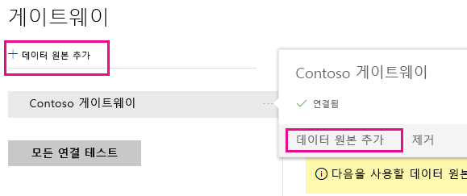
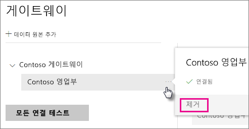
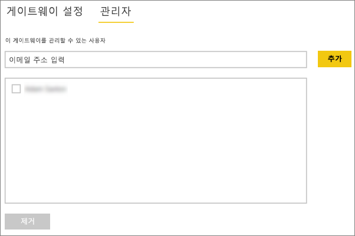
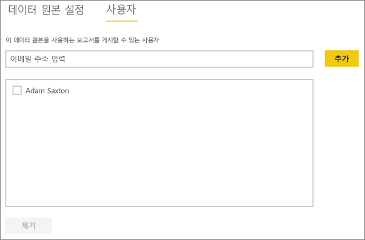

# 데이터 원본 관리 - Analysis Services
온-프레미스 데이터 게이트웨이를 설치한 후에는 게이트웨이와 함께 사용할 수 있는 데이터 원본을 추가해야 합니다. 이 문서에서는 게이트웨이 및 데이터 소스로 작업하는 방법을 살펴봅니다. 예정된 새로 고침 또는 라이브 연결을 위해 Analysis Services 데이터 원본을 사용할 수 있습니다.

<iframe width="560" height="315" src="https://www.youtube.com/embed/ownIGbcRAAU" frameborder="0" allowfullscreen></iframe>

## 게이트웨이 다운로드 및 설치
Power BI 서비스에서 게이트웨이를 다운로드할 수 있습니다. **다운로드** > **데이터 게이트웨이**를 선택하거나 [게이트웨이 다운로드 페이지](https://go.microsoft.com/fwlink/?LinkId=698861)로 이동합니다.

## Analysis Services 라이브 연결의 제한 사항
테이블 형식 또는 다차원 인스턴스에 대해 라이브 연결을 사용할 수 있습니다.

| **서버 버전** | **필수 SKU** |
| --- | --- |
| 2012 SP1 CU4 이상 |비즈니스 인텔리전스 및 Enterprise SKU |
| 2014 |비즈니스 인텔리전스 및 Enterprise SKU |
| 2016 |표준 SKU 이상 |

* 셀 수준 형식 지정 및 변환 기능은 지원되지 않습니다.
* 작업 및 명명된 집합은 Power BI에 노출되지 않지만, 작업 또는 명명된 집합을 포함하고 시각적 개체 및 보고서를 만드는 다차원 큐브에는 계속 연결할 수 있습니다.

## 게이트웨이 추가
게이트웨이를 추가하려면 해당 환경의 서버에 게이트웨이를 [다운로드](https://go.microsoft.com/fwlink/?LinkId=698861)하여 설치하기만 하면 됩니다. 게이트웨이를 설치하면 **게이트웨이 관리**아래의 게이트웨이 목록에 표시됩니다.

> [!NOTE]
> 하나 이상의 게이트웨이에 대한 관리자가 아닌 경우 **게이트웨이 관리**가 표시되지 않습니다. 이를 위해서는 관리자로 추가되거나 게이트웨이를 설치 및 구성해야 합니다.
> 
> 

## 게이트웨이 제거
게이트웨이를 제거하면 해당 게이트웨이에 속한 모든 데이터 원본도 삭제됩니다.  또한 이러한 데이터 소스를 사용하는 모든 대시보드 및 보고서와의 연결도 끊어집니다.

1. 오른쪽 위 모퉁이에서 기어 아이콘  > **게이트웨이 관리**를 선택합니다.
2. 게이트웨이 > **제거**
   
   

## 데이터 소스 추가
게이트웨이를 선택하고 **데이터 소스 추가**를 클릭하거나 게이트웨이 > **데이터 소스 추가**로 이동하여 데이터 소스를 추가할 수 있습니다.

그런 다음 목록에서 **데이터 소스 형식** 을 선택합니다. 다차원 또는 테이블 형식 서버에 연결하는 경우 Analysis Services를 선택합니다.

그런 다음 **서버** 및 **데이터베이스**를 포함하는 데이터 소스에 대한 정보를 입력합니다.  

입력한 **사용자 이름** 및 **암호** 는 게이트웨이가 Analysis Services 인스턴스에 연결하는 데 사용됩니다.

> [!NOTE]
> 입력하는 Windows 계정에는 연결할 인스턴스에 대한 서버 관리자 권한이 있어야 합니다. 이 계정의 암호가 만료되도록 설정되면 데이터 원본에 대한 암호를 업데이트하지 않은 경우 사용자에게 연결 오류가 발생할 수 있습니다. 자세한 내용은 기본 온-프레미스 데이터 게이트웨이 문서를 참조하여 [자격 증명](service-gateway-onprem.md#credentials)이 저장되는 방식에 대해 자세히 알아보세요.
> 
> 

모든 항목을 입력한 다음 **추가**를 클릭합니다.  이제 온-프레미스에 있는 Analysis Services 인스턴스에 대한 예약된 새로 고침 또는 라이브 연결에 이 데이터 원본을 사용할 수 있습니다.  성공한 경우 *연결 성공* 이 표시됩니다.

### 고급 설정
데이터 원본에 대한 개인 정보 보호 수준을 구성할 수 있습니다. 데이터가 조합되는 방식을 제어합니다. 예정된 새로 고침에만 사용됩니다. 라이브 연결에는 적용되지 않습니다. [자세히 알아보기](https://support.office.com/article/Privacy-levels-Power-Query-CC3EDE4D-359E-4B28-BC72-9BEE7900B540)

## Analysis Services를 사용하는 사용자 이름
사용자가 Analysis Services에 연결된 보고서를 조작할 때마다 유효 사용자 이름은 게이트웨이에 전달된 다음 온-프레미스 Analysis Services 서버에 전달됩니다. Power BI에 로그인하는 전자 메일 주소는 유효한 사용자로 Analysis Services에 통과됩니다. 연결 속성 [EffectiveUserName](https://msdn.microsoft.com/library/dn140245.aspx#bkmk_auth)에 전달됩니다. 이 전자 메일 주소는 로컬 Active Directory 도메인 내에서 정의된 UPN과 일치해야 합니다. UPN은 Active Directory 계정의 속성입니다. 그런 다음 해당 Windows 계정은 Analysis Services 역할에 있어야 합니다. 일치하는 항목이 없는 경우 Active Directory에서 로그인이 성공적으로 수행되지 않습니다. [자세히 알아보기](https://msdn.microsoft.com/library/ms677605.aspx)

로컬 디렉터리 UPN으로 Power BI 로그인 이름을 매핑할 수도 있습니다. [자세히 알아보기](service-gateway-enterprise-manage-ssas.md#map-user-names)

<iframe width="560" height="315" src="https://www.youtube.com/embed/Qb5EEjkHoLg" frameborder="0" allowfullscreen></iframe>

### 내 UPN이 무엇인지 어떻게 확인합니까?
사용자 UPN이 무엇인지 알 수 없으며 도메인 관리자가 되지 못할 수도 있습니다. 워크스테이션에서 다음 명령을 사용하여 계정에 대한 UPN을 알아볼 수 있습니다.

    whoami /upn

결과는 전자 메일 주소와 유사하지만 도메인 계정에 있는 UPN입니다. 라이브 연결에 대해 Analysis Services 데이터 소스를 사용하고 Power BI에 로그인하는 전자 메일 주소와 일치하지 않는 경우 [사용자 이름을 매핑](#map-user-names)하는 방법을 살펴볼 수 있습니다.

## 사용자 이름 매핑
<iframe width="560" height="315" src="https://www.youtube.com/embed/eATPS-c7YRU" frameborder="0" allowfullscreen></iframe>

Analysis Services의 사용자 이름은 다음과 같은 별도의 두 가지 방법으로 매핑할 수 있습니다.

1. 수동 사용자 다시 매핑 
2. AAD UPN을 Active Directory 사용자로 다시 매핑하기 위한 온-프레미스 Active Directory 속성 조회(AD 조회 매핑)

두 번째 방법을 사용하여 수동 매핑을 수행할 수 있지만, 이 경우 시간이 많이 걸리며 유지 관리가 어려울 수 있습니다. 특히 패턴 일치가 충분하지 않은 경우(예: AAD와 온-프레미스 AD 간에 도메인 이름이 다른 경우 또는 AAD와 AD 간에 사용자 계정 이름이 다른 경우) 어렵습니다. 따라서 두 번째 방법의 수동 매핑은 사용하지 않는 것이 좋습니다.

여기서는 이러한 두 가지 방법에 대해 다음의 두 섹션에서 차례로 설명합니다

### 수동 사용자 이름 다시 매핑
Analysis Services 데이터 원본의 경우 사용자 지정 UPN(사용자 계정 이름) 규칙을 구성할 수 있습니다. Power BI 서비스 로그인 이름이 로컬 디렉터리 UPN과 일치하지 않는 경우 도움이 됩니다. 예를 들어 john@contoso.com으로 Power BI에 로그인하지만 로컬 디렉터리 UPN이 john@contoso.local이 아닌 경우 john@contoso.local을 Analysis Services에 전달하도록 매핑 규칙을 구성할 수 있습니다.

UPN 매핑 화면을 가져오려면 다음을 수행합니다.

1. **기어 아이콘**으로 이동하고 **게이트웨이 관리**를 선택합니다.
2. Analysis Services 데이터 원본을 포함하는 게이트웨이를 확장합니다. 또는 Analysis Services 데이터 원본을 만들지 않은 경우 지금 만들 수 있습니다.
3. 데이터 원본을 선택한 다음 **사용자** 탭을 선택합니다.
4. **사용자 이름 매핑**을 선택합니다.
   
    

그러면 규칙을 추가하고 지정된 사용자에 대해 테스트하는 옵션이 표시됩니다.

> [!NOTE]
> 의도하지 않은 사용자를 실수로 변경할 수도 있습니다. 예를 들어 **대체(원본 값)** 가 @contoso.com이고 **(새 이름)으로**가 @contoso.local인 경우 @contoso.com을 포함하는 로그인을 사용하는 모든 사용자는 @contoso.local로 대체됩니다. 또한 **대체(원본 이름)** 가 dave@contoso.com이고 **(새 이름)으로**가 dave@contoso.local인 경우 v-dave@contoso.com의 로그인한 사용자는 v-dave@contoso.local로 전송됩니다.
> 
> 

### AD 조회 매핑
온-프레미스 AD 속성 조회를 수행하여 AAD UPN을 Active Directory 사용자로 다시 매핑하려면 이 섹션의 단계를 수행합니다. 먼저 이 기능이 작동하는 방식을 검토해 보겠습니다.

**Power BI 서비스**에서 다음이 수행됩니다.

- 온-프레미스 SSAS 서버에 대한 Power BI AAD 사용자의 각 쿼리에 대해 UPN 문자열(예: firstName.lastName@contoso.com)이 전달됩니다.

> [!NOTE]
> 사용자 이름 문자열을 온-프레미스 데이터 게이트웨이로 보내기 ‘전에도’ Power BI 데이터 원본 구성에 정의된 수동 UPN 사용자 매핑이 계속 적용됩니다.
> 
> 

구성 가능한 사용자 지정 사용자 매핑을 사용하는 온-프레미스 데이터 게이트웨이에서 다음을 수행합니다.

1. 검색할 Active Directory를 찾습니다(자동 또는 구성 가능).
2. **Power BI 서비스**에서 들어오는 UPN 문자열("firstName.lastName@contoso.com")을 기반으로 하여 AD 사용자의 특성(예: *전자 메일*)을 조회합니다.
3. AD 조회가 실패하면 전달된 UPN을 SSAS에 대한 EffectiveUser로 사용하려고 시도합니다.
4. AD 조회가 성공하면 해당 AD 사용자의 *UserPrincipalName*을 검색합니다. 
5. *UserPrincipalName* 전자 메일(예: *Alias@corp.on-prem.contoso*)을 *EffectiveUser*로 SSAS에 전달합니다.

AD 조회를 수행하도록 게이트웨이를 구성하는 방법:

1. 최신 게이트웨이를 다운로드하여 설치합니다.
2. 게이트웨이에서 로컬 서비스 계정 대신 도메인 계정으로 실행하려면 **온-프레미스 데이터 게이트웨이 서비스**를 변경해야 합니다. 그러지 않으면 런타임에 AD 조회가 제대로 작동하지 않습니다. 변경 내용을 적용하려면 게이트웨이 서비스를 다시 시작해야 합니다.  컴퓨터의 게이트웨이 앱으로 이동합니다(“온-프레미스 데이터 게이트웨이” 검색). 이렇게 하려면 **서비스 설정 > 서비스 계정 변경**으로 이동합니다. 새 게이트웨이를 대신 만들려는 경우가 아니라면 동일한 시스템에서 복구 키를 복원해야 하므로 이 게이트웨이에 대한 복구 키가 있는지 확인합니다. . 
3. 쓰기 권한이 있는지 확인하려면 게이트웨이의 설치 폴더인 *C:\Program Files\On-premises data gateway*로 이동하고 다음 파일을 편집합니다.
   
       Microsoft.PowerBI.DataMovement.Pipeline.GatewayCore.dll.config 
4. AD 사용자에 대한 *자신*의 Active Directory 특성 구성에 따라 다음 두 가지 구성 값을 편집합니다. 아래에 표시된 구성 값은 단지 예일 뿐이므로 Active Directory 구성에 따라 해당 구성 값을 지정해야 합니다. 
   
   
5. **온-프레미스 데이터 게이트웨이** 서비스를 다시 시작하여 구성 변경 내용을 적용합니다.

### 매핑 규칙 작업
매핑 규칙을 만들려면 **원래 이름** 및 **새 이름**에 대한 값을 입력한 다음 **추가**를 선택합니다.

| 필드 | 설명 |
| --- | --- |
| 대체(원래 값) |Power BI에 로그인하는 전자 메일 주소. |
| (새 이름)으로 |대체하려는 값. 대체의 결과는 Analysis Services 연결에 대한 *EffectiveUserName* 속성으로 전달되는 것입니다. |

목록에서 항목을 선택하는 경우 **아이콘 펼침** 또는 항목 **삭제**를 사용하여 다시 정렬하도록 선택할 수 있습니다.

### 와일드카드(\*) 사용
**대체 (원본 이름)** 문자열에서 와일드 카드를 사용할 수 있습니다. 다른 문자열 부분이 아닌 자체 문자열에 사용할 수 있습니다. 이렇게 하면 모든 사용자를 선택하여 단일 값을 데이터 원본에 전달할 수 있습니다. 로컬 환경에서 동일한 사용자를 사용하는 조직에서 모든 사용자를 원하는 경우에 유용합니다.

### 매핑 규칙 테스트
**원래 이름**에 대한 값을 입력하고 **규칙 테스트**를 선택하여 대체될 원래 이름의 유효성을 검사할 수 있습니다.

> [!NOTE]
> 저장된 규칙을 서비스에서 사용하기 시작하는 데에는 몇 분이 걸립니다. 하지만 브라우저에서는 규칙이 즉시 작동합니다.
> 
> 

### 매핑 규칙에 대한 제한
* 매핑은 구성되는 중인 특정 데이터 원본에 대한 것입니다. 전역 설정이 아닙니다. 여러 Analysis Services 데이터 원본이 있는 경우 각 데이터 원본에 대한 사용자를 매핑해야 합니다.

## 데이터 원본 제거
데이터 원본을 제거하면 지정된 데이터 원본을 사용하는 모든 대시보드 또는 보고서와의 연결이 끊어집니다.  

데이터 원본을 제거하려면 데이터 원본 > **제거**로 이동합니다.

## 관리자 관리
게이트웨이의 관리자 탭에서 게이트웨이를 관리할 수 있는 사용자(또는 보안 그룹)를 추가 및 제거할 수 있습니다.

## 사용자 관리
사용자 탭에서 데이터 원본에 대해 이 데이터 원본을 사용할 수 있는 사용자 또는 보안 그룹을 추가 및 제거할 수 있습니다.

> [!NOTE]
> 사용자 목록은 보고서를 게시할 수 있는 사용자를 제어합니다. 보고서 소유자는 대시보드 또는 콘텐츠 팩을 만들 수 있으며 이를 다른 사용자와 공유합니다.
> 
> 

## 데이터 원본 사용
데이터 원본을 만든 후 라이브 연결 또는 예약된 새로 고침을 통해 사용할 수 있습니다.

> [!NOTE]
> 서버 및 데이터베이스 이름은 온-프레미스 데이터 게이트웨이 내에서 Power BI Desktop 및 데이터 원본 간에 일치해야 합니다.
> 
> 

게이트웨이 내에서 데이터 집합 및 데이터 원본 간의 링크는 서버 이름 및 데이터베이스 이름을 기반으로 합니다. 이는 일치해야 합니다. 예를 들어 Power BI Desktop 내에서 서버 이름에 대한 IP 주소를 제공하는 경우 게이트웨이 구성 내에서 데이터 원본에 대한 IP 주소를 사용해야 합니다. Power BI Desktop에서 서버\인스턴스를 사용하는 경우 게이트웨이에 대해 구성된 데이터 원본 내에서 동일한 것을 사용해야 합니다.

라이브 연결과 예약된 새로 고침에 대한 경우입니다.

### 라이브 연결로 데이터 원본 사용
서버 및 데이터베이스 이름이 Power BI Desktop 및 게이트웨이에 대해 구성된 데이터 원본 간과 일치하는지 확인해야 합니다. 라이브 연결 데이터 집합을 게시하기 위해 사용자가 데이터 원본의 **사용자** 탭에 나열되는지 확인해야 합니다. 라이브 연결의 경우 처음으로 데이터를 가져올 때 Power BI Desktop 내에서 선택이 발생합니다.

게시한 후 Power BI Desktop 또는 **데이터 가져오기**에서 보고서 작업을 시작해야 합니다. 연결을 사용할 수 있으려면 게이트웨이 내에서 데이터 원본을 만든 후 몇 분 정도가 걸릴 수 있습니다.

### 예약된 새로 고침으로 데이터 원본 사용
게이트웨이 내에서 구성된 데이터 원본의 **사용자** 탭에 나열되고 서버 및 데이터베이스 이름이 일치하는 경우 예약된 새로 고침으로 사용하기 위한 옵션으로 게이트웨이가 표시됩니다.

## 다음 단계
[온-프레미스 데이터 게이트웨이](service-gateway-onprem.md)  
[온-프레미스 데이터 게이트웨이 심층 분석](service-gateway-onprem-indepth.md)  
[온-프레미스 데이터 게이트웨이 문제 해결](service-gateway-onprem-tshoot.md)  
궁금한 점이 더 있나요? [Power BI 커뮤니티를 이용하세요.](http://community.powerbi.com/)

