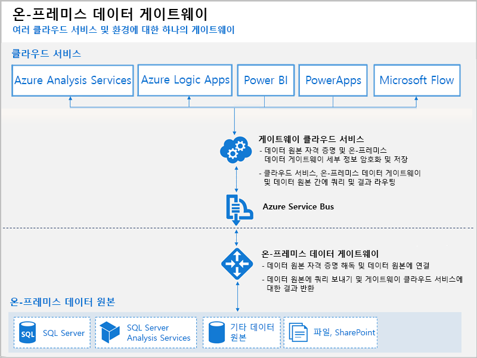

# Power BI 게이트웨이란?

Power BI 게이트웨이는 온-프레미스 네트워크 내에 설치하는 소프트웨어로서, 이 게이트웨이를 통해 해당 네트워크의 데이터에 액세스할 수 있습니다. 연결 요청을 수신 대기하고 사용자의 요청이 특정 기준에 부합할 때만 액세스를 부여하는 게이트키퍼와 유사합니다. 이를 통해 조직에서는 데이터베이스와 기타 데이터 원본을 온-프레미스 네트워크에 유지하면서도 Power BI 보고서 및 대시보드에서 해당 온-프레미스 데이터를 안전하게 사용할 수 있습니다.

단일 데이터 원본이나 여러 데이터 원본에 게이트웨이를 사용할 수 있습니다. 다음 다이어그램은 세 개의 온-프레미스 컴퓨터에 대한 클라우드의 요청을 처리하는 게이트웨이가 포함된 기본 보기를 보여줍니다. 이 보기는 문서의 뒷부분에서 확장됩니다.

## 게이트웨이 유형

Power BI에서는 시나리오마다 각각 두 개의 게이트웨이를 제공합니다.

* **온-프레미스 데이터 게이트웨이(개인 모드)** – 한 사용자가 원본에 연결하며 다른 사용자와 공유할 수 없습니다. Power BI에만 사용할 수 있습니다. 이 게이트웨이는 보고서를 만드는 유일한 사용자이며 데이터 원본을 다른 사용자와 공유할 필요가 없는 시나리오에 적합합니다.

* **온-프레미스 데이터 게이트웨이** - 여러 사용자가 여러 온-프레미스 데이터 원본에 연결할 수 있습니다. Power BI, PowerApps, Flow, Azure Analysis Services, Azure Logic Apps 등에서 사용할 수 있으며 모두 단일 게이트웨이 설치를 포함합니다. 이 게이트웨이는 여러 사용자가 여러 데이터 원본에 액세스하는 더 복잡한 시나리오에 적합합니다. 

## 게이트웨이 사용

게이트웨이 사용에는 4개의 기본 단계가 있습니다.

1. 적절한 모드를 사용하여 로컬 컴퓨터에 **게이트웨이 설치**
2. 온-프레미스 데이터 원본에 액세스할 수 있도록 **게이트웨이에 사용자 추가**
3. 보고서 및 대시보드에서 사용할 수 있도록 **데이터 원본에 연결**
4. Power BI 보고서가 최신 상태를 유지하도록 **온-프레미스 데이터 새로 고침**

독립 실행형 게이트웨이를 설치하거나 고가용성을 위해 권장되는 ‘클러스터’에 게이트웨이를 추가할 수 있습니다.

## 게이트웨이 작동 방식

설치하는 게이트웨이는 Windows 서비스, **온-프레미스 데이터 게이트웨이**로 실행됩니다. 이 로컬 서비스는 Azure Service Bus를 통해 게이트웨이 클라우드 서비스에 등록됩니다. 다음 다이어그램은 온-프레미스 데이터와 게이트웨이를 사용하는 클라우드 서비스 간의 흐름을 보여줍니다.

쿼리 및 데이터 흐름:

1. 쿼리는 온-프레미스 데이터 원본에 대한 암호화된 자격 증명을 사용하여 클라우드 서비스에 의해 만들어집니다. 그런 다음, 게이트웨이가 처리하도록 큐로 전송됩니다.
2. 게이트웨이 클라우드 서비스는 쿼리를 분석하고 요청을 Azure Service Bus로 푸시합니다.
3. 온-프레미스 데이터 게이트웨이는 대기 중인 요청에 대해 Azure Service Bus를 폴링합니다.
4. 게이트웨이는 쿼리를 가져오고 자격 증명의 암호를 해독하며 해당 자격 증명을 사용하여 데이터 원본에 연결합니다.
5. 게이트웨이는 실행에 대한 데이터 원본에 쿼리를 전송합니다.
6. 결과는 데이터 원본에서 다시 게이트웨이로 전송된 다음, 클라우드 서비스 및 서버로 전송됩니다.

## 다음 단계
[온-프레미스 데이터 게이트웨이 설치](service-gateway-install.md)

궁금한 점이 더 있나요? [Power BI 커뮤니티를 이용하세요.](http://community.powerbi.com/)

