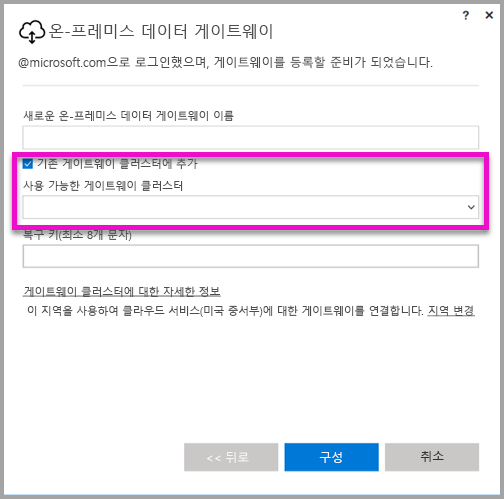

# <a name="high-availability-clusters-for-on-premises-data-gateway"></a>온-프레미스 데이터 게이트웨이를 위한 고가용성 클러스터
조직에서 Power BI 보고서 및 대시보드에 사용되는 온-프레미스 데이터 리소스에 액세스할 수 있도록 **온-프레미스 데이터 게이트웨이**의 **고가용성 클러스터** 설치 프로그램을 만들 수 있습니다. 이러한 클러스터를 사용하면 게이트웨이 관리자는 게이트웨이를 여러 그룹으로 나누어 온-프레미스 데이터 리소스에 대한 액세스에서 단일 실패 지점을 방지할 수 있습니다. 이 문서에서는 온-프레미스 데이터 게이트웨이의 고가용성 클러스터를 만드는 단계를 설명하고, 설정 방법에 대한 모범 사례를 공유합니다. 고가용성 게이트웨이 클러스터를 만들려면 온-프레미스 데이터 게이트웨이에 대한 2017년 11월 이상 업데이트가 필요합니다.


## <a name="setting-up-high-availability-clusters-of-gateways"></a>게이트웨이 고가용성 클러스터 설정

**온-프레미스 데이터 게이트웨이** 설치 프로세스 중에 게이트웨이를 기존 게이트웨이 클러스터에 추가할지 여부를 지정할 수 있습니다. 



게이트웨이를 기존 클러스터에 추가하려면 새 게이트웨이를 조인하려는 클러스터의 기본 게이트웨이 인스턴스에 대한 *복구 키*를 제공해야 합니다. 클러스터의 기본 게이트웨이는 2017년 11월 이상 게이트웨이 업데이트를 실행해야 합니다. 


## <a name="managing-a-gateway-cluster"></a>게이트웨이 클러스터 관리

게이트웨이 클러스터가 두 개 이상의 게이트웨이로 구성되면 데이터 원본 추가 또는 게이트웨이에 관리 권한 부여 등의 모든 게이트웨이 관리 작업이 클러스터의 일부인 모든 게이트웨이에 적용됩니다. 

관리자가 **Power BI 서비스**의 기어 아이콘 아래에서 찾을 수 있는 **게이트웨이 관리** 메뉴 항목을 사용할 때 등록된 클러스터 또는 개별 게이트웨이 목록은 보이지만, 클러스터의 구성원인 개별 게이트웨이 인스턴스는 보이지 않습니다.

모든 새 **예약된 새로 고침** 요청 및 DirectQuery 작업은 지정된 게이트웨이 클러스터의 기본 인스턴스에 자동으로 라우팅됩니다. 기본 게이트웨이 인스턴스가 오프라인이면 요청이 클러스터의 다른 게이트웨이 인스턴스로 라우팅됩니다.

## <a name="powershell-support-for-gateway-clusters"></a>게이트웨이 클러스터에 대한 PowerShell 지원

PowerShell 스크립트는 온-프레미스 데이터 게이트웨이 설치 폴더에 있습니다. 기본적으로 이 폴더는 *C:\Program Files\On-premises data gateway*입니다. 이러한 스크립트가 제대로 작동하려면 PowerShell 버전 5 이상을 사용해야 합니다. 사용자는 PowerShell 스크립트를 사용하여 다음 작업을 수행할 수 있습니다.

-   사용자에게 제공되는 게이트웨이 클러스터 목록 검색
-   클러스터에 등록된 게이트웨이 인스턴스 목록과 온라인 또는 오프라인 상태 검색
-   클러스터 내 게이트웨이 인스턴스의 설정/해제 상태와 다른 게이트웨이 속성을 수정합니다.
-   게이트웨이 삭제

다음 표의 PowerShell 명령을 실행하려면 먼저 다음 단계를 수행해야 합니다.

1. 관리자 권한으로 PowerShell 명령 창을 엽니다.
2. 그런 후 다음 일회성 PowerShell 명령을 실행합니다(현재 컴퓨터에서 PowerShell 명령을 한 번도 실행하지 않은 것으로 간주).

    ```
    Set-ExecutionPolicy -ExecutionPolicy Unrestricted -Force
    ```

3. 다음으로 PowerShell 창에서 온-프레미스 데이터 게이트웨이 설치 폴더를 찾은 후 다음 명령을 사용하여 필요한 모듈을 가져옵니다.

    ```
    Import-Module .\OnPremisesDataGatewayHAMgmt.psm1
    ```

이러한 단계가 완료되면 다음 표의 명령을 사용하여 게이트웨이 클러스터를 관리할 수 있습니다.

| **명령** | **설명** | **매개 변수** |
| --- | --- | --- |
| *Login-OnPremisesDataGateway* |이 명령은 사용자가 로그인하여 자신의 온-프레미스 데이터 게이트웨이 클러스터를 관리할 수 있게 해줍니다.  다른 고가용성 명령이 정상적으로 작동하려면 *먼저* 이 명령을 실행하고 로그인해야 합니다. 참고: 로그인 호출의 일부로 획득한 AAD 인증 토큰은 1시간만 유효하며 그 후에는 만료됩니다. 로그인 명령을 다시 실행하여 새 토큰을 획득할 수 있습니다.| AAD 사용자 이름 및 암호(초기 호출이 아닌 명령 실행의 일부로 제공)|
| *Get-OnPremisesDataGatewayClusters* | 로그인한 사용자에 대한 게이트웨이 클러스터 목록을 검색합니다. | 필요에 따라 가독성을 높이기 위해 *Format-Table -AutoSize -Wrap* 같은 형식 지정 매개 변수를 이 명령에 전달할 수 있습니다. |
| *Get-OnPremisesDataClusterGateways* | 지정된 클러스터 내부의 게이트웨이 목록과 각 게이트웨이에 대한 추가 정보(온라인/오프라인 상태, 컴퓨터 이름 등)를 검색합니다. | *-ClusterObjectID xyz*(*Get-OnPremisesDataGatewayClusters* 명령으로 검색할 수 있는 실제 클러스터 개체 ID 값으로 *xyz*를 대체)|
| *Set-OnPremisesDataGateway* | 특정 게이트웨이 인스턴스를 설정/해제하는 기능을 포함하여 클러스터 내 특정 게이트웨이의 속성 값을 설정할 수 있습니다.  | *-ClusterObjectID xyz*(*Get-OnPremisesDataGatewayClusters* 명령으로 검색할 수 있는 실제 클러스터 개체 ID 값으로 *xyz*를 대체) *-GatewayObjectID abc*(클러스터 개체 ID가 지정된 경우 *Get-OnPremisesDataClusterGateways* 명령으로 검색할 수 있는 실제 게이트웨이 개체 ID 값으로 *abc*를 대체) |
| *Get-OnPremisesDataGatewayStatus* | 클러스터 내의 특정 게이트웨이 인스턴스 상태를 검색할 수 있습니다.  | *-ClusterObjectID xyz*(*Get-OnPremisesDataGatewayClusters* 명령으로 검색할 수 있는 실제 클러스터 개체 ID 값으로 *xyz*를 대체) *-GatewayObjectID abc*(클러스터 개체 ID가 지정된 경우 *Get-OnPremisesDataClusterGateways* 명령으로 검색할 수 있는 실제 게이트웨이 개체 ID 값으로 *abc*를 대체) |
| *Remove-OnPremisesDataGateway*  | 클러스터에서 게이트웨이 인스턴스를 제거할 수 있습니다. 클러스터의 다른 게이트웨이를 전부 제거하기 전에는 기본 게이트웨이를 제거할 수 없습니다.| *-ClusterObjectID xyz*(*Get-OnPremisesDataGatewayClusters* 명령으로 검색할 수 있는 실제 클러스터 개체 ID 값으로 *xyz*를 대체) *-GatewayObjectID abc*(클러스터 개체 ID가 지정된 경우 *Get-OnPremisesDataClusterGateways* 명령으로 검색할 수 있는 실제 게이트웨이 개체 ID 값으로 *abc*를 대체) |


## <a name="next-steps"></a>다음 단계

-   [데이터 원본 관리 - Analysis Services](service-gateway-enterprise-manage-ssas.md)  
-   [데이터 원본 관리 - SAP HANA](service-gateway-enterprise-manage-sap.md)  
-   [데이터 원본 관리 - SQL Server](service-gateway-enterprise-manage-sql.md)  
-   [데이터 원본 관리 - Oracle](service-gateway-onprem-manage-oracle.md)  
-   [데이터 원본 관리 - 가져오기/예약된 새로 고침](service-gateway-enterprise-manage-scheduled-refresh.md)  
-   [온-프레미스 데이터 게이트웨이 심층 분석](service-gateway-onprem-indepth.md)  
-   [온-프레미스 데이터 게이트웨이(개인 모드)](service-gateway-personal-mode.md)
-   [온-프레미스 데이터 게이트웨이에 대한 프록시 설정 구성](service-gateway-proxy.md)  
-   [Power BI에서 온-프레미스 데이터 원본으로 SSO(Single Sign-On)에 대해 Kerberos 사용](service-gateway-kerberos-for-sso-pbi-to-on-premises-data.md)  

궁금한 점이 더 있나요? [Power BI 커뮤니티를 이용하세요.](http://community.powerbi.com/)
